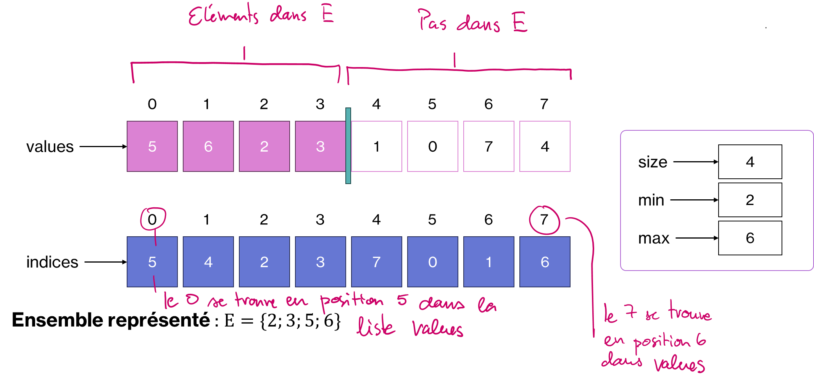
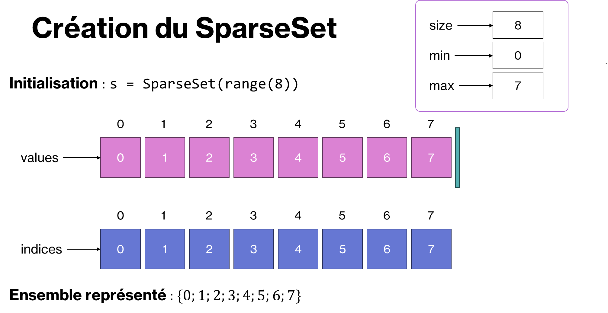
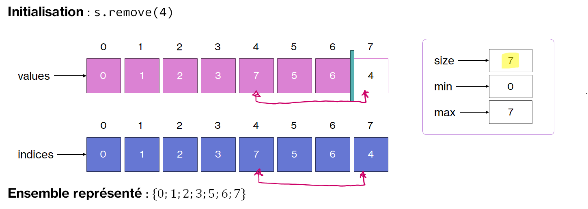
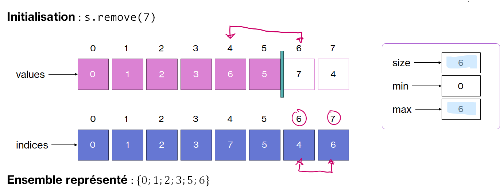

.. _sparse-sets.rst:

Sparse Sets
###########

..  contents:: Contenu de la page
    :depth: 3

Analyse de performance des domaines de ``ToyCSP``
=================================================

Dans le solveur ``ToyCSP``, nous avons simplement représenté les domaines des
variables en utilisant les ensembles de Python, à savoir le type intégré ``set``.

Pour rappel, voici le code de la classe ``Domain`` utilisée jusqu'à présent

..  code-block:: python
    :linenos:

    class Domain:
        def __init__(self, *args) -> None:
            if len(args) != 1:
                raise TypeError("Domain takes only one parameter")
            elif isinstance(args[0], int):
                n = args[0]
                self.values = set(range(n))
            elif isinstance(args[0], set):
                dom = args[0]
                self.values = dom.copy()
            else:
                raise TypeError("Argument must be int or set[int]")

        def is_fixed(self) -> bool:
            return len(self.values) == 1

        def size(self) -> int:
            return len(self.values)
        
        def min(self) -> int:
            return min(self.values)

        def remove(self, v: int) -> bool:
            if v in self.values:
                self.values.remove(v)
                if not self.values:
                    raise Inconsistency
                return True
            return False

        def fix(self, v: int):
            if v not in self.values:
                raise Inconsistency
            self.values = {v}

        def clone(self) -> "Domain":
            return Domain(self.values)

        def __repr__(self) -> str:
            return f"Domain({self.values})"

Même si certaines opérations sur les ``set`` sont :math:`\Theta(1)`, à savoir
très performantes, en raison de l'implémentation à l'aide d'une table de
hachage, d'autres, qui sont abondamment sollicitées dans la résolution de
problèmes de satisfaction de contraintes, sont trop lentes (:math:`\Theta(n)`).

..  list-table:: Opérations sur les domaines des variables
    :header-rows: 1
    :widths: 6 3
    :align: left

    * - Opération
      - Complexité
    
    * - Insertion d'un élément
      - :math:`\Theta(1)`

    * - ``is_fixed``
      - :math:`\Theta(1)`

    * - Suppression d'un élément
      - :math:`\Theta(1)`
    
    * - Sauvegarde (copie du set)
      - :math:`\Theta(n)`

    * - Restauration à partir d'une copie de sauvegarde (``set`` existant)
      - :math:`\Theta(1)`

    * - Déterminer le minimum ou le maximum de l'ensemble
      - :math:`\Theta(n)`

Implémentation
==============

L'idée de la structure de données ``SparseSet`` est de maintenir deux listes

- Une liste ``values`` qui stocke les éléments présents dans le set (en
  principe, tous les nombres entiers entre un min et un max)

- Une liste ``indices`` qui représente la position de chaque nombre dans la
  liste ``values``, car ils vont être sans arrêt permutés.

L'idée de base est ensuite de représenter l'ensemble :math:`E` comme
sous-ensemble de l'ensemble :math:`E \subset A = \{a, a+1, \ldots, b-1, b\}` où
:math:`a, b \in \mathbb{Z}` avec :math:`a < b` en plaçant tous les éléments
:math:`e \in E` au début de la liste ``values`` et tous les éléments :math:`x
\in A \setminus E` à la fin de la liste ``values``.

    Représentation de l'ensemble :math:`\{2, 3, 5, 6\}` après que les valeurs 1,
    0, 7 et 4 ont été supprimées.

De cette manière l'implémentation des opérations dont on a besoin sur les
ensembles se font toutes en :math:`\Theta(1)`

- **Suppression d'un élément** : échange de l'élément à supprimer avec l'élément qui
  se trouve à la position :math:`|E| - 1` et diminuer la taille de l'ensemble de
  1.

- **Supression de tous les éléments d'un ensemble sauf 1** : échanger cet élément
  avec celui positionné tout à gauche de la liste ``values`` et mettre la taille
  l'ensemble à 1

- **Vérifier si un élément est dans l'ensemble** : il suffit de regarder si sa
  position (indice) dans ``values`` est inférieure à la taille de l'ensemble.

- **Restaurer l'ensemble dans un état précédent** : il suffit de remettre la taille
  à sa valeur précédente.

Code conceptuel
---------------

Le code ci-dessous explique conceptuellement le fonctionnement derrière les
ensembles que nous voulons implémenter. Pour visualiser le code dans
PythonTutor, collez le code dans https://pytutor.21-learning.com/visualize.html.

..  activecode:: 3e03cbfc-8255-43e2-a0b8-0812a401362d
    :language: webtp
    :interpreterargs: vanilla_python=true&debug_mode=true&layout=["Editor", "Console"]

    def swap(value, other_idx):
        idx = indices[value]
        other = values[other_idx]
        values[idx], values[other_idx] = values[other_idx], values[idx]
        
        # échanger les valeurs dans la liste indices
        indices[value], indices[other] = indices[other], indices[value]

    def show_set():
        elements = ', '.join(str(x) for x in values[:_size])
        print(f"{values = }") ; print(f"{indices = }") ; print("Set E = {" + elements + "}") ; print(f"{_min = }") ; print(f"{_max = }") ; print(80 * "=")

    ######################
    # création d'un set

    values = list(range(8))    # liste pour stocker les éléments
    indices = list(range(8))   # liste pour stocker les positions des éléments
    _size = len(values)         # taille réelle de l'ensemble
    _min = min(values)          # on maintient le min pour qu'il soit accessible en O(1)
    _max = max(values)          # on maintient le max pour qu'il soit accessible en O(1)

    ###################
    # suppression de 4

    swap(4, _size - 1)
    _size -= 1

    show_set()

    ###################
    # suppression de 7

    swap(7, _size - 1)
    _size -= 1
    _max = 6

    show_set()

    ####################
    # Suppression de tout ce qui est plus petit que 2

    # suppression de 0
    swap(0, _size - 1)
    _size -= 1
    _min = 1

    # suppression de 1
    swap(1, _size - 1)
    _size -= 1
    _min = 2

    show_set()

    ####################
    # Suppression de tout sauf 6 (en O(1) !!!)
    swap(6, 0)
    _size = 1
    _min = 6
    _max = 6

    show_set()

Création
--------

Pour créer un ``SparseSet``, on veut pouvoir indiquer une collection de valeurs
(liste, tuple, range, ...). 

..  admonition:: Exemple de création de ``SparseSet``

    Ainsi, on peut créer l'ensemble :math:`\{0,1,2,3,4,5,6,7\}` de différentes
    manières, par exemple:

    - ``s = SparseSet(range(8))``
    - ``s = SparseSet([0, 1, 2, 3, 4, 5, 6, 7])``
    - ``s = SparseSet({0, 1, 2, 3, 4, 5, 6, 7})``

    Création d'un ``SparseSet`` représentant l'ensemble
    :math:`\{0,1,2,3,4,5,6,7\}`

Suppression d'un élément
------------------------

Pour supprimer un élément de l'ensemble, il suffit d'échanger sa position avec
l'élément le plus à droite qui est encore dans l'ensemble, à savoir avec
l'élément en position ``size - 1``.

Suppression de 4
++++++++++++++++

    Suppression de l'élément 4 avec ``s.remove(4)``

Suppression de 7
++++++++++++++++

    Suppression de l'élément 4 avec ``s.remove(7)``

Supprimer tous les éléments inférieurs à un nombre

Définition de la classe ``SparseSet``
=====================================

..  activecode:: sparse-set
    :language: webtp

    from abc import ABC, abstractmethod
    from collections.abc import Iterable

    class NoSuchElementException(Exception):
        pass

    class SparseSet:
        """
        >>> s = SparseSet(range(4, 8))
        >>> s._values
        [0, 1, 2, 3]
        >>> s
        SparseSet([4, 5, 6, 7])
        >>> len(s)
        4
        >>> len(s)
        4
        >>> s.to_list()
        [4, 5, 6, 7]
        >>> s.to_set() == {4, 5, 6, 7}
        True
        >>> s._min
        0
        >>> s._max
        3
        >>> s.min()
        4
        >>> s.max()
        7

        >>> s = SparseSet([])
        Traceback (most recent call last):
            ...
        ValueError: Set cannot be initialized with empty iterable
        >>> s = SparseSet([1])
        >>> 1 in s
        True
        >>> s.remove(1)
        True
        >>> 1 in s
        False
        >>> len(s)
        0
        >>> s.min()
        Traceback (most recent call last):
            ...
        NoSuchElementException: Unable to find min of empty set

        >>> s = SparseSet({3, 5, 7})
        >>> len(s)
        3
        >>> s._min
        0
        >>> s.min()
        3
        """

        def __init__(self, values: Iterable[int]) -> None:
            if len(values) > 0:
                a = min(values)
                b = max(values)
            else:
                raise ValueError("Set cannot be initialized with empty iterable")

            self._size: int = b - a + 1

            self._min = 0
            self._max = b - a
            self._offset: int = a
            self._values: list[int] = list(range(0, b + 1 - a))
            self._indices: list[int] = self._values[:]

            # remove all the values that are not present in values
            for intern_value in self._values:
                val = intern_value + self._offset
                if val not in values:
                    self.remove(val)

        def min(self) -> int:
            ...

        def max(self) -> int:
            ...

        def __len__(self) -> int:
            ...

        def is_empty(self) -> bool:
            ...

        def remove(self, value: int) -> bool:
            """
            Removes `value` from set if possible in O(1) time.
            Returns `True` if it has been removed and `False` otherwise.

            >>> s = SparseSet([1, 2, 3, 4])
            >>> s
            SparseSet([1, 2, 3, 4])
            >>> s.remove(0)
            False
            >>> s.remove(2)
            True
            >>> 2 in s
            False
            >>> s.min()
            1
            >>> s.max()
            4
            >>> s
            SparseSet([1, 3, 4])
            >>> s._values
            [0, 3, 2, 1]
            >>> s.remove(2)
            False
            >>> s.remove(1)
            True
            >>> s.min()
            3
            >>> s.remove(4)
            True
            >>> s.max()
            3

            >>> s = SparseSet([3, 5, 7])
            >>> s
            SparseSet([3, 5, 7])
            >>> s.remove(7)
            True
            >>> s
            SparseSet([3, 5])
            >>> 5 in s
            True
            >>> s.remove(5)
            True
            >>> s
            SparseSet([3])

            """
            ...

        def remove_all_but(self, value: int) -> None:
            """
            >>> s = SparseSet([1,2,3,4,5])
            >>> s.remove_all_but(3)
            >>> s
            SparseSet([3])
            >>> s.min()
            3
            >>> s.max()
            3
            >>> s.remove(3)
            True
            >>> s.remove_all_but(3)
            Traceback (most recent call last):
                ...
            NoSuchElementException: Value is not in set
            """
                ...

        def remove_all(self) -> None:
            """
            >>> s = SparseSet([2, 3, 4])
            >>> len(s)
            3
            >>> s.remove_all()
            >>> s
            SparseSet([])
            """
            ...

        def remove_above(self, value: int) -> None:
            """
            >>> s = SparseSet([3, 4, 5, 6, 7])
            >>> s.remove_above(5)
            >>> s
            SparseSet([3, 4, 5])
            >>> s = SparseSet([1, 3, 5, 6, 7])
            >>> s.remove_above(5)
            >>> s
            SparseSet([1, 3, 5])
            >>> s.remove_above(0)
            >>> s
            SparseSet([])
            """
            ...

        def remove_below(self, value: int) -> None:
            """
            >>> s = SparseSet([3, 4, 5, 6, 7])
            >>> s.remove_below(5)
            >>> s
            SparseSet([5, 6, 7])
            >>> s = SparseSet([1, 3, 5, 6, 7])
            >>> s.remove_below(5)
            >>> s
            SparseSet([5, 6, 7])
            >>> s.remove_below(10)
            >>> s
            SparseSet([])
            """
            ...

        def _update_min(self, intern_value: int) -> None:
            ...

        def _update_max(self, intern_value: int) -> None:
            ...

        def _raw_contains(self, value: int) -> bool:
            """
            >>> s = SparseSet([1])
            >>> s._values
            [0]
            >>> s._size
            1
            >>> s._min
            0
            >>> s._raw_contains(-1)
            False
            >>> s._raw_contains(1)
            False
            >>> s._raw_contains(0)
            True
            >>> s._size = 0
            >>> s._raw_contains(0)
            False
            """
            ...

        def __contains__(self, value: int) -> bool:
            ...

        def to_list(self) -> list[int]:
            """
            Returns a sorted list containing the set elements
            >>> s = SparseSet([1, 2, 3])
            >>> s.to_list()
            [1, 2, 3]
            """
            ...

        def to_set(self) -> set[int]:
            Returns a Python set containing the set elements
            """
            >>> s = SparseSet([2, 4, 6])
            >>> s.to_set() == {2, 4, 6}
            True
            """
            ...

        def __repr__(self) -> str:
            return f"{self.__class__.__name__}({self.to_list()})"

        def __str__(self) -> str:
            """
            >>> s = SparseSet([1, 2, 3])
            >>> str(s)
            '{1, 2, 3}'
            """
            return "{" + ", ".join(str(x) for x in self.to_list()) + "}"

    def intern_tests():
        '''
        >>> s = SparseSet(range(8))
        >>> s
        SparseSet([0, 1, 2, 3, 4, 5, 6, 7])
        >>> s._values
        [0, 1, 2, 3, 4, 5, 6, 7]
        >>> s._indices
        [0, 1, 2, 3, 4, 5, 6, 7]
        
        [0, 4, 2, 3, 1]
        >>> s._size
        8
        >>> s.remove(4)
        True
        >>> s._values
        [0, 1, 2, 3, 7, 5, 6, 4]
        >>> s._indices
        [0, 1, 2, 3, 7, 5, 6, 4]

        >>> s.remove(7)
        True
        >>> s._values
        [0, 1, 2, 3, 6, 5, 7, 4]
        >>> s._indices
        [0, 1, 2, 3, 7, 5, 4, 6]
        >>> s._max
        6
        >>> s.remove_below(2)
        >>> s._values
        [5, 6, 2, 3, 1, 0, 7, 4]
        >>> s._indices
        [5, 4, 2, 3, 7, 0, 1, 6]
        >>> s._size
        4
        >>> s._min
        2
        >>> s.remove_all_but(6)
        >>> s._values
        [6, 5, 2, 3, 1, 0, 7, 4]
        >>> s._indices
        [5, 4, 2, 3, 7, 1, 0, 6]
        
        '''
        ...

    if __name__ == "__main__":
        import doctest
        doctest.testmod()

..  reveal:: 2b94a54c-63ae-425f-aa74-b446373b1226
    :showtitle: Solution
    :instructoronly:

    ..  activecode:: 2a9adde1-6811-4e52-82ea-9a74e16a2c6a
        :language: webtp

        from abc import ABC, abstractmethod
        from collections.abc import Iterable

        class NoSuchElementException(Exception):
            pass

        class SparseSet:
            """
            >>> s = SparseSet(range(4, 8))
            >>> s._values
            [0, 1, 2, 3]
            >>> s
            SparseSet([4, 5, 6, 7])
            >>> len(s)
            4
            >>> len(s)
            4
            >>> s.to_list()
            [4, 5, 6, 7]
            >>> s.to_set() == {4, 5, 6, 7}
            True
            >>> s._min
            0
            >>> s._max
            3
            >>> s.min()
            4
            >>> s.max()
            7

            >>> s = SparseSet([2, 4, 6])
            >>> s
            SparseSet([2, 4, 6])
            >>> s._values
            [0, 4, 2, 3, 1]
            >>> s._size
            3
            >>> s = SparseSet([])
            Traceback (most recent call last):
                ...
            ValueError: Set cannot be initialized with empty iterable
            >>> s = SparseSet([1])
            >>> 1 in s
            True
            >>> s.remove(1)
            True
            >>> 1 in s
            False
            >>> len(s)
            0
            >>> s.min()
            Traceback (most recent call last):
                ...
            NoSuchElementException: Unable to find min of empty set

            >>> s = SparseSet({3, 5, 7})
            >>> len(s)
            3
            >>> s._min
            0
            >>> s.min()
            3
            """

            def __init__(self, values: Iterable[int]) -> None:
                if len(values) > 0:
                    a = min(values)
                    b = max(values)
                else:
                    raise ValueError("Set cannot be initialized with empty iterable")

                self._size: int = b - a + 1

                self._min = 0
                self._max = b - a
                self._offset: int = a
                self._values: list[int] = list(range(0, b + 1 - a))
                self._indices: list[int] = self._values[:]

                # remove all the values that are not present in values
                for intern_value in self._values:
                    val = intern_value + self._offset
                    if val not in values:
                        self.remove(val)

            def min(self) -> int:
                if self.is_empty():
                    raise NoSuchElementException("Unable to find min of empty set")
                return self._min + self._offset

            def max(self) -> int:
                if self.is_empty():
                    raise NoSuchElementException("Unable to find max of empty set")
                return self._max + self._offset

            def __len__(self) -> int:
                return self._size

            def is_empty(self) -> bool:
                return len(self) == 0

            def remove(self, value: int) -> bool:
                """
                Removes `value` from set if possible in O(1) time.
                Returns `True` if it has been removed and `False` otherwise.

                >>> s = SparseSet([1, 2, 3, 4])
                >>> s
                SparseSet([1, 2, 3, 4])
                >>> s.remove(0)
                False
                >>> s.remove(2)
                True
                >>> 2 in s
                False
                >>> s.min()
                1
                >>> s.max()
                4
                >>> s
                SparseSet([1, 3, 4])
                >>> s._values
                [0, 3, 2, 1]
                >>> s.remove(2)
                False
                >>> s.remove(1)
                True
                >>> s.min()
                3
                >>> s.remove(4)
                True
                >>> s.max()
                3

                >>> s = SparseSet([3, 5, 7])
                >>> s
                SparseSet([3, 5, 7])
                >>> s.remove(7)
                True
                >>> s
                SparseSet([3, 5])
                >>> 5 in s
                True
                >>> s.remove(5)
                True
                >>> s
                SparseSet([3])

                """
                if value not in self:
                    return False

                intern_value = value - self._offset
                s = len(self)
                self._swap_positions(intern_value, self._values[s - 1])
                self._size -= 1
                self._update_min(intern_value)
                self._update_max(intern_value)
                return True

            def _swap_positions(self, v1: int, v2: int) -> None:
                i1: int = self._indices[v1]
                i2: int = self._indices[v2]
                self._values[i1] = v2
                self._values[i2] = v1
                self._indices[v1] = i2
                self._indices[v2] = i1

            def remove_all_but(self, value: int) -> None:
                """
                >>> s = SparseSet([1,2,3,4,5])
                >>> s.remove_all_but(3)
                >>> s
                SparseSet([3])
                >>> s.min()
                3
                >>> s.max()
                3
                >>> s.remove(3)
                True
                >>> s.remove_all_but(3)
                Traceback (most recent call last):
                    ...
                NoSuchElementException: Value is not in set
                """
                if value not in self:
                    raise NoSuchElementException("Value is not in set")
                _v: int = value - self._offset
                index: int = self._indices[_v]
                self._indices[_v] = 0
                self._indices[self._values[0]] = index
                self._values[index], self._values[0] = self._values[0], self._values[index]
                self._size = 1
                self._min = _v
                self._max = _v

            def remove_all(self) -> None:
                """
                >>> s = SparseSet([2, 3, 4])
                >>> len(s)
                3
                >>> s.remove_all()
                >>> s
                SparseSet([])
                """
                self._size = 0

            def remove_above(self, value: int) -> None:
                """
                >>> s = SparseSet([3, 4, 5, 6, 7])
                >>> s.remove_above(5)
                >>> s
                SparseSet([3, 4, 5])
                >>> s = SparseSet([1, 3, 5, 6, 7])
                >>> s.remove_above(5)
                >>> s
                SparseSet([1, 3, 5])
                >>> s.remove_above(0)
                >>> s
                SparseSet([])
                """
                if value < self.min():
                    self.remove_all()
                else:
                    v = self.max()
                    while v > value:
                        self.remove(v)
                        v -= 1

            def remove_below(self, value: int) -> None:
                """
                >>> s = SparseSet([3, 4, 5, 6, 7])
                >>> s.remove_below(5)
                >>> s
                SparseSet([5, 6, 7])
                >>> s = SparseSet([1, 3, 5, 6, 7])
                >>> s.remove_below(5)
                >>> s
                SparseSet([5, 6, 7])
                >>> s.remove_below(10)
                >>> s
                SparseSet([])
                """
                if value > self.max():
                    self.remove_all()
                else:
                    v = self.min()
                    while v < value:
                        self.remove(v)
                        v += 1

            def _update_min(self, intern_value: int) -> None:
                if not self.is_empty() and intern_value == self._min:
                    val = self._min + 1
                    while not self._raw_contains(val):
                        val += 1
                    self._min = val

            def _update_max(self, intern_value: int) -> None:
                if not self.is_empty() and intern_value == self._max:
                    val = self._max - 1
                    while not self._raw_contains(val):
                        val -= 1
                    self._max = val

            def _raw_contains(self, value: int) -> bool:
                """
                >>> s = SparseSet([1])
                >>> s._values
                [0]
                >>> s._size
                1
                >>> s._min
                0
                >>> s._raw_contains(-1)
                False
                >>> s._raw_contains(1)
                False
                >>> s._raw_contains(0)
                True
                >>> s._size = 0
                >>> s._raw_contains(0)
                False
                """
                if value < self._min or value > self._max:
                    return False
                else:
                    return self._indices[value] < self._size

            def _index_of(self, value: int) -> int:
                return self._indices[value]

            def __contains__(self, value: int) -> bool:
                return self._raw_contains(value - self._offset)

            def to_list(self) -> list[int]:
                """
                >>> s = SparseSet([1, 2, 3])
                >>> s.to_list()
                [1, 2, 3]
                """
                return sorted([x + self._offset for x in self._values[: self._size]])

            def to_set(self) -> set[int]:
                """
                >>> s = SparseSet([2, 4, 6])
                >>> s.to_set() == {2, 4, 6}
                True
                """
                return set(self.to_list())

            def __repr__(self) -> str:
                return f"{self.__class__.__name__}({self.to_list()})"

            def __str__(self) -> str:
                """
                >>> s = SparseSet([1, 2, 3])
                >>> str(s)
                '{1, 2, 3}'
                """
                return "{" + ", ".join(str(x) for x in self.to_list()) + "}"

        def intern_tests():
            '''
            >>> s = SparseSet(range(8))
            >>> s
            SparseSet([0, 1, 2, 3, 4, 5, 6, 7])
            >>> s._values
            [0, 1, 2, 3, 4, 5, 6, 7]
            >>> s._indices
            [0, 1, 2, 3, 4, 5, 6, 7]
            
            [0, 4, 2, 3, 1]
            >>> s._size
            8
            >>> s.remove(4)
            True
            >>> s._values
            [0, 1, 2, 3, 7, 5, 6, 4]
            >>> s._indices
            [0, 1, 2, 3, 7, 5, 6, 4]

            >>> s.remove(7)
            True
            >>> s._values
            [0, 1, 2, 3, 6, 5, 7, 4]
            >>> s._indices
            [0, 1, 2, 3, 7, 5, 4, 6]
            >>> s._max
            6
            >>> s.remove_below(2)
            >>> s._values
            [5, 6, 2, 3, 1, 0, 7, 4]
            >>> s._indices
            [5, 4, 2, 3, 7, 0, 1, 6]
            >>> s._size
            4
            >>> s._min
            2
            >>> s.remove_all_but(6)
            >>> s._values
            [6, 5, 2, 3, 1, 0, 7, 4]
            >>> s._indices
            [5, 4, 2, 3, 7, 1, 0, 6]
            
            '''
            ...

        if __name__ == "__main__":
            import doctest
            doctest.testmod()
