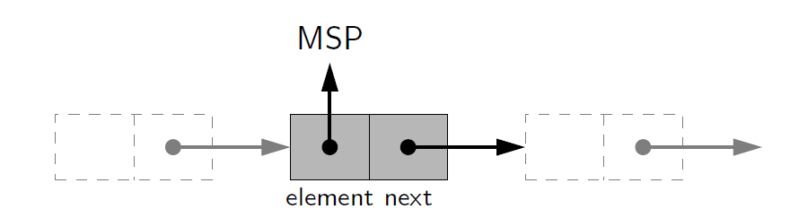
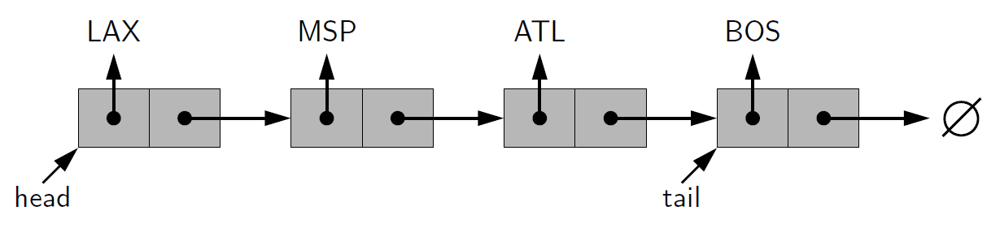
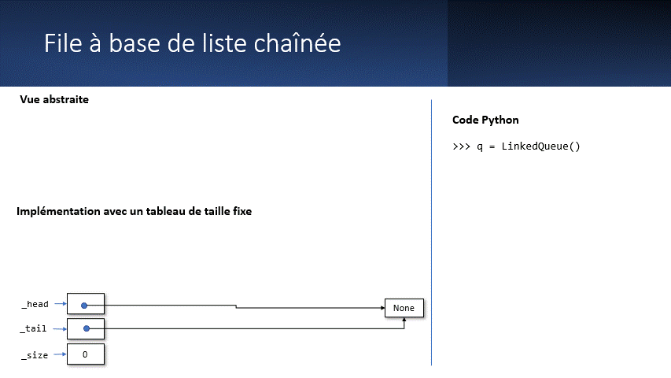

.. _linked-list:

Listes chaînées (Linked List)
#############################

..
    Présentation PowerPoint
    =======================

    Le diaporama ci-dessous présente les structures de données linéaires, en
    particulier les piles et les files.

    ..  admonition:: Présentation PowerPoint

        ..  raw:: html
            
            <iframe
                src="https://eduetatfr.sharepoint.com/teams/CSUD-GT-BrancheInformatiqueBureautique/_layouts/15/Doc.aspx?sourcedoc={b2b7e616-d894-47c4-9422-6b18683820e4}&amp;action=embedview&amp;wdAr=1.7777777777777777"
                width="640px" height="385px" frameborder="0">Ceci est un document <a
                target="_blank" href="https://office.com">Microsoft Office</a> incorporé,
                avec <a target="_blank"
                href="https://office.com/webapps">Office</a>.
            </iframe>

..  contents:: Contenu de la page
    :depth: 3

Pour stocker des données de manière linéaire (dans un ordre précis), on utilise
généralement les listes en Python. Cette structure de données convient dans la
plupart des cas lorsqu'il faut conserver des éléments dans un ordre précis.

Une liste chaînée (ou liste liée) est une structure de données composées d’une
séquence d’éléments de liste.

Chaque enregistrement d’une liste chaînée est souvent appelé élément, nœud ou
maillon.

La tête d’une liste est son premier nœud. La queue d’une liste peut se référer
soit au reste de la liste après la tête, soit au dernier nœud de la liste.

Le champ de chaque nœud qui contient l’adresse du nœud suivant ou précédent est
généralement appelé lien ou pointeur. Le contenu est placé dans un ou plusieurs
autres champs appelés données, informations ou valeur.

Stocker les données dans les nœuds
==================================

Dans une liste chaînée, les données à proprement parler sont stockées dans une
structure de données auxiliaire appelée nœud (``Node``). De manière abstraite,
ces nœuds sont liés entre eux par des références.

    Nœud d'une liste chaînée

Les nœuds de la liste chaînée ci-dessous stockent des abréviations.

    Liste chainée

On maintient des références ``head`` et ``tail`` qui font référence au premier
et au dernier élément de la liste. De plus, le dernier élément ne fait référence
à aucun autre nœud On utilise donc pour cela une valeur spéciale telle que
``None`` en Python.

Complexité des opérations dans une liste chaînée
================================================

Avantages des listes chaînées
-----------------------------   

-   Contrairement au listes basées sur des tableaux (éléments contigus en
    mémoire), les listes chaînées ont pour avantage que l'on peut **facilement
    ajouter ou supprimer des éléments au début de la liste**.

-   Elles n'ont pas de taille fixe initiale

Désavantages de listes chainées
-------------------------------

Malheureusement, les listes chainées ont également des désavantages

-   Elles occupent plus de mémoire qu'un simple tableau, car il faut également
    stocker les pointeurs (références) entre les nœuds.

-   Pour accéder à un élément par sa position, il faut partir du premier élément
    (head) et suivre tous les liens jusqu'à tomber sur le bon nœud.

Implémentation d'une file avec une liste chaînée
================================================

Comme on n'a généralement pas besoin d'accéder à un élément se trouvant au
milieu d'une liste, les listes chaînées se prêtent bien à l'implémentation d'une
file.

Fonctionnement
--------------

    Animation des opérations ``enqueue()`` et ``dequeue()`` sur une file
    implémentée à l'aide d'une liste chaînée.

Implémentation Python
---------------------

Complétez le code de base ci-dessous pour implémenter une file implémentée à
l'aide d'une liste chaînée.

Travaillez dans l'ordre suivant :

- Implémentez la méthode ``to_list`` qui retourne une liste représentant les
  éléments de la liste chaînée.

- Implémentez la méthode ``enqueue``

- Implémentez la méthode ``dequeue``

..  activecode:: linked_queue.py
    :language: webtp

    ############### Importation dans WebTigerPython ############
    from pyodide.http import open_url

    def load_external_files(files: list[str]) -> None:
        prefix = 'https://raw.githubusercontent.com/informatiquecsud/algo-ds/refs/heads/solutions/ds_single_files/'
        for file in files:
            module = file.split('/')[-1]
            with open(module, 'w') as fd: fd.write(open_url(prefix + file).read())

    load_external_files([
        'queue.py',
    ])
    ############################################################

    from typing import TypeVar, Generic
    from queue import QueueADT

    T = TypeVar('T')

    class LinkedQueue(QueueADT, Generic[T]):
        '''
        
        FIFO queue implementation using a singly linked list for storage.

        >>> q = LinkedQueue(items=[3, 4, 5])
        >>> q
        LinkedQueue(items=[3, 4, 5])
        >>> q = LinkedQueue()
        >>> q
        LinkedQueue(items=[])
        >>> q.enqueue(3)
        >>> q.enqueue(5)
        >>> q
        LinkedQueue(items=[3, 5])
        >>> len(q)
        2
        >>> for item in [7, 9, 11]: q.enqueue(item)
        >>> q
        LinkedQueue(items=[3, 5, 7, 9, 11])
        >>> q.first()
        3
        >>> q.dequeue()
        3
        >>> len(q)
        4
        >>> q
        LinkedQueue(items=[5, 7, 9, 11])
        >>> for _ in range(4): q.dequeue()
        5
        7
        9
        11
        >>> q
        LinkedQueue(items=[])
        >>> q.dequeue()
        Traceback (most recent call last):
        ...
        EmptyQueueError: Cannot dequeue from empty queue
        >>> q.first()
        Traceback (most recent call last):
        ...
        EmptyQueueError: Cannot get first element from empty queue
        >>> for n in range(2): q.enqueue(n)
        >>> q
        LinkedQueue(items=[0, 1])
        >>> q.is_empty()
        False
        >>> for _ in range(2): q.dequeue()
        0
        1
        >>> q
        LinkedQueue(items=[])
        >>> q.is_empty()
        True
        
        '''
        

        #-------------------------- nested Node class --------------------------
        class _Node(Generic[T]):
            '''Lightweight, nonpublic class for storing a singly linked node.'''
            
            __slots__ = '_element' , '_next' # streamline memory usage

            def __init__(self, element: T, next: '_Node') -> None:
                self._element = element
                self._next = next

            def __repr__(self) -> str:
                return f'_Node(element={self._element}, next={self._next})'

        #------------------------------- stack methods -------------------------------
        def __init__(self, items: list[T] | None = None) -> None:
            self._head = None
            self._tail = None
            self._size = 0
            
            self.from_list(items or [])

        def __len__(self) -> int:
            return self._size

        def is_empty(self) -> bool:
            return self._size == 0

        def first(self) -> T:
            ...
            
        def enqueue(self, item: T) -> None:
            ...

        def dequeue(self) -> T:
            ...

        def to_list(self) -> list[T]:
            ...

        def _reset(self) -> None:
            self._head = None # reference to the head node
            self._tail = None # reference to the tail node
            self._size = 0 # number of queue elements

        def from_list(self, items: list[T]) -> None:
            self._reset()
            for item in items:
                self.enqueue(item)

        def __repr__(self) -> str:
            return f'LinkedQueue(items={self.to_list()})'

    if __name__ == '__main__':
        import doctest
        doctest.testmod()

..  reveal:: fb4290b2-fff6-4169-b0c9-ee84e7e7f245
    :showtitle: Solution
    :instructoronly:

    ..  activecode:: d6f831d0-0d27-47e7-b720-cb3cdc5bab9d
        :language: webtp

        ############### Importation dans WebTigerPython ############
        from pyodide.http import open_url

        def load_external_files(files: list[str]) -> None:
            prefix = 'https://raw.githubusercontent.com/informatiquecsud/algo-ds/refs/heads/solutions/ds_single_files/'
            for file in files:
                module = file.split('/')[-1]
                with open(module, 'w') as fd: fd.write(open_url(prefix + file).read())

        load_external_files([
            'queue.py',
        ])
        ############################################################

        from typing import TypeVar, Generic
        from queue import QueueADT

        T = TypeVar('T')

        class LinkedQueue(QueueADT, Generic[T]):
            '''
            
            FIFO queue implementation using a singly linked list for storage.

            >>> q = LinkedQueue(items=[3, 4, 5])
            >>> q
            LinkedQueue(items=[3, 4, 5])
            >>> q = LinkedQueue()
            >>> q
            LinkedQueue(items=[])
            >>> q.enqueue(3)
            >>> q.enqueue(5)
            >>> q
            LinkedQueue(items=[3, 5])
            >>> len(q)
            2
            >>> for item in [7, 9, 11]: q.enqueue(item)
            >>> q
            LinkedQueue(items=[3, 5, 7, 9, 11])
            >>> q.first()
            3
            >>> q.dequeue()
            3
            >>> len(q)
            4
            >>> q
            LinkedQueue(items=[5, 7, 9, 11])
            >>> for _ in range(4): q.dequeue()
            5
            7
            9
            11
            >>> q
            LinkedQueue(items=[])
            >>> q.dequeue()
            Traceback (most recent call last):
            ...
            EmptyQueueError: Cannot dequeue from empty queue
            >>> q.first()
            Traceback (most recent call last):
            ...
            EmptyQueueError: Cannot get first element from empty queue
            >>> for n in range(2): q.enqueue(n)
            >>> q
            LinkedQueue(items=[0, 1])
            >>> q.is_empty()
            False
            >>> for _ in range(2): q.dequeue()
            0
            1
            >>> q
            LinkedQueue(items=[])
            >>> q.is_empty()
            True
            
            '''
            

            #-------------------------- nested Node class --------------------------
            class _Node(Generic[T]):
                '''Lightweight, nonpublic class for storing a singly linked node.'''
                
                __slots__ = '_element' , '_next' # streamline memory usage

                def __init__(self, element: T, next: '_Node') -> None:
                    self._element = element
                    self._next = next

                def __repr__(self) -> str:
                    return f'_Node(element={self._element}, next={self._next})'

            #------------------------------- stack methods -------------------------------
            def __init__(self, items: list[T] | None = None) -> None:
                self.from_list(items or [])

            def __len__(self) -> int:
                return self._size

            def is_empty(self) -> bool:
                return self._size == 0

            def first(self) -> T:
                if self.is_empty():
                    raise EmptyQueueError("Cannot get first element from empty queue")
                    
                return self._head._element
                
            def enqueue(self, item: T) -> None:
                new_node = self._Node(item, None)

                if self.is_empty():
                    self._head = new_node
                else:
                    self._tail._next = new_node

                self._tail = new_node
                self._size += 1

            def dequeue(self) -> T:
                if self.is_empty():
                    raise EmptyQueueError("Cannot dequeue from empty queue")

                node = self._head
                
                second_node = node._next
                self._head = second_node

                if self._size == 1:
                    self._tail = None

                self._size -= 1

                return node._element

            def to_list(self) -> list[T]:
                result = [None] * self._size
                current_node = self._head

                for i in range(self._size):
                    result[i] = current_node._element
                    current_node = current_node._next

                return result

            def _reset(self) -> None:
                self._head = None # reference to the head node
                self._tail = None # reference to the tail node
                self._size = 0 # number of queue elements

            def from_list(self, items: list[T]) -> None:
                self._reset()
                for item in items:
                    self.enqueue(item)

            def __repr__(self) -> str:
                return f'LinkedQueue(items={self.to_list()})'
            

        if __name__ == '__main__':
            import doctest
            doctest.testmod()

    ..  
        raw:: html

        <a
            href="https://webtigerpython.ethz.ch/?code=NobwRAdghgtgpmAXGGUCWEB0AHAnmAGjABMoAXKJMAMwCcB7GAAigCMBjJtGbe2spgEEAQgGECLVgGcytKOzLwyAC3rEAOhDqMmZXNgwBzLjz4CAKvrgA1KLQkBxOBDi007TZvNMAvE0vYNnYAFADk5qEAlJ4Q7AA2UFJSTACKAK5wGYIAIubBIuJMTi5u7MDmALqRiDFMdUwAAmwycgpKqhoQ9UzEcNRMzgCOGRnBUnBx1BJoZHAwiP6RTAC0AHxMAHL0LjVd3fWhhwCiWmhxcExpXRD0aQBuE0z0rABWcAKkEMkJTNRncIdQpp9vVsIkpMD6pC6tDGs1ZPJFO8OrDev1esNMnAxhNqEs1v5diC6oDsgBLv7nJhU7C0OZoVxPV7vHoXH6UgGHWHdMFJWH8vZ1JrSBFtZFqVF9X5oWgyHGTfHrcxE4mAgBK71utBc1IutPpjLJcTJ8AgHzZUGlVKkUC-up6FP-tEB3NB4IFsOFLUR7QlgtZ_TQUgA-nNsHp5XiVutWPR6HEVSD1Zq0tqLgADdPmWgZTNMKRoamWuJB2YDGRMO5oXoDASZgBiUDi4zzBZuEBd_p57ogtXqXtFSJUfu6aKYweD5wgE8jiq4ZsT-2TZC1OqpNxgrDpPVCRpNzjIyRr7P-neJTF5EN71-6A9aQ5R_rHE7ptJn4wV0fzskX3WXq4tJhX1oMlxjNcg0G2edZjTVkiytTkgS7N0-WveJwVSEY4COAAPdg4HDSCIGCXD8MI7ZqlhS8YnQpImCOHg9HSLEjloBhaGCZiMlIgiyCIyj_WotCEjori4AAeQeWhqDiegAHdWPYzisJ48iIAE7tUJokTkgAGQwABrOBiDE5SsRycxHGcVx3HKKpFzPKF_XrABJetxKYTEMhMbBzlNCg-KgtI22MS0QriXBqUM4yoorag-G_PgoEMOBMD7OpVkyzzfCYfSICMkysOCGY5ikHxgAAZgkAAWCQAFYqlhTL1kGWE8oK0ySpgMrKpq-rGv9Zrsr8drjNM6JBqy1r_VGwqsWK2ZuvKgbuiGwZMCGIqKom1apo2iAvOxOqdvqNa2uiubRi6nqqqYBqToyrKp2CQYHqYAAmJqsvi2guEW-cmGAAB2CQAE4JAARghioFnWzb5q6t6zpmi7OsWm76okEGmHBpgoZW069r-WUyGCN6Kq-lrMAxIrycp3ViNe2Fqvp6bulmtHSvKuqsbByHoaR76EuDAG5AgFLgmq6pPOpuBDrJ2E6thIHYVB2EodZ878rGorruWwWqZp-a3uzeQ4FYeQDKYYIYHoCs6Xws0mHYJs4iLGQNPqTBvdhBjw1wMTFL4BZRFtG5zUO34GGYMM9E8rDWcwYm5RN1pzct63bftuBHYEF24jdkSyE9upvbS_0_aYlS2ODphQ4gcOmBSgRk4ECY5gPKOdFjyLDvpn6mC6DAgNtCX3uluGDqK9TNZR7XLuxPXgAABkhgnHqpoNQ0Y3AFecptxn74XRdH7Fx9h2X5be5f1dn9nUd19H9cTree737pswyAU_y5f10qYAAxMsYBIDQFgPAWAwecAZAxS2DWWiyQIFIOQcA2ECDxxwOxMUGyZRKglyXIcfShhlBkDknANAxCyASHbNgNIrASycHQQPGQfAjAsHzEYCKUV56DzUKlRyIJXR1AnFIWSh4Jw5VCKGPyB5QhMAkFIlwOEyByIAd-OksASw6ngLbWgkVgrJTgP_UcUoJwYBmO-XEEh27-QWJZKByiFhSMwVEL8WwdhCP2B-agmBpEdydn4GxB5PHdG8b4pRAg_AROMfUZ8wZgKWM_ASFov5iR0jIKmLo1BnF8OCEEs0PgQBhL8f5AAvtQuAyjCnFIiaUyISFYRAJQc05B34M6-mIIglp3SwGSn6GYiAFjgyRmmOjBYJYZB2SYAAH02NsC4fh3FwDnEs1JdQwnaBgJOUsC1SpPF-sAAafTxyTmcIkqMBIMBkDWUBd4mT8y4l8QWAAXkYm8sSpSvx3rOL8sZ4w3PSfc4pLyFl-Bvu8uoY5W4_IJMqTxaB-hhK-f7MmNzuhyCDBcSuAdq5KXUGAeujdm7ShJgMGRTtNkDB3vHLE-K3rnk8YC7UDzJi-OUHAKAxBfH5LIJ4458NRjeNGXMOxKz5k3JcHJYMNwax-GKZg3ZMAJBLImvCxFjzkURnweeYp7LOU5UldKvhniJjjDRfUYpFAzjhMqZEqBUqZVvM8Za9AbsolwAdca5C6zHnBhBUwAA1H4CG_8xxG0FbiOccLvVcHVayzVu9tVpPQOMeiO9A41w4viwl9AI5YS7jHalfcwCqpjY6nKuqOWdAZTG8Y7BtjECNbK3hvQbXKOdb6vVxAK05wbU2p1MaEUsp8X6tArzfDBvNT61lwYrVurmS4GJ06R3-uWMGpdtyMnMsddy8lvKIUBl0PQbZcpvFzgmWQOyALoFpDiHa4ASyKhMAAFTDqeWOt5552CpjpGaftPaZ1do3QPQsw8xYS2BR-pNII6RSFvZetAT6_DfrYgeftu7_H7vPN0FDv6yD_uQz-tDO7pW2o3UyrosH4OhtMbB94ML1irI7YBqtOUlmANudQVwzh8JHt0OypgXaW2fuJC6s4bH5kcbpFx39vGVz8YuHO4TzGV0fpysvDjEA0ibkZPQfokceVXho_0TZJ7SZCr-qVcZpY7Jio8bW31dHSb0vqCB_6w9rpTrfQKxei1S3HJfARWg5y5wpMZXc5l2SOaPy5kUx5K4zNkzqQ0s0ejFzcF4PwHo9AFDQKw7EnLswZCYCK4oNQe9KlkWuVRNwZpgj4pcqYJIaB6EXGPLafCv1zhHkK3liEJawClIqEAA"
        >Code exécutable dans WebTigerPython</a>

    

..  
    literalinclude:: linked-list/linked_queue.py
    :linenos:
    :language: python
    :pyobject: LinkedQueue

Pour aller plus loin ...
========================

- https://realpython.com/linked-lists-python/
- Les slots en Python : https://www.pythontutorial.net/python-oop/python-__slots__/