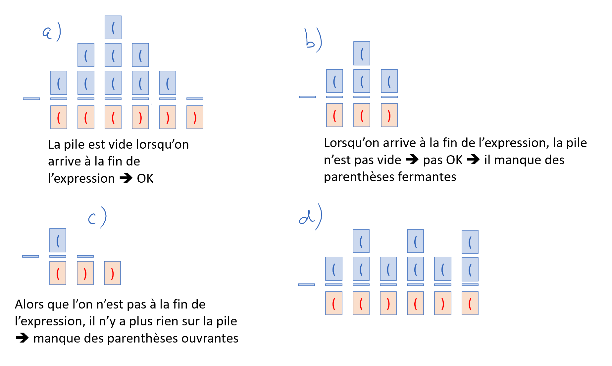
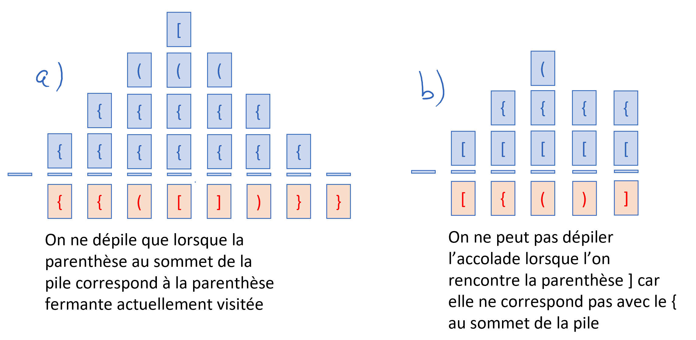

.. _parenthesis_checking:

Application des piles : vérification de parenthèses
###################################################

..  contents:: Contenu de la page
    :depth: 3

..  admonition:: Source / inspiration

    Le contenu suivant est adapté de la page
    https://perso.liris.cnrs.fr/pierre-antoine.champin/enseignement/algo/cours/sda/pile.html#application-texte-bien-parenthese

Les piles sont utilisées dans de nombreuses situations en informatique. Nous
étudions ici un exemple d'analyseur syntaxique simple, vérifiant si un texte est
correctement parenthésé.

Avec un seul type de parenthèses
================================

Considérons des mots formés sur l'alphabet :math:`\{ (, ) \}`. On dit qu'une
expression est bien parenthésée si chaque parenthèse ouvrante correspond à une
parenthèse fermante correspondante.

..  admonition:: Expressions bien parenthésées

    - ``()``
    - ``()()()``
    - ``(()(()))()``

..  admonition:: Expressions mal parenthésées

    - ``((``
    - ``(()``
    - ``)``
    - ``())``
    - ``)())``

Pour vérifier si une expression est bien parenthésée, il ne suffit pas de
s'assurer qu'il y ait autant de parenthèses ouvrantes que de parenthèses
fermantes. Il faut encore vérifier qu'elles soient correctement emboîtées.

La structure de pile convient à merveille pour résoudre ce problème. L'image
ci-dessous illustre la manière dont on peut résoudre ce problème dans
différentes situations:

    Utilisation d'une pile pour vérifier l'équilibre en parenthèse d'une
    expression. On considère qu'il n'y a que les parenthèses dans l'expression
    et on ignore tous les autres symboles.

Avec plusieurs types de parenthèses
===================================

Le problème se complique encore un peu si l'on considére des expressions pouvant
contenir plusieurs types de parentèses.

Considérons une chaîne de caractères contenant un texte. Ce texte contient des
parenthèses rondes (``(`` et ``)``) et carrées (``[`` et ``]``). À chaque
parenthèse ouvrante doit correspondre une parenthèse fermante du même type, et
réciproquement. Par ailleurs, si une parenthèse ouvrante est ouverte à
l'intérieur d'un autre couple de parenthèses, sa parenthèse fermante doit elle
aussi de trouver à l'intérieur du même couple.

    Utilisation d'une pile pour vérifier l'équilibre en parenthèse d'une
    expression contenant plusieurs types de parenthèses. On considère qu'il n'y
    a que les parenthèses dans l'expression et on ignore tous les autres
    symboles.

Le tableau ci-dessous donne des exemples de textes bien et mal parenthésés.

..  list-table:: Textes bien parenthésés et mal parenthésés
    :widths: 50 50
    :align: left
    :header-rows: 1

    * - Bien parenthésés
      - Mal parenthésés

    * - abc
      - (

    * - (abc)
      - abc)

    * - ab[cd]ef
      - ab)c

    * - a[b]c(d)e
      - a(b]c

    * - a((b)c)d
      - a(b(c)d

    * - a(b[c()e]f)g
      - a(b[c)d]e

D'après la définition d'un texte bien parenthésé, une condition nécessaire est
qu'il contienne autant de « ( » que de « ) », et autant de « [ » que de « ] ».
Cependant, cette condition n'est pas suffisante, comme l'illustre le dernier
exemple de texte mal parenthésé dans le tableau ci-dessus. L'ordre dans lequel
on rencontre les parenthèses fermantes doit correspondre à l'ordre dans lequel
on a rencontré les parenthèses ouvrantes.

En fait, le type (rond ou carré) d'une parenthèse fermante doit toujours
correspondre au type de la dernière parenthèse ouvrante rencontrée (et non
encore fermée). On décide donc de stocker dans une pile les types des
parenthèses ouvrante rencontrées. Lorsqu'on rencontre une parenthèse fermante,
il faut s'assurer qu'il reste dans la pile une parenthèse ouvrante à fermer, et
que son type correspond à celui de la parenthèse fermante. Si ces conditions
sont vérifiées, la parenthèse ouvrante est retirée de la pile (puisqu'elle vient
d'être fermée), sinon le texte est mal parenthésé et on peut interrompre le
traitement. Arrivé à la fin du texte, il faut également vérifier qu'aucune
parenthèse ne demeure ouverte dans la pile. On supposera que le nombre de
parenthèses ouvertes simultanément n'excède jamais la capacité de la pile.

Exercices
=========

Exercice 1
----------

..  activecode:: stack__parenthesis_matcher_py
    :language: webtp
    :interpreterargs: vanilla_python=true&debug_mode=true&layout=["Editor", "Console"]

    Développez une classe ``ParenthesisMatcher`` qui fonctionne comme dans la
    docstring et qui permet de créer un vérificateur de correspondance de
    parenthèses:

    ~~~~

    class ParenthesisMatcher:
        '''

        >>> m = ParenthesisMatcher()
        >>> m.add_match('(', ')')
        >>> m.add_match('[', ']')

        >>> m.as_dict()
        {'(': ')', '[': ']'}

        >>> m
        ParenthesisMatcher({'(': ')', '[': ']'})
        
        >>> m.match('(', ')')
        True
        >>> m.match('(', '(')
        False
        >>> m.match('(', ']')
        False
        >>> m.match('[', ']')
        True
        >>> m.match('[', ')')
        False
        >>> m.match('{', '}')
        False

        >>> m.add_match('{', '}')
        >>> m.match('{', '}')
        True
        
        '''

        ...

    if __name__ == '__main__':
        import doctest
        doctest.testmod()

..  reveal:: ad84034a-dade-446b-ae02-4c7a21d96f22
    :showtitle: Solution
    :instructoronly:

    ..  code-block:: python

        from typing import Any

        class ParenthesisMatcher:
            '''

            >>> m = ParenthesisMatcher()
            >>> m.add_match('(', ')')
            >>> m.add_match('[', ']')

            >>> m.as_dict()
            {'(': ')', '[': ']'}

            >>> m
            ParenthesisMatcher({'(': ')', '[': ']'})
            >>> m = ParenthesisMatcher({'(': ')', '[': ']'})
            >>> m
            ParenthesisMatcher({'(': ')', '[': ']'})
            
            >>> m.is_opening_paren('(')
            True
            >>> m.is_opening_paren(')')
            False
            >>> m.is_opening_paren('{')
            False
            
            >>> m.is_closing_paren(')')
            True
            >>> m.is_closing_paren('(')
            False
            >>> m.is_closing_paren('}')
            False
                
            >>> m.match('(', ')')
            True
            >>> m.match('(', '(')
            False
            >>> m.match('(', ']')
            False
            >>> m.match('[', ']')
            True
            >>> m.match('[', ')')
            False
            >>> m.match('{', '}')
            False

            >>> m.add_match('{', '}')
            >>> m.match('{', '}')
            True
            
            '''

            def __init__(self, matches: dict[str, str] = None) -> None:
                self._matches = matches or {}
                self._reverse_matches = ParenthesisMatcher.reverse_dict(self._matches)
                
            @staticmethod
            def reverse_dict(d: dict[Any, Any]) -> dict[Any, Any]:
                result = {}
                for k, v in d.items():
                    if v in result:
                        raise ValueError(f"dict {d} must be reversible")
                    result[v] = k
                return result
                

            def add_match(self, opening: str, closing: str) -> None:
                self._matches[opening] = closing
                self._reverse_matches[closing] = opening

            def match(self, opening, closing):
                if opening in self._matches:
                    return self._matches[opening] == closing
                else:
                    return False
                
            def is_opening_paren(self, c: str) -> bool:
                return c in self._matches
            
            def is_closing_paren(self, c: str) -> bool:
                return c in self._reverse_matches

            def as_dict(self) -> dict[str, str]:
                return self._matches

            def __repr__(self) -> str:
                return f'{self.__class__.__name__}({self._matches})'

        if __name__ == '__main__':
            import doctest
            doctest.testmod()

Exercice 2
----------

Implémentez une fonction ``check_balanced(text: str) -> bool`` qui retourne
``True`` si et seulement le texte ``text`` est bien parenthésé.

..  activecode:: stack__parenthesis_checking_py
    :language: webtp
    :interpreterargs: vanilla_python=true&debug_mode=true&layout=["Editor", "Console"]

    ############### Importation dans WebTigerPython ############
    from pyodide.http import open_url

    def load_external_files(files: list[str]) -> None:
        prefix = 'https://raw.githubusercontent.com/informatiquecsud/algo-ds/refs/heads/solutions/ds_single_files/'
        for file in files:
            module = file.split('/')[-1]
            with open(module, 'w') as fd: fd.write(open_url(prefix + file).read())

    load_external_files([
        'stack.py',
        'list_stack.py',
    ])
    ############################################################

    from list_stack import ListStack

    Stack = ListStack

    class ParenthesisMatcher:

        # Commencer par faire l'exercice 1 et coller le code ici

        ...
            
            
    Stack = ListStack

    def check_balanced(text: str) -> bool:
        '''
        >>> check_balanced("abc")
        True
        >>> check_balanced("(abc)")
        True
        >>> check_balanced("ab[cd]ef")
        True
        >>> check_balanced("a[b]c(d)e")
        True
        >>> check_balanced("a((b)c)d")
        True
        >>> check_balanced("a(b[c()e]f)g")
        True
        
        >>> check_balanced("(")
        False
        >>> check_balanced("abc)")
        False
        >>> check_balanced("ab)c")
        False
        >>> check_balanced("a(b]c")
        False
        >>> check_balanced("a(b(c)d")
        False
        >>> check_balanced("a(b[c)d]e")
        False
        '''
        ...

    if __name__ == '__main__':
        import doctest
        doctest.testmod()

    

..  admonition:: Solution en vidéo

    ..  youtube:: TC7apM-xGaU
        :divid: parenthesis-checking-lucid-programming
        :width: 630
        :height: 435

..  reveal:: de18a099-0256-4c71-94fe-df33dcfef07a
    :showtitle: Solution
    :instructoronly:

    ..  activecode:: 246dac91-e0f5-406b-b623-23dbe38542d7
        :language: webtp

        ############### Importation dans WebTigerPython ############
        from pyodide.http import open_url

        def load_external_files(files: list[str]) -> None:
            prefix = 'https://raw.githubusercontent.com/informatiquecsud/algo-ds/refs/heads/solutions/ds_single_files/'
            for file in files:
                module = file.split('/')[-1]
                with open(module, 'w') as fd: fd.write(open_url(prefix + file).read())

        load_external_files([
            'stack.py',
            'list_stack.py',
            'parenthesis_matcher.py',
        ])
        ############################################################

        from stack import EmptyStackError
        from list_stack import ListStack
        from parenthesis_matcher import ParenthesisMatcher

        Stack = ListStack

        def check_balanced(text: str) -> str:
            '''
            >>> check_balanced("abc")
            True
            >>> check_balanced("(abc)")
            True
            >>> check_balanced("ab[cd]ef")
            True
            >>> check_balanced("a[b]c(d)e")
            True
            >>> check_balanced("a((b)c)d")
            True
            >>> check_balanced("a(b[c()e]f)g")
            True
            
            >>> check_balanced("(")
            False
            >>> check_balanced("abc)")
            False
            >>> check_balanced("ab)c")
            False
            >>> check_balanced("a(b]c")
            False
            >>> check_balanced("a(b(c)d")
            False
            >>> check_balanced("a(b[c)d]e")
            False
            '''
                
            m = ParenthesisMatcher()
            m.add_match('(', ')')
            m.add_match('[', ']')
            m.add_match('{', '}')
                    
            p_stack = Stack()
            
            for c in text:
                if m.is_opening_paren(c):
                    p_stack.push(c)
                elif m.is_closing_paren(c):
                    try:
                        top = p_stack.peek()
                        if m.match(top, c):
                            p_stack.pop()
                        else:
                            return False
                    except EmptyStackError as e:
                        return False
                else:
                    pass
                
            if p_stack.is_empty():
                return True
            else:
                return False

        if __name__ == '__main__':
            import doctest
            doctest.testmod()

.. 
    ..  reveal:: 97223ff4-e2e2-47ff-a8f5-5d4697239deb
        :showtitle: Lien vers basthon.fr

        https://console.basthon.fr/?script=eJylVttqGzEQfTf4H0ReVgLHNMlbIIa2pKVQSqGmL8siy9pxLLI3JBliQv-9mr1qb4lpZTAr6czM0WguOug8JWIviUqLXFvy8dPnlZsbq4W0KdhjHi8XBwTZc6Gypwa3PRfwW-gV-QoZaCWXi-ViSx6adRpsA4ZrxI3lQibCGPLLCvn8-CKhsCrPaPvF7itc4UAoU6Ef08KeKxGtc0370tMy35WxJY7WtMJt1CCDIGgI7XYtcLfDEyWQQmYNEcTgItmfycngaQVJHJIIQ-wRiMwzK5RTvG40bTYbYu47u6HKbOTc0BFhHnBdnMyR3vhL1Wd4E41gt1OwFbkdI-9mkCty1wcDtHzueht5MbU-a7SD386s34zVRI3PvIuI4UA4V5mynFMDyYGR6w35kWdQXxoOXF9zZSE1zrOdnkpYQ6F9YRe5nqwGe9IZQRD19LC-jgQyX4W7w7EKh5nVUN4Cbq4Ibt6T7TvnWIuigCymOOlrci5seWw9YavP3szj5Wv1LgAHlMlCvmUxvJQ5hHEMQzVCGRglW_AzL0iZ9iIjgJtVZgSsWoUeaYyrf2YdXjfB_9-cHY9L-CrDS0jHeZ_nyfyVM_LwQD502_5Xad9PeDSERuQR5DPfi0RkEmJq4cXeY3AOgrRMhiZVBjJXri5f1fe51SeYB1KHZJdBxT6UcQSHC9HhPpI0ZnAhnNI9kyy-FO24UAbRgT2NJd44bQP-IhLz5lE7p7wLZfJSKHUuuRxLPXe8jw4dOoIJfBsnXRjvTyqJeawk9kOhFRhaCO362BEMGObFc-6KjetmvNx2wfr6p9uTSW7m9rqvg0vEQijtaiPxjAzysrazapQ6ddg-KUqySWhlNqxn2Dlr0T66RzKsZ4iuBfvoUSL3jK362oanbbEezhmacHYYUBasSPD6B__DKIiYf0UFN3Vt6D0Eqn_0p0RnlnWh46AO1XLLYuDhWmnV96Vf65NGtGU9fTmdi3kRymjOczjG1bum2LIoHxRYHWvlE_Ae635_6ribYYVvRn2BXiK0QlWjGDSBqW4xr2fCcPWe7PvDO3HbOti4XXSla6C3bxx_Cl8dmUiBc_RewHnq3pWcB7VU_ciOc2nB2Drlq8ka_9I8Rkf-BXBVGeU 
