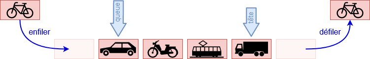
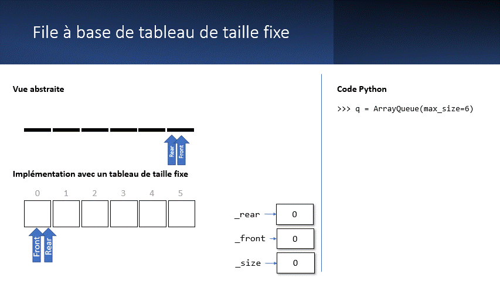

.. _queue:

Files (Queue)
#############

..  contents:: Contenu de la page
    :depth: 3

..  reveal:: 2983d83a-2c68-414c-b9f4-987fce0e1c83
    :showtitle: Réflexions pédagogiques
    :instructoronly:

    ..  note::

        Réflexion : il n'y a pas vraiment besoin de pointeur ``rear`` qui fait
        doublon avec front / size. On peut toujours calculer rear à partir de
        front + size --> idée ==> garder comme exercice ou comme question
        d'examen.

Une File (ou Queue) est une structure de données linéaire dans laquelle les
éléments sont accessibles selon une discipline FIFO (“First-In First-Out”) : le
premier élément inséré dans la liste est le premier à en sortir.

..
    ..  figure:: queue/queue-cover.png
        :align: right
        :width: 80%

- Insérer un élément dans la file est appelé **enfiler** (enqueue)
- Supprimer un élément de la file est appelé **défiler** (dequeue)

L’accès aux objets de la file se fait grâce à deux pointeurs, l’un pointant sur
l’élément qui a été inséré en premier et l’autre sur celui inséré en dernier.

    Opérations FIFO sur une file.

..
    Introduction en vidéo
    =====================

    ..  note:: 

        L'implémentation de la pile donnée dans cette vidéo diffère légèrement de
        celle que nous allons développer, mais elle permet de comprendre les grandes
        lignes.

    ..  youtube:: RFOsPp_BM3M
        :divid: stack-intro
        :width: 630
        :height: 435

..
    Présentation PowerPoint
    =======================

    Le diaporama ci-dessous présente les structures de données linéaires, en
    particulier les piles et les files.

    ..  admonition:: Présentation PowerPoint

        ..  raw:: html
            
            <iframe
                src="https://eduetatfr.sharepoint.com/teams/CSUD-GT-BrancheInformatiqueBureautique/_layouts/15/Doc.aspx?sourcedoc={ff96b824-00cc-4929-aaca-9bfa187ac2a5}&amp;action=embedview&amp;wdAr=1.7777777777777777"
                width="640px" height="385px" frameborder="0">Ceci est un document <a
                target="_blank" href="https://office.com">Microsoft Office</a> incorporé,
                avec <a target="_blank"
                href="https://office.com/webapps">Office</a>.
            </iframe>

Type abstrait ``QueueADT``
==========================

Commençons par définir une classe abstraite ``QueueADT`` pour représenter le
type abstrait de file. 

- Une méthode ``enqueue(item)`` pour **enfiler** un nouvel élément ``item`` en
  fin de file.

  ..  note::

      Cette opération est parfois appelée ``push`` par analogie avec les piles
      ou ``put``

- Une méthode ``dequeue()`` pour **défiler** l'élément en tête de la file

  ..  note::

      Cette opération est parfois appelée ``pop`` par analogie avec les piles ou
      ``get``

- Une méthode ``first()`` pour consulter l'élément à l'avant de la file sans le
  défiler.

- La méthode magique ``__len__()`` permettant d'utiliser la fonction
  ``len(queue)`` sur la file ``queue`` pour connaître le nombre d'éléments
  qu'elle contient.
  
- La méthode magique ``is_empty()`` pour savoir si la pile contient des
  éléments ou si elle est vide.

..  activecode:: queue_adt_py
    :language: webtp

    from abc import ABC, abstractmethod
    from typing import TypeVar, Generic

    T = TypeVar('T')

    class QueueADT(ABC, Generic[T]):

        @abstractmethod
        def enqueue(self, item: T) -> None:
            '''Enfile un nouvel objet dans la file'''
            pass
        
        
        @abstractmethod
        def dequeue(self) -> T:
            '''Défile le premier objet de la file'''
            pass
        
        
        @abstractmethod
        def first(self) -> T:
            '''Retourne le premier élément de la file sans le défiler'''
            pass
        

        @abstractmethod
        def is_empty(self) -> bool:
            '''Retourne ``True`` si la liste est vide et ``False`` sinon'''
            pass

        @abstractmethod
        def __len__(self) -> int:
            '''Retourne le nombre d'éléments de la file'''
            pass

        @abstractmethod
        def __repr__(self) -> str:
            '''Retourne la représentation interne de la file'''
            pass

    class QueueException(Exception):
        pass

    class EmptyQueueError(QueueException):
        pass

    class QueueOverflowError(QueueException):
        pass

On définit également l'exception ``EmptyQueueError`` et ``QueueOverflowError``

..  
    literalinclude:: queue/list_queue.py
    :pyobject: QueueADT
    :linenos:
    :name: queue-adt-py
    :caption: list_queue.py

..
    ..  activecode:: queue_adt.py

        ..  admonition:: Attention
            :class: warning

            Il n'est pas encore possible d'exécuter le code ci-dessous sur le site.
            Il faut utiliser https://futurecoder.io ou
            https://papyros.dodona.be/?locale=en&language=Python pour exécuter ce
            code sur le Web.

        ~~~~

        from abc import ABC, abstractmethod
        from typing import TypeVar, Generic

        T = TypeVar('T')

        class QueueADT(ABC, Generic[T]):

            @abstractmethod
            def enqueue(self, item: T) -> None:
                'Enfile un nouvel objet dans la file'
                pass
            
            
            @abstractmethod
            def dequeue(self) -> T:
                'Défile le premier objet de la file'
                pass
            
            
            @abstractmethod
            def first(self) -> T:
                'Retourne le premier élément de la file sans le défiler'
                pass
            

            @abstractmethod
            def is_empty(self) -> bool:
                'Retourne ``True`` si la liste est vide et ``False`` sinon'
                pass

            @abstractmethod
            def __len__(self) -> int:
                'Retourne le nombre d'éléments de la file'
                pass

            @abstractmethod
            def __repr__(self) -> str:
                'Retourne la représentation interne de la file'
                pass

.. _list-queue:

Implémentation d'une file avec une liste
========================================

Il est possible d'implémenter une file à l'aide d'une liste. Voici une
implémentation naïve:

..  
    literalinclude:: queue/list_queue.py
    :pyobject: ListQueue
    :linenos:
    :name: list-queue-py
    :caption: Implémentation d'une file à base de liste

..  activecode:: queue_list_py
    :language: webtp

    ############### Importation dans WebTigerPython ############
    from pyodide.http import open_url

    def load_external_files(files: list[str]) -> None:
        prefix = 'https://raw.githubusercontent.com/informatiquecsud/algo-ds/refs/heads/solutions/ds_single_files/'
        for file in files:
            module = file.split('/')[-1]
            with open(module, 'w') as fd: fd.write(open_url(prefix + file).read())

    load_external_files([
        'queue.py',
    ])
    ############################################################

    from typing import TypeVar, Generic
    from queue import QueueADT, EmptyQueueError

    T = TypeVar('T')

    class ListQueue(QueueADT, Generic[T]):
        '''
        Implements a queue ADT by storing the elements in a list

        >>> queue: ListQueue[int] = ListQueue()
        >>> queue.enqueue(3)
        >>> queue.enqueue(5)
        >>> queue
        [3, 5]
        >>> len(queue)
        2
        >>> queue.first()
        3
        >>> queue.dequeue()
        3
        >>> queue
        [5]
        >>> queue.dequeue()
        5
        >>> queue
        []
        >>> queue.dequeue()
        Traceback (most recent call last):
        ...
        EmptyQueueError: dequeue from empty queue
        '''

        def __init__(self) -> None:
            self._items = []

        def enqueue(self, item: T) -> None:
            '''Enfile un nouvel objet dans la file'''
            self._items.append(item)
        
        
        def dequeue(self) -> T:
            '''Défile le premier objet de la file'''
            if self.is_empty():
                raise EmptyQueueError("dequeue from empty queue")
            else:
                return self._items.pop(0)

        def first(self) -> T:
            '''Retourne le premier élément de la file sans le défiler'''
            if self.is_empty():
                raise EmptyQueueError("illegal first element in empty queue")
            else:
                return self._items[0]
        

        def is_empty(self) -> bool:
            '''Retourne ``True`` si la liste est vide et ``False`` sinon'''
            return len(self) == 0

        def __len__(self) -> int:
            '''Retourne le nombre d'éléments de la file'''
            return len(self._items)

        def __repr__(self) -> str:
            '''Retourne la représentation interne de la file'''
            return repr(self._items)

        if __name__ == '__main__':
            import doctest
            doctest.testmod()

Applications
============

Les files sont très utilisées en informatique, en particulier pour gérer de
longues tâches qu'il faut accomplir les unes après les autres:

- Files d'impression
- Traitement des vidéos sur une plateforme telle que YouTube
- Mémoire tampon (buffer) pour le streaming vidéo

Files d'impression
------------------

Lorsque de nombreuses tâches d'impression sont envoyées vers un serveur
d'impression (ou gestionnaire d'impression), ce dernier met les tâches dans une
file d'attente en attendant que l'imprimante soit disponible pour les imprimer.

Tâches longues sur un service Web
---------------------------------

Certains services Web doivent effectuer de nombreuses tâches longues. Un exemple
de telle tâche est le traitement de contenu multimédia tel que les images ou les
vidéos. Par exemple, de nombreuses vidéos sont téléversées chaque minute sur les
plateformes de streaming vidéo telles que YouTube.

Le traitement de ces vidéos (compression, encodage, scaling dans diverses
résolutions, etc.) demande beaucoup de temps de calcul et des serveurs dédiés
s'occupent de ces tâches fastidieuses pour que le serveur principal puisse
continuer de répondre aux clients qui désirent visionner des vidéos.

Ces tâches gourmandes en temps de calcul sont mises en attente dans une file en
attendant d'être traitées.

Mémoires tampon (buffers)
-------------------------

En informatique, il arrive souvent qu'une source produise des données plus
rapidement qu'elles ne peuvent être consommées à l'autre bout. Ainsi, lorsqu'on
visionne une vidéo en streaming, les données sont généralement transférées plus
rapidement que la vitesse de lecture. En attendant, que les données vidéos
soient jouées, elles sont stockées dans une **mémoire tampon** (*buffer* en
anglais), de sorte s'il y a un ralentissement dans la vitesse de connexion, on
puisse continuer à lire les données présentes dans la mémoire tampon en
attendant que la suite de la vidéo soit téléchargée.

Recherche en largeur (BFS)
--------------------------

Les files sont à la base de la recherche en largeur (Breadth-First Search =
BFS).

Dans le challenge :ref:`challenge-bwillis.rst`, on peut utiliser une recherche
en largeur pour résoudre le challenge de manière automatique en trouvant une
manière optimale de faire les transferts, pour autant qu'une telle solution
existe. La recherche en largeur est très souvent utilisée pour faire une
recherche exhaustive. 

..  note::

    Nous étudierons en détail la recherche en largeur dans le contexte de la
    résolution de problèmes de satisfaction de contraintes.

Questions de compréhension
==========================

..  mchoice:: queue/comprehension-01

    Considérons la suite d'opérations suivante sur la file ``q``:

    ::

        q = Queue()
        q.enqueue("hello")
        q.enqueue("dog")
        q.enqueue(3)
        q.dequeue()

    Quels sont les éléments qui restent dans la file lorsqu'elles ont toutes été
    exécutées?

    - 'hello', 'dog'

      - Faux. Rappelez-vous que le premier élément enfilé dans la file est
        également le premier à en être défilé (principe FIFO).

    - 'dog', 3

      + Vrai.

    - 'hello', 3

      - Faux. Avec les piles et les files, on ne peut accéder qu'au dernier
        élément

    - 'hello', 'dog', 3

      - Faux. Vous avez peut-être pas fait attention à la dernière opération de
        défilement.

Implémentation sous forme de tableau
====================================

..  admonition:: Tableau (définition)

    Les **tableaux** sont des structures de données linéaires dont tous les
    éléments sont stockés de manière contiguë en mémoire. L'accès aux éléments
    se fait en temps constant. Les listes Python sont des tableaux dynamiques
    dont la taille peut changer, contrairement aux tableaux "normaux" que l'on
    trouve dans les langages bas niveau tels que le C/C++, dont la taille est
    définie d'avance lors de leur création et ne peut varier.

Le problème avec l'implémentation ``ListQueue``
-----------------------------------------------

Dans :ref:`list-queue`, nous avons développé une classe ``ListQueue`` qui
implémente une file à l'aide d'une liste Python. Cette implémentation a
l'avantage de la simplicité mais comporte deux désavantages problématiques

#. Même si la complexité amortie de l'opération ``append()`` est :math:`O(1)`,
   le redimensionnement du tableau sous-jacent effectué par Python peut demander
   passablement de ressources lorsqu'il n'y a plus de place libre pour un nouvel
   élément

#. L'opération de défilement est très coûteuse puisqu'elle nécessite un
   ``.pop(0)`` qui est de complexité :math:`O(n)`, donc catastrophique pour de
   grosses files et la plupart des utilisations.

Idée de base
------------

Il est possible de développer une file sur la base d'un tableau de taille fixe
avec des opérations ``enqueue`` et ``dequeue`` qui sont toutes deux très
performantes et en :math:`O(1)`.

Pour cela, on commence déjà par demander un paramètre supplémentaire
``max_size`` lors de la création de la file:

::

    >>> q = ArrayQueue(max_size=1000)

En effet, dans de très nombreux cas, on peut se contenter d'une file qui ne
dépasse pas une certaine taille. Dans cette implémentation, au lieu d'utiliser
``_items.pop(0)`` pour défiler les éléments, on utilise une astuce qui utilise
deux compteurs ``rear`` et ``front`` pour marquer le début et la fin de la file
au sein du tableau (= liste de taille fixe) sous-jacent.

..  admonition:: Animation interactive de ``ArrayQueue``

    L'animation interactive ci-dessous permet de se familiariser avec le concept
    de file basée sur un tableau de taille fixe. Les contrôles sont les suivants

    - Le bouton "Enqueue" permet d'enfiler un nouvel élément dans la file
    - Le bouton "Dequeue" permet de défiler l'élément se trouvant à l'avant de la file
    - Le bouton "Reset" permet de réinitialiser la file.

    ..  reveal:: 85c0ebca-1fd0-4cd8-8d2b-3b55fb2890c9
        :showtitle: URL du composant
        :instructoronly:

        https://21learning-components.surge.sh/#/component/arrayQueue?maxSize=5

        Le code source se trouve dans
        ``/home/donnerc/dev/21learning/old-21learning-components`` ou sur
        https://github.com/informatiquecsud/21learning-components

    ..  raw:: html

        <iframe
            src="https://21learning-components.surge.sh/#/component/arrayQueue?maxSize=5"
            width="100%" height="610px" frameborder="0" 
        ></iframe>

Présentation détaillée du fonctionnement
----------------------------------------

Le fonctionnement est simple

    Animation du fonctionnement d'une file basée sur un tableau de taille fixe

-   Pour **enfiler** un élément lorsque la file n'est pas pleine, on assigne le
    nouvel élément à enfiler à l'élément du tableau situé à l'indice indiqué par
    l'attribut ``rear`` et on incrémente ``rear``. 

    ..  admonition:: Exemple

        On crée une file de taille maximale 6 et on enfile les éléments 5, 7 et 9.
        Voici l'état du tableau après ces opérations

        ..  figure:: queue/array_queue_enqueue.png
            :align: center
            :width: 100%

            État du tableau sous-jacent après que 5, 7 et 9 ont été enfilés.

-   Pour **défiler** un élément lorsque la file n'est pas vide, on incrémente
    simplement l'indice ``front`` pour qu'il fasse référence au prochain élément
    du tableau. 

    ..  admonition:: Exemple

        Par exemple, si l'on défile deux fois (les deux éléments à l'avant de la
        liste), on obtient l'état suivant, avec le compteur ``front`` qui a été
        augmenté de deux positions:

        ..  figure:: queue/array_queue_dequeue.png
            :align: center
            :width: 100%

            État du tableau sous-jacent après que les deux éléments à l'avant
            ont été défilés.

-   Si le compteur ``rear`` fait déjà référence au dernier élément de la liste,
    on le remet simplement à 0 pour qu'il référence le premier élément du
    tableau.

    ..  admonition:: Exemple

        ..  figure:: queue/rear_pointeur_around.gif
            :align: center
            :width: 100%

            Le compteur ``rear`` est remis à zéro lorsqu'on arrive à la fin du
            tableau.

-   De même, si le compteur ``front`` fait déjà référence au dernier élément du
    tableau, on le remet simplement à 0 pour faire référence au premier élément
    du tableau. 

    ..  admonition:: Exemple

        ..  figure:: queue/front_pointeur_around.gif
            :align: center
            :width: 100%

            Le compteur ``front`` est remis à zéro lorsqu'on arrive à la fin du
            tableau.

Voici une implémentation Python d'une file à base de tableau (liste de taille
fixe) fonctionnant comme présentés dans la vidéo.

Exercices
=========

Exercice 1
----------

Dans cet exercice, il s'agit de déterminer la complexité des opérations
``enqueue`` et ``dequeue`` avec notre implémentation ``ListQueue``.

..  note:: 
    
    Étudiez et exécutez le code ci-dessous. Il utilise le package ``matplotlib``
    pour visualiser les mesures du temps d'exécution collectées durant l'exécution.

..  activecode:: f5f6aaf3-644c-4fdc-8166-ef7cd531c058
    :language: webtp

    import matplotlib.pyplot as plt
    from timeit import Timer

    sizes = []
    pop_head_times = []
    append_times = []

    pop_head = Timer("x.pop(0)", "from __main__ import x")
    append_tail = Timer("x.append(0)", "from __main__ import x")
    print(f"{'n':10s}{'pop(0)':>15s}{'append()':>15s}")
    for i in range(1_000, 100_001, 5_000):
        sizes += [i]
        
        x = list(range(i))
        head_t = pop_head.timeit(number=1000)
        pop_head_times.append(head_t)
        
        x = list(range(i))
        append_t = append_tail.timeit(number=1000)
        append_times.append(append_t)
        
        print(f"{i:<10d}{head_t:>15.5f}{append_t:>15.5f}")
        
    fig, ax = plt.subplots()
    ax.scatter(sizes, pop_head_times, label="pop(0)")
    ax.scatter(sizes, append_times, label="append()")
    ax.set_xlabel("Queue size")
    ax.set_ylabel("Time [ms]")
    ax.set_title("Comparison between pop(0) and append()")
    ax.legend()
    ax.grid(True)
    plt.show()

..  
    admonition:: Indication

    ..  literalinclude:: queue/benchmark_list_queue_performance.py
        :language: python
        :linenos:

    ..  figure:: queue/queue-operation-costs.png
        :align: center
        :width: 80%

        Coût des opérations ``list.pop(0)`` et ``list.append()``.

..  shortanswer:: ds-queues-exercise-01-complexity-enqueue

    Déterminez la complexité de l'opération ``ListQueue.enqueue()``

..  reveal:: 72e1ef1f-60dc-43a0-9007-9fa100812612
    :showtitle: Solution

    ..  admonition:: Solution

        L'opération ``enqueue`` utilise ``list.append()`` qui a une complexité
        amortie de :math:`O(1)`. Cependant, utiliser une liste (tableau
        dynamique) et ``append`` n'est pas optimal, car l'opération ``append``
        est parfois :math:`O(n)`, lorsque la liste est pleine et qu'il faut la
        redimensionner (voir :ref:`prog-lists-performances-append`).

..  shortanswer:: ds-queues-exercise-01-complexity-dequeue

    Déterminez la complexité de l'opération ``ListQueue.dequeue()``

..  reveal:: 84e39023-bafc-48cd-b9c1-be52a935294f
    :showtitle: Solution

    ..  admonition:: Solution

        L'opération ``dequeue`` utilise ``list.pop(0)``, qui a une complexité
        amortie de :math:`O(n)` comme le montre le graphique

        
Exercice 2
----------

..  note:: 

    Cet exercice consiste à implémenter une file bien plus performante, avec un
    défilement et un enfilement qui sont tous deux :math:`O(1)`, mais qui a une
    taille maximale fixe.

Implémentez une pile ``ArrayQueue`` qui stocke les éléments sous forme de
tableau (liste de taille fixe). Le constructeur de la classe doit prendre un
paramètre ``size: int`` qui détermine la taille initiale du tableau.

Les opérations ``enqueue``, ``dequeue``, ``first``, ``size`` et ``is_empty``
doivent toutes être de complexité :math:`O(1)`.

..  activecode:: queue-array_queue_py
    :language: webtp

    ############### Importation dans WebTigerPython ############
    from pyodide.http import open_url

    def load_external_files(files: list[str]) -> None:
        prefix = 'https://raw.githubusercontent.com/informatiquecsud/algo-ds/refs/heads/solutions/ds_single_files/'
        for file in files:
            module = file.split('/')[-1]
            with open(module, 'w') as fd: fd.write(open_url(prefix + file).read())

    load_external_files([
        'queue.py',
    ])
    ############################################################

    from typing import TypeVar, Generic
    from queue import QueueADT, QueueOverflowError, EmptyQueueError

    T = TypeVar('T')

    class ArrayQueue(QueueADT, Generic[T]):
        '''

        Implements a static array based queue

        >>> q = ArrayQueue(max_size=5)
        >>> q.enqueue(3)
        >>> q.enqueue(5)
        >>> q
        ArrayQueue(max_size=5, items=[3, 5])
        >>> len(q)
        2
        >>> for item in [7, 9, 11]: q.enqueue(item)
        >>> q
        ArrayQueue(max_size=5, items=[3, 5, 7, 9, 11])
        >>> q.enqueue(13)
        Traceback (most recent call last):
        ...
        queue.QueueOverflowError: Cannot enqueue into full queue
        >>> q.first()
        3
        >>> q.dequeue()
        3
        >>> len(q)
        4
        >>> q
        ArrayQueue(max_size=5, items=[5, 7, 9, 11])
        >>> for _ in range(4): q.dequeue()
        5
        7
        9
        11
        >>> q
        ArrayQueue(max_size=5, items=[])
        >>> q.dequeue()
        Traceback (most recent call last):
        ...
        queue.EmptyQueueError: Cannot dequeue from empty queue
        >>> q.first()
        Traceback (most recent call last):
        ...
        queue.EmptyQueueError: Cannot get first element from empty queue
        >>> for n in range(2): q.enqueue(n)
        >>> q
        ArrayQueue(max_size=5, items=[0, 1])
        >>> q.is_empty()
        False
        >>> for _ in range(2): q.dequeue()
        0
        1
        >>> q
        ArrayQueue(max_size=5, items=[])
        >>> q.is_empty()
        True
        '''

        def __init__(self, max_size: int) -> None:
            self._items = [None] * max_size

        def __len__(self) -> int:
            pass

    if __name__ == '__main__':
        import doctest
        doctest.testmod()

..  reveal:: 00e2e4b4-0549-44de-90ec-9e08f10a27e7
    :showtitle: Solution
    :instructoronly:

    ############### Importation dans WebTigerPython ############
    from pyodide.http import open_url

    def load_external_files(files: list[str]) -> None:
        prefix = 'https://raw.githubusercontent.com/informatiquecsud/algo-ds/refs/heads/solutions/ds_single_files/'
        for file in files:
            module = file.split('/')[-1]
            with open(module, 'w') as fd: fd.write(open_url(prefix + file).read())

    load_external_files([
        'queue.py',
    ])
    ############################################################

    from typing import TypeVar, Generic
    from queue import QueueADT, QueueOverflowError, EmptyQueueError

    T = TypeVar('T')

    class ArrayQueue(QueueADT, Generic[T]):
        '''

        Implements a static array based queue

        >>> q = ArrayQueue(max_size=5)
        >>> q.enqueue(3)
        >>> q.enqueue(5)
        >>> q
        ArrayQueue(max_size=5, items=[3, 5])
        >>> len(q)
        2
        >>> for item in [7, 9, 11]: q.enqueue(item)
        >>> q
        ArrayQueue(max_size=5, items=[3, 5, 7, 9, 11])
        >>> q.enqueue(13)
        Traceback (most recent call last):
        ...
        queue.QueueOverflowError: Cannot enqueue into full queue
        >>> q.first()
        3
        >>> q.dequeue()
        3
        >>> len(q)
        4
        >>> q
        ArrayQueue(max_size=5, items=[5, 7, 9, 11])
        >>> for _ in range(4): q.dequeue()
        5
        7
        9
        11
        >>> q
        ArrayQueue(max_size=5, items=[])
        >>> q.dequeue()
        Traceback (most recent call last):
        ...
        queue.EmptyQueueError: Cannot dequeue from empty queue
        >>> q.first()
        Traceback (most recent call last):
        ...
        queue.EmptyQueueError: Cannot get first element from empty queue
        >>> for n in range(2): q.enqueue(n)
        >>> q
        ArrayQueue(max_size=5, items=[0, 1])
        >>> q.is_empty()
        False
        >>> for _ in range(2): q.dequeue()
        0
        1
        >>> q
        ArrayQueue(max_size=5, items=[])
        >>> q.is_empty()
        True
        '''

        def __init__(self, max_size: int, items=None) -> None:
            self._items = items or [None] * max_size
            self._rear = 0
            self._front = 0
            self._size = 0
            self._max_size = max_size

        def __len__(self) -> int:
            return self._size
        
        def _shift_right(self, current_value):
            return (current_value + 1) % self._max_size
        
        def enqueue(self, item: T) -> None:
            if self._size < self._max_size:
                self._items[self._rear] = item
                self._rear = self._shift_right(self._rear)
                self._size += 1
            else:
                raise QueueOverflowError("Cannot enqueue into full queue")
            
        def dequeue(self) -> T:
            if self._size > 0:
                front_item = self._items[self._front]
                self._front = self._shift_right(self._front)
                self._size -= 1
                return front_item
            else:
                raise EmptyQueueError("Cannot dequeue from empty queue")
            
            
        def to_list(self) -> list[T]:
            if self._size == 0:
                return []
            elif self._front < self._rear:
                return self._items[self._front:self._rear]
            else:
                return self._items[:self._rear] + self._items[self._front:]
            
        def __repr__(self):
            items = self.to_list()
            return f'{self.__class__.__name__}(max_size={self._max_size}, items={items})'
        
        def first(self):
            if self._size > 0:
                return self._items[self._front]
            else:
                raise EmptyQueueError("Cannot get first element from empty queue")
        def is_empty(self) -> bool:
            return self._size == 0
                

    if __name__ == '__main__':
        import doctest
        doctest.testmod()

Exercice 3 (facultatif)
-----------------------

Développez une classe ``DynamicArrayQueue`` qui dérive de ``ArrayQueue`` et
fonctionne de la même manière, à la différence qu'elle implémente une méthode
``_grow`` qui redimensionne (double) la taille de la file si l'on essaye d'y
enfile un élément alors qu'elle est pleine. 

..  note::

    Il faudra également réimplémenter la méthode ``enqueue`` pour qu'elle ne
    lève pas d'exception si la file est pleine, mais qu'elle redimensionne la
    file et insère l'élément.

..  admonition:: Redimensionnement

    Pour redimensionner le tableau sous-jacent, il est important de créer un
    nouveau tableau (liste) et de copier les éléments un à un dans le
    nouveau tableau, en commençant depuis le début, selon l'illustration 

    ..  figure:: queue/redimensionner.png
        :align: center
        :width: 80%

        Redimensionnement du tableau sous-jacent en doublant la taille de la
        liste.

..  activecode:: queue-dynamic_array_queue_py
    :language: webtp

    # coller ici le code nécessaire pour la classe ArrayQueue

    class DynamicArrayQueue(ArrayQueue):
        '''
        >>> q = DynamicArrayQueue(max_size=3)
        >>> q._grow()
        >>> q
        DynamicArrayQueue(max_size=6, items=[])
        >>> q = DynamicArrayQueue(max_size=3)
        >>> for x in [2, 4, 6]: q.enqueue(x)
        >>> q._max_size == 3
        True
        >>> q.enqueue(10)
        >>> q
        DynamicArrayQueue(max_size=6, items=[2, 4, 6, 10])
        '''
        ...

..  reveal:: 4dba9f2c-a2d0-4e72-b9d5-f0301b0026be
    :showtitle: Solution
    :instructoronly:

    ..  admonition:: Solution

        ..  note:: 

            La solution ci-dessous exploite l'héritage. Il n'est pas nécessaire
            de redéfinir la méthode ``dequeue`` qui ne change pas. On
            réimplémente uniquement les méthodes dont le comportement est
            modifié. Il n'est même pas nécessaire de redéfinir le constructeur,
            puisqu'il est identique dans la classe fille.

            Notez que la méthode ``enqueue`` s'appelle elle-même après avoir
            augmenté la taille de la liste lorsqu'elle est pleine. Une fonction
            qui s'appelle elle-même est dite **récursive**.

            On expoite également le polymorphisme d'héritage en ne redéfinissant
            pas la méthode ``__repr__`` qui devrait pourtant être théoriquement
            modifiée. En effet, si la méthode est appelée sur une instance de la
            classe ``DynamicArrayQueue``, l'attribut ``__class__.__name__``
            contiendra automatiquement le bon nom de classe.

        ..  activecode:: dynamique_array_queue_py
            :language: webtp

            class DynamicArrayQueue(ArrayQueue):
                '''
                >>> q = DynamicArrayQueue(max_size=3)
                >>> q._grow()
                >>> q
                DynamicArrayQueue(max_size=6, items=[])
                >>> q = DynamicArrayQueue(max_size=3)
                >>> for x in [2, 4, 6]: q.enqueue(x)
                >>> q._max_size == 3
                True
                >>> q.enqueue(10)
                >>> q
                DynamicArrayQueue(max_size=6, items=[2, 4, 6, 10])
                '''

                def _grow(self):
                    new_max_size = self._max_size * 2
                    
                    new_items = [None] * new_max_size

                    # copy element from old array to new array
                    for new_index in range(self._size):
                        old_index = (self._front + new_index) % self._max_size
                        new_items[new_index] = self._items[old_index]

                    self._items = new_items

                    self._front = 0
                    self._rear = self._size

                    self._max_size = new_max_size

                def enqueue(self, item: T) -> None:
                    if self._size < self._max_size:
                        self._items[self._rear] = item
                        self._rear = self._shift_right(self._rear)
                        self._size += 1
                    else:
                        self._grow()
                        self.enqueue(item)

..
    Exercice 4
    ----------

    Dans l'exercice précédent, certaines lignes sont inutilement répétées dans
    ``ArrayQueue`` et ``DynamicArrayQueue`` pour la méthode ``enqueue``.
            
    Proposez une solution permettant d'éviter cette répétition.

    ..  reveal:: 45925058-632c-46f4-99b9-b68dbdd3d6bb
        :showtitle: Indice 1

        Il faut isoler les lignes en question dans une autre méthode de la
        classe de base et utiliser cette méthode dans les deux implémentations
        de ``enqueue``.

    ..  activecode:: queue-dry_dynamic_array_queue_py
        :language: webtp

    ..  reveal:: 102c6ed6-ad1e-486c-a675-1f69e9cfbd38
        :showtitle: Solution
        :instructoronly:

        Il s'agit de rajouter une méthode protégée ``_add_item(item: T) -> None``
        qui rajoute l'élément dans la file. On peut ensuite réutiliser cette méthode
        dans les méthodes ``ArrayQueue.enqueue`` et ``DynamicArrayQueue.enqueue``.

        Code complet exécutable : https://webtigerpython.ethz.ch/?code=NobwRAdghgtgpmAXGGUCWEB0AHAnmAGjABMoAXKJMAMwCcB7GAAigCMBjJtGbe2spgEEAQgGECLVgGcytKOzLwyAC3rEAOhDqMmZXNgwBzLjz4CAKvrgA1KLQkBxOBDi007TZvNMAvE0vYNnYAFADk5qEAlJ4Q7AA2UFJSTACKAK5wGYIAIubBIuJMTi5u7MDmALqRiDFMdUwAAmwycgpKqhoQ9UzEcNRMzgCOGRnBUnBx1BJoZHAwiP6RTAC0AHxMAHL0LjVd3fWhhwCiWmhxcExpXRD0aQBuE0z0rABWcAKkEMkJTNRncIdQpp9vVsIkpMD6pC6tDGs1ZPJFO8OrDev1esNMnAxhNqEs1v5diC6oDsgBLv7nJhU7C0OZoVxPV7vHoXH6UgGHWHdMFJWH8vZ1JrSBFtZFqVF9X5oWgyHGTfHrcxE4mAgBK71utBc1IutPpjLJcTJ8AgHzZUGlVKkUC-up6FP-tEB3NB4IFsOFLUR7QlgtZ_TQUgA-nNsHp5XiVutWPR6HEVSD1Zq0tqLgADdPmWgZTNMKRoamWuJB2YDGRMO5oXoDASZgBiUDi4zzBZuEBd_p57ogtXqXtFSJUfu6aKYweD5wgE8jiq4ZsT-2TZC1OqpNxgrDpPVCRpNzjIyRr7P-neJTF5EN71-6A9aQ5R_rHE7ptJn4wV0fzskX3WXq4tJhX1oMlxjNcg0G2edZjTVkiytTkgS7N0-WveJwVSEY4COAAPdg4HDSCIGCXD8MI7ZqlhS8YnQpImCOHg9HSLEjloBhaGCZiMlIgiyCIyj_WotCEjori4AAeQeWhqDiegAHdWPYzisJ48iIAE7tUJibTYhE5JBDYqBcDE5SsRycxHGcVx3HKKpF07WEAEkeHOU1DxYb8IM4Ow5FwJhWESOBiCYTEMj7OpVkikLfCEQzjKw4JUBw4MCwALzgHwAFZon9SL1kGTAhgSgBmHLujykLCogULsWy2EKsGWEDN8kykpStB0qy6ZZhgKQfGAYqJEyqp6qiqdgkGMr6gAJlG9ZqD4LgevnJhgAAdgkABOCQAEYdoqBYCqKrFghmOYpoiqLGv9ZqjNaqBkrSjLMu6uY-oGoaJA2phtqYPaRtyq6qpq4IdtK2Fs3kOAAvYABrJhEvoCs6Xws0mHYJs4iLGQNPqTB8dhMTJNcGT5MUvgFlEW0bgEY6Mmg-hfjSOIsZqubKr-WUyGCC6mGK9mCoxBLef5wH1nGybYQAFgFpq4vux6Oue17ev6l6mG-37_t5iqFtoccVrkCBDGxKXqkqoWTt5zLYTW2FNthPbZZu-WErap6uqWt7-oB8qgct0Zech_CYfhxHkbgVGBAxlnsbIXG6nxzBYQY8N4pYtiKaYKmIBp1kat-BhmDDPQQqwgXME5uUg9aaH5DDmAkYEFGD3RzG44Tpgk5Txj0-4zPaEp6n6AEE2BCr2nXNb7Ri97susXZvWmC6DAgNtE3gmm82juqhL1Od7pbr77F3aVz2ztV4AAAZdt9-oGswINQ17nnYUbZs4EXxbg0N9fsS3w6mAA7Yl5lfR2B96hHwVu1Tq6sL7vTvpdfKj8Qwl1wK_f02Ywr-gck-KUE4MAzHfLiCQp90oLAwGQFWfUtguDnLQuAv56gfmoJgYM8CYocMWsABhFQmAAComBkM_shOoLC2F0jsDFMBoj8y4jYdoNGfgZHnnETAi4yjXRiPkcGYRMVhHhQDOOSczhiGfgJJQphdQ6RkFTF0NRT0BSjnwVIZQaBqBkGDG4QwyhuYsIkOwVMdIzTBjuE2DIndug2LsQjQJbEDyhPCRcAA1H9JYABSORkw2EGJvPUZ8UBiDEHYT1SMKsFjmHodsRhWismsJKW9YAajJG0D4X4C-tTmlwCkX4BxbiPFeLQD4vxOiWm826A4pWTBkl-B2rUpx-SpR02xP4r28xFhfgYVYrg_RJnpSYAAHjqTkh66jtkTJ0YU4pF9To9XGfUCY4xzn1DkEGC4RMpKkwUgPYI6gwA5zzsshmTNY5szAPcmEeD0RwBBiwucypanuOOeopg6wr7PLqIozxF8YpqPgU0nRWKKi1Iudk4MWLcU6Nce4zx3jfGRgUQwM0EL9h7IuMsWZJKXnvBiVihpMBamPJqbIqJ6Bxj0V7mJcmHE_kApHvnLChcdBoPnmFcF8zZGSn6CuScpZZxfhLDIWy2ykVst8MojFQEeXalWsS2RExTWEqZQII5XS7CWuiTavFPUpAErJVixAbrWmCo_h6619idH4sDaM7prTpnIvxWogNdrzxauMcBMxeITU-spdknVhruYss9V0agoQQBqODLREMwY2HBmgPACcABfRKpyPblp0cIxt1CfAgHgY2yISFuhponrOE1uyqVTLRWG2xXrI0-r9fUolIanlcusWKi4qcmIqR-bK4eo8WQTwGFPNGM8BhzzBSyodUKuCoJfnCr8sZ4zbOLcip65qmAqPPFCXSGFsi4Hre4KBCUgNYk7mee-V0Yp_oA-wEDoxhE-HBmLSqwZDAMDkhgv2-VYTQdgIB12J0EMADZu3AEQaiyDfhcMwHwy1N2raz5Iaw78RaOEVrAGmhIKWEgiMHUqss4IOEdZA10Qx_ZPg_Ci26FgkRzGd4gx2lfYT2H_TUdo3dejitOokbWe9TjTBuNMB04p8j4G6gAGJnzsIgEQ4MZShFicYdBbtDCqk7FhOZiZaRAgcUiLWwhni7PCOoTlNNqH0OjtqS4OSomtMaORXowRs08kgmi_y5IfgeHVL4YItLuTamefYPQPAR65jTyLk8OIwUfJGV0IzaLLA4q1KXmljAvQ2OryNhvNlkTiTxmuRAdrMUGXkudfG1rg24BCaYJktRuSv31Fa_Oib7W2kJvnf16zq3DGkvqRwvwS23o7eYU67YAhNGyKDbm-pjiUuso7Y5mKeXHOGLHAJ1ZF8KlueFeeR1ZK32uoe3Fy1airn8tuedZdP2FvIrQ_JTDMPxECYvqFmz_QJz1rgBOd9oQJyoAwBOUIi5uC8H4D0egCg4AyFRBT2YMhMB08UGoHmYBG0VCAA
        
        ..  literalinclude:: queue/dynamic_array_queue.py
            :language: python

Pour aller plus loin ...
========================

- L'article de blog https://realpython.com/queue-in-python/ discute de manière
  détaillée de l'implémentation de files en Python.