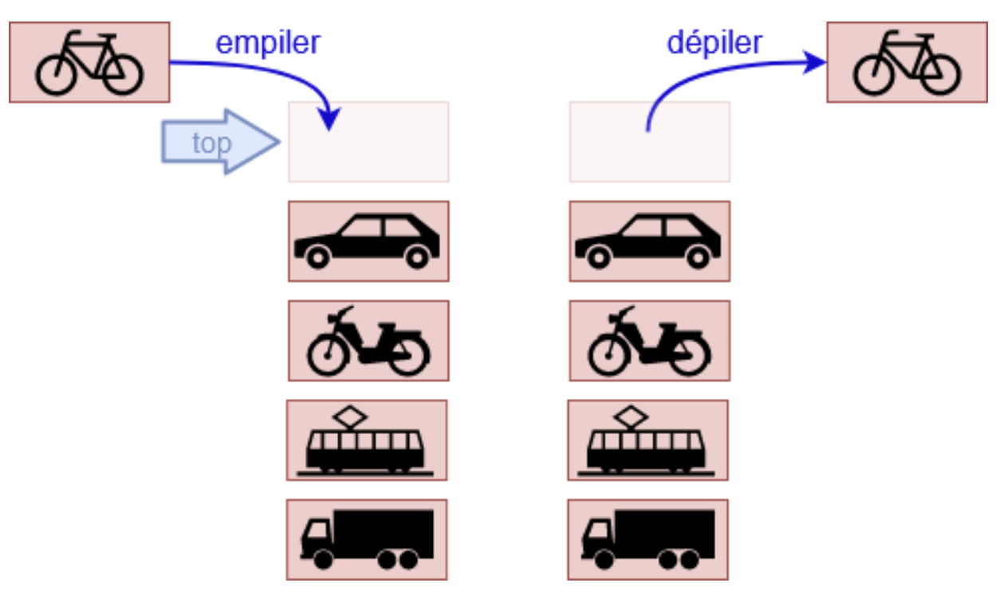

.. _stacks.rst:

Piles (Stack)
#############

..  contents:: Contenu de la page
    :depth: 3

..  reveal:: 41cf8dcf-2ba7-4a61-a6c5-226061a0ac7a
    :showtitle: Matériel
    :instructoronly:

    Dépôt avec les fichiers pour importer et plus de confort :
    https://github.com/informatiquecsud/algo-ds

..  reveal:: 09d39c37-b70b-45de-bacf-ceb0851d094d
    :showtitle: Références

    - https://perso.liris.cnrs.fr/pierre-antoine.champin/enseignement/algo/cours/sda/pile.html

Présentation en vidéo
=====================

..  note:: 

    L'implémentation de la pile donnée dans cette vidéo diffère légèrement de
    celle que nous allons développer, mais elle permet de comprendre les grandes
    lignes.

..  youtube:: qwptQU8zEa8
    :divid: stack-intro
    :width: 630
    :height: 435

Définition
==========

La structure de données de pile est très fréquente en informatique. Une pile est
une structure de données linéaire (les éléments sont stockés dans un ordre
précis) où les éléments sont accessibles selon une discipline LIFO (Last In
First Out). En d'autres termes, seul le dernier objet stocké est accessible avec
l'opération ``pop`` ou ``peek``.

Ajout / suppression d'éléments
==============================

Les seules opérations possibles sont 

1. Rajouter un élément au sommet de la pile (empiler = push)
2. Supprimer l'élément se trouvant au sommet de la pile (dépiler = pop)

    
    Opérations possibles : empiler (PUSH) et dépiler (POP)

Type abstrait ``StackADT``
==========================

Commençons par définir une classe abstraite ``StackADT`` pour représenter le
type abstrait de pile. La classe abstraite de base joue le rôle de contrat
indiquant les méthodes que n'importe quelle pile doit définir, à savoir:

- Une méthode ``push(item)`` pour empiler un nouvel élément ``item``
- Une méthode ``pop()`` pour dépiler l'élément au sommet de la pile
- Une méthode ``peek()`` pour consulter l'élément au sommet de la pile sans le
  dépiler.
- La méthode magique ``__len__()`` permettant d'utiliser la fonction
  ``len(stack)`` sur la pile ``stack`` pour connaître le nombre d'éléments
  qu'elle contient.
  
- La méthode magique ``is_empty()`` pour savoir si la pile contient des
  éléments ou si elle est vide.

..  
    activecode:: stack_adt_py
    :language: webtp

    from abc import ABC, abstractmethod

    class StackADT[T](ABC):

        @abstractmethod
        def push(self, item: T) -> None:
            pass
        
        
        @abstractmethod
        def pop(self) -> T:
            pass
        
        
        @abstractmethod
        def peek(self) -> T:
            pass
        
        @abstractmethod
        def is_empty(self) -> bool:
            pass

        @abstractmethod
        def __len__(self) -> int:
            pass

        @abstractmethod
        def __repr__(self) -> str:
            pass

..  activecode:: stack_adt_py_legacy
    :language: webtp

    from abc import ABC, abstractmethod
    from typing import TypeVar, Generic

    T = TypeVar('T')

    class StackADT(ABC, Generic[T]):

        @abstractmethod
        def push(self, item: T) -> None:
            pass
        
        
        @abstractmethod
        def pop(self) -> T:
            pass
        
        
        @abstractmethod
        def peek(self) -> T:
            pass
        
        @abstractmethod
        def is_empty(self) -> bool:
            pass

        @abstractmethod
        def __len__(self) -> int:
            pass

        @abstractmethod
        def __repr__(self) -> str:
            pass

Implémentation inefficace
=========================

La classe ``TupleStack`` définie ci-dessous est une classe concrète dérivée de
la classe abstraite ``StackADT``. Comme la classe abstraite de base agit comme
un contrat, il est **obligatoire** d'implémenter toutes les méthodes déclarées
comme abstraites dans la classe abstraite.
            
..  activecode:: tuplestack_py_legacy
    :include: stack_adt_py
    :language: webtp
        
    from typing import TypeVar, Generic
    from stack import StackADT

    T = TypeVar("T")

    class TupleStack(StackADT[T], Generic[T]):
        """
        Implements a stack ADT by storing the elements in a tuple

        >>> s: TupleStack[int] = TupleStack()
        >>> s.is_empty()
        True
        >>> s.push(3)
        >>> s.push(5)
        >>> s
        (3, 5)
        >>> s.is_empty()
        False
        >>> len(s)
        2
        >>> s.peek()
        5
        >>> s.pop()
        5
        >>> s
        (3,)
        >>> s.pop()
        3
        >>> s
        ()
        >>> s.pop()
        Traceback (most recent call last):
        ...
        IndexError: tuple index out of range
        >>> s.is_empty()
        True

        """

        def __init__(self) -> None:
            self._items: tuple[T, ...] = tuple()

        def push(self, item: T) -> None:
            self._items += (item,)

        def pop(self) -> T:
            value = self._items[-1]
            self._items = self._items[:-1]
            return value

        def peek(self) -> T:
            return self._items[-1]

        def is_empty(self) -> bool:
            return len(self._items) == 0

        def __len__(self) -> int:
            return len(self._items)

        def __repr__(self) -> str:
            return repr(self._items)

    if __name__ == '__main__':
        try:
            import doctest
            doctest.testmod()
        except:
            print("Use a standard Python interpreter to benefit from doctests")
            

..  admonition:: Vérification de type avec Mypy
    :class: note

    L'utilitaire MyPy effectue une vérification de type en utilisant les
    indications de type. Le code
    https://mypy-play.net/?mypy=latest&python=3.12&flags=strict&gist=a998b6c13c7eaf71ef955344b527ff48
    permet de constater que l'utilisation des types génériques empêchent de
    mélanger différents types dans la pile, ce qui est le but recherché par
    l'utilisation des classes abstraites.
                

Complexité (coût) des opérations
================================

..  shortanswer:: tuple-stack-complexity-question

    L'implémentation à base de tuples n'est performante, car la structure de données
    sous-jacentes (les tuples) ne sont pas mutables (on ne peut pas rajouter un
    élément au tuple). 

    Déterminez le coût des opérations de PUSH / POP avec les tuples

..  reveal:: 10e70784-831d-49ac-94ad-82477e58eb1d
    :showtitle: Réponse

    ..  admonition:: Réponse

        - ``push`` : :math:`\Theta(N)`, car il faut recréer un nouveau tuple de
          taille :math:`N+1`
        - ``pop`` : :math:`\Theta(N)`, car il faut recréer un nouveau tuple de
          taille :math:`N-1`
        - ``peek`` : :math:`\Theta(1)`, car il suffit de faire un lookup sur le
          dernier élément du tuple, ce qui coûte :math:`\Theta(1)`.

Applications des piles
======================

Les piles sont très souvent utilisées en informatique dans les logiciels de tous
les jours.

Historique de navigation Web
----------------------------

Dans les navigateurs Web, chaque nouvelle page visitée (en suivant un hyperlien
par exemple) est empilé sur une pile ``previous`` qui stocke toutes les pages
visitées dans le passé. Le bouton "retour à la dernière page précédente" empile
l'URL de la page actuelle sur une pile ``next`` et dépile la dernière URL de la
pile ``previous`` et revisite cette page. On peut ainsi revenir en arrière, puis
en avant dans l'historique de navigation.

..  list-table:: Utilisation de deux piles pour gérer l'historique de navigation
    :widths: 15 60 25
    :align: left
    :header-rows: 1

    * - Opération de navigation
      - État des piles ``previous`` et ``next`` après l'opération
      - Commentaires

    * - Visiter la page https://www.google.com
      - 
        ..  figure:: stack/navigate_google.png
            :align: center
      - La page actuelle est https://www.google.com. Les piles sont vides
        pour l'instant.
    
    * - Visiter la page https://www.epfl.ch
      - 
        ..  figure:: stack/navigate_epfl.png
            :align: center
      - L'ancienne page visitée https://www.google.com est empilée sur la pile
        ``previous`` et la page visitée est mise à https://www.epfl.ch

    * - Visiter la page https://www.github.com
      - 
        ..  figure:: stack/navigate_github.png
            :align: center
      - L'ancienne page visitée https://www.epfl.ch est empilée sur la pile
        ``previous`` et la page visitée est mise à https://www.github.com
    * - Retour vers la dernière page visitée
      - 
        ..  figure:: stack/navigate_back_to_epfl.png
            :align: center
      - La page actuellement visitée est empilée sur la pile ``next`` et la page
        au sommet de la pile ``previous`` est dépilée et visitée.
    * - Retour vers la dernière page visitée
      - 
        ..  figure:: stack/navigate_back_to_google.png
            :align: center
      - La page actuellement visitée est empilée sur la pile ``next`` et la page
        au sommet de la pile ``previous`` est dépilée et visitée.

        ..  admonition:: Remarque

            Le bouton "dernière page visitée" devient désactivé étant donné que
            la pile ``previous`` est vide.
    * - Bouton "avancer dans l'historique"
      - 
        ..  figure:: stack/navigate_back_to_epfl.png
            :align: center
      - La page visitée actuellement est empilée sur la pile ``previous`` et la
        page au sommet de la pile ``next`` est dépilée et revisitée.

        ..  admonition:: Remarque

            Le bouton "dernière page visitée" est à nouveau disponible.

Bouton "Annuler / refaire"
--------------------------

La plupart des logiciels mettent à disposition un bouton "Annuler" et "Refaire"
pour annuler des actions effectuées. Les différentes opérations ou états du
document sont stockés dans deux piles de manière similaire à la navigation dans
un navigateur Web.

Analyse syntaxique d'expressions arithmétiques
----------------------------------------------

Pour vérifier si des expressions arithmétiques sont bien parenthésées, on
utilise une pile avec la stratégie décrite dans la section
:ref:`parenthesis_checking`.

Questions de compréhension
==========================

Question 1
----------

..  mchoice:: stacks/comprehension-01
    :random:

    Après les opérations ci-dessous sur la pile ``stack``, quelle est la valeur
    de l'élément au sommet de la pile.

    ::

        stack: Stack[str] = Stack[str]()
        stack.push("x")
        stack.push("y")
        stack.pop()
        stack.push("z")
        stack.peek()
        
    - "x"

      - Faux.

    - "y"

      - Faux.

    - "z"

      + Vrai.

    - The stack is empty

      - Faux.

Question 2
----------

..  mchoice:: stacks/comprehension-02
    :random:

    Après les opérations ci-dessous sur la pile ``stack``, quelle est la valeur
    de l'élément au sommet de la pile.

    ::

        stack: Stack[str] = Stack[str]()
        stack.push("x")
        stack.push("y")
        stack.push("z")
        while not stack.is_empty():
          stack.pop()
          stack.pop()
        
    - "x"

      - Faux.

    - La pile est vide

      - Faux. Il y a un nombre impair d'éléments sur la pile et on dépile deux
        éléments à chaque itération de la boucle ``while`` .

    - Le programme va produire une erreur d'exécution

      + Vrai.

    - "z"

      - Faux.

Exercices
=========

Exercice 1 (Pile à base de liste)
---------------------------------

Implémentez une classe ``ListStack`` qui utilise une liste Python comme
structure de données sous-jacente, en complétant le code ci-dessous.

Notez les points suivants:

- La classe définit déjà la méthode ``__repr__`` pour définir la représentation
  de la pile.

- Définissez une exception de type ``StackException`` et une classe
  ``EmptyStackError`` qui dérive de ``StackException``. Levez cette exception
  avec un message d'erreur approprié lorsqu'on essaye de faire ``pop`` ou
  ``peek`` sur une pile vide.

- Votre code est automatiquement testé sur la base de l'interaction notée dans
  la docstring.  

..  activecode:: basic_stack
    :language: webtp
    :interpreterargs: vanilla_python=true&debug_mode=true&layout=["Editor", "Console"]

    ..  admonition:: Environnement de programmation

        Vous pouvez effectuer l'exercice directement dans l'éditeur ci-dessous
        ou, pour plus de confort, sur gitpod.io, en utilisant un fork du dépôt
        https://github.com/informatiquecsud/algo-ds, dans le fichier
        ``algods/ds/list_stack.py``.

    ~~~~

    from abc import ABC, abstractmethod
    from typing import TypeVar, Generic

    T = TypeVar('T')

    class StackADT(ABC, Generic[T]):

        @abstractmethod
        def push(self, item: T) -> None: ...

        @abstractmethod
        def pop(self) -> T: ...

        @abstractmethod
        def peek(self) -> T: ...

        @abstractmethod
        def __len__(self) -> int: ...

        @abstractmethod
        def __repr__(self) -> str: ...

        @abstractmethod
        def is_empty(self) -> bool: ...

    class StackException(Exception):
        pass

    class EmptyStackError(StackException):
        pass

    class ListStack(StackADT[T], Generic[T]):
        '''

        ``ListStack`` implements a stack by using a list as the container.

        >>> s: ListStack[int] = ListStack()
        >>> s.push(1)
        >>> s
        ListStack([1])
        >>> s.push(2)
        >>> s
        ListStack([1, 2])
        >>> s.push(3)
        >>> s
        ListStack([1, 2, 3])
        >>> s.peek()
        3
        >>> s.pop()
        3
        >>> s
        ListStack([1, 2])
        >>> s.pop()
        2
        >>> s.pop()
        1
        >>> s.pop()
        Traceback (most recent call last):
        ...
        EmptyStackError: Pop from an empty stack
        >>> s.peek()
        Traceback (most recent call last):
        ...
        EmptyStackError: Peek an empty stack
        >>> s
        ListStack([])

        '''

        def __init__(self) -> None:
            self._items: list[T] = []

        def __repr__(self) -> str:
            return repr(self._items)

    if __name__ == '__main__':
        import doctest
        doctest.testmod()

..  reveal:: ec2839c3-7df5-480d-a4d2-0ead203c3090
    :showtitle: Solution

    ..  admonition:: Solution

        Il faut rajouter les classes ``StackException`` et ``EmptyStackError``
        et définir la classe ``ListStack`` qui doit dériver de ``StackADT`` et
        être une classe générique (dériver de ``Generic[T]``).

..  reveal:: 21047bc9-9e99-46a0-97f7-18b42b79bf6f
    :showtitle: Solution
    :instructoronly:

    ..  admonition:: Solution

        ..  code-block:: python

            class StackException(Exception):
                pass

            class EmptyStackError(StackException):
                pass

            class ListStack(StackADT[T], Generic[T]):
                '''

                ``ListStack`` implements a stack by using a list as the container.

                >>> s: ListStack[int] = ListStack()
                >>> s.push(1)
                >>> s
                ListStack([1])
                >>> s.push(2)
                >>> s
                ListStack([1, 2])
                >>> s.push(3)
                >>> s
                ListStack([1, 2, 3])
                >>> s.peek()
                3
                >>> s.pop()
                3
                >>> s
                ListStack([1, 2])
                >>> s.pop()
                2
                >>> s.pop()
                1
                >>> s
                ListStack([])

                '''

                def __init__(self) -> None:
                    self._items = []

                def __repr__(self) -> str:
                    return f'{self.__class__.__name__}({repr(self._items)})'

                def __len__(self) -> int:
                    return len(self._items)

                def push(self, item: T) -> None:
                    self._items.append(item)

                def pop(self) -> T:
                    try:
                        return self._items.pop()
                    except IndexError as e:
                        raise EmptyStackError('Pop from an empty stack') from e

                def peek(self) -> T:
                    try:
                        return self._items[-1]
                    except IndexError as e:
                        raise EmptyStackError('Peek an empty stack') from e

                def is_empty(self) -> bool:
                    return len(self) == 0

            if __name__ == '__main__':
                import doctest
                doctest.testmod()

Exercice 2
----------

Définissez une classe ``CPStack`` optimisée pour les besoins du solveur de
contraintes sur la page :ref:`cpsolver-stack.rst`.

Exercice 3 (facultatif)
-----------------------

..  note::

    Cet exercice n'est pas primordial, mais montre un exemple trivial
    d'utilisation de pile en informatique.

..  activecode:: stack_exo_reverse_string_py
    :language: webtp
    :interpreterargs: vanilla_python=true&debug_mode=true&layout=["Editor", "Console"]

    Développez une fonction ``reverse_string(to_reverse: str) -> str`` qui retourne une
    chaîne de caractères dont l'ordre a été inversé. Utilisez une pile pour
    effectuer cette opération.

    Écrivez vous-mêmes les exemples de test dans la docstring.

    ..  reveal:: b43eaded-c8ee-43c1-aca6-eebc95f5376d
        :showtitle: Indice 1 (docstring)

        ::

            >>> reverse_string('Salut tout le monde')
            >>> reverse_string('')
            ''
            >>> reverse_string('abba')
            'abba'            

    ~~~~

..  admonition:: Solution en vidéo

    ..  youtube:: cXxkvq3u_f8
        :divid: reverse-string
        :width: 630
        :height: 435

..  reveal:: 33502998-86c3-4f73-9b73-c792bc75f940
    :showtitle: Solution

    ..  admonition:: Solution

        ..  activecode:: a267221d-57bb-4cb6-848d-0347bfd1e4fe
            :language: webtp

            ############### Importation dans WebTigerPython ############
            from pyodide.http import open_url

            def load_external_files(files: list[str]) -> None:
                prefix = 'https://raw.githubusercontent.com/informatiquecsud/algo-ds/refs/heads/solutions/ds_single_files/'
                for file in files:
                    module = file.split('/')[-1]
                    with open(module, 'w') as fd: fd.write(open_url(prefix + file).read())

            load_external_files([
                'stack.py',
                'list_stack.py',
            ])
            ############################################################

            from list_stack import ListStack

            def reverse_string(to_reverse: str) -> str:
                '''
                Reverses the string ``to_reverse`` using a stack.

                >>> reverse_string('Salut tout le monde')
                'ednom el tuot tulaS'
                >>> reverse_string('')
                ''
                >>> reverse_string('abba')
                'abba'
                '''
                
                stack: ListStack[str] = ListStack[str]()

                for c in to_reverse:
                    stack.push(c)

                result: str = ''

                while not stack.is_empty():
                    result += stack.pop()

                return result

            if __name__ == '__main__':
                import doctest
                doctest.testmod()

