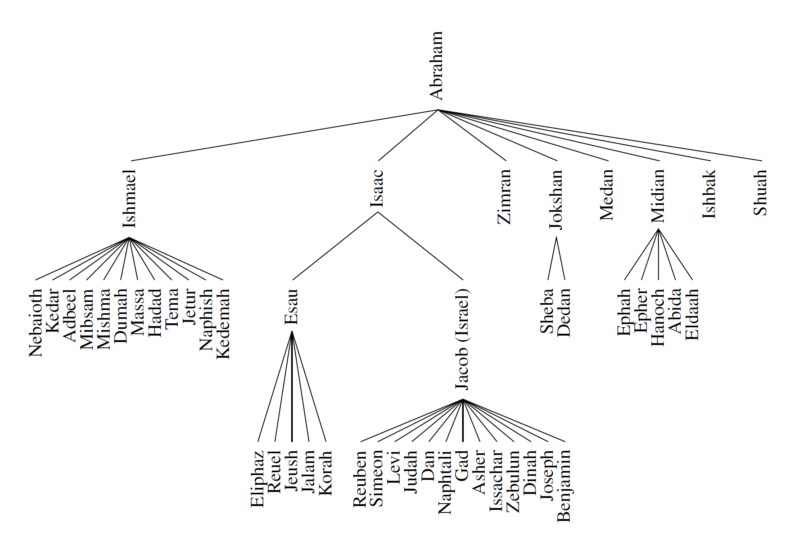
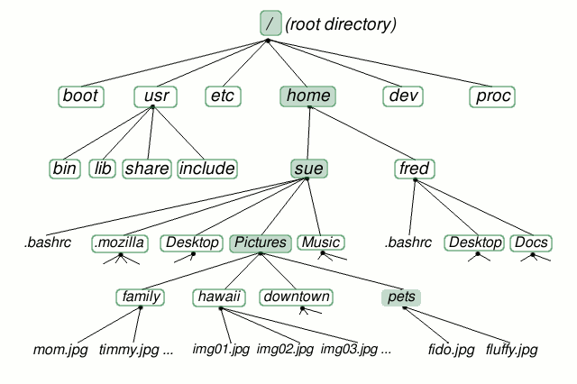
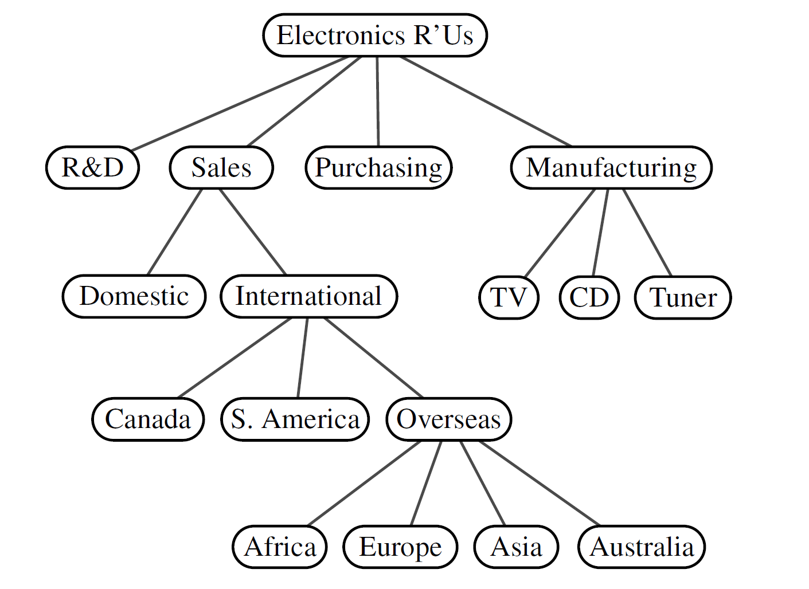
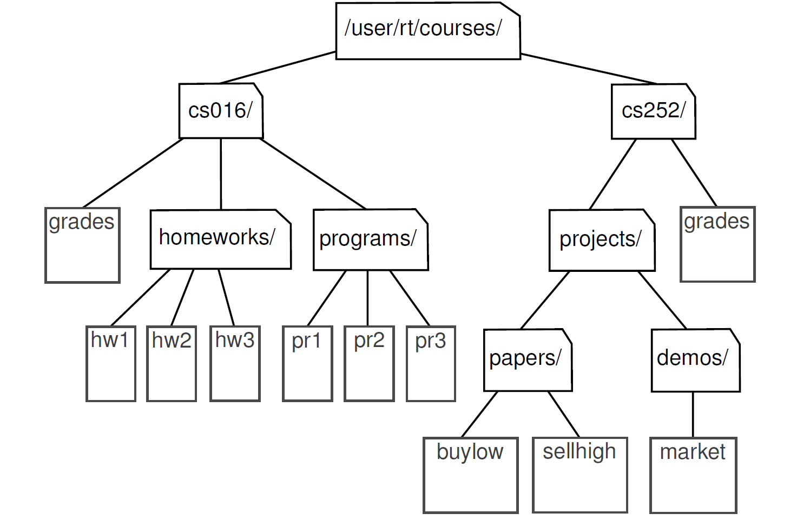
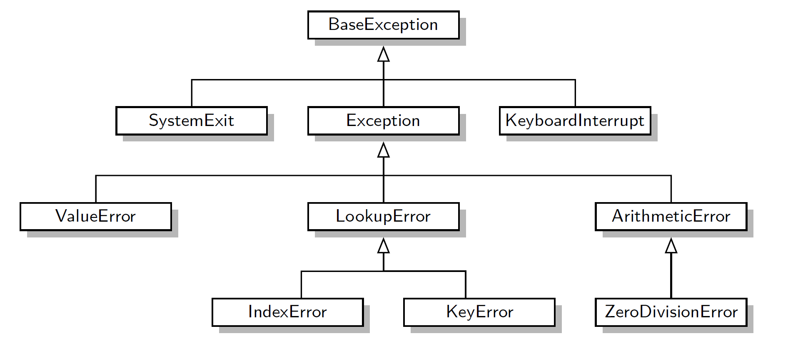
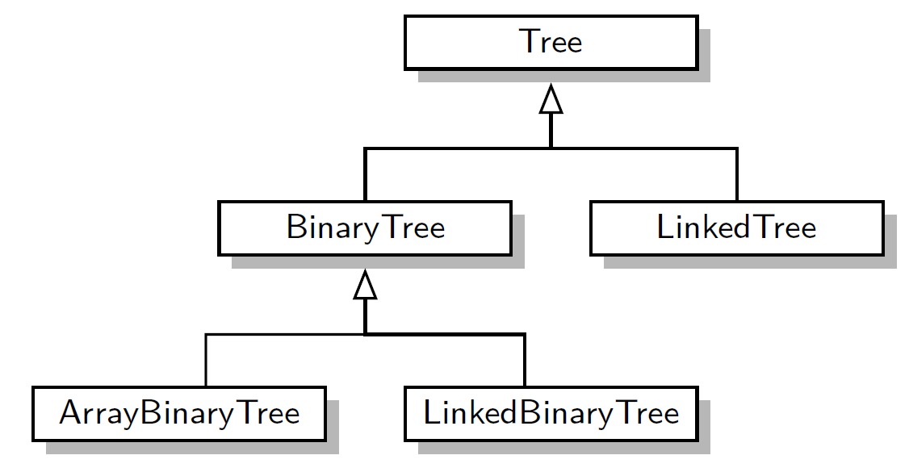
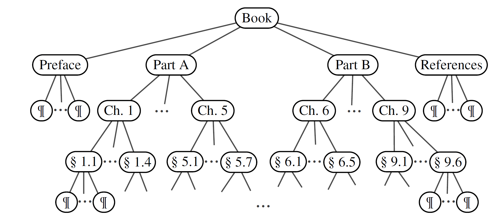

.. _common-ds-trees:

Arbres
######

..  contents:: Contenu de la page
    :depth: 3

..  note:: 

    Le contenu de ce chapitre est fortement inspiré du livre "Data Structures
    and Algorithms in Python" de Michael Goodrich et al., Wiley, 2013
    (https://bcs.wiley.com/he-bcs/Books?action=index&bcsId=8028&itemId=1118290275).
    Le PDF du livre est disponible dans le canal général de l'équipe Teams du
    cours.

Introduction
============

Jusqu'à présent, nous avons utilisé et étudié essentiellement des structures de
données linéaires, dans lesquelles les éléments sont ordonnés dans un ordre
particulier. Parmi ces structures, on compte notamment les piles et les files.

Dans la vie réelle, de nombreux problèmes ne se laissent pas modéliser de
manière adéquates avec ce type de structures de données, car la réalité est très
souvent **hiérarchisée**. Un exemple de ce type sont les arbres généaligiques ou
la structure d'une entreprise.

    Arbre généalogique de la descendance d'Abraham, selon Genèse chapitres
    25-26. Source: Datastructures and Algorithms in Python, Goodrich & al.,
    Wiley, 2013.

Dans le domaine informatique, la structure en arbre se retrouve notamment dans
l'organisation des systèmes de fichiers 

    Représentation sous forme d'arbre d'un système de fichiers sous Linux.
    Source : https://prashantnamse.blogspot.com/2013/07/linux-file-system.html,
    consulté le 16 février 2024.

Exemples importants d'arbre en informatique
-------------------------------------------

Les arbres sont une structure de données extrêmement fréquente en informatique.
Voici quelques exemples excessivement importants:

- Les index sur les tables dans une DB relationnelle sont très souvent stockés
  sous forme d'arbres (B-trees) pour permettre une recherche et une insertion
  efficace en :math:`O(\lg n)` dans le cas moyen.

- Implémentation des systèmes de fichiers (arborescence de fichiers et dossiers)

- Représenter des documents structurés, par exemple une page Web est représentée
  à l'interne, dans le navigateur, en tant qu'arbre (**DOM** = *Document Object
  Model*)

- Arbre syntaxique : une fois une expression arithmétique ou un code Python
  analysée par le *parser*, le résultat est représenté sous forme d'arbre :
  c'est **l'arbre syntaxique** (*Abstract Syntax Tree* = **AST**)

- Diagramme d'héritage en POO, par exemple l'arbre d'héritage des exceptions
  Python

Définition et propriétés
========================

Un arbre est un type de données abstrait qui stocke des éléments de manière
hiérarchique. On utilise la terminologie des arbres généalogiques pour situer
les éléments (nœuds) les uns par rapport aux autres dans l'arbre. À l'exception
de l'élément supérieur, chaque élément d'un arbre a un élément **parent** et
zéro ou plusieurs éléments **enfants** (**nœuds fils**). Un arbre est
généralement visualisé en plaçant les éléments dans des ovales ou des rectangles
et en traçant les connexions entre les parents et les enfants avec des lignes
droites. (Voir Figure 8.2.) On appelle généralement l'élément supérieur la
**racine** de l'arbre, mais il est dessiné comme l'élément le plus élevé, avec
les autres éléments connectés en dessous (juste à l'opposé d'un arbre
botanique).

Exemple 1
---------

Voici un exemple d'arbre représentant l'organisation d'une entreprise

    Un arbre à 17 nœuds représente l'organisation d'une société fictive. La
    racine de l'arbre porte le nom "Electronics R'Us". Les enfants de la racine
    sont "R&D", "Ventes", "Achats" et "Fabrication". Les nœuds internes
    contiennent les labels "Ventes", "International", "À l'étranger",
    "Electronics R'Us" et "Fabrication".

Définition formelle
-------------------

De manière plus formelle, un arbre :math:`T` est défini comme un ensemble de **nœuds**
stockant des éléments, où les nœuds ont une relation parent-enfant qui satisfait
aux propriétés suivantes :

- Si :math:`T` n'est pas vide, il possède un nœud spécial, appelé la racine de
  :math:`T`, qui n'a pas de parent.

- Chaque nœud :math:`v` de :math:`T`, différent de la racine, possède un unique
  parent :math:`w` ; tout nœud ayant :math:`w` comme parent est un enfant de
  :math:`w`.

..  admonition:: Autres relations entre les nœuds:

    Deux **nœuds** qui sont enfants du même parent sont appelés **nœuds
    frères**. Un nœud :math:`v` est externe s'il n'a pas d'enfants. Un nœud
    :math:`v` est interne s'il a un ou plusieurs enfants. Les nœuds externes
    sont également appelés **feuilles**.

..  admonition:: Concepts clés

    Voici quelques termes importants concernant les arbres en informatique:

    - **Arbre**: Un type de données abstrait qui stocke des éléments de manière hiérarchique.
    - **Élément**: Une unité de données stockée dans un arbre.
    - **Parent**: Un élément qui a un ou plusieurs enfants.
    - **Enfant**: Un élément qui a un seul parent.
    - **Frères**: Deux nœuds dont le parent est identique.
    - **Racine**: L'élément supérieur d'un arbre.
    - **Feuille**: Un élément qui n'a aucun enfant.
    - **Nœud**: Un terme générique pour désigner un élément d'un arbre.

Exemples courants d'arbres en informatique
==========================================

Exemple 2
---------

Vous connaissez la relation hiérarchique entre les fichiers et les répertoires
dans le système de fichiers d'un ordinateur. La figure ci-dessous montre que les
nœuds internes de l'arbre sont associés à des répertoires et les feuilles à des
fichiers ordinaires. Dans les systèmes d'exploitation UNIX et Linux, la racine
de l'arbre est appelée de manière appropriée "répertoire racine" (*root
directory*) et est représentée par le symbole ``/``.

.. _trees-linus-fs-portion:

    Arbre représentant une portion d'un système de fichiers Linux. L'arbre
    représente en fait un sous-arbre de l'arbre représentant le système de
    fichier complet. C'est pour cette raison que la racine de cet arbre est le
    dossier ``/user/rt/courses/`` et non le dossier racine ``/``.

Notion de sous-arbre, ancêtre et descendant
-------------------------------------------

Un nœud :math:`u` est un **ancêtre** d'un nœud :math:`v` si :math:`u = v` ou si
:math:`u` est un **ancêtre** du parent de :math:`v`. Réciproquement, on dit
qu'un nœud :math:`v` est un **descendant** d'un nœud :math:`u` si :math:`u` est
un ancêtre de v. Par exemple, dans la figure :ref:`trees-linus-fs-portion`,
``cs252/`` est un ancêtre de ``papers/``, et ``pr3`` est un descendant de
``cs016/``. Le sous-arbre de :math:`T` enraciné en un nœud :math:`v` est l'arbre
constitué de tous les descendants de :math:`v` dans :math:`T` (y compris
:math:`v` lui-même). Dans la Figure 8.3, le sous-arbre enraciné en ``cs016/`` se
compose des nœuds ``cs016/``, ``grades``, ``homeworks/``, ``programs/``,
``hw1``, ``hw2``, ``hw3``, ``pr1``, ``pr2`` et ``pr3``.

Activité 1
----------

Dans l'arbre représenté à l'exemple 2, identifiez les éléments suivants:

- La racine
- Un ancêtre du noeud ``projects``
- Un descendant du noeud ``cs252``
- Un sous-arbre
- Les feuilles du sous-arbre dont la racine est ``projects``
  

..  reveal:: 4a22ffb4-fb5e-4f55-b740-e49e7e8782fb
    :showtitle: Réponses

    - La racine

        ``/user/rt/courses/``

    - Un ancêtre du noeud ``projects``

        ``/user/rt/courses/`` ou ``cs252/``

    - Un descendant du noeud ``cs252``

        ``grades``, ``demos/`` ou ``market``

    - Un sous-arbre

        Il suffit de prendre n'importe quel descendant de la racine
        ``/user/rt/courses/`` et considérer l'arbre formé par le noeud en
        question et tous ses descendants.

    - Les feuilles du sous-arbre dont la racine est ``projects``

        Il s'agit des fichiers ``buylow``, ``sellhight``, ``market``

Exemple 3
---------

Les diagrammes de classe représentant la relation d'héritage en POO sont des
arbres.

    Diagramme de classe représentant partiellement la hiérarchie des exceptions
    du language Python.

    Hiérarchie des classes que nous allons développer dans ce chapitre pour
    implémenter différents types d'arbres.

Exemple 4
---------

La structure de documents ou de livres sont des arbres.

    Représentation partielle de la structure d'un livre d'informatique.

Exercices
=========

Exercice 1
----------

..  shortanswer:: trees-exos-1-examples-from-reallife

    Citez deux situations de la vie de tous les jours, non évoquée dans cette
    section, qui est avantageusement représentée par un arbre.

..  reveal:: 12d0179d-d195-486b-b15b-83b467291f31
    :showtitle: Réponse

    - La structure hiérarchique du personnel au sein d'une entreprise, avec le
      CEO à la racine. Chaque employé est subordonné à un autre employé pour
      réaliser la chaîne de responsabilité et d'autorité. Les feuilles sont les
      employés qui n'ont personne sous leurs ordres.

    - Arbres phylogénétiques en biologie :
      https://fr.wikipedia.org/wiki/Arbre_phylog%C3%A9n%C3%A9tique#:~:text=Un%20arbre%20phylog%C3%A9n%C3%A9tique%20est%20un,des%20groupes%20d'%C3%AAtres%20vivants.

    - Arbres de compétences :
      https://www.orientaction.com/arbre-competences-outil-developpement-strategique-entreprise/#:~:text=L'arbre%20de%20comp%C3%A9tences%20permet,le%20d%C3%A9veloppement%20de%20l'entreprise.

    - Arbres de décision : https://fr.wikipedia.org/wiki/Arbre_de_d%C3%A9cision

..  shortanswer:: trees-exos-1-examples-from-cs

    Citez encore au moins une situation du domaine de l'informatique, non
    évoquée dans cette section, qui est avantageusement représentée par un
    arbre.

..  reveal:: 94d2915f-76da-4e67-b6c5-317a3bcc23c8
    :showtitle: Réponse

    - Hiérarchie de processus dans un système d'exploitation

      ..  figure:: trees/process-hierarchy.png
          :align: center
          :width: 60%

          Chaque processus peut engendrer d'autres processus, ce qui donne une
          structure hiérarchique. Ici une capture du "gestionnaire de tâches"
          dans Windows 11.

      
      Voici un vue analogue avec la commande ``pstree`` dans le système Linux
      Ubuntu, sous WSL:

      ..  figure:: trees/process-hierarchy-wsl.png
          :align: center
          :width: 100%

          Chaque processus peut engendrer d'autres processus, ce qui donne une
          structure hiérarchique. Ici une capture de la sortie de la commande
          ``pstree`` (ps = process) dans Linux Ubuntu sous WSL.
      
