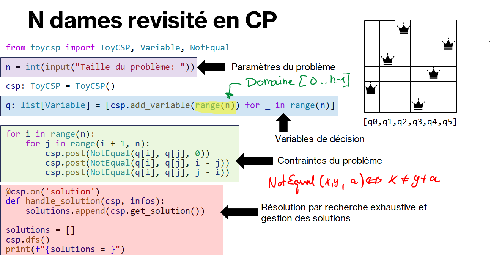

.. _n-dames-approche-generique.rst:

Concepts de programmation par contraintes (PPC)
###############################################

..  contents:: Contenu de la page
    :depth: 3

Résolution du problème des :math:`n` dames
==========================================

..  note:: Vocabulaire

    PPC = Programmation par contraintes (français)
    CP = Constraint Programming (anglais)

Au lieu de développer un algorithme spécifique au :math:`n` dames qui ne peut
fonctionner que pour ce problème, on aimerait écrire un code plus générique
permettant ensuite de résoudre d'autres problèmes, afin de suivre la philosophie
de la programmation par contraintes consistant à formuler le problème et laisser
l'ordinateur trouver les solutions.

Voici à quoi ressemble la modélisation du problème des :math:`n` dames avec le
solveur de contraintes ``ToyCSP`` que nous allons développer.

..  note:: 

    Comme son nom l'indique, ce solveur est très limité. Il permettra d'acquérir
    les bases nécessaires au développement ultérieur d'une deuxième version du
    solveur par la suite, plus performant.

    Le solveur ToyCSP est une adaptation Python du solveur de contraintes
    éducatif ``TinyCSP`` qui fait partie du projet MiniCP
    http://www.minicp.org/.

..  activecode:: n-queens-modeling-version-1
    :language: webtp
    :interpreterargs: branch=branch&layout=["Editor", "Console"]

    ############### Importation dans WebTigerPython ############
    from pyodide.http import open_url
    url = 'https://raw.githubusercontent.com/donnerc/pyminicp/refs/heads/main/build/toycsp_bundle.py'
    with open('toycsp.py', 'w') as fd: fd.write(open_url(url).read())
    ############################################################

    from toycsp import ToyCSP, Variable, NotEqual

    n = int(input("Taille du problème: "))

    csp: ToyCSP = ToyCSP()
    q: list[Variable] = [csp.add_variable(range(n)) for _ in range(n)]

    for i in range(n):
        for j in range(i + 1, n):
            csp.post(NotEqual(q[i], q[j], 0))
            csp.post(NotEqual(q[i], q[j], i - j))
            csp.post(NotEqual(q[i], q[j], j - i))

    @csp.on('solution')
    def handle_solution(csp, infos):
        solutions.append(csp.get_solution())

    solutions = []
    csp.dfs()

    print(f"{solutions = }")

Constatation
------------

On constate que l'approche par PPC permet de résoudre le problème avec très peu
de code. La seule chose que l'on fait est de formuler le problème qui comporte
trois parties

#.   Les paramètres
#.   Les variables de décision
#.   Les contraintes

puis de résoudre le CSP ainsi modélisé à l'aide d'un solveur (représenté ici par
la classe ``ToyCSP``).

..  note::  

    À ce stade, le solveur de contraintes agit un peu comme une "boîte noire"
    dont le fonctionnement est mystérieux. Le but de la suite du cours est
    d'expliquer le fonctionnement du solveur utilisé et de l'améliorer.

    On constate que la majorité du code concerne la formulation (ou
    **modélisation**) du problème et non sa résolution.

Survol des concepts essentiels
==============================

Comme le montre la figure ci-dessous reprenant le code ci-dessus, la
programmation par contraintes se base essentiellement sur les concepts suivants:

- Les **paramètres** sont des données inconnues lors de la modélisation mais
  connues avant la résolution. La donnée des paramètres détermine une **instance
  du problème**. Par exemple, le seul paramètre du problème des :math:`n` dames
  est la taille de l'échiquier :math:`n`. La donnée de ce paramètre détermine
  complètement le problème et constitue une instance du problème.

- Les **variables de décision** permettent d'exprimer le problème. Chaque
  variable possède un **domaine** correspondant à l'ensemble des valeurs
  admissibles pour cette variable dans le problème.

- Les **contraintes** permettent d'exprimer des relations entre les variables.
  Les contraintes constituent non seulement un outil de formulation du problème
  comme en mathématiques, mais aussi des outils de raisonnement, par l'entremise
  de ses algorithmes de propagation. L'**arité** d'une contrainte correspond au
  nombre de variables qu'elle implique. 

- Le **processus de résolution** est généralement encapsulé dans le solveur et
  **indépendant du modèle**. On peut typiquement imaginer garder le modèle, mais
  modifier le processus de résolution, en expérimentant avec différentes
  stratégies de recherche préimplémentées dans le solveur. C'est là que réside
  toute la force de la programmation par contraintes : la formulation du
  problème est clairement **découplée** du processus de résolution, ce qui
  permet de modifier le modèle (donc le problème) en conservant la stratégie de
  résolution ou, au contraire, garder le même modèle mais changer la stratégie
  de résolution.

Résoudre le problème de satisfaction de contraintes consiste à assigner à chaque
variable de décision une valeur issue de son domaine de sorte que toutes les
contraintes du problème soient satisfaites.

    Les différentes parties d'un programme en programmation par contraintes pour
    résoudre le problème des :math:`n` dames.

Les variables
=============

..
  Comme vu précédemment, il y a plusieurs manières de modéliser le problème des
  :math:`n` dames, à savoir de choisir les variables de décision et les
  contraintes. 

  - Utiliser :math:`n^2` variables :math:`X_{ij}` booléennes, à savoir de domaine
    :math:`D_{ij} = \{0; 1\}`

  - Utiliser :math:`n` variables entières :math:`X_i`, à savoir de domaine
    :math:`[1, n] \cap \mathbb{N}` ou  :math:`[0, n-1] \cap \mathbb{N} =
    \{0, 1, 2, \ldots, n-1\}`.

  ..  note::

      De manière générale, on privilégie souvent les modèles impliquant le moins
      de variables possible, car chaque variable de décision rajoute un niveau de
      plus à l'arbre de décision.

Le concept de variable de la programmation par contraintes se ditingue fortement
des variables utilisé dans un langage de programmation impératif comme Python. 

Les variables en programmation impérative
-----------------------------------------

En Python, les variables sont essentiellement des moyens de stocker de des
valeurs en mémoire. Les différentes variables d'un programme impératif ne sont
pas liées entre elles. Lorsqu'on affecte une valeur à une variable, cela ne
change jamais la valeur d'une autre variable, comme le montre le code ci-dessous:

..  activecode:: f8d42a63-a329-4435-aecf-ca0d61420a3a

    x = 10
    y = 2 * x + 1
    x = 20
    print(y) # que vaut y ???

Dans ce code, la ligne ``y = 2 * x + 1`` est une instruction d'affectation. Elle
constitue une ``opération`` qui lit d'une part la valeur de la variable ``x``
(évaluation de l'expression à droite) et affectation de la valeur de
l'expression à la variable ``x``

Les variables en programmation par contraintes
----------------------------------------------

En PPC, les variables ne sont pas simplement des moyens pour stocker de
l'information, car elles peuvent être mises en relation les unes avec les autres
par des **contraintes**. Chaque variable :math:`X` est caractérisée par un
domaine :math:`D(X)` correspondant à l'ensemble des valeurs envisageables pour
une variable.

Pour bien comprendre la différence, considérons la notion de **contrainte** en
PPC.

Les contraintes
===============

..  note:: 

    Cette partie est fortement inspirée de
    https://perso.liris.cnrs.fr/christine.solnon/Site-PPC/session1/e-miage-ppc-sess1.htm#grand_1

En PPC, les contraintes doivent être comprises comme des sortes "d'équations
mathématiques", à savoir comme des propositions qui doivent être vraies. Elles
expriment des relations entre les variables. À ce titre, la contrainte

..  math:: 

    x + 3 \cdot y = 12

signifie en PPC la même chose qu'en mathématiques : seules certaines
combinaisons de valeurs pour :math:`x` et :math:`y` sont valides. Par exemple,
si :math:`x = 6`, alors on peut en déduire que :math:`y = 2`. Si :math:`y = 3`,
on peut en déduire que :math:`x = 3`. En d'autres termes, toute assignation de
valeur à l'une des variables de la contrainte contraint les valeurs possibles
que peut prendre l'autre variable.

Caractéristiques des contraintes
--------------------------------

- Les contraintes sont **relationnelles**, comme les équations en mathématiques
  ou les lois de la physique.
- Les contraintes sont **déclaratives** : elles expriment une relation, sans
  toutefois indiquer comment résoudre le problème, à savoir quelles valeurs
  affecter aux différentes variables.

- L'ordre dans lequel les contraintes sont formulées n'est pas important : la
  seule chose qui importe est que toutes les contraintes soient satisfaites à
  l'issue de la résolution.

Définition d'une contrainte
---------------------------

Il y a deux manière de définir une contrainte : soit en **intension** ou en
**extension**

- Pour définir une contrainte en extension, on énumére les tuples de valeurs
  appartenant à la relation.

  ..  admonition:: Exemple

      Par exemple, si les domaines des variables :math:`x` et :math:`y`
      contiennent les valeurs 0, 1 et 2, alors on peut définir la contrainte "x
      est plus petit que y" en extension par :math:`(x=0\text{ et }y=1)` ou
      :math:`(x=0\text{ et }y=2)` ou :math:`(x=1\text{ et }y=2)`, ou encore par
      :math:`(x,y) \in \{(0,1),(0,2),(1,2)\}`.

- Pour définir une contrainte en intention, on utilise des propriétés
  mathématiques connues. 
  
  ..  admonition:: Exemple
    
      Par exemple : :math:`x < y` ou encore :math:`A \wedge B
      \Longrightarrow \neg C`.

Arité d'une contrainte
----------------------

L'arité d'une contrainte est le nombre de variables sur lesquelles elle porte.

- Une contrainte est dite **unaire** si elle porte sur une seule variable, par
  exemple :math:`x * x = 4` ou :math:`\text{est_un_triangle}(y)`.

- Une contrainte est dite **binaire** si elle porte sur deux variables, par
  exemple :math:`x \neq y` ou :math:`x \leq y + 2`.

- Une contrainte est dite **ternaire** si elle porte sur trois variables, par
  exemple :math:`x+y < 3*z-4`.

- De manière générale, une contrainte est dite :math:`n`-aire si elle porte sur
  :math:`n` variables, par exemple une contrainte globale
  :math:`\text{all_different}(X)` où :math:`X` est un ensemble de variables de
  décision.

Différents types de contraintes
-------------------------------

- Les **contraintes numériques** portent sur des variables numériques et sont
  exprimées par une comparaison (:math:`=`, :math:`\neq`, :math:`<`,
  :math:`\leq`, :math:`>`, :math:`\geq`) entre deux expressions arithmétiques
  impliquant les variables numériques. Dans ce groupe, on distingue plus
  finement les types de contraintes suivants:

  - **numériques sur les entiers** : les variables ne peuvent prendre que des
    valeurs entières 

  - **mumériques sur les réels** : les variables peuvent prendre des valeurs
    réelles

  - **les contraintes linéaires** : les expressions arithmétiques ne contiennent
    que des polynômes du premier degré sur les variables. Par exemple :
    :math:`4\cdot x - 3\cdot y + 8\cdot z < 10`. 

  - **les contraintes non linéaires** : certaines expressions ne sont pas
    linéaires. Par exemple :math:`x * x = 4` ou :math:`\sin(x) + z\cdot \log(y)
    = 4`.

- Les **contraintes logiques** portent sur des variables booléennes. Les
  contraintes logiques sont essentiellement des implications logiques :math:`A
  \Rightarrow B`, les équivalences :math:`A \Leftrightarrow B` ou la non
  équivalence :math:`A \not\Leftrightarrow B`. Par exemple, :math:`\neg A \wedge
  B \Rightarrow C`.

Propagation
-----------

..  admonition:: Conseil

    Utilisez le débogueur de l'environnement ci-dessous pour bien comprendre le
    mécanisme de propagation de la contrainte ``NotEqual``, à savoir ses
    capacités (limitées) de raisonnement.

..  activecode:: a75d76ff-1bc8-4692-9f24-2da0f9706820
    :language: webtp

    ############### Importation dans WebTigerPython ############
    from pyodide.http import open_url
    url = 'https://raw.githubusercontent.com/donnerc/pyminicp/refs/heads/main/build/toycsp_bundle.py'
    with open('toycsp.py', 'w') as fd: fd.write(open_url(url).read())
    ############################################################

    from toycsp import Variable, NotEqual

    x = Variable(range(5, 10))
    y = Variable(range(3, 8))
    print(x)
    print(y)
    c1 = NotEqual(x, y)
    c2 = NotEqual(x, y, 2)
    c3 = NotEqual(x, y, -1)
    print(c1)
    c1.propagate()
    print(x)
    print(y)
    x.dom.fix(6)
    c1.propagate()
    print(x)
    print(y)
    c2.propagate()
    print(x)
    print(y)
    c3.propagate()
    print(x)
    print(y)

Problème de satisfaction de contraintes (PSC)
=============================================

Un problème de satisfaction de contraintes est déterminé par la donnée d'un
triplet :math:`\langle X, D, C \rangle` où 

- :math:`X` est l'ensemble des variables de décision du problème
- :math:`D` une fonction qui, à chaque variable :math:`x \in X`, associe son
  **domaine** :math:`D(x)`, qui correspond aux valeurs possibles que peut
  prendre la variable
- :math:`C` qui est un ensemble de contraintes.

Résoudre un problème de satisfaction de contraintes :math:`\langle X, D, C
\rangle` consiste à associer à chaque variable une valeur de son domaine de
sorte que toutes les contraintes :math:`c \in C` soient satisfaites.

..
    Graphe de contraintes
    =====================

    Le **graphe de contraintes** associé à une PSC :math:`\langle X, D, C \rangle`
    est le graphe :math:`G = G()`

