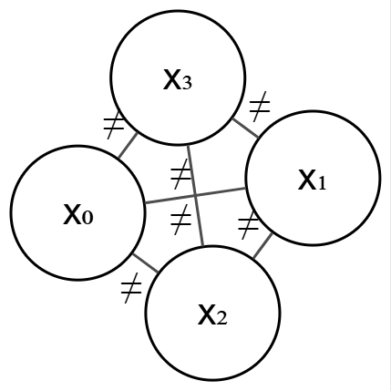

.. _cp-global-constraints.rst:

Contraintes globales
####################

..  contents:: Contenu de la page
    :depth: 3

Le concept
==========

Jusqu'à présent, nous avons développé la contrainte binaire ``NotEqual(x, y,
offset=0)`` qui impose que les variables ``x`` et ``y`` ne prennent pas la même
valeur (en tenant compte d'un éventuel décalage). Nous allons maintenant
introduire une nouvelle contrainte, appelée ``AllDifferent``, qui impose que
toutes les variables d'une liste donnée prennent des valeurs différentes les
unes des autres.

Exemple : le problème des n reines
==================================

Dans le problème des n reines, pour :math:`n=4`, nous avons quatre variables :
:math:`x_i`, chacune représentant le numéro de ligne de la reine placée
dans la colonne :math:`i` de l'échiquier 4x4. 

..  shortanswer:: cp-global-constraints-nb-not-equal-nqueens

    Déterminez le nombre de contraintes binaires de type ``NotEqual(x, y,
    offset)`` qui seraient nécessaires pour modéliser le problème des n reines
    avec :math:`n=4` en utilisant uniquement des contraintes binaires.

..  reveal:: cp-global-constraints-nb-not-equal-nqueens-reponse
    :showtitle: Réponse
    :hidetitle: Cacher la réponsemk

    Il y a 4 variables : :math:`x_0, x_1, x_2, x_3`. Nous devons imposer des
    contraintes entre chaque paire de ces variables.

    ..  admonition:: Contraintes horizontales

        - ``NotEqual(x_i, x_j, offset=0)`` pour :math:`i \neq j` (pour éviter
          que deux reines soient sur la même colonne)

          - Il y a :math:`\binom{4}{2} = 6` paires de variables, donc 6
            contraintes de ce type.

    ..  admonition:: Contraintes de diagonale

        - ``NotEqual(x_i, x_j, offset=j - i)`` pour :math:`i < j` (pour éviter
          que deux reines soient sur la même diagonale descendante)

        - ``NotEqual(x_i, x_j, offset=i - j)`` pour :math:`i < j` (pour éviter que
          deux reines soient sur la même diagonale montante)

          - Il y a :math:`\binom{4}{2} = 6` paires de variables, donc 6
            contraintes de ce type pour les diagonales descendantes et 6
            contraintes de ce type pour les diagonales montantes.

    Cela fait en tout :math:`6 + 6 + 6 = 18` contraintes binaires de type
    ``NotEqual`` nécessaires pour modéliser le problème des n reines avec
    :math:`n=4` en utilisant uniquement des contraintes binaires (contraintes
    portant sur deux variables à la fois).

Graphe de contraintes binaires
==============================

On peut représenter les variables et les contraintes binaires d'un problème de
satisfaction de contraintes à l'aide d'un **graphe de contraintes**. Dans ce
graphe, les nœuds représentent les variables, et les arêtes représentent les
contraintes binaires entre ces variables.

Par exemple, les contraintes binaires de type ``NotEqual`` entre les variables
:math:`x_0, x_1, x_2, x_3` du problème des n reines peuvent être représentées
par un graphe où chaque variable est un nœud, et chaque contrainte ``NotEqual``
est une arête entre les nœuds correspondants.

    Graphe de contraintes pour les contraintes ``NotEqual`` de ligne entre les
    variables :math:`x_0, x_1, x_2, x_3`.

Contrainte globale ``AllDifferent``
===================================

Au lieu d'utiliser de nombreuses contraintes binaires pour imposer que toutes
les variables prennent des valeurs différentes, on pourrait utiliser une seule
contrainte globale ``AllDifferent``. Cette contrainte impose que toutes les
variables d'une liste donnée prennent des valeurs différentes les unes des
autres.

Avantages
---------

L'utilisation de la contrainte globale ``AllDifferent`` présente plusieurs
avantages par rapport à l'utilisation de nombreuses contraintes binaires :

- **Simplicité** : Une seule contrainte remplace plusieurs contraintes binaires,
  ce qui simplifie la modélisation du problème.
- **Efficacité** : Les solveurs de contraintes peuvent exploiter des algorithmes
  spécialisés pour traiter les contraintes globales de manière plus efficace que
  les contraintes binaires individuelles.
- **Lisibilité** : Le modèle devient plus lisible et plus facile à comprendre,
  car il exprime directement l'intention que toutes les variables prennent des
  valeurs différentes.

Modélisation du problème des n reines avec ``AllDifferent``
===========================================================

..  activecode:: cp-global-constraints-nqueens-all-different
    :language: webtp
    :interpreterargs: branch=branch&layout=["Editor", "Console"]

    ############### Importation dans WebTigerPython ############
    from pyodide.http import open_url
    url = 'https://raw.githubusercontent.com/donnerc/pyminicp/refs/heads/main/build/toycsp_bundle.py'
    with open('toycsp.py', 'w') as fd: fd.write(open_url(url).read())
    ############################################################

    from toycsp import ToyCSP, Variable, AllDifferent

    def nqueens(n: int):
        # problème
        csp: ToyCSP = ToyCSP()
        # variables de décision
        q: list[Variable] = [csp.add_variable(range(n)) for _ in range(n)]

        # 1. Une dame par colonne (déjà géré par la structure du problème : queens[i] est la ligne en col i)
        # 2. Toutes les lignes doivent être différentes
        csp.post(AllDifferent(q))

        # 3. Diagonales montantes : Xi + i doit être différent
        csp.post(AllDifferent(q, offsets=[i for i in range(n)]))

        # 4. Diagonales descendantes : Xi - i doit être différent
        csp.post(AllDifferent(q, offsets=[-i for i in range(n)]))
        
        @csp.on('solution')
        def handle_solution(csp, infos):
            solutions.append(csp.get_solution())
            #print(sol)

        solutions = []
        csp.dfs()
        
        return solutions

    # profiling : https://realpython.com/python-profiling/
    from cProfile import Profile
    from pstats import SortKey, Stats

    import sys

    try:
        n = int(sys.argv[1])
    except:
        n = 4

    with Profile() as profile:
        print(f"{len(nqueens(n)) = }\n\nfor {n = }")
        (
            Stats(profile)
            .strip_dirs()
            .sort_stats(SortKey.CUMULATIVE)
            .print_stats()
        )

..  reveal:: 96fb1583-3ec7-4b4f-aa10-bc0b33e478e5
    :showtitle: Réflexion didactique
    :instructoronly:

    - Montrer les différents niveaux de consistance (node, arc, path,
      k-consistency) et expliquer que les algorithmes de filtrage associés à la
      contrainte ``AllDifferent`` permettent d'atteindre une consistance plus
      forte que celle obtenue avec des contraintes binaires individuelles.

    - Montrer que pour les n-dames, les algorithmes de filtrage coûteux de GAC
      ne permettent pas de filtrer drastiquement les domaines, et que
      l'utilisation de la contrainte ``AllDifferent`` n'est pas forcément plus
      efficace que l'utilisation de contraintes binaires.

    - Montrer que pour des Sudoku difficiles, les algorithmes de filtrage de la
      contrainte ``AllDifferent`` permettent de filtrer drastiquement les
      domaines, et que l'utilisation de la contrainte ``AllDifferent`` est
      beaucoup plus efficace que l'utilisation de contraintes binaires.

    - Montrer Bound Consistency et Range Consistency, et expliquer que les algorithmes de
      filtrage associés à la contrainte ``AllDifferent`` permettent d'atteindre
      ces niveaux de consistance plus faibles que GAC, mais qui sont plus
      efficaces à mettre en œuvre.

..  note:: 

    Bonnes explications dans (sur la contrainte all-different et les algorithmes de filtrage associés) :
    
    - https://www.constraint-programming.com/people/regin/papers/hdrsynthese.pdf
    - https://www.constraint-programming.com/people/regin/papers/CPandOR.pdf et dans 