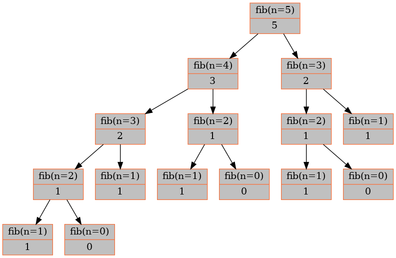
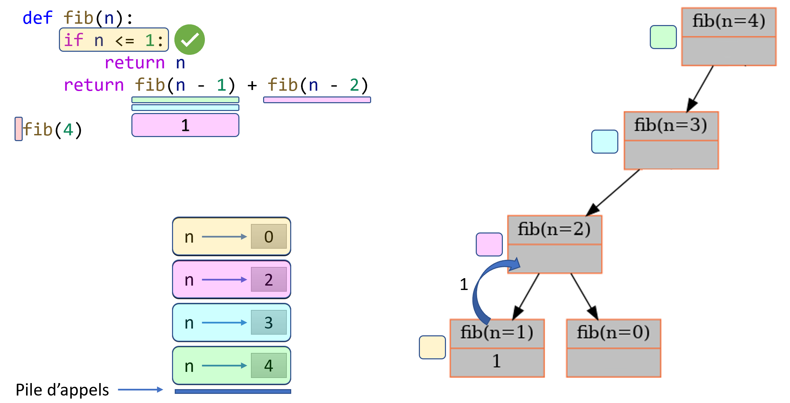

.. _prog-dynamique-fibonacci:

Le problème avec les nombres de Fibonacci récursifs
###################################################

..  contents:: Contenu de la page
    :depth: 3

Générer la suite de Fibonacci de manière récursive est en gros le "Hello world"
de la programmation dynamique. 

Nombres de fibonacci récursifs
==============================

Définissez récursivement une fonction ``fib_rec(n: int) -> int`` qui retourne le
:math:`n`-ième terme de Fibonacci. La suite de Fibonacci joue un rôle important
dans de plusieurs domaines scientifiques. Elle est définie de la manière
suivante:

..  math::  

    F_n = \begin{cases}
        n &\text{si $n \in \{0, 1\}$} \\
        F_{n-2} + F_{n-1} &\text{si $n > 1$}
    \end{cases}
        
Les premiers termes de la suite sont donc :math:`0, 1, 1, 2, 3, 5, 8, 13, 21,
34, \ldots`

..  list-table:: Premiers termes de la suite de Fibonacci
    :stub-columns: 1

    * - :math:`n`
      - 0
      - 1
      - 2
      - 3
      - 4
      - 5
      - 6
      - 7
      - 8
      - 9
      - 10

    * - :math:`F_n`
      - 0
      - 1
      - 1
      - 2
      - 3
      - 5
      - 8
      - 13
      - 21
      - 34
      - 55
    

..  activecode:: fib_rec_py
    :language: webtp
    :interpreterargs: debug_mode=true&layout=["Editor", "Console"]

    def fib_rec(n: int) -> int:
        '''
        >>> fib_rec(0)
        0
        >>> fib_rec(1)
        1
        >>> fib_rec(2)
        1
        >>> fib_rec(4)
        3
        >>> fib_rec(7)
        13
        '''

        ...

    if __name__ == '__main__':
        import doctest
        doctest.testmod()

..  reveal:: 6c7d88ab-d078-4aee-b63c-d95e278d89fd
    :showtitle: Solution

    ..  admonition:: Solution
        :class: important

        ..  code-block:: python
            :linenos:

            from time import time

            def fib_rec(n: int) -> int:
                if n < 2:
                    return n
                else:
                    return fib_rec(n-1) + fib_rec(n-2)

Complexité de Fibonacci récursif
================================

On constate que pour calculer le 40-ième nombre de Fibonacci, chose assez
facile à faire à la main, le temps mis par l'ordinateur est très conséquent.
En fait, on se rend compte que le temps mis pour terminer l'algorithme
augmente exponentiellement avec :math:`n`.

Pour comprendre ce phénomène, on peut calculer le temps nécessaire pour
effectuer ``fib_rec(n)`` pour :math:`n` allant de 23 à 43 et afficher les
résultats sous forme de données CSV facilement importables dans Excel ou dans
https://desmos.com avec le programme:

..  activecode:: c2df858c-f215-435b-b029-af439be642c8
    :language: webtp
    :interpreterargs: debug_mode=true&layout=["Editor", "Console"]

    from time import time

    def fib_rec(n: int) -> int:
        ...

    for n in range(23, 43):
        t0 = time()
        Fn = fib_rec(n)
        t1 = time()
        print(f"{n};{t1 - t0}")

..  shortanswer:: fib-rec-why-complexity-exp

    Tentez d'expliquer le phénomène observé, à savoir que le temps nécessaire
    pour calculer ``fib_rec(n)`` augmente très rapidement avec :math:`n`.

    ..  admonition:: Indication
        :class: tip
        
        Utiliser ``print`` pour afficher un message à chaque appel récursif en
        précisant la valeur de l'argument ``n``.

..  reveal:: b7f23be2-3c35-4894-8400-2c57ca7dc417
    :showtitle: Solution

    ..  admonition:: Solution
        :class: important

        En rajoutant une instruction ``print`` lors de au début de la
        fonction, on se rend compte qu'il faut vite énormément d'appels
        récursifs. Ceci vient du fait que l'on recalcule plusieurs fois les
        mêmes valeurs, ce que l'on peut visualiser sous forme d'un arbre :

        ..  activecode:: d939fad5-c8ae-4308-a163-1691eafb4b0b
            :language: webtp
            :interpreterargs: debug_mode=true&layout=["Editor", "Console"]

            from time import time

            def fib_rec(n, level=0):
                print("    "*level + "fib({})".format(n))
                if n < 2:
                    return n
                else:
                    return fib_rec(n-1, level+1) + fib_rec(n-2, level+1)

            fib_rec(6)

        ..  figure:: figures/fib_rec_call_tree.png
            :align: center
            :width: 80%

            Appels récursifs de la fonction ``fib_rec``

        ::

            >>> fib_rec(6)
            fib(6)
                fib(5)
                    fib(4)
                        fib(3)
                            fib(2)
                                fib(1)
                                fib(0)
                            fib(1)
                        fib(2)
                            fib(1)
                            fib(0)
                    fib(3)
                        fib(2)
                            fib(1)
                            fib(0)
                        fib(1)
                fib(4)
                    fib(3)
                        fib(2)
                            fib(1)
                            fib(0)
                        fib(1)
                    fib(2)
                        fib(1)
                        fib(0)

Complexité de Fibonacci récursif
================================

On voit bien que l'algorithme n'est pas efficace, même pour des valeurs
relativement petites de :math:`n`. L'exécution de l'appel pour :math:`n=50` est
même tellement lente que le programme ne produit aucune sortie en temps
raisonnable. De nombreux problèmes intéressants tels que le problème du rendu de
pièces de monnaies ou du sac à dos présentent une structure permettant une
résolution par décomposition, qui est toutefois inefficace si l'on procède de
manière naïve.

..  only:: html

    En considérant l'arbre des appels récursifs, on comprend vite que cet
    algorithme récursif est de complexité temporelle :math:`\Theta(2^n)`. En
    effet, l'appel ``fib(4)`` génère l'arbre d'appels récursifs suivant:

    ..  tabbed:: afae295c-367b-4f46-b1b6-e53f4d0b4752

        .. tab:: Gif animé

            ..  figure:: figures/fib4-deroulement-dynamique.gif
                :align: center
                :width: 100%

                Arbre des appels récursifs à la fonction ``fib(n)`` pour :math:`n = 4`

        
        .. tab:: PowerPoint

            ..  raw:: html

                <iframe
                src="https://onedrive.live.com/embed?cid=D617C342AC226A99&amp;resid=D617C342AC226A99%21325356&amp;authkey=AMAei_uwZUragVo&amp;em=2&amp;wdAr=1.7777777777777777"
                width="100%" height="430px" frameborder="0">Ceci est un document
                <a target="_blank" href="https://office.com">Microsoft
                Office</a> incorporé, avec <a target="_blank"
                href="https://office.com/webapps">Office</a>.</iframe>
        

        .. tab:: Visualisation statique

            ..  figure:: figures/fib4-deroulement-statique.png
                :align: center
                :width: 100%

                Arbre des appels récursifs à la fonction ``fib(n)`` pour :math:`n = 4`

..  only:: latex

    En considérant l'arbre des appels récursifs, on comprend vite que cet
    algorithme récursif est de complexité temporelle :math:`\Theta(2^n)`. En
    effet, l'appel ``fib(4)`` génère l'arbre d'appels récursifs de la figure
    :ref:`fib-tree-4`

    ..  _fib-tree-4:

    ..  figure:: figures/fibonacci-4.png
        :align: center
        :width: 50%

        Arbre des appels récursifs à la fonction ``fib(n)`` pour :math:`n = 4`

On constate que l'arbre représentant les appels récursifs est un arbre binaire
(incomplet) de hauteur :math:`n-1 = 3`. Si l'on augmente :math:`n` de 1, le
nombre de nœuds est presque multiplié par 2 comme le montre la figure
:ref:`fib-tree-5`. En effet, l'arbre :math:`F(n)` est le sous-arbre gauche de
l'arbre :math:`F(n+1)`.

..  _fib-tree-5:

    Arbre des appels récursifs à la fonction ``fib(n)`` pour :math:`n = 5`

Complexité de la récursion naïve
================================

Lorsque l'on étudie les algorithmes récursifs, il faut non seulement
s'intéresser à la complexité temporelle, liée au nombre d'opérations
élémentaires nécessaires pour exécuter l'algorithme, mais également à la
complexité spatiale, qui donne une indication de la quantité de mémoire de
travail nécessaire en fonction de la taille de l'entrée.

Complexité temporelle
---------------------

.. 
    On peut aussi calculer la complexité avec la master theorem ... je ne sais
    pas si la version vue en cours est suffisante

    ..  math::

        T(n) = 2\cdot T(n-1) + 1 \Rightarrow \Theta(2^n)

    Attention ... ceci n'est pas vraiment le master theorem ... il faudra
    refaire un check ...

La complexité temporelle de l'algorithme récursif ``fib(n)`` se mesure au nombre
de feuilles dans l'arbre des appels récursifs, à savoir le nombre d'appels des
cas de base :math:`n \in \{0, 1\}`. Or, comme chaque noeud de l'arbre possède
deux noeuds enfants, le nombre de feuilles de l'ordre de :math:`2^n` pour un
arbre de hauteur :math:`n`. Par conséquent, la complexité temporelle de
l'algorithme récursif ``fib(n)`` est de l'ordre de :math:`\Theta(2^n)`.

    Arbre des appels récursifs à la fonction ``fib(n)`` pour :math:`n = 5`

..
    La complexité de la méthode récursive ``fib(n)`` est donné par la formule de
    récurrence :math:`T(n) = T(n-1) + T(n-2) + \Theta(1)`. En effet, toutes les
    opérations impliquées dans la recombinaison des sous-solutions :math:`F(n-1)` et
    :math:`F(n-2)` sont constantes en temps (addition, comparaison, etc.). Or, la
    formule de récurrence ``T(n)`` correspond justement à la suite de Fibonacci. On
    a donc :math:`T(n) \geq F(n) \approx \phi^n` où :math:`\phi` est le nombre d'or,
    ce qui nous donne un :math:`\Theta(\phi^n) = \Theta(2^n)` pour la complexité
    temporelle. 

    Une autre manière de calculer la complexité temporelle est de constater que
    :math:`T(n) \geq 2\cdot T(n-2) = \Theta(2^{\frac{n}{2}}) = \Theta(2^n)` puisque
    cela correspond au nombre de nœuds d'un arbre binaire dont les deux sous-arbres
    sont de hauteur ``n-2``.

..  only:: comment

    Chaque appel récursif de l'algorithme ``fib(n)`` effectue les mêmes étapes. On
    peut donc ramener l'étude de sa complexité au nombre d'appels récursifs
    nécessaires, à savoir au nombre de nœuds dans l'arbre des appels récursifs. En
    gros, le nombre d'appels récursifs de ``fib(n)`` est encadré par les algorithmes
    ``f(n)`` et ``g(n)`` ci-dessous, dont le nombre d'appels récursifs est
    clairement exponentiel en :math:`n`.

    ::

        def f(n):
            if n <= 1: return n
            return f(n - 1) + f(n - 1)
        
        def g(n):
            if n <= 1: return n
            return g(n - 2) + g(n - 2)
        
    En effet, comme le montrent les figures :ref:`fib-lower-bound` et
    :ref:`fib-upper-bound`, il y a :math:`2^n = \Theta(2^n)` appels récursifs pour
    exécuter l'appel ``f(n)`` et :math:`2^{\frac{n}{2}} = \Theta(2^n)` pour l'appel
    ``g(n)``. Or, comme l'arbre des appels récursifs de l'algorithme ``fib(n)``
    contient plus de nœuds que celui de ``g(n)``, mais moins de nœuds que celui de
    ``f(n)``, la complexité de ``fib(n)`` est entre celle de ``f(n)`` et celle de
    ``g(n)``. Or, aussi bien ``f(n)`` que ``g(n)`` est de complexité temporelle
    :math:`\Theta(2^n)`, ce qui implique que ``fib(n)`` est également de complexité
    temporelle :math:`\Theta(2^n)`.

    ..  _fib-upper-bound:

    ..  figure:: figures/fib-upper-4.png
        :align: center
        :width: 90%

        Arbre des appels récursifs pour ``f(n)``

    ..  _fib-lower-bound:

    ..  figure:: figures/fib-lower-4.png
        :align: center
        :width: 40%

        Arbre des appels récursifs pour ``g(n)``
    
Complexité spatiale
-------------------

Il est également nécessaire d'étudier la complexité spatiale de l'algorithme. En
effet, lorsqu'on utilise des fonctions récursives, chaque appel occupe de
l'espace sur la pile d'appels, à savoir dans la mémoire de travail. La hauteur
maximale de la pile d'appels est atteinte lorsqu'on atteint une feuille de
l'arbre dont la profondeur est maximale. La figure :ref:`fib-call-stack` montre
la hauteur maximal de la pile d'appels pour l'appel ``fib(n=4)``. Le nombre
d'appels récursifs simultanément en cours d'exécution ne dépasse pas la hauteur
de l'arbre des appels récursifs + 1, à savoir :math:`n`. La complexité spatiale
de ``fib(n)`` récursif est donc :math:`\Theta(n)`.

.. _fib-call-stack:

    Hauteur maximale de la pile d'appels pour l'appel ``fib(n=4)``

