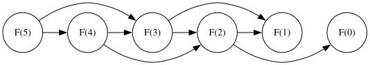
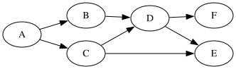
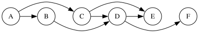

.. _graphe-de-dependances.rst:

Intermède : le graphe de dépendances
####################################

..  contents:: Contenu de la page
    :depth: 3

Graphe de dépendances
=====================

Pour pouvoir être résolu par programmation dynamique, il faut que le **graphe de
dépendances** des calculs soit acyclique. 

..  _defn:dependency-graph:

..  admonition:: Définition (Graphe de dépendances / graphe des sous-problèmes)

    Le graphe de dépendances (également appelé graphe des sous-problèmes) d'une
    fonction récursive est le graphe orienté :math:`G(V, E)` dont les sommets
    :math:`v \in V` représentent les calculs à effectuer, à savoir les appels
    récursifs à faire et qui contient une arête :math:`(u, v) \in E` si et
    seulement si le calcul du problème :math:`u` dépend directement du calcul du
    problème de :math:`v`.

..  _fig-dependency-graph-fibn:

    Graphe de dépendances du calcul de :math:`F(5)`

..  
    graphviz::
    :caption: Graphe de dépendances du calcul de :math:`F(5)`

     digraph example {
         rankdir=LR;
         rank=same;
         a [label="F(5)"];
         b [label="F(4)"];
         c [label="F(3)"];
         d [label="F(2)"];
         e [label="F(1)"];
         f [label="F(0)"];
         a -> b;
         a -> c [constraint=false];
         b -> c;
         b -> d [constraint=false];
         c -> d;
         c -> e [constraint=false];
         d -> e;
         d -> f;
     }

..  _prop:condition-necessaire-graphe-dependances-dag:

..  admonition:: Proposition

    Si on établit une relation d'équivalence entre les nœuds de l'arbre des
    appels récursifs correspondant à un appel avec les mêmes paramètres
    (mémoïsés dans un même emplacement), on obtient le graphe des dépendances en
    faisant "l'arbre des appels modulo la relation d'équivalence". En d'autres
    termes, on obtient chaque sommet du graphe de dépendances en réduisant les
    nœuds équivalents de l'arbre des appels récursifs. On obtient les arêtes du
    graphe de dépendances en réduisant de manière analogue toutes les arêtes de
    l'arbre des appels entre deux nœuds équivalents.

..  admonition:: Proposition (Condition nécessaire pour la programmation dynamique)

    Pour qu'un problème puisse être résolu par programmation dynamique, il faut
    que le graphe de dépendance sous-jacent soit acyclique.

En effet, si le graphe de dépendances est cyclique, la récursion va
immanquablement conduire à un algorithme qui tourne en boucle infinie (récursion
infinie indirecte).

Il n'y a aucun problème avec le calcul des nombres de Fibonacci puisque le
calcul de :math:`F(n)` n'est dépendant que du calcul de :math:`F(n-1)` et
:math:`F(n-2)`, comme le montre le graphe de dépendances de la figure
:ref:`fig-dependency-graph-fibn` pour le calcul de :math:`F(5)`.

Tri topologique
===============

Soit :math:`G(V, E)` un graphe orienté acyclique. Un tri topologique de
:math:`G` est un ordre total sur les sommets de :math:`G` tel que pour toute
arête :math:`(u, v) \in E`, le sommet :math:`u` précède le sommet :math:`v` dans
l'ordre total.

..  admonition:: Intuition

    Un tri topologique d'un graphe orienté acyclique est une disposition des
    noeuds du graphe sur une seule ligne de manière à ce que les arcs pointent
    toujours de gauche à droite. En d'autres termes, un tri topologique est un
    ordre linéaire des sommets d'un graphe orienté acyclique tel que pour chaque
    arête :math:`(u, v)`, le sommet :math:`u` apparaît avant le sommet :math:`v`
    dans l'ordre.

Exemple
-------

On donne le graphe suivant:

    Graphe orienté acyclique

Un tri topologique de ce graphe est :math:`A \rightarrow B \rightarrow C
\rightarrow D \rightarrow E \rightarrow F`. Un autre tri topologique de ce
graphe est :math:`A \rightarrow C \rightarrow B \rightarrow D \rightarrow E
\rightarrow F`. En revanche, :math:`A \rightarrow C \rightarrow D \rightarrow B
\rightarrow E \rightarrow F` n'est pas un tri topologique de ce graphe, car il
viole la contrainte que :math:`B` doit précéder :math:`D` (il existe une arête
:math:`(B, D)` dans le graphe).

    Tri topologique du graphe orienté acyclique de la figure précédente

..
    digraph example_horizontal {
    // Force la direction de Gauche à Droite
    rankdir=LR;
    
    // Style des nœuds
    node [shape=circle, width=0.5];

    // On définit les nœuds dans l'ordre
    a [label="A"];
    b [label="B"];
    c [label="C"];
    d [label="D"];
    e [label="E"];
    f [label="F"];

    // On crée une chaîne principale avec un poids fort (weight)
    // Cela oblige Graphviz à les aligner sur une ligne droite
    edge [weight=10];
    a -> b;
    b -> c [style=invis]; // On ajoute un lien invisible pour b -> c car il n'existe pas dans vos données
    c -> d;
    d -> e;
    e -> f [style=invis]; // Lien invisible pour amener F sur la ligne après E

    // On ajoute vos autres arêtes avec un poids faible pour qu'elles ne cassent pas la ligne
    edge [weight=1];
    a -> c;
    b -> d;
    c -> e;
    d -> f;
    }   

..  
    graphviz::
    :caption: Graphe orienté acyclique

     digraph example {
         rankdir=LR;
         rank=same;
         a [label="A"];
         b [label="B"];
         c [label="C"];
         d [label="D"];
         e [label="E"];
         f [label="F"];
         a -> b;
         a -> c;
         b -> d;
         c -> d;
         c -> e;
         d -> e;
         d -> f;
     }

..  admonition:: Proposition (Ordre d'évaluation des appels récursifs)

    Si le graphe de dépendances est un DAG (*directed acyclic graph* = graphe
    orienté acyclique), l'ordre dans lequel les problèmes sont résolus (un
    problème est considéré comme résolu lorsque toutes ses dépendances sont
    résolues) par les appels récursifs correspond à un "tri topologique inverse"
    du graphe de dépendances, à savoir à un tri topologique du graphe de
    dépendances inversé.
