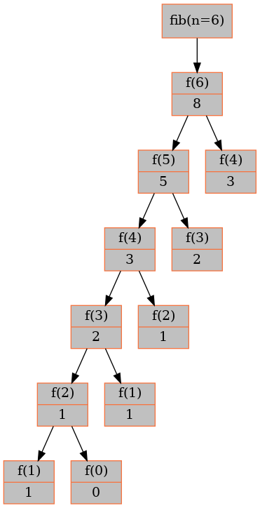

.. _memoization-top-down.rst:

Programmation dynamique "top-down" : la mémoïsation
###################################################

..  contents:: Contenu de la page
    :depth: 3

La raison pour laquelle l'algorithme récursif ``fib(n)`` est inefficace vient du
fait que de certains calculs sont refaits à l'identique à plusieurs moments. Par
exemple,  on voit bien sur la figure :ref:`fib-tree-5` que l'appel ``fib(5)``
répète quatre fois l'appel ``fib(1)``, trois fois l'appel ``fib(2)`` et deux
fois l'appel ``fib(3)``.

..  _fib-tree-5-recompute:

..  figure:: figures/fibonacci-5.png
    :align: center
    :width: 80%

    Arbre des appels récursifs à la fonction ``fib(n)`` pour :math:`n = 5`

Il est possible d'améliorer considérablement les performances de l'algorithme
récursif de Fibonacci vu à la page :ref:`prog-dynamique-fibonacci` en utilisant
une technique de **mémoïsation**. Cette technique consiste à stocker les
résultats des appels récursifs dans un dictionnaire afin d'éviter de refaire les
mêmes calculs plusieurs fois.

Mémoïsation avec un dictionnaire
================================

..  activecode:: fibonacci_rec_memo_py
    :language: webtp
    :interpreterargs: debug_mode=true&layout=["Editor", "Console"]

    Optimisez l'algorithme récursif de la suite de Fibonacci développé à l'exercice
    précédent en utilisant le technique de **mémoïsation**. Développez une fonction
    ``fibonacci_rec_opt(n: int) -> int`` qui retourne le :math:`n`-ième terme de la
    suite de Fibonacci avec une technique de mémoïsation. 
    
    ..  admonition:: Indication
        :class: tip

        Il faut utiliser un dictionnaire **global** ``already_computed`` dans
        lequel les clés seront l'argument passé à la fonction. Avant de
        retourner la valeur, on la stocke dans le dictionnaire
        ``already_computed``. Avant de calculer la valeur, on vérifie dans le
        dictionnaire si la valeur n'a pas déjà été calculée précédemment. Si
        c'est le cas, on retourne simplement la valeur qui existe dans le
        dictionnaire au lieu de refaire le calcul.

        On devrait donc avoir le déroulement suivante

        ::

            >>> already_computed = {}
            >>> fibonacci_rec_opt(0)
            >>> already_computed
            {0: 0}
            >>> fib_rec(2)
            >>> already_computed
            {0: 0, 1: 1, 2: 1}
            >>> fib_rec(4)
            >>> already_computed
            {0: 0, 1: 1, 2: 1, 3: 2, 4: 3}

    ..  admonition:: Exemple d'utilisation
        :class: important

        ::

            >>> fib_rec(0)
            0
            >>> fib_rec(1)
            1
            >>> fib_rec(3)
            2
            # impossible à faire avec la version non mémoïsée
            >>> fib_rec(150)
            9969216677189303386214405760200

    ~~~~

    def fib_rec(n: int) -> int:
        '''
        >>> fib_rec(0)
        0
        >>> fib_rec(1)
        1
        >>> fib_rec(7)
        13
        >>> fib_rec(8)
        21
        >>> fib_rec(9)
        34
        >>> fib_rec(40)
        102334155
        >>> fib_rec(150)
        9969216677189303386214405760200
        >>> fib_rec(1000)
        43466557686937456435688527675040625802564660517371780402481729089536555417949051890403879840079255169295922593080322634775209689623239873322471161642996440906533187938298969649928516003704476137795166849228875
        >>> fib_rec(1500)
        13551125668563101951636936867148408377786010712418497242133543153221487310873528750612259354035717265300373778814347320257699257082356550045349914102924249595997483982228699287527241931811325095099642447621242200209254439920196960465321438498305345893378932585393381539093549479296194800838145996187122583354898000
        
        '''

        ...

    if __name__ == '__main__':
        import doctest
        doctest.testmod()

..  reveal:: 3320493c-868b-4595-a101-c018c538e0e6
    :showtitle: Solution

    ..  figure:: figures/refactore-fib-memoization.png
        :align: center
        :width: 100%

        Étapes pour rajouter la mémoïsation à la fonction ``fib(n)``

    On présente ci-dessous deux solutions

    ..  note:: 

        Si vous exécutez le code dans un navigateur, il est possible que la
        profondeur de la récursion ne puisse pas être augmentée à 2000
        suivant le navigateur.

    ..  activecode:: decac617-0beb-488b-b52d-8ca65ec4e6b6
        :language: webtp
        :interpreterargs: debug_mode=true&layout=["Editor", "Console"]

        La première solution est celle que vous avez sans doute trouvée
        rapidement.

        ~~~~

        import sys
        sys.setrecursionlimit(2000)

        already_computed = {}

        def fib_rec(n):
            if n in already_computed:
                return already_computed[n]

            result = None
            if n < 2:
                result = n
            else:
                result = fib_rec(n-1) + fib_rec(n-2)
            already_computed[n] = result
            return result
            
        print(fib_rec(40))
        print(fib_rec(150))
        print(fib_rec(1000))
        print(fib_rec(1500))

    ..  activecode:: 9201076d-687f-4337-bb60-eefaf9039da9
        :language: webtp
        :interpreterargs: debug_mode=true&layout=["Editor", "Console"]

        Cette deuxième solution représente le cas de base de la récursion en
        préremplissant le dictionnaire avec les deux cas de base de la suite de
        Fibonacci. Dans cette version, il n'y a donc plus le cas de base ``if n
        < 2``, qui est matérialisé par l'initialisation de la table de
        mémoïsation.

        ~~~~

        import sys
        sys.setrecursionlimit(2000)

        already_computed = {0: 0, 1: 1}

        def fib_rec(n):
            result = None
            if n in already_computed:
                return already_computed[n]
            else:
                result = fib_rec(n-1) + fib_rec(n-2)
            already_computed[n] = result
            return result
            
        print(fib_rec(40))
        print(fib_rec(150))
        print(fib_rec(1000))
        print(fib_rec(1500))

Arbre des appels récursifs avec la mémoïsation
==============================================

De manière générale, la mémoïsation sert à éviter de recalculer un résultat déjà
calculé au préalable. Concrètement, au niveau des appels récursifs, cela a pour
effet de couper toutes les branches inutiles de l'arbre des appels de la
fonction récursive, comme le montre la figure :ref:`fib-6-tree-with-memo` pour
l'appel ``fib(6)``.

..  only:: html

    L'animation ci-dessous montre les appels récursifs de la version mémoïsée
    ``fib(n=6)``.

    ..  figure:: figures/fib_memoized-6.gif
        :align: center
        :width: 65%

        Animation montrant les appels récursifs à la fonction ``fib(n)`` pour
        :math:`n = 6`

..  _fib-6-tree-with-memo:

    Arbre des appels récursifs lors de l'appel ``fib(6)``

Analyse de complexité de la récursion avec la mémoïsation
=========================================================

Complexité temporelle
---------------------

De manière générale, pour déterminer la complexité d'un algorithme utilisant la
programmation dynamique, on considère le nombre d'appels récursifs non mémoïsés
à faire. En effet, les appels mémoïsés coûtent :math:`\Theta(1)` en temps pour
autant que la table de mémoïsation permette un accès en :math:`\Theta(1)`
opérations.

..  math:: 

    \text{nombre d'appels non mémoïsés} \times \text{complexité pour chaque
    appel non mémoïsé}

Dans le cas présent, pour calculer le terme de rang :math:`n` de la suite de
Fibonacci, il faut calculer tous les :math:`n` termes précédents, ce qui fait en
tout :math:`n+1` sous-problèmes (appels non mémoïsés). En supposant que
l'addition de :math:`F(n-1)` et :math:`F(n-2)` est :math:`\Theta(1)`, la
résolution de chaque sous-problème est :math:`\Theta(1)`, puisque les appels
récursifs sont mémoïsés. La complexité temporelle est donc :math:`(n+1) \times
\Theta(1) = \Theta(n)`.

Une autre manière de déterminer la complexité temporelle est de déterminer le
nombre de nœuds de l'arbre des appels récursifs. Comme le montre la figure
:ref:`fib-6-tree-with-memo`, la version mémoïsée ne demande que :math:`n + (n - 1)
= 2n-1` appels, ce qui donne lieu à une complexité temporelle de
:math:`\Theta(n)`.

Complexité spatiale
-------------------

La complexité spatiale de l'algorithme n'est pas améliorée par la mémoïsation.
Au contraire, la version mémoïsée demande davantage de mémoire que la version
naïve. En effet, en plus de devoir stocker la pile d'appels récursifs, également
de hauteur :math:`n` dans la version mémoïsée, il faut encore stocker la table
de hachage de mémoïsation, qui occupe également :math:`\Theta(n)` unités
mémoire. Ainsi, la version mémoïsée nécessite en gros deux fois plus de mémoire
que la version naïve mais reste :math:`\Theta(n)`.

Limites de l'approche récursive descendante
===========================================

Même si la technique de mémoïsation permet d'améliorer considérablement
lesperformances de l'algorithme récursif, elle ne permet pas de résoudre tous
les problèmes. 

..  shortanswer:: test_fib_rec_memo_rec_depth_limit

    Appelez la fonction ``fibonacci_rec_opt`` développée dans l'exercice
    précédent pour ``n`` dans ``[150, 500, 1000, 8000]``.

    Que se passe-t-il pour :math:`n = 8000`? Donnée une explication détaillée de
    ce qui se passe.

..  reveal:: 008d38ed-7b2b-4ccf-9d6c-b76cbaed9042
    :showtitle: Réponse

    ..  admonition:: Réponse

        Même si les calculs peuvent être effectués relativement efficacement, le
        programme produit néanmoins une erreur d'exécution. La raison est que le
        nombre d'appels récursifs dépasse la limite autorisée. Techniquement,
        rien n'empêcherait de faire plus d'appels récursifs, car l'ordinateur
        contient suffisamment de mémoire pour la pile d'appels qui ne doit
        stocker à chaque fois que le paramètre :math:`n`.

        Pour cela, on peut modifier manuellement la limite du nombre d'appels
        récursifs (voir par exemple
        https://stackoverflow.com/questions/3323001/what-is-the-maximum-recursion-depth-in-python-and-how-to-increase-it)

..  note::

    La programmation dynamique qui utilise la récursion et la mémoïsation est
    appelée "top-down" (de haut en bas) car elle commence par le problème global
    et le divise en sous-problèmes plus petits, jusqu'à atteindre les cas de
    base. En d'autres termes, on part du problème que l'on veut résoudre pour
    remonter progressivement vers les cas de base qui sont connus.

