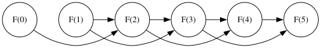
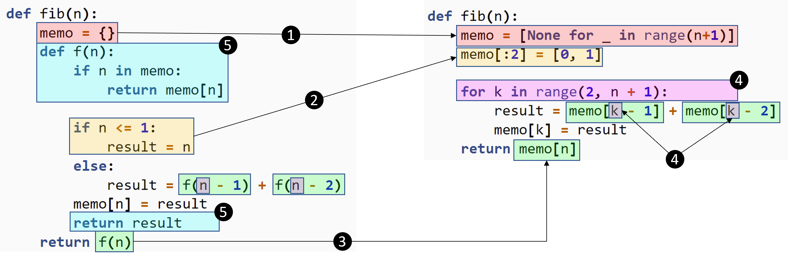

.. tabulation-bottom-up.rst:

Approche itérative ascendante
#############################

..  contents:: Contenu de la page
    :depth: 3

L'approche récursive développée dans la section :ref:`memoization-top-down` correspond à l'approche
"descendante" de la programmation dynamique. Il existe également une approche
ascendante qui se débarrasse de la récursion. Cette approche est souvent plus
performante, car elle évite les pénalités de performance liés aux appels
récursifs.

..  admonition:: Programmation dynamique ascendante (*bottom-up*)
    :class: tip

    L'approche ascendante de la programmation dynamique fonctionne à l'envers de
    l'approche descendante. Au lieu de partir du résultat auquel on veut arriver
    et décomposer le problème jusqu'à ce qu'il soit trivial, on part du cas
    trivial et on construit progressivement la solution en mémorisant toutes les
    étapes dans une table de hachage ou un tableau. En général, on préfère
    stocker les résultats intermédiaires dans un tableau pour de meilleures
    performances.

..
    L'approche ascendante, à rebours de l'approche récursive qui commence avec le
    calcul souhaité et descend vers les cas de base, démarre avec les cas de base
    pour "remonter" au résultat souhaité. 
    
Les calculs doivent cependant être faits dans un ordre tel que l'on calcule
toujours les dépendances d'un calcul avant de faire le calcul lui-même. Dans le
cas de Fibonacci, il est trivial de déterminer cet ordre. En effet, le graphe de
dépendances de ``fib(5)`` de la figure :ref:`inverse-dependency-graph`

..  
    graphviz::
    :caption: Graphe de dépendances inversé du calcul de :math:`F(5)`

    digraph example {
        rankdir=LR;
        node [shape=circle, width=0.8, fixedsize=true];
        
        // 1. Définition de l'ordre et des liens directs (Epine dorsale)
        // On utilise F(0) -> F(1) en invisible pour le placement
        // Puis les liens réels pour le reste de la ligne
        edge [weight=10];
        "F(0)" -> "F(1)" [style=invis];
        "F(1)" -> "F(2)";
        "F(2)" -> "F(3)";
        "F(3)" -> "F(4)";
        "F(4)" -> "F(5)";

        // 2. Arêtes de "saut" et cas particulier F(0) -> F(2)
        edge [weight=1, constraint=false];
        "F(0)" -> "F(2)"; // Le saut de F(0)
        "F(1)" -> "F(3)"; // Le saut de F(1)
        "F(2)" -> "F(4)"; // Le saut de F(2)
        "F(3)" -> "F(5)"; // Le saut de F(3)
    }

.. _inverse-dependency-graph:

    Graphe de dépendances inversé du calcul de :math:`F(5)`

On voit facilement qu'on obtient un tri topologique de ce graphe orienté
acyclique en triant les sommets :math:`F(n)` dans l'ordre croissant de
:math:`n`: :math:`F(0) \rightarrow F(1) \rightarrow F(2) \rightarrow \ldots
\rightarrow F(5)`.

De la version récursive à la version itérative
==============================================

Pour passer de la version récursive à la version itérative, on procède en
suivant les transformations suivantes:

#.  Transformation de la table de mémoïsation en tableau contenant autant de
    dimensions que de paramètres indépendants dans la clé d'accès à la table de
    mémoïsation. Dans le cas des nombres de Fibonacci, chaque appel à la
    fonction ne contient que le paramètre :math:`n`. Le tableau sera donc de
    dimension 1. Dans chaque dimension, le tableau doit avoir une taille
    correspondant au nombre de valeurs entières différentes que peut prendre le
    paramètre. Dans notre cas, le paramètre ``n`` peut prendre n'importe
    laquelle des :math:`N+1` valeurs entières entre :math:`0` et :math:`N`. On
    crée donc le tableau comme suit:
 
    ::

        memo = [None for _ in range(N + 1)]

#.  Remplissage du tableau ``memo`` avec les valeurs représentant les cas de
    base de la récursion. Dans le cas de Fibonacci, il y a deux cas de base, à
    savoir :math:`F(0) = 0` et :math:`F(1) = 1` . On peut donc initialiser le
    tableau ``memo`` avec ``memo[0:2] = [0, 1]``. De manière équivalente, on
    aurait pu transformer les cas de base en  

    ::

        memo[0] = 0
        memo[1] = 1

    ou encore en

    ::

        for k in [0, 1]:
            memo[k] = k

#.  Transformation des appels récursifs ``f(n)`` en un accès au tableau de
    mémoïsation ``memo[n]``.

#.  Itérer sur toutes les emplacements non remplis du tableau de solutions
    intermédiaires. Il est crucial de parcourir le tableau dans un ordre qui
    correspond à un tri topologique du graphe de dépendances inversé. Dans notre
    cas, il suffit de parcourir le tableau dans l'ordre croissant des indices
    :math:`k`. Dans notre cas, les cases ``memo[0]`` et ``memo[1]`` sont déjà
    remplies avec les cas de base. On commence donc à itérer à partir de
    :math:`k=2` jusqu'à la fin du tableau, à savoir jusqu'à :math:`k=n` où se
    trouvera la solution construite pas à pas à la fin de l'itération.

#.  Supprimer ce qui concerne la récursion et dont on n'a pas besoin dans la
    version itérative.

    Passage de la version récursive mémoïsée à la version itérative ascendante
    de ``fib(n)``

..
    ::

        memo = {}
        def fib(n):
            if n <= 1:
                result = n
            else:
                result = fib(n - 1) + fib(n - 2)
            memo[n] = result
            return result
    ::

        memo = {}
        def fib(n):
            if n <= 1:
                return n
            
            memo[n] = fib(n - 1) + fib(n - 2)
            return memo[n]

    ::

        memo = [None for _ in range(n+1)]
        def fib(n):
            memo[:2] = [0, 1]

            for k in range(2, n + 1):
                result = memo[k - 1] + memo[k - 2]
                memo[k] = result
            return memo[n]
    ::

        def fib(n):
            memo = [None for _ in range(n+1)]
            memo[:2] = [0, 1]

            for k in range(2, n + 1):
                result = memo[k - 1] + memo[k - 2]
                memo[k] = result
            return memo[n]

À la fin de ce processus, on trouve la version itérative de ``fib(n)`` présentée
dans le code :ref:`code-fib-tabular.py`.

..  _code-fib-tabular.py:

Version itérative de ``fib(n)``
-------------------------------

..  activecode:: fib_tabular_py
    :caption: Version itérative de ``fib(n)``
    :language: webtp
    :interpreterargs: debug_mode=true&layout=["Editor", "Console"]

    def fib(n):
        memo = [None for _ in range(n+1)]
        # initialisation du tableau avec les cas de base
        memo[:2] = [0, 1]

        # remplir le tableau itérativement (dans le bon ordre) 
        # au lieu de faire des appels récursifs
        for k in range(2, n + 1):
            # remplacer les appels récursifs par des accès au tableau
            result = memo[k - 1] + memo[k - 2]
            memo[k] = result
        # La réponse au problème se trouve dans la dernière case
        # remplie du tableau
        return memo[n]

..
    Implémentation en Python
    ========================

    Commençons pas étudier une implémentation Python ascendante, qui n'utilise pas
    la récursion et qui mémorise les résultats intermédiaires dans une table de
    hachage.

    ..  literalinclude:: scripts/fib_tabulation.py
        :caption:
        :linenos:
        :pyobject: fib_hash
        
    De manière équivalente, on peut remplacer la table de hachage par un tableau
    (liste en Python) pour de meilleures performances. Le seul changement à faire
    est à la ligne 2.

    ..  literalinclude:: scripts/fib_tabulation.py
        :caption:
        :linenos:
        :emphasize-lines: 2
        :pyobject: fib_table

Analyse de complexité de la version itérative
=============================================

La version récursive mémoïsée (approche descendante) et la version itérative
(approche ascendante) ont exactement la même complexité temporelle
:math:`\Theta(n)`. Nous avons déjà vu que cette complexité est linéaire dans le
cas de la récursion mémoïsée. Dans le cas de la version itérative, la
programmation dynamique consiste simplement à remplir tout le tableau, qui est
de taille :math:`n+1`. Pour chaque case, il faut faire des opérations de coût
:math:`\Theta(1)`. La complexité temporelle de l'algorithme itératif est donc
également de complexité :math:`\Theta(n)`.

Au niveau de la complexité spatiale, la mémoire utilisée vient surtout du
tableau. Dans le cas de la version itérative, sa taille est en
:math:`\Theta(n)`.

BONUS : Améliorer la complexité spatiale
========================================

On peut encore améliorer la performance de ce dernier algorithme en tenant
compte du fait que, pour calculer :math:`F(n)`, il suffit de connaître
:math:`F(n-1)` et :math:`F(n-2)` et qu'il n'est pas nécessaire de se souvenir de
tous les résultats intermédiaires précédents. On peut réaliser cette
amélioration très facilement en prenant un tableau de 3 éléments qui va, en tout
temps, stocker les résultats pour le rang :math:`n`, :math:`n-1` et :math:`n-2`.
On utilise pour ce faire un type personnalisé de cache LRU basé sur un tableau
de longueur 3 parcouru modulo 3, de manière cyclique.

..  note::

    L'implémentation du cache LRU est dans ce cas très simple puisque les clés sont
    des nombres entiers. Elle consiste essentiellement à accéder aux indices modulo
    la taille du cache, ce qui a pour effet de faire une rotation dans le tableau
    ``self.cache`` à mesure que l'indice croît.

..  activecode:: fib_tabulation_lru_py
    :language: webtp
    :interpreterargs: debug_mode=true&layout=["Editor", "Console"]

    '''
    Version itérative de ``fib(n)`` avec cache LRU de taille 3
    '''

    class ArrayLRUCache[T]:
        def __init__(self, maxsize: int = None) -> None:
            self.maxsize: int = maxsize
            self.cache: List[T] = [None] * maxsize

        def __getitem__(self, key: int) -> T:
            return self.cache[key % self.maxsize]

        def __setitem__(self, key: int, value: T) -> None:
            self.cache[key % self.maxsize] = value

    def fib(n: int) -> int:
        memo: ArrayLRUCache[int] = ArrayLRUCache(maxsize=3)
        # initialisation du tableau avec les cas de base
        for k in [0, 1]: memo[k] = k

        # remplir le tableau itérativement (dans le bon ordre)
        # au lieu de faire des appels récursifs
        for k in range(2, n + 1):
            # remplacer les appels récursifs par des accès au tableau
            result = memo[k - 1] + memo[k - 2]
            memo[k] = result
        # La réponse au problème se trouve dans la dernière case
        # remplie du tableau
        return memo[n]

    n = fib(8000)
    print()
