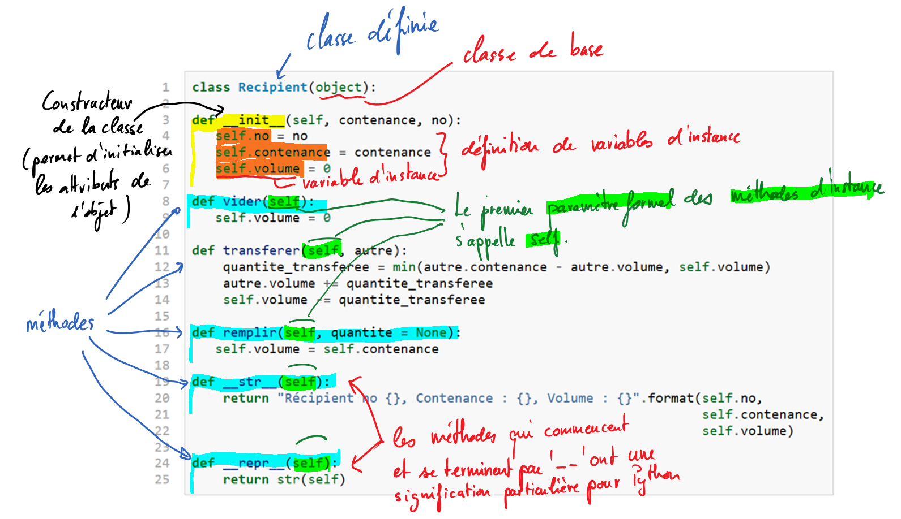

.. _poo-bwillis-analyse.rst:

Définir des objets en Python
############################

..  contents:: Contenu de la page
    :depth: 3

Vidéo de présentation
=====================

..  admonition:: Remarque

    Là encore, si vous trouvez une meilleure vidéo, en français, pour présenter
    les concepts de cette page, n'hésitez pas à me la signaler.

..  youtube:: f0TrMH9s-VE
    :width: 800
    :height: 430
    :divid: definition_classe_python

..  admonition:: Programmation impérative ou procédurale

    Le terme **programmation impérative** désigne la manière classique de
    programmer que vous avez utilisée jusqu'ici. Dans ce chapitre, on désigne
    également cette technique basique par le terme **programmation
    procédurale**. Les deux sont parfaitement synonymes.

Définition d'une classe
=======================

Un bon exemple vaut mieux qu'un long discours pour cerner immédiatement les
différentes notions de base de la programmation orientée  objets. Enfilez vos
meilleures lunettes (ou lentilles) et observez attentivement le code suivant
qui montre comment définir une nouvelle classe ``Recipient``:

..  activecode:: bwillis_recipient_py

    class Recipient:
        def __init__(self, contenance, no, volume=0):
            self.no = no
            self.contenance = contenance
            self.volume = volume

        def vider(self):
            self.volume = 0

        def transferer(self, autre):
            quantite_transferee = min(autre.contenance - autre.volume, self.volume)
            autre.volume += quantite_transferee
            self.volume -= quantite_transferee

        def remplir(self):
            self.volume = self.contenance

        def __str__(self):
            return repr(self)

        def __repr__(self):
            return f"Recipient(contenance={self.contenance}, no={self.no}, volume={self.volume})"

Analyse du code
---------------

Étudiez attentivement le code ci-dessus à l'aide des annotations.

..  tip::

    Si vous ne comprenez pas tout, c'est normal ... la programmation orientée
    objets est difficile d'accès au début, mais dès qu'on commence à la
    maîtriser, c'est un petit paradis de la programmation.

Cette classe va nous permettre d'aider Bruce Willis à désamorcer une bombe ...

Utilisation de la classe
========================

Pour pouvoir utiliser une classe, il faut créer un ou plusieurs objets à partir de
cette classe. En termes techniques, on dit qu'on crée une **instance** de la
classe ou qu'on **instancie** la classe. Ainsi, après avoir défini la classe à
l'aide du mot-clé ``class``, on peut créer des récipients différents.

::

    >>> r1 = Recipient(no=1, contenance=5)
    >>> r2 = Recipient(no=2, contenance=3)

À l'aide de ces deux lignes, ont vient de créer deux objets concrets
(instances) de la classe ``Recipient`` (on pourrait dire du *type*
``Recipient``). En effet, notre classe ``Recipient`` constitue un nouveau type
de données utilisable dans notre programme.

    >>> r2.remplir() # remplir le recipient r2
    >>> r1.transferer(r2) # transfère le contenu de r1 dans r2
    >>> r2.vider() # vider le récipient r2
    >>> r2.volume
    0
    >>> r1.volume
    3
    ...
    >>> r2.volume == 2 # ce que l’on devrait obtenir à la fin ...
    True

..
    ..  activecode:: oop_exemple1
        :nocanvas:
        :language: python
        :caption: Premier exemple de test

        from math import pi

        def add(a,b):
            return a+b

        ## grading
        import unittestgui

        class myTests(unittestgui.unittest):

           def testOne(self):
               self.assertEqual(add(2,2),4,"A feedback string when the test fails")
               self.assertEqual(add(2, 0), 2, "balba")
               #self.assertAlmostEqual(add(2.0,3.0),5.0,"Your function failed on inputs of 2.0 and 3.0")

        myTests().main()

Récréation
----------

Dans *Die Hard 3*, Bruce Willis a besoin de 4 "gallons" d'eau pour
désamorcer une bombe, mais il ne dispose que d'un récipient de contenant 3
gallons et un autre de contenance 5 gallons. Comment doit-il s'y prendre?

..  tip::

    Regarder la séquence du film https://www.youtube.com/watch?v=BVtQNK_ZUJg

    ..  only:: html

        ..  youtube:: BVtQNK_ZUJg

Utilisez la classe ``Recipient`` définie ci-dessus pour écrire un programme qui permet d'avoir 4 gallons dans le grand récipient.

..  admonition:: Contraintes

    Les récipients ne sont pas gradués. On peut donc uniquement faire les opérations suivantes avec les récipients :

    *   Remplir le récipient ``r1`` avec

        ::

            r1.remplir()

    *   Transférer le contenu du récipient ``r1`` dans le récipient ``r2``. Uniquement le volume encore disponible dans le récipient ``r2`` sera transféré, le reste demeure dans le récipient de départ ``r1``.

        ::

            r1.transferer(r2)

    *   Vider le récipient avec

        ::

            r1.vider()

..  tip::

    Si vous ne parvenez pas à la solution, faites une recherche sur Google avec la requête

    ::

        Die Hard 3 jug riddle

Code de base
------------

..  activecode:: b09263dd-aea4-4383-9012-ee50ffeddcb4
    :include: bwillis_recipient.py

    Dans le code ci-dessous, la classe ``Recipient`` est déjà considérée comme
    définie à l'avance. Vous pouvez donc directement instancier la classe
    ``Recipient``.

    ~~~~

    # On commence par créer les instances de la classe Recipient en
    # spécifiant la capacité
    r1 = Recipient(no=1, contenance=5)
    r2 = Recipient(no=2, contenance=3)

    # Procédure à compléter  ...

    ====

    from unittest.gui import TestCaseGui

    class myTests(TestCaseGui):

        def test_1(self):
            code = self.getEditorText()

            feedback = f"Le récipient 1 contient bien 4 litres à la fin du programme"
            self.assertEqual(r1.volume, 4, feedback=feedback)

            # vérifier qu'on n'a pas modifié le volume directement
            modified_volume_directly = False
            for line in [x.strip().replace(' ', '') for x in code.split('\n')]:
                if 'r1.volume=' in line:
                    modified_volume_directly = True
            feedback = f"Volume du récipient 1 jamais modifié directement avec `r1.volume =`"
            self.assertFalse(modified_volume_directly, feedback=feedback)

    myTests().main()

..  reveal:: 4e00afc5-75e8-49a9-af16-51aaea2f20e4
    :showtitle: Solution

    ..  code-block:: python
        :linenos:

        