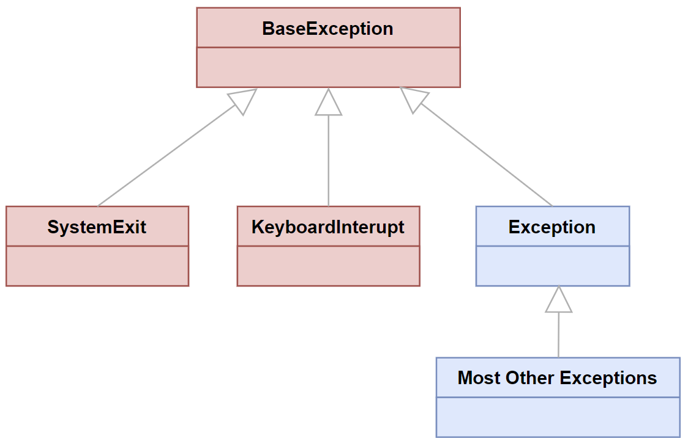
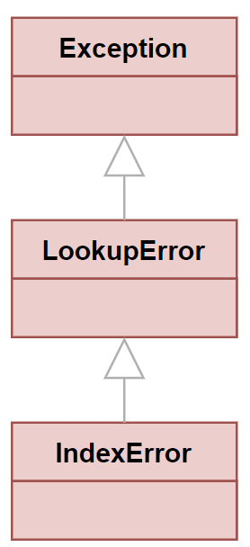

######################
Les exceptions
######################

..  contents:: Contenu de la page
    :depth: 3

..  raw:: html

    

..  admonition:: Sources
    :class: important

    - https://runestone.academy/runestone/static/csud-oci1719-thinkcspy/Exceptions/01_intro_exceptions.html
    - https://realpython.com/python-exceptions/
    - https://realpython.com/python-raise-exception/

Introduction
============

Les exceptions sont un mécanisme des langages de programmation modernes pour
gérer les situations inattendues, à savoir les **erreurs d'exécution**. 

Erreurs de syntaxe et erreurs d'exécution
-----------------------------------------

..  admonition:: Erreurs de syntaxe

    Pour rappel, un code contient une erreur de syntaxe lorsqu'il ne respecte pas
    la grammaire du langage de programmation. Le programme ci-dessous contient
    par exemple une erreur de syntaxe assez subtile.

    ..  activecode:: d0538383-7593-4800-9c92-51c3e605d506

        x = int(input("Entrez un nombre"))

        if False != not x:
            print("???") 
        else:
            print("Bingo")

..  admonition:: Erreurs d'exécution

    Une erreur d'exécution se produit lorsqu'un programme ne contient aucune
    erreur de syntaxe, qu'il est exécuté par Python et que le programme demande
    de faire quelque chose qui pose problème, comme diviser par 0.

    ..  activecode:: f6378ce9-6cdb-420e-b397-9f6b43bbf83a

        Le code suivant produit une erreur de type ``ZeroDivisionError`` puisque
        la fonction f est appelée avec ``y = 0``.

        ~~~~

        def f(x, y):
            return (x ** 2 + y ** 2) / y

        print(f(10, 0))

Qu'est-ce qu'une exception?
===========================

Une exception est le signal témoignant qu'il est survenu  une condition ne
pouvant pas être facilement gérée à l’aide du flux de contrôle normal d’un
programme Python. Les exceptions sont souvent définies comme des «erreurs», mais
ce n'est pas toujours le cas. Toutes les erreurs en Python sont traitées à
l'aide d'exceptions, mais toutes les exceptions ne sont pas nécessairement des
erreurs.

Les exceptions sont des classes
-------------------------------

Les exceptions sont des classes dérivant de la classe de base ``BaseException``.
Vous trouvez une liste plus exhaustive sous :ref:`builtin-exceptions-hierarchy`.

..  
    figure:: https://www.pythontutorial.net/wp-content/uploads/2021/11/python-exceptions.svg

    Diagramme simplifié de la hiérarchie des exceptions. Source :
    https://www.pythontutorial.net/python-oop/python-exceptions/

Intérêt des exceptions
======================

Exemple introductif
-------------------

Le code suivant produit une erreur lorsqu'on appelle la fonction ``min`` sur une
liste vide. Il s'agit d'une exception de la classe ``IndexError``, car la ligne
2 accède au premier élément, malheureusement inexistant:

..  activecode:: error_handling_without_exceptions_example_1.py

    def min(elements):
        current_min = elements[0]

        for i in range(1, len(elements)):
            if elements[i] < current_min:
                current_min = elements[i]
        
        return current_min

    items = []
    print(f"Minimum trouvé: {min(items)}")

Dans les anciens langages de programmation, tel que le C, il n'y avait pas de
mécanisme de gestion d'erreur intégré au programme et il fallait donc programmer
de manière **défensive**, en prévoyant toujours tout ce qui pourrait poser
problème:

..  activecode:: error_handling_without_exceptions_example_2.py

    def min(elements):
    
        if len(elements) == 0:
            return "Error: can't find min of empty list"

        current_min = elements[0]

        for i in range(1, len(elements)):
            if elements[i] < current_min:
                current_min = elements[i]
        
        return current_min

    print(f"Minimum trouvé: {min([])}")

Cette manière de faire est cependant très fastidieuse et problématique, car les
fonctions qui utilisent la fonction ``min`` doivent à leur tour

- Connaître tous les problèmes qui pourraient arriver dans la fonction ``min``
- Gérer tous les problèmes possibles

..  activecode:: error_handling_without_exceptions_example_3.py

    def min(elements):
    
        if len(elements) == 0:
            return "Error: can't find min of empty list"

        current_min = elements[0]

        for i in range(1, len(elements)):
            if elements[i] < current_min:
                current_min = elements[i]
        
        return current_min

    def my_stuff(items):
        result = min(items)

        if isinstance(stuff, str) and "Error" in result:
            return "Error: Il y a eu un problème avec la fonction min ..."

        # suite de la fonction ...

        return result

    def other_stuff(items):

        result = my_stuff(items)

        if isinstance(result, str) and "Error" in result:
            return "Error: blabla"

        return result

    items = []
    result = other_stuff(items)

    ...

..  activecode:: error_handling_with_exceptions_example_1.py

    def min(elements):
    
        if len(elements) == 0:
            raise ValueError("Can't find min in empty list")

        current_min = elements[0]

        for i in range(1, len(elements)):
            if elements[i] < current_min:
                current_min = elements[i]
        
        return current_min

    def my_stuff(items):
        m = min(items)

        ...

        return m

    def other_stuff(items):

        stuff = my_stuff(items)

        ...

        return stuff

    items = []

    try:
        result = other_stuff(items)
    except ValueError as e:
        print(f"Une erreur s'est produite: {str(e)}")

..  reveal:: 0ec74287-abda-4676-94cc-5ad5132cfa19
    :showtitle: Pour aller plus loin ...

    Pour comprendre le rôle d’une exception, il faut se rappeler le fonctionnement
    du **flux de contrôle** normal dans un programme Python. Normalement, Python
    exécute les instructions les unes après les autres. Il y a cependant trois
    constructions de programmation qui vont interrompre cette exécution séquentielle
    : les branchements conditionnels, les boucles et les invocations de fonctions.

    *   Pour les instructions ``if``, un seul des blocs d’instructions est exécuté, puis
        le flux de contrôle passe à la première instruction suivant la structure ``if``.

    *   Pour les boucles, lorsque la fin de la boucle est atteinte, le flux de contrôle
        revient au début de la boucle et un test est utilisé pour déterminer si la
        boucle doit être exécutée à nouveau. Si la boucle est terminée, le contrôle de
        flux passe à la première instruction après la boucle.

    *   Pour les appels de fonction, le flux de contrôle saute à la première
        instruction de la fonction appelée, la fonction est exécutée et le flux de
        contrôle revient à l'instruction suivante après l'appel de la fonction.

    Voyez-vous le motif? Si le flux de contrôle n'est pas purement séquentiel, il
    exécute toujours la première instruction immédiatement après le flux de contrôle
    modifié. C'est pourquoi nous pouvons dire que le flux de contrôle Python est
    séquentiel. Mais il existe des cas où ce flux de contrôle séquentiel ne
    fonctionne pas bien. Voyons pourquoi à l'aide d'un exemple :

    Supposons qu’un programme contienne une logique complexe correctement subdivisée
    en fonctions. Le programme est en cours d'exécution et exécute actuellement la
    fonction ``D``, appelée par la fonction ``C``, appelée par la fonction ``B``,
    appelée par la fonction ``A``, appelée elle-même à partir de la fonction
    principale. Ceci est illustré par l'exemple de code simpliste suivant:

    ..  code-block:: python

        def main()
            A()

        def A():
            B()

        def B():
            C()

        def C():
            D()

        def D():
            # processing

    La fonction ``D`` détermine que le traitement en cours ne fonctionnera pas pour
    une raison quelconque et doit envoyer un message à la fonction principale pour
    que celle-ci puisse essayer quelque chose de différent. Cependant, tout ce que
    la fonction ``D`` peut faire en utilisant un contrôle de flux normal est de
    renvoyer une valeur à la fonction ``C``. La fonction ``D`` renvoie donc une
    valeur spéciale à la fonction ``C`` qui signifie «essayer autre chose». La
    fonction ``C`` doit reconnaître cette valeur, quitter son traitement et renvoyer
    la valeur spéciale à la fonction ``B``. Et ainsi de suite. Il serait très utile
    que la fonction ``D`` puisse communiquer directement avec la fonction principale
    (ou les fonctions ``A`` et ``B``) sans devoir envoyer cette valeur spéciale via
    les fonctions d’appel intermédiaires. C'est exactement le rôle des exceptions.
    Une exception est un message à n’importe quelle fonction actuellement dans la
    **pile d'appel** du programme en cours d’exécution. (La **pile d'appels** permet
    garder la trace des appels de fonctions actifs pendant l'exécution d'un
    programme.)

    En Python, vous créez un message d'exception à l'aide de la commande ``raise``.
    La syntaxe lae plus simple pour une déclencher une exception (on dit **lever**
    une exception) est le mot clé ``raise``, suivi du nom d'une exception. Par exemple:

    ..  code-block::

        raise ExceptionName

    lève une exception de type ``ExceptionName``. Alors, qu'advient-il d'un message
    d'exception après sa création? Le flux de contrôle normal d'un programme Python
    est interrompu et Python commence à rechercher tout code dans sa pile
    d'exécution qui est intéressé par le traitement du message. Il recherche
    toujours à partir de son emplacement actuel au bas de la pile d'exécution, en
    haut de la pile, dans l'ordre dans lequel les fonctions ont été appelées à
    l'origine. Un bloc ``try: ... except:``  est utilisé pour dire «hé, je peux
    gérer ce message». Le premier bloc ``try: except:`` que Python trouve en
    remontant la pile d'appel sera exécuté. S'il aucune bloc ``try: except:`` n'est
    trouvé., le programme “se plante” et affiche sa pile d'exécution sur la console.

    Jetons un coup d’œil à plusieurs exemples de code pour illustrer ce processus.
    Si la fonction ``D`` avait un bloc ``try: except:`` entourant le code qui a
    occasionné une exception, ``MyException``, le flux d'exécution aurait été passé
    à ce bloc ``try: except:`` et la fonction ``D`` traiterait ses propres
    problèmes.

    ..  code-block:: python

        def main()
            A()

        def A():
            B()

        def B():
            C()

        def C():
            D()

        def D():
            try:
                # processing code
                if something_special_happened:
                    raise MyException
            except MyException:
                # execute if the MyException message happened

    Mais peut-être que la fonction ``C`` est mieux placés pour gérer le problème, et
    on pourrait alors mettre le bloc ``try: except:`` dans la fonction ``C``:

    ..  code-block:: python

        def main()
            A()

        def A():
            B()

        def B():
            C()

        def C():
            try:
                D()
            except MyException:
                # execute if the MyException message happened

        def D():
            # processing code
            if something_special_happened:
                raise MyException

    Mais peut-être que, finalement, c'est la fonction principale qui est la mieux
    placés pour gérer le problème, et on pourrait alors mettre le bloc ``try:
    except:`` dans la fonction ``main``:

    ..  code-block:: python

        def main()
            try:
                A()
            except MyException:
                # execute if the MyException message happened

        def A():
            B()

        def B():
            C()

        def C():
            D()

        def D():
            # processing code
            if something_special_happened:
                raise MyException

..  admonition:: Résumé
    :class: info

    En résumé, une exception est un message qui indique que quelque chose de
    spécial s'est produit et que le flux de contrôle normal doit être abandonné.
    Lorsqu'une exception est déclenchée, Python recherche dans sa pile
    d'exécution un bloc ``try: except:`` qui peut traiter la condition de
    manière appropriée. Le premier bloc ``try: except:`` qui prétend savoir
    comment traiter le problème est exécuté, puis le flux de contrôle revient à
    son exécution séquentielle normale. Si aucun bloc ``try: except:`` approprié
    n’est trouvé, le programme “se plante” et affiche sa pile d’exécution sur la
    console (*traceback* en anglais).

    Comme dernier exemple, voici un programme qui se plante car aucun bloc
    ``try: except:`` valide  n’a été trouvé pour traiter le message
    ``MyException``. Notez que le bloc ``try: except:`` dans la fonction
    principale sait seulement comment traiter les exceptions ``ZeroDivisonError``
    mais pas les exceptions ``MyException``.

Exemple 2
---------

..  note:: 

    Source : https://www.pythontutorial.net/python-oop/python-exceptions/

Voici un autre exemple qui montre l'utilisation des exceptions

..  activecode:: error_handling_with_exceptions_example_2.py

    Le code suivant génère une exception de type ``IndexError``

    ~~~~

    colors = ['red', 'green', 'blue']

    print(colors[3])

..  activecode:: error_handling_with_exceptions_example_3.py

    Le code suivant gère l'exception ``IndexError`` avec un bloc ``try ...
    except ...`` et affiche un message d'erreur expliquant la nature de l'erreur
    avec ``print(e)``.

    ..  note:: 

        L'exécution du programme est poursuivie malgré l'erreur, car l'exception
        a été attrapée (gérée) par le bloc ``except IndexError``.

    ~~~~

    colors = ['red', 'green', 'blue']

    try:
        print(colors[3])
    except IndexError as e:
        print(e)

    print('Continue to run')

Exemple 3
---------

On aurait aussi pu gérer l'exception ``IndexError`` dans l'exemple précédent en
gérant l'exception ``LookupError`` au lieu de ``IndexError``, car l'exception
``IndexError`` dérive de ``LookupError``:

    L'erreur ``IndexError`` dérive de l'exception ``LookupError``, qui dérive à
    son tour de la classe ``Exception``. Source :
    https://www.pythontutorial.net/python-oop/python-exceptions/

..  raw:: html

    <iframe 
        src="https://webtigerpython.ethz.ch/?code=NobwRAdghgtgpmAXGGUCWEB0AHAnmAGjABMoAXKJMAYwHsAbWgJwGcACAXjeAHIm5iPAmx4BzfnAhCRAI3oBXODwC6AHQjqyTXInVt9bbEwxkAFHUatgAZmUBKdXAAe1ONjJsAMrVoBredgAokxMzGxQ7HC6EAaGxhBmcJgA-snU9BEsqcI8ALTScA4aEEYmpjwAwrQJGIpsZLRsTPJSRWAAvspAA"
        height="400px"
        width="200%"
        style="max-width: 1172px;"
    ></iframe>

..  note:: 

    De manière générale, on privilégie une gestion des exceptions la plus
    spécifique possible. Il est donc préférable ici de gérer l'exception
    ``IndexError`` plutôt que ``LookupError``.

..  note::

    Le programme précédent s'exécuterait de la même manière si on avait remplacé
    ``LookupError`` par ``Exception``, puisque ``LookupError`` dérive de
    ``Exception``.

.. _builtin-exceptions-hierarchy:

Exceptions standard
====================

La plupart des **exceptions** standard intégrées à Python sont répertoriées
ci-dessous. Ils sont organisés en groupes liés en fonction du type de problèmes
qu’ils traitent.

=====================  ================================================
Language Exceptions    Description
=====================  ================================================
``StandardError``      Classe de base pour toutes les exceptions intégrées (built-in) excepté 
                       ``StopIteration`` et ``SystemExit``.
``ImportError``	       Levée lorsqu'une instruction ``import`` ne échoue.
``SyntaxError``        Levée lorsqu'il y a une erreur de syntaxe Python.
``IndentationError``   Levée lorsqu'il y a des erreurs d'indentation.
``NameError``          Levée lorsqu'un identifiant n'est pas trouvé dans l'espace de noms local ou global.
``UnboundLocalError``  Levée lorsqu'un instruction tente d'accéder à une variable locale dans une fonction ou méthode et qu'aucune valeur ne lui a encore été assignée.
``TypeError``          Levée lorsque le programme tente d'effectuer une opération ou d'appeler une fonction invalie pour le type de données en question.
``LookupError``        Classe de base pour toutes les erreurs de type *lookup*.
``IndexError``         Levée lorsqu'un indice n'est pas trouvé dans une séquence.
``KeyError``           Levée lorsque la clé en question n'est pas trouvée dans le dictionnaire.
``ValueError``         Levée lorsque le paramètre passé à une fonction est d'un type correct mais que la valeur est invalide.
                       
``RuntimeError``	   Levée lorsque le programme produit une erreur qui ne tombe dans aucune autre catégorie.
``MemoryError``        Levée lorsqu'une opération occassionne un dépassement de mémoire (plus de mémoire disponible).
``RecursionError``     Levée lorsque la profondeur maximale de la récursion est dépassée.
``SystemError``        Levée lorsque l'interpréteur se prduit une erreur interne. Lorsque cette erreur survient, l'interpréteur Python ne quitte pas.
=====================  ================================================

======================  ================================================
Exceptions Math         Description
======================  ================================================
``ArithmeticError``	    Classe de base pour toutes les erreurs qui surviennent lors de calculs numériques. On sait qu'une erreur s'est produit mais on ne sait pas laquelle précisément.
``OverflowError``       Levée lorsqu'un calcul produit un nombre qui excède la capacité d'un type numérique.
``FloatingPointError``  levée lorsq'un calcul en virgule flottante échoue.
``ZeroDivisonError``    levée lorsqu'une division ou une opération de modulo par zéro est effectuée.
======================  ================================================

=====================  ================================================
Exceptions d'I/O       Description
=====================  ================================================
``FileNotFoundError``  Levée lorsque le programme tente d'ouvrir un fichier ou un dossier qui n'existe pas.
``IOError``            Levée lorsqu'une opération d'entrée/sortie échoue, telle que l'instruction ``print`` ou un appel à la fonction ``open()`` pour essayer d'ouvrir un fichier qui n'existe pas. Également levée pour des erreurs liées au système d'exploitation.
``PermissionError``    Levée lorsque le programme tente d'effectuer une opération mais ne dispose pas des droits nécessaires.
``EOFError``           Levée lorsqu'il n'y a plus de données à lire sur l'entrée standard pour la fonction ``input`` / ``raw_input()`` et que la fin du fichier est atteinte.
                       
``KeyboardInterrupt``  Levée lorsque l'utilisation interrompt l'exécution du programme avec les touches ``Ctrl+c``.
=====================  ================================================

=======================  ================================================
Autres Exceptions        Description
=======================  ================================================
``Exception``            Classe de base pour toutes les exceptions. Ceci intercepte la plupart des exceptions.
``StopIteration``        Levée lorsque la méthode ``next()`` d'un intérateur ne pointe pas vers un objet.
``AssertionError``       Levée lorsqu'une instruction ``assert`` échoue.
``SystemExit``           Levée lorsque l'interpréteur Python est quitté avec ``sys.exit()``. Si cette exception n'est pas gérée dans le code, elle cause la fermeture de l'interpréteur.
``OSError``              Levée pour les erreurs liées au système d'exploitation.
``EnvironmentError``     Classe de base pour toutes les exceptions qui surviennent en-dehors de l'environnement Python.
``AttributeError``       Levée en cas d'échec d'une référence d'attribut (variable d'instance ou de classe) ou d'une opération d'assignation.
``NotImplementedError``  Levée lorsqu'une méthode abstraite qui devrait être redéfinie dans une classe fille n'est en réalité pas redéfinie.
=======================  ================================================

Toutes les exceptions sont des objets. Les classes qui définissent les objets
sont organisées dans une hiérarchie montrée ci-dessous. Ceci est important car
la classe parente d'un ensemble d'exceptions interceptera tous les messages
correspondant à sa propre classe ou à ses classes filles. Par exemple, une
exception  ``ArithmeticError`` va gérer toutes les exceptions
``FloatingPointError``, ``OverflowError``, et  ``ZeroDivisionError``.

..  code-block:: Python

    BaseException
     ├── BaseExceptionGroup
     ├── GeneratorExit
     ├── KeyboardInterrupt
     ├── SystemExit
     └── Exception
          ├── ArithmeticError
          │    ├── FloatingPointError
          │    ├── OverflowError
          │    └── ZeroDivisionError
          ├── AssertionError
          ├── AttributeError
          ├── BufferError
          ├── EOFError
          ├── ExceptionGroup [BaseExceptionGroup]
          ├── ImportError
          │    └── ModuleNotFoundError
          ├── LookupError
          │    ├── IndexError
          │    └── KeyError
          ├── MemoryError
          ├── NameError
          │    └── UnboundLocalError
          ├── OSError
          │    ├── BlockingIOError
          │    ├── ChildProcessError
          │    ├── ConnectionError
          │    │    ├── BrokenPipeError
          │    │    ├── ConnectionAbortedError
          │    │    ├── ConnectionRefusedError
          │    │    └── ConnectionResetError
          │    ├── FileExistsError
          │    ├── FileNotFoundError
          │    ├── InterruptedError
          │    ├── IsADirectoryError
          │    ├── NotADirectoryError
          │    ├── PermissionError
          │    ├── ProcessLookupError
          │    └── TimeoutError
          ├── ReferenceError
          ├── RuntimeError
          │    ├── NotImplementedError
          │    └── RecursionError
          ├── StopAsyncIteration
          ├── StopIteration
          ├── SyntaxError
          │    └── IndentationError
          │         └── TabError
          ├── SystemError
          ├── TypeError
          ├── ValueError
          │    └── UnicodeError
          │         ├── UnicodeDecodeError
          │         ├── UnicodeEncodeError
          │         └── UnicodeTranslateError
          └── Warning
               ├── BytesWarning
               ├── DeprecationWarning
               ├── EncodingWarning
               ├── FutureWarning
               ├── ImportWarning
               ├── PendingDeprecationWarning
               ├── ResourceWarning
               ├── RuntimeWarning
               ├── SyntaxWarning
               ├── UnicodeWarning
               └── UserWarning

Intercepter plusieurs exceptions avec le même bloc ``except``
=============================================================

Si deux exceptions ``Exception1`` et ``Exception2`` doivent être gérées de la
même manière, on peut raccourcir la structure

::

    try:
        # code qui peut poser problème
    except Exception1:
        # gestion exception
    except Exception2:
        # même gestion exception

en interceptant plusieurs exceptions dans le même bloc ``except`` à l'aide de la
syntaxe

::

    try:
        # code qui peut poser problème
    except (Exception1, Exception2) as e:
        # gestion des deux exceptions 
        ...

Ordre de traitement des exceptions
==================================

Lorsqu'il y a plusieurs blocs ``except``, Python va toujours n'en exécuter qu'un
seul (le premier qui correspond à l'exception produite dans le bloc ``try``) et
continuer à la prochaine instruction après l'instruction ``try ... except``.

..  admonition:: Conséquence : toujours attrapper les exceptions les plus spécifiques en premier

    Une conséquence importante de ce comportement est qu'il faut toujours
    intercepter les exceptions les plus spécifiques en premier.

    ..  list-table:: Interception des exceptions spécifiques d'abord
        :header-rows: 1
        :align: left

        *   -   Faux
            -   Juste

        *   -   Il est faux d'intercepter d'abord ``LookupError`` avant
                ``IndexError``, car ``IndexError`` est plus spécifique (classe
                dérivée) que ``LookupError`` 
                
                ::

                    try:
                        # bloc qui peut poser problème
                    except LookupError:
                        # une erreur de lookup a eu lieu
                    except IndexError:
                        # une erreur d'index a eu lieu

            -   Il faut intercepter ``IndexError`` avant ``LookupError`` 
                
                ::

                    try:
                        # bloc qui peut poser problème
                    except IndexError:
                        # une erreur d'index a eu lieu
                    except LookupError:
                        # une erreur de lookup a eu lieu

Principes d'utilisation des exceptions
======================================

Il y a beaucoup de mauvais exemples d'utilisation *d'exception* sur Internet. Le
but d'une *exception* consiste à modifier le flux de contrôle, pas à intercepter
des erreurs simples. Si votre instruction ``try ... except ...`` se trouve dans
la fonction qui ``raise`` l'exception, vous utilisez probablement les exceptions
de travers.

..  topic :: Principe 1:

    En général, il vaut mieux utiliser le contrôle de flux normal si l'on peut
    prévoir facilement certaines erreurs.

Exemple 1:

+------------------------------------------------------+----------------------------------------------------------+
| **Utilisation exagérée**                             | Lorsque vous pouvez tout aussi bien tester               |
|                                                      | l'absence d'éléments dans la liste avec                  |
+------------------------------------------------------+----------------------------------------------------------+
| ..  code-block:: Python                              | ..  code-block:: Python                                  |
|                                                      |                                                          |
|     try:                                             |     if len(a_list) > 0:                                  |
|         average = sum(a_list) / len(a_list)          |         average = sum(a_list) / len(a_list)              |
|     except ZeroDivisionError:                        |     else:                                                |
|         average = 0                                  |         average = 0                                      |
+------------------------------------------------------+----------------------------------------------------------+

Exemple 2:

..
  +------------------------------------------+-------------------------------------------+
  | **Avec exception**:                      | Ici, l'utilisation d'une exception se     |
  |                                          | justifie déjà davantage                   |
  +------------------------------------------+-------------------------------------------+
  | .. code-block:: Python                   | .. code-block:: Python                    |
  |                                          |                                           |
  |   try:                                   |   if 0 <= index < len(my_list):           |
  |     value = my_list[index]               |     value = my_list[index]                |
  |   except IndexError:                     |   else:                                   |
  |     value = -1                           |     value = -1                            |
  +------------------------------------------+-------------------------------------------+
  Exemple 3:

..  note::

    Dans l'exemple ci-dessous, l'utilisation des exceptions est plutôt exagérée,
    car il est très facile de prévenir l'erreur avec un petit test. Le code de
    droite est plus clair que celui de gauche.

+------------------------------------------+-------------------------------------------------------+
| **Avec exception**                       | Il est facile de tester si un dictionnaire            |
|                                          | contient une clé donnée                               | 
+------------------------------------------+-------------------------------------------------------+
| ..  code-block:: Python                  | ..  code-block:: python                               |
|                                          |                                                       |
|     try:                                 |     if key in my_dictionary.keys():                   |
|         value = my_dictionary[key]       |         value = my_dictionary[key]                    |
|     except KeyError:                     |     else:                                             |
|         value = -1                       |         value = -1                                    |
|                                          |                                                       |
|                                          | ou, encore mieux, en utilisant la méthode             |
|                                          | ``dict.get``,                                         |
|                                          |                                                       |
|                                          | ..  code-block:: python                               |
|                                          |                                                       |
|                                          |     value = my_dictionary.get(key, -1)                |
+------------------------------------------+-------------------------------------------------------+

..  topic :: Principe 2:

    Si vous appelez une fonction qui génère potentiellement des exceptions et que vous pouvez faire
    quelque chose d'approprié pour traiter l'exception,  entourez le code
    qui contient l'appel de fonction avec un bloc ``try: except:``.

**Exemple**: supposons que vous ayez une fonction qui lit un fichier pour
initialiser l’état d'une application quand il démarre. Vous devriez attraper les
erreurs liées à la lecture du fichier et définir l'état de l'application aux
valeurs par défaut si elles ne peuvent pas être lues à partir du fichier.

..  code-block:: Python

    try:
        config = load_config('config.txt')
    except OSError:
        config = default_config()

..  topic:: Principe 3:

    Si vous appelez une fonction qui génère potentiellement des exceptions et
    que vous ne pouvez rien faire d'intelligent avec l'exception levée, alors il
    vaut mieux ne rien faire et la laisser remonter plus loin pour qu'elle
    puisse éventuellement être gérée en amont par une autre fonction.

Syntaxe des exceptions
======================

Il existe de nombreuses variantes pour intercepter les exceptions. Voici un bref
résumé, mais il faut savoir qu'il existe encore d'autres possibilités
tout-à-fait valides de le faire.

Attraper toutes les exceptions
------------------------------

Attrape toutes les exceptions, quel que soit leur type. Cela empêchera votre
programme de planter, mais ce type de gestion des exceptions est rarement
recommandé, car vous ne pouvez rien faire de significatif pour traiter l'erreur
produite de manière intelligente.

..  code-block:: Python

    try:
        # Your normal code goes here.
        # Your code should include function calls which might raise exceptions.
    except:
        # If any exception was raised, then execute this code block.

Attraper une exception spécifique
---------------------------------

C'est peut-être la syntaxe la plus souvent utilisée. Il attrape une condition
spécifique et tente de gérer l'erreur de manière intelligente et pertinente.

.. code-block:: Python

    try:
        # Your normal code goes here.
        # Your code should include function calls which might raise exceptions.
    except ExceptionName:
        # If ExceptionName was raised, then execute this block.

Attraper plusieurs exceptions spécifiques
-----------------------------------------

.. code-block:: Python

    try:
        # Your normal code goes here.
        # Your code should include function calls which might raise exceptions.
    except Exception_one:
        # If Exception_one was raised, then execute this block.
    except Exception_two:
        # If Exception_two was raised, then execute this block.
    else:
        # If there was no exception then execute this block.

Nettoyage après les exceptions
------------------------------

Si vous avez du code que vous voulez exécuter même si des exceptions se
produisent, vous peut inclure un bloc de code ``finally``:

.. code-block:: Python

    try:
        # Your normal code goes here.
        # Your code might include function calls which might raise exceptions.
        # If an exception is raised, some of these statements might not be executed.
    finally:
        # This block of code will always execute, even if there are exceptions raised

..
    Un exemple d'entrée / sortie de fichier
    ---------------------------------------

    Une situation nécessitant une gestion d'exception systématique est la lecure ou
    l'écriture dans un fichier. Voici un exemple typique de traitement de fichier.
    Notez que le bloc externe ``try: except:`` s’occupe d’un fichier manquant ou
    le fait que le fichier existant ne puisse pas être ouvert en écriture. Le bloc
    ``try: except:`` intérieur protège contre les erreurs de sortie, telles que
    l'écriture sur un périphérique plein. Le code ``finally`` garantit que le
    fichier sera fermé correctement même en cas d'erreur lors de l'écriture.

    .. code-block:: Python

        try:
            f = open("my_file.txt", "w")
            try:
                f.write("Writing some data to the file")
            finally:
                f.close()
        except IOError:
            print "Error: my_file.txt does not exist or it can't be opened for output."

.. index:: exceptions syntax

Glossaire
=========

..  glossary::

    Exception
        Une erreur qui se produit au moment de l'exécution.

    Gérer une exception
        Pour empêcher une exception de terminer un programme en encapsulant le
        bloc de code dans une construction ``try`` / ``except``.

    Lever une exception
        Pour provoquer une exception en utilisant l'instruction ``raise``.