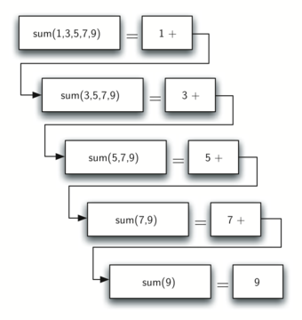
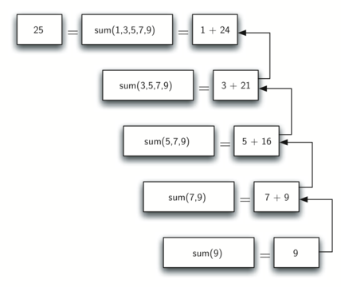
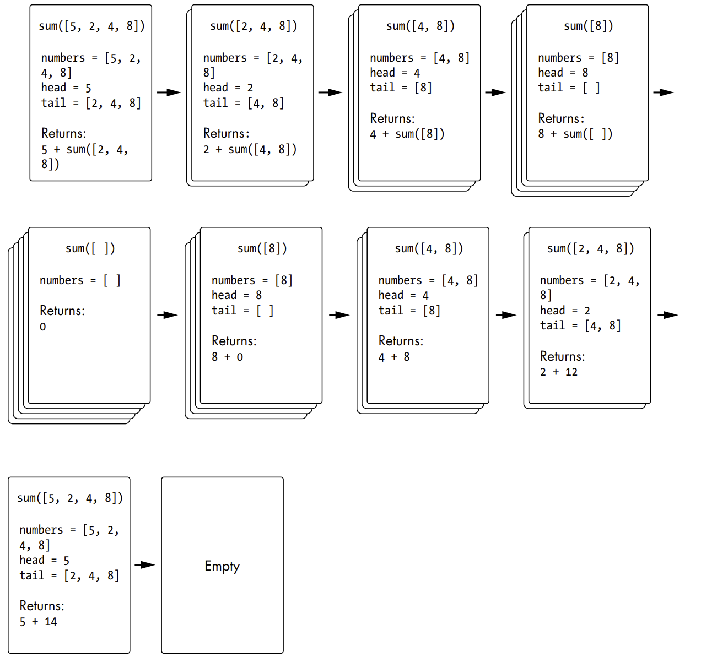
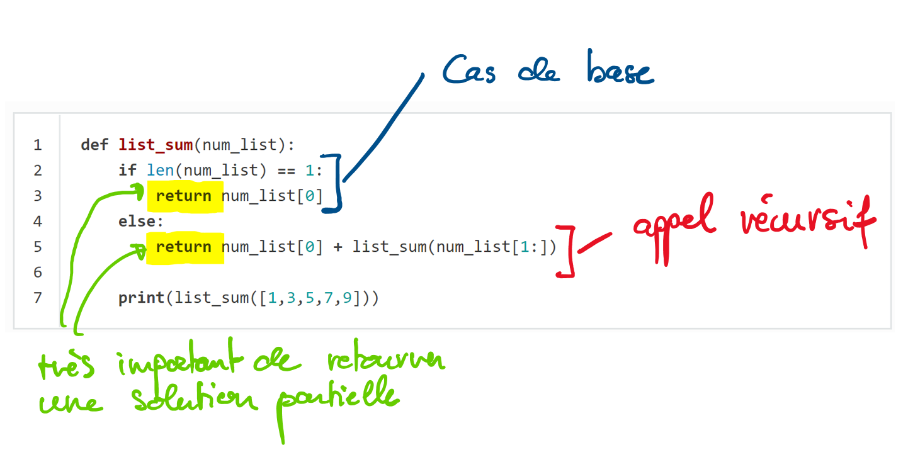

.. _algorithmes-recursifs.rst:

Utiliser des fonctions récursives à la place de boucles
#######################################################

..  contents:: Contenu de la page
    :depth: 3

..  admonition:: Culture informatique

    Il existe des langages qui ne possèdent ni le concept de variables mutables,
    ni le concept de boucles. Ces langages sont basés sur le
    :math:`\lambda`-calcul auquel l'informaticien Alonzo Church a énormément
    contribué à développer initialement. De tels langages sont appelés
    **langages fonctionnels** et donnent lieu au paradigme de **programmation
    fonctionnelle**. On peut se demander comment de tels langages peuvent servir
    à faire quoi que ce soit d'utile, mais ils permettent de faire des choses
    difficilement réalisables autrement.

    Le Scheme ou le Haskell sont des langages fonctionnels. Le Scheme a
    longtemps été utilisé au MIT pour introduire les étudiants aux concepts de
    programmation.

    Dans de tels langages, dépourvus de boucles ``for`` ou ``while``, on utilise
    des fonctions récursives pour répéter des tâches.

Calculer la somme d'une liste de nombres sans boucle
====================================================

Commençons par un problème simple que nous savons déjà résoudre sans utiliser la
récursivité :  calculer la somme d'une liste de nombres tels que :
``[1,3,5,7,9]``. Le code ci-dessous présente une fonction itérative qui fait la
somme des nombres présents dans la liste. La fonction utilise une variable
d'accumulateur (``total``) pour calculer un total courant de tous les nombres
dans la liste en commençant par 0 et en ajoutant chaque nombre dans la liste.

..  codelens:: iter_sum_codelens_py

    def sum_iter(numbers):
        total = 0
        for n in numbers:
            total = total + n
        return total

    print(sum_iter([1,3,5,7,9]))

Imaginons qu'il n'y ait pas de boucles ``for`` ou ``while`` dans le langage
Python. Comment pourrait-on calculer la somme d'une liste de nombres ? Un
mathématicien commencerait  par se rappeler que l'addition est une fonction qui
est définie pour deux paramètres, une paire de nombres. Pour réduire le problème
de la somme d'une liste à l'addition de paires de nombres, on pourrait réécrire
la liste comme une expression entièrement parenthésée. Une telle expression
ressemble à ceci :

..  math::

    ((((1+3)+5)+7)+9)

On peut aussi parenthéser l'expression dans l'autre sens,

..  math::

    (1+(3+(5+(7+9))))

Notons que l'addition au sein de la paire de parenthèse la plus emboîtée, (7+9),
constitue un problème que nous pouvons résoudre sans boucle ni construction
spéciale. En fait, on peut utiliser la séquence suivante de simplifications pour
calculer une somme finale.

..  math::

    \mathrm{total}=(1+(3+(3+(5+(7+(7+9))))) \\
    \mathrm{total}=(1+(3+(3+(5+16))) \\
    \mathrm{total}=(1+(3+21)) \\
    \mathrm{total}=(1+24) \\
    \mathrm{total}=25

Comment prendre cette idée et la transformer en un programme Python ? Tout
d'abord, reformulons le problème de la somme en termes de listes Python. Nous
pourrions dire que la somme de la liste ``numbers`` est la somme du premier
élément de la liste (``numbers[0]``), et la somme des nombres dans le reste de
la liste (``numbers[1:]``). Sous forme fonctionnelle, cela donne :

..  math::

    \mathrm{list\_sum}(\mathrm{num\_list})=first(\mathrm{num\_list})+\mathrm{list\_sum}(rest(\mathrm{num\_list}))

Dans cette équation :math:`first(\mathrm{num\_list})` retourne le premier
élément de la liste et :math:`rest(\mathrm{num\_list})` retourne une liste de
tout sauf le premier élément. Cela s'exprime facilement en Python de la manière
suivante :

..  activecode:: b2f8b13b-c077-4731-b3bd-bf26192239a0

    def rec_sum(numbers):
        if numbers == []:
            return 0
        else:
            head = numbers[0]
            tail = numbers[1:]
            return head + rec_sum(tail)

    numbers = [1,3,5,7,9]
    print(rec_sum(numbers))

..  codelens:: rec_sum_codelens_py

    def rec_sum(numbers):
        if numbers == []:
            return 0
        else:
            head = numbers[0]
            tail = numbers[1:]
            return head + rec_sum(tail)

    numbers = [1,3,5,7,9]
    print(rec_sum(numbers))

Examinons les idées essentielles de ce code :

#.  Premièrement, à la ligne 2, nous vérifions si la liste ne contient qu'un
    seul élément. Ce contrôle est crucial et constitue notre garantie de sortie
    de la fonction. La somme d'une liste de longueur 1 est triviale.

#.  Deuxièmement, à la ligne 5, notre fonction s'appelle elle-même ! C'est la
    raison pour laquelle nous appelons l'algorithme ``rec_sum`` récursif. Une
    fonction récursive est une fonction qui s'appelle elle-même.

On peut comprendre le déroulement de ce programme comme suit (cliquez sur **Next
Step** pour voir la manière dont l'expression est évaluée de manière récursive)

..  showeval:: rec_sum_list_showeval
    :trace_mode: true

    rec_sum([1,3,5,7,9])

    ~~~~

    {{rec_sum([1,3,5,7,9])}}{{1 + (rec_sum([3,5,7,9]))}}
    1 + ({{rec_sum([3,5,7,9])}}{{3 + (rec_sum([5,7,9]))}})
    1 + (3 + ({{rec_sum([5,7,9])}}{{5 + rec_sum([7,9])}}))
    1 + (3 + (5 + {{rec_sum([7,9])}}{{7 + rec_sum([9])}}))
    1 + (3 + (5 + (7 + {{rec_sum([9])}}{{9}})))
    1 + (3 + (5 + {{(7 + 9)}}{{16}}))
    1 + (3 + {{(5 + 16)}}{{21}})
    1 + {{(3 + 21)}}{{24}}
    {{1 + 24}}{{25}}

La figure :ref:`fig-rec-sum-list` montre la série d'appels récursifs qui sont
nécessaires pour additionner la liste ``[1,3,5,5,7,9]``. 

Il faut considérer cette série d'appels comme une série de simplifications. À
chaque  appel récursif, on réduit le problème à un problème plus petit, jusqu'à
ce qu'on arrive à un point où le problème ne peut plus être réduit.

.. _fig-rec-sum-list:

    Visualisation des appels récursifs nécessaires à additionner les éléments de
    la liste

Lorsqu'on parvient au point où le problème ne peut plus être réduit, on commence
à combiner les solutions de chacun des petits problèmes jusqu'à ce que le
problème initial soit résolu. La figure :ref:`fig-sumlistOut-label` montre les
ajouts effectués au fur et à mesure que la somme de liste revient en arrière
dans la série d'appels. Lorsque la somme de liste revient du problème le plus
haut, nous avons la solution à l'ensemble du problème.

.. _fig-sumlistOut-label:

    Combinaison des solutions partielles pour réaliser la somme des éléments de
    la liste

Autre visualisation statique de la somme récursive
--------------------------------------------------

L'illustration suivante montre comment faire la somme récursive de la liste
``numbers = [5, 2, 4, 8]``. Les cartes représentent les contextes d'exécution
des différents appels de la fonction récursive (avec les valeurs des variables
locales).

    Visualisation de la somme récursive de la liste ``numbers = [5, 2, 4, 8]``
    avec des piles de cartes qui indiquent ce qui est calculé à chaque étape.
    Source: The Recursive Book of Recursion, chapitre 3, page 48
    (https://eduetatfr.sharepoint.com/:b:/t/CSUD-GT-BrancheInformatiqueBureautique/EeVgaIX6ibpAsdEJyLYa1bwBQVx7PlQyw60XMoYFvikMIg?e=Tfo45d).

Les trois principes de la récursion
===================================

Comme les robots d'Asimov, tous les algorithmes récursifs doivent obéir à trois
lois importantes :

#.  Un algorithme récursif doit avoir un cas de base.

#.  Un algorithme récursif doit changer son état et se rapprocher du cas de base.

#.  Un algorithme récursif doit s'appeler lui-même, récursivement.

Examinons chacun de ces principes plus en détail et voyons comment ils ont été
utilisés dans la fonction ``rec_sum``. 

    Illustration des principes des algorithmes récursifs

#.  Premièrement, le cas de base est la condition qui permet à la récursion de
    s'interrompre. Un cas de base est généralement un problème suffisamment
    petit pour être résolu directement. Dans l'algorithme de la somme de liste,
    le cas de base consiste à additionner les éléments d'une liste ne comprenant
    qu'un seul élément.

#.  Pour obéir au deuxième principe, il faut effectuer un changement d'état qui
    rapproche l'algorithme du cas de base. Un changement d'état signifie que
    certaines données utilisées par l'algorithme sont modifiées. Habituellement,
    les données qui représentent notre problème deviennent plus petites. En
    l'occurrence, notre structure de données principale est une liste et il faut
    donc concentrer les  efforts de changement d'état sur cette liste. Étant
    donné que le cas de base est une liste de longueur 1, une progression
    naturelle vers le cas de base consiste à raccourcir la liste. C'est
    exactement ce qui se passe à la ligne 5 du code, lorsqu'on appelle
    ``rec_sum`` avec une liste plus courte.

#.  Le troisième principe dit  que l'algorithme doit s'appeler lui-même. C'est
    la définition  même de la récursivité. La récursivité est un concept
    déroutant pour de nombreux programmeurs débutants. En tant que programmeur
    débutant, vous avez appris que les fonctions sont bonnes parce que vous
    pouvez prendre un gros problème et le diviser en petits problèmes. Les
    petits problèmes peuvent être résolus en écrivant une fonction pour résoudre
    chaque problème. Lorsque nous parlons de récursivité, il se peut que nous
    ayons l'impression de tourner en rond. Nous avons un problème à résoudre
    avec une fonction, mais cette fonction résout le problème en s'appelant
    elle-même ! Mais la logique n'est pas circulaire du tout; la logique de la
    récursion est une expression élégante de la résolution d'un problème en le
    décomposant en problèmes plus petits et plus faciles.

Dans la suite de ce chapitre, nous allons examiner d'autres exemples de
récursivité. Dans chaque cas, on se concentrera sur la recherche d'une solution
en utilisant les trois lois de la récursivité.

