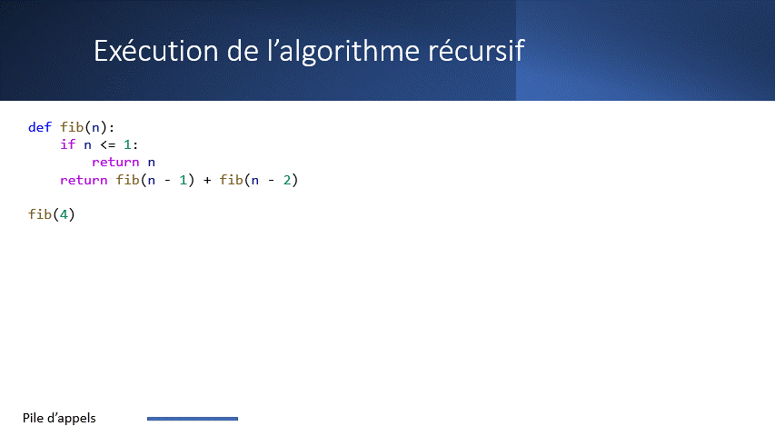
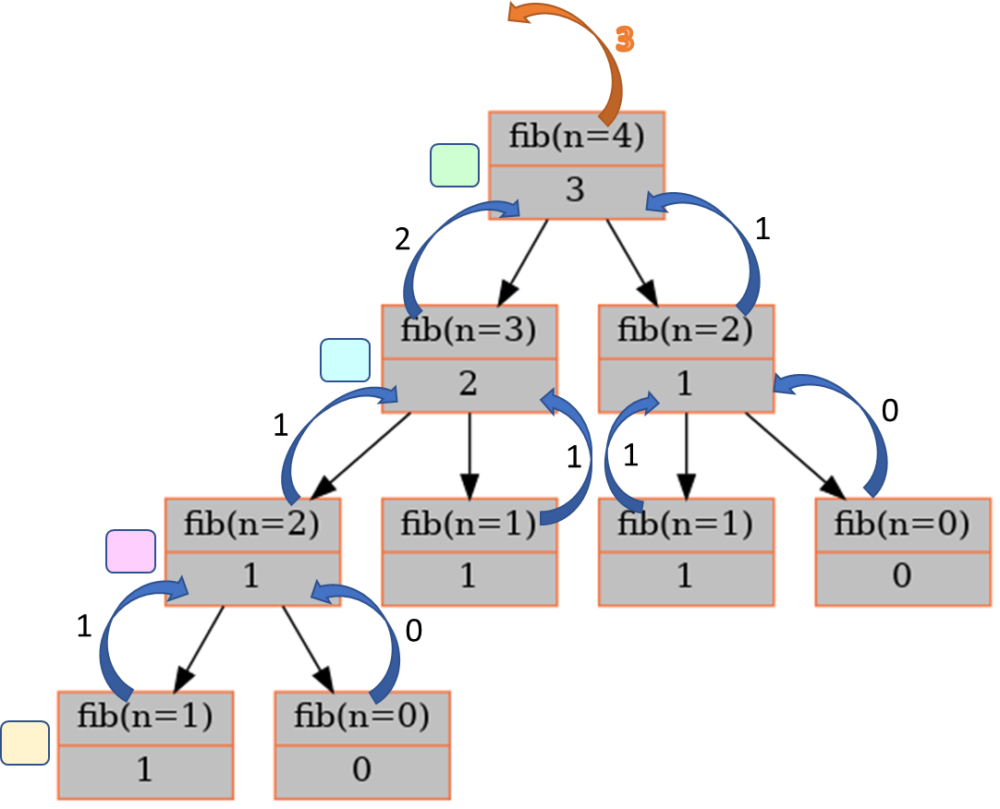

.. _arbre-appels-recursifs.rst:

Arbre des appels récursifs
##########################

..  contents:: Contenu de la page
    :depth: 3

Dans la section :ref:`prog-recursive-pile-appels`, nous avons rappelé que lors
de chaque appel de fonction, Python stocke les variables locales liées à cette
fonction sur la **pile d'appels** (*call stack* en anglais). 

La pile d'appels est une structure dynamique dont la hauteur varie au cours de
l'exécution de la fonction récursive selon les règles suivantes:

- On empile au sommet de la pile un cadre d'exécution (*stack frame*) lors de
  chaque appel
- On dépile le cadre d'exécution se trouvant au sommet de la pile à chaque fois
  que la fonctionen cours d'exécution se termine (``return`` explicite ou
  implicite).

Le problème est qu'une fois le cadre d'exécution dépilé, il est supprimé et on
en perd la trace. Pour comprendre le processus de récursion, on peut dessiner un
arbre, appelé **arbre des appels récursifs**, permettant de capturer
l'historique du comportement de la pile d'appels.

Les règles sont les suivantes :

- Chaque noeud de l'arbre des appels récursifs correspond à un appel de fonction
  au cours de la récursion
- La racine de l'arbre correspond au premier appel de la fonction récursive, à
  savoir le cadre d'exécution se trouvant tout en bas de la pile.
- À chaque fois qu'on empile un cadre d'exécution sur la pile, on rajoute un
  noeud fils au noeud correspondant à l'appel qui effectue l'appel récursif
- À chaque fois qu'on dépile de la pile d'appels (un appel récursif se termine),
  on remonte d'un niveau dans l'arbre des appels récursifs.

Évolution de la pile d'appels
=============================

Exécutez le programme suivant pas à pas avec le débogueur (et observer
l'évolution de la pile d'appels dans le panneau ``DEBUGGER``) pour constater que
la pile d'appels augmente et diminue plusieurs fois de suite durant l'exécution
de la fonction récursive ``fib``.

..  activecode:: e1d5b35d-d4b3-4990-ab31-a8786cf16279
    :language: webtp
    :interpreterargs: debug_mode=true&load_python=true

    ..  note:: 

        Le code ci-dessous n'est pas du tout optimal pour générer la suite de
        Fibonacci, mais le but est surtout d'illustrer l'évolution de la pile
        d'appels et de faire le lien avec l'arbre des appels récursifs.

    ~~~~

    def fib(n: int) -> int:
        if n <= 1: 
            return n
        else:
            n1 = fib(n - 1)
            n2 = fib(n - 2)
            return n1 + n2

    fib(n=4)

Arbre des appels
================

Voici l'arbre des appels récursifs pour l'exécution de la fonction ``fib(n=4)``
qui calcule le terme de rang :math:`n=4` de la suite de Fibonacci. L'arbre des
appels récursifs permet en fait de retracer l'évolution de la pile d'appels. 

..  
    raw:: html

    <iframe
    src="https://onedrive.live.com/edit.aspx?resid=D617C342AC226A99!346559"
    width="100%" height="400px"></iframe>

    Construction de l'arbre des appels récursifs pour encoder l'évolution de la
    pile d'appels.

..  note::

    L'arbre des appels récursifs **n'est pas une structure de données** stockée
    dans la mémoire de travail de l'ordinateur, mais une **abstraction**
    permettant de comprendre le fonctionement de la récursion en retraçant
    l'évolution de la pile d'appels au cours de la récursion.

    Arbre des appels récursifs pour l'appel ``fib(n=4)``

Récursion et recherche en profondeur
=====================================

Il y a un lien étroit entre récursion et recherche en profondeur (Depth-First
Search = DFS). En effet, la construction de l'arbre des appels récursifs suit la
logique du parcours en profondeur d'un arbre.

Nous utiliserons cette propriété de la récursion pour développer notre solveur
de contraintes, et mettre en place une stratégie de **recherche exhaustive** de
solutions aux problèmes des satisfaction de containtes.

..  note:: 

    On peut toujours se passer de la récursion en gérant soi-même une pile sur
    laquelle on stocke les noeuds de l'arbre de recherche, mais c'est souvent
    plus simple avec la récursion.

