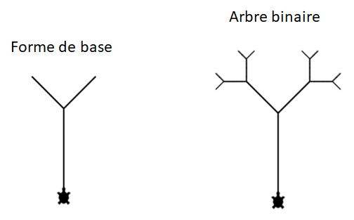
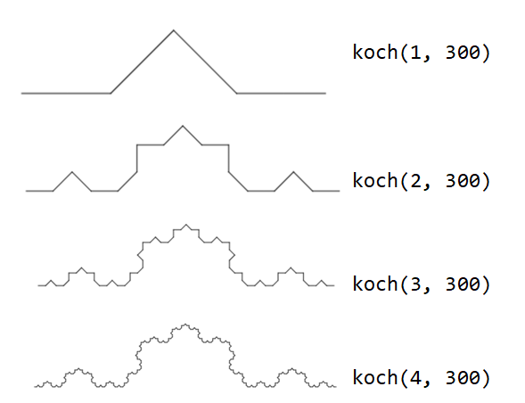
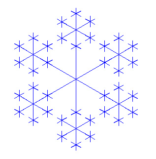
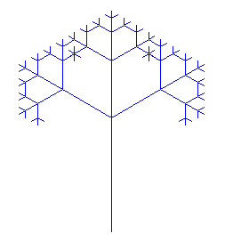
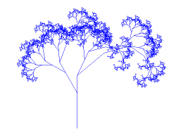

.. _dessins-recursifs.rst:

Dessins récursifs
#################

..  contents:: Contenu de la page
    :depth: 3

La récursion permet de réaliser des dessins assez spectaculaires et qui seraient
assez difficiles à réaliser autrement.

Exemple 1 : dessiner des escaliers
==================================

Pour dessiner un escalier avec la tortue, on peut évidemment procéder en
utilisant une boucle ``for`` pour implémenter la répétition.

..
    ..  activecode:: c04a8a55-6fd8-4bd8-b9ad-811bbc9d245f

        import turtle
        wn = turtle.Screen()
        t = turtle.Turtle()

        def step(size):
            t.forward(size)
            t.right(90)
            t.forward(size)
            t.left(90)

        def stairs(n, size):
            for _ in range(n):
                step(size)

        t.left(90)
        # instantané : speed=0 / speed=1..10 (vitesse animation)
        t.speed(0)
        stairs(4, 30)

..  activecode:: stairs_iter.py
    :language: webtj
    
    from gturtle import *
    makeTurtle()

    def step(size):
        fd(size)
        rt(90)
        fd(size)
        lt(90)

    def stairs(n, size):
        for _ in range(n):
            step(size)
            
    hideTurtle()
    setPos(0, -100)
    stairs(4, 30)

On peut aussi se passer de la boucle ``for`` et implémenter la répétition en
transformant la fonction ``stairs`` en fonction récursive.

..  activecode:: stairs_rec.py
    :language: webtj
    
    from gturtle import *
    makeTurtle()

    def step(size):
        forward(size)
        right(90)
        forward(size)
        left(90)

    def stairs(n, size):
        if n > 0:
            step(size)
            stairs(n-1, size)

    speed(10)
    setPos(0, -100)
    stairs(4, 30)    
            

Exemple 2 : dessiner une arbre binaire
======================================

Dessiner un arbre binaire peut se ramener à dessiner une figure fondamentale
très simple:

    Dessin récursif d'un arbre binaire

Voici le code permettant de dessiner un arbre binaire. 

* Étudiez le fonctionnement du code en utilisant la version Desktop de
  TigerJython et en activant le débogueur.

* Modifiez le code pour rajouter 2 niveaux récursifs

  ..  reveal:: f3b8d9ae-55f4-460a-af75-bd8760508fdf
      :showtitle: Solution

      Il suffit de modifier la valeur du paramètre ``n`` lors de l'appel pour
      rajouter des niveaux récursifs.

..  activecode:: turtle-binary-tree-rec.py
    :language: webtj

    from gturtle import *

    def tree(n, size):
        if n <= 0:
            return
        
        forward(size)
        left(45)
        tree(n - 1, size / 2)
        right(90)
        tree(n - 1, size / 2)
        left(45)
        back(size)

    makeTurtle()
    speed(500)
    setY(-100)
    tree(4, 128)

Exemple 3 : dessiner des alvéoles
=================================

Étudiez le fonctionnement du code ci-dessous. Pour bien comprendre son
fonctionnement, faites varier le paramètre ``n`` de 1 à 12. Pour les grandes
valeurs de ``n``, n'hésitez pas à accélérer le dessin avec
``setSpeed(vitesse)``.

..  activecode:: honeycomb.py
    :language: webtj

    from gturtle import *

    def honeycomb(n, size):
        if n == 0:
            return
        forward(size)
        left(60)
        honeycomb(n - 1, size)
        right(120)
        honeycomb(n - 1, size)
        left(60)
        back(size)

    makeTurtle()
    #hideTurtle()
    speed(300)
    honeycomb(n=12, size=20)

Exemple 4 : courbe de Koch
==========================

La courbe de Koch est une courbe fractale très célèbre qui est beaucoup plus
facile à dessiner si l'on utilise la récursion.

    Courbe de Koch pour 1, 2, 3 et 4 niveaux d'appels récursifs.

..  admonition:: Fonctionnement du code

    Pour comprendre le fonctionnement du code, augmentez progressivement le
    paramètre ``n`` indiquant la profondeur d'appels récursifs.

..  activecode:: koch_curve.py
    :language: webtj

    from gturtle import *

    def koch(n, size):
        if n == 0:
            forward(size)
            return

        koch(n - 1, size / 3)
        left(45)
        koch(n - 1, size / 3)
        right(90)
        koch(n - 1, size / 3)
        left(45)
        koch(n - 1, size / 3)

    makeTurtle()
    hideTurtle()
    setPos(-250, 0)
    right(90)
    koch(4, 300)

Exemple 5 : Arbre fractal
=========================

De nombreuses images générées par ordinateur sont des fractales, notamment les
végétaux. Voici un exemple pour générer un abre récursivement.

..  activecode:: fractal_tree.py
    :language: webtj

    # TreeFractal.py

    from gturtle import *

    def tree(size):
        if size < 5:
            fd(size)
            bk(size)
            return
          
        fd(size / 3)
        lt(30)
        tree(size * 2 / 3)
        rt(30)
        fd(size / 6)
        rt(25)
        tree(size / 2)
        lt(25)
        fd(size / 3)
        rt(25)
        tree(size / 2)
        lt(25)
        fd(size / 6)
        bk(size)

    makeTurtle()
    ht()
    setPos(20, -195)
    tree(250)

Courbe de Hilbert
=================

La courbe de Hilbert est l'une des récurrences les plus connues. Ici aussi, le
problème peut être ramené à une figure simple.

..  activecode:: peano_curve.py
    :language: webtj
    
    from gturtle import *

    def hilbert(n, s, w):
        if n == 0:   
            return
        lt(w)
        hilbert(n - 1, s, -w)
        fd(s)
        rt(w)
        hilbert(n - 1, s, w)
        fd(s)
        hilbert(n - 1, s, w)
        rt(w)
        fd(s)
        hilbert(n - 1, s, -w)
        lt(w)
        
    makeTurtle()
    setPos(185, -185)
    speed(-1)
    hilbert(6, 6, 90)

Ensemble de Mandelbrot
======================

Une des fractales les plus célèbres est l'ensemble de Mandelbrot.

Voici un code Python utilisant le module ``gpanel`` de TigerJython pour dessiner
l'ensemble de Mandelbrot. Les paramètres importants sont le zoom (``scale``) et
les coordonnées du centre du carré observé (``cx`` et ``cy``).

..  admonition:: Ne fonctionne que dans TigerJython Desktop

    Le programme demande trop de puissance de calcul pour être exécuté avec le
    Python du navigateur. Il faut utiliser TigerJython version Desktop.

..  literalinclude:: code/mandelbrot.py
    :language: python

Le code ci-dessus n'a pas pour vocation de donner une magnifique visualisation
de l'ensemble de Mandelbrot, mais de montrer en gros que la récursion est très
puissante. Il permet aussi, sans aucune prétention, de comprendre comment
visualiser l'ensemble de Mandelbrot. Cela demande énormément de calculs et
Python n'est pas le plus adapté pour faire ce genre de choses.

Pour une meilleure visualisation et un voyage dans l'ensemble de Mandelbrot,
n'hésitez pas à visionner la magnifique vidéo suivante:

..  youtube:: zXTpASSd9xE
    :divid: mandelbrot-trip
    :width: 800
    :height: 430

Vous pouvez également explorer interactivement l'ensemble de Mandelbrot sur le
site https://math.hws.edu/eck/js/mandelbrot/MB.html

Compléments sur l'ensemble de Mandelbrot
----------------------------------------

La vidéo suivante introduit le concept de multiplication dans le plan complexe
et le lien avec les ensembles de Julia et l'ensemble de Mandelbrot, qui
présentent des structures fractales (autosimilaires).

..  youtube:: Y4ICbYtBGzA
    :divid: fractales-mandelbrot-2-minutes
    :width: 800
    :height: 430

La vidéo suivante explique plus précisément ce qu'est l'ensemble de Mandelbrot.

..  youtube:: 7MotVcGvFMg
    :divid: mandelbrot-explained-1
    :width: 800
    :height: 430

Questions de compréhension
==========================

Question 1
----------

..  shortanswer:: fc6565de-e301-49fc-b615-f6ce53f12bf2

    Expliquer la différence essentielle entre ces deux programmes. Examiner en
    particulier la position et l’orientation de la tortue à la fin du programme.
    Pourquoi ``figA`` est-elle appelée « Last Line Recursion » alors que
    ``figB`` est-elle appelée « First Line Recursion »? 

    ..  figure:: figures/comprehension-01-compare.png
        :align: center
        :width: 100%

..  reveal:: 38743243-966a-485a-b30e-43a31877a707
    :showtitle: Réponse

    ..  admonition:: Réponse

        Dans la fonction ``figA``, l'appel récursif est effectué après avoir
        avancé et tourné, alors que dans ``figB``, l'appel récursif se fait
        avant.

        Dans ``figA``, on commence donc par dessiner, puis on progresse vers le
        cas de base. De ce fait, dans ``figA``, on commence par dessiner un
        petit côté et les côtés deviennent de plus en plus grands.

        Dans ``figB``, c'est le contraire. On commence par rejoindre le cas de
        base avant de dessiner. De ce fait, on commence à dessiner les grands
        segments, puis on dessine des segments de la spirale de plus en plus
        petits.

        Voici le code de ``figA`` et ``figB`` dans le même programme. Vous
        pouvez les exécuter l'une après l'autre pour observer la différence.

        ..  activecode:: 148ef0b1-cc52-4d36-8725-b98fe737b3c6
            :language: webtj

            from gturtle import *

            def figA(s):
                if s > 200:
                    return

                forward(s)
                right(90)
                figA(s + 10)

            def figB(s):
                if s > 200:
                    return

                figB(s + 10)
                forward(s)
                right(90)

            makeTurtle()
            speed(10)

            print("Dessin de la figure A")
            setX(-200)
            figA(100)

            print("Dessin de la figure B")
            setX(200)
            figB(100)

Exercices
=========

Exercice 1
----------

    Flocon à dessiner

Complétez le code ci-dessous pour dessiner le flocon en définissant la fonction
récursive ``snowflake(size)`` où ``size`` représente la taille du flocon, à
savoir la distance entre le centre du flocon et le centre des flocons de la
génération suivante. La taille ``size`` diminue à 1/3 de sa valeur précédente.
Dessinez le flocon avec l’appel ``snowflake(180)`` et définissez l’ancrage de la
récursion de telle sorte qu’elle s’arrête lorsque la taille est inférieure à 20.
En cachant la tortue avec ``hideTurtle()``, le dessin se fera bien plus
rapidement.

Complétez le code pour dessiner un flocon.

..  reveal:: 00d12c59-dcc7-4d5e-8a53-2d4d0a933262
    :showtitle: Indication / code de base

    ::

        from gturtle import *
        makeTurtle()

        def figure(size):
            
            for _ in range(6):
                forward(size)
                figure(size / 3)
                back(size)
                right(60)

..  activecode:: turtle-recursion-exo-01-flake.py

    from gturtle import *
    makeTurtle()

    def figure(size):
        pass

Exercice 2
----------

Complète la courbe de Koch de manière à obtenir un flocon de neige entier
(flocon de Koch).

..  admonition:: Indication

    Suivre les générations suivantes

    ..  figure:: figures/kochflake-generation.png
        :align: center
        :width: 50%

        Les 4 premiers niveaux récursifs pour la génération du flocon de Koch.

..  activecode:: koch_flakep_rec.py

    from gturtle import *
    makeTurtle()

    def koch_flake():
        pass

Exercice 3
----------

Effectuez le dessin suivant avec une fonction récursive.

    Arbre ternaire à dessiner de manière récursive.

..  activecode:: ternary_tree_rec.py
    :language: webtj

    from gturtle import *

    def tree(size):
        pass

    makeTurtle()

    tree(100)

Exercice 4
----------

    Arbre fractal à dessiner

Dessinez un arbre qui ressemble presque à un arbre réaliste. Dans ce but,
définir une fonction ``treeFractal(size)`` dont la tige mesure ``size``
construit de la manière suivante:

*   Définir l’ancrage de la récursion de telle sorte qu’elle s’arrête lorsque la
    longueur ``size`` de la tige est inférieure à 5.

*   Avant de commencer le dessin de l’arbre, sauver les coordonnées ``x`` et
    ``y`` avec les fonctions ``getX()`` et ``getY()`` ainsi que son orientation
    avec ``heading()`` de manière à pouvoir les restaurer facilement à la fin du
    dessin.

*   Avancer de ``size / 3``, tourner de 30 degrés vers la gauche et dessiner un
    arbre de taille ``2 * s / 3``.

*   Tourner de 30 degrés vers la droite, avancer de ``size / 6``, tourner de 25
    degrés vers la droite et dessiner l’arbre de taille ``size / 2``.

*   Tourner encore une fois de 25 degrés vers la droite, avancer de ``size / 3``
    et dessiner à nouveau un arbre de taille ``size / 2``.

*   Restaurer les coordonnées et l’orientation initiales avec les fonctions
    ``setPos(x, y)`` et ``heading(angle)``.