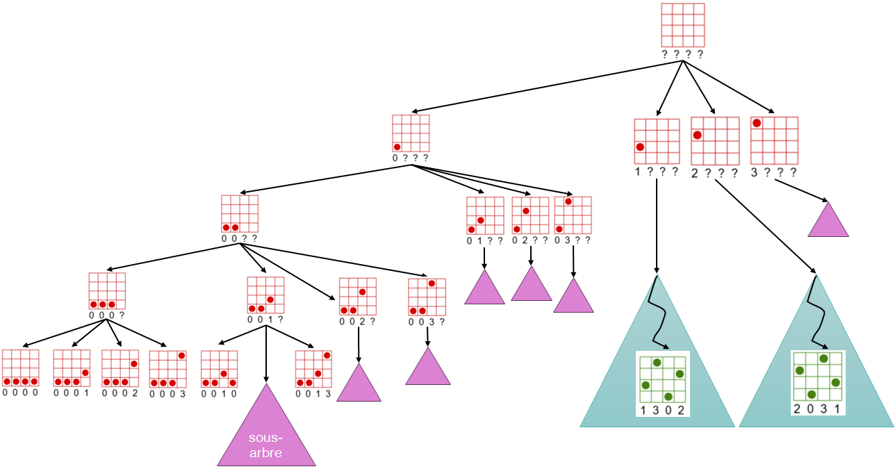

.. _dfs-filter.rst:

Recherche en profondeur et filtrage
###################################

..  contents:: Contenu du cours
    :depth: 3

Dans cette section, nous présentons une approche équivalente à l'approche naïve
de la section :ref:`generate-and-test.rst`, mais en utilisant une approche
récursive au lieu du module ``itertools`` de Python. Cette approche ressemblera
davantage à ce que nous allons faire par la suite en exploitant la récursivité.

..
    note::

    Vous avez abordé les fonctions récursives l'année passée, mais il s'agit
    d'un sujet difficile rarement bien compris du premier coup...

    Nous commencerons donc par un peu de révision.

Recherche en profondeur récursive
=================================

..  note:: 

    L'année passée, vous avez abordé la recherche en profondeur (DFS =
    Depth-First Search) et la recherche en largeur (BFS = Breadth-First Search)
    lors des cours sur la résolution de labyrinthes.

Voici un code de base utilisant la fonction récursive ``dfs`` pour générer
récursivement toutes les configurations possible de l'échiquier. Utilisez le
débogueur intégré de WebTigerPython pour comprendre comment la récursion
fonctionne et comment les appels à la fonction ``dfs`` correspondent à un
parcours en profondeur d'un arbre de recherche.

..  activecode:: dfs_filter_base_functional
    :language: webtp
    :interpreterargs: branch=branch&debug_mode=true&load_python=true

    from collections.abc import Callable

    type PartialSolution =  list[int | None]
    type Solution = list[int]

    def check_constraints(q: PartialSolution) -> bool:
        '''
        Vérifie que toutes les contraintes du problème soient satisfaites dans la
        solution ``q`` représentant la ligne sur laquelle est placée chaque dames
        q[i]
        '''
        n = len(q)

        for i in range(n):
            for j in range(i + 1, n):
                if q[i] == q[j]: return False
                if q[i] - q[j] == i - j: return False
                if q[j] - q[i] == i - j: return False

        return True

    def nqueens_solver(n: int) -> None:
        '''
        Retourne toutes les solutions pour le problème des n dames

        >>> nqueens_solver(n=1)
        [[0]]
        >>> nqueens_solver(n=2)
        []
        >>> nqueens_solver(n=3)
        []
        >>> nqueens_solver(n=4)
        [[1, 3, 0, 2], [2, 0, 3, 1]]
        >>> nqueens_solver(n=5)
        [[0, 2, 4, 1, 3], [0, 3, 1, 4, 2], [1, 3, 0, 2, 4], [1, 4, 2, 0, 3], [2, 0, 3, 1, 4], [2, 4, 1, 3, 0], [3, 0, 2, 4, 1], [3, 1, 4, 2, 0], [4, 1, 3, 0, 2], [4, 2, 0, 3, 1]]
        '''
        def on_solution(queens: Solution) -> None:
            solutions.append(queens)

        def dfs(queens: PartialSolution, index: int = 0) -> None:
            n = len(queens)
            if index == n:
                if check_constraints(queens):
                    # Attention à faire une copie de la liste `queens`
                    on_solution(queens[:])
            else:
                for i in range(n):
                    queens[index] = i
                    dfs(queens, index=index + 1)

        # Préparation du tableau utilisé pour représenter la solution
        queens: PartialSolution = [None] * n
        solutions: list[Solution] = []

        # Générer tous les placements de dames imaginables
        # => feuilles de l'arbre de recherche

        dfs(queens)

        return solutions

    def test():
        import doctest
        doctest.testmod()

    if __name__ == '__main__':
        sols = nqueens_solver(n=6)
        print(sols)

..  
    reveal:: ffd30f2a-0841-4aa3-beba-0ca71234a2ca
    :showtitle: Solution
    :hidetitle: Cacher
    :instructoronly:
    :modal:
    :modaltitle: Solution

    ..  code-block:: python

        ...

Explications : récursion et arbre de recherche
==============================================

..  reveal:: f7f110e8-4f06-411d-a5d1-5cc2d6bff842
    :instructoronly:
    :showtitle: Idées pédagogiques

    - Reprendre la fonction de fibonacci avec les nombreuses animations PPT pour
      bien comprendre le lien entre les appels récursifs et le parcours d'un
      arbre.

    - transposer ensuite cette compréhension à la génération de toutes les
      solutions pour l'échiquier de taille 4.

La figure ci-dessous permet de visualiser l'arbre récursif des appels à la
fonction récursive ``dfs`` qui correspond à une recherche en profondeur testant
tous les placements possibles de dames sur l'échiquier:

    Visualisation de l'arbre de recherche exhaustive explorant en profondeur
    tous les placements possibles.

Visualisation interactive de la récursion
-----------------------------------------

..  activecode:: 637b5ed4-1d59-494a-a776-9e68ce13174e
    :language: webtp
    :interpreterargs: debug_mode=true

    from collections.abc import Iterable

    from gturtle import *

    def draw_chess_board(
        solution: Iterable[int],
        x: int = 0, y: int = 0,
        size: int = 50,
        color="black") -> tuple[int, int]:

        def square(cx, cy) -> None:
            setPos(cx - size / 2, cy - size / 2)
            for _ in range(4):
                fd(size)
                rt(90)

        def queen(cx, cy):
            setPos(cx, cy)
            dot(size * 0.7)

        hideTurtle()
        setPenColor(color)
        setFontSize(size)

        n = len(solution)

        for i in range(n):
            for j in range(n):
                cx = x + i * size - size / 2
                cy = y + j * size - size / 2
                square(cx, cy)
                if solution[i] == j:
                    queen(cx, cy)

        setPos(x - size, y - 2 * size)
        setHeading(0)
        label("  ".join(str(q) if q is not None else '?' for q in solution))

        return n, size

    def nqueens_solver(n: int, ms=150, wait: bool = False, size: int = 50) -> None:
        def next(ms=50, feasible=False):
            nonlocal stop_infeasible

            if feasible or not feasible and stop_infeasible:
                while True:
                    key = getKeyWait()
                    if key == 'i':
                        stop_infeasible = True
                        break
                    elif key == 'f':
                        stop_infeasible = False
                        break
                    else:
                        continue
            else:
                delay(ms)
            
        def on_solution(queens: Iterable[int]) -> None:
            clear()
            draw_chess_board(queens, x=0, y=0, size=size, color="green")
            next(ms=2000, feasible=True)
            
            
        def on_conflict(queens: Iterable[int]) -> None:
            clear()
            draw_chess_board(queens, x=0, y=0, size=size, color="red")
            next(ms=ms, feasible=False)

        def check_constraints(q: Iterable[int]) -> bool:
            n = len(q)

            for i in range(n):
                for j in range(i + 1, n):
                    if q[i] == q[j]: return False
                    if q[i] - q[j] == i - j: return False
                    if q[j] - q[i] == i - j: return False

            return True

        def dfs(queens: Iterable[int], index: int = 0) -> None:
            n = len(queens)
            if index == n:
                if check_constraints(queens):
                    # Attention à faire une copie de la liste `queens`
                    on_solution(queens[:])
            else:
                for i in range(n):
                    queens[index] = i
                    on_conflict(queens[:])
                    dfs(queens, index=index + 1)
                    queens[index] = None
            
        stop_infeasible = True
            
        # Préparation du tableau utilisé pour représenter la solution
        queens = [None] * n

        # Générer tous les placements de dames imaginables
        # => feuilles de l'arbre de recherche
        dfs(queens)

    if __name__ == '__main__':
        # solutions = nqueens_solver(n=4)
        solutions = nqueens_solver(n=4, ms=1, wait=True, size=20)
        
        # Dessiner une solution particulière
        # draw_chess_board([0, 3, 3, None], x=0, y=0, size=20, color="red")

        import doctest
        doctest.testmod()

Visualisation des solutions faisables
-------------------------------------

..  activecode:: d01d487a-c5f0-458b-bef9-f48c6d492db7
    :language: webtp
    :interpreterargs: branch=branch

    from collections.abc import Iterable

    from gturtle import *

    def draw_chess_board(
        solution: Iterable[int],
        x: int = 0, y: int = 0,
        size: int = 50,
        color="black") -> tuple[int, int]:

        def square(cx, cy) -> None:
            setPos(cx - size / 2, cy - size / 2)
            for _ in range(4):
                fd(size)
                rt(90)

        def queen(cx, cy):
            setPos(cx, cy)
            dot(size * 0.7)

        hideTurtle()
        setPenColor(color)
        setFontSize(size)

        n = len(solution)

        for i in range(n):
            for j in range(n):
                cx = x + i * size - size / 2
                cy = y + j * size - size / 2
                square(cx, cy)
                if solution[i] == j:
                    queen(cx, cy)

        setPos(x - size, y - 2 * size)
        setHeading(0)
        label("  ".join(str(q) if q is not None else '?' for q in solution))

        return n, size

    def nqueens_solver(n: int) -> None:
        def on_solution(queens: list[int]) -> None:
            solutions.append(queens)
        
        def check_constraints(q: Iterable[int]) -> bool:
            n = len(q)

            for i in range(n):
                for j in range(i + 1, n):
                    if q[i] == q[j]: return False
                    if q[i] - q[j] == i - j: return False
                    if q[j] - q[i] == i - j: return False
        
            return True
        
        
        def dfs(queens: Iterable[int], index: int = 0) -> None:
            n = len(queens)
            if index == n:
                if check_constraints(queens):
                    # Attention à faire une copie de la liste `queens`
                    on_solution(queens[:])
            else:
                for i in range(n):
                    queens[index] = i
                    dfs(queens, index=index + 1)

        # Préparation du tableau utilisé pour représenter la solution
        queens = [None] * n
        solutions = []

        # Générer tous les placements de dames imaginables
        # => feuilles de l'arbre de recherche

        dfs(queens)

        return solutions

    if __name__ == '__main__':
        solutions = nqueens_solver(n=6)
        print("nombre de solutions:", len(solutions))

        x0, y0 = -300, -150
        x, y, = x0, y0
        for no, sol in enumerate(solutions):
            n, size = draw_chess_board(sol, x, y, size=30)
            setPos(x, y)
            if x < 400:
                x += n * size + 30
            else:
                x = x0
                y += n * size + 60

        import doctest
        doctest.testmod()

Complexité de l'algorithme naïf (générer et tester)
===================================================

Si vous essayez de résoudre le problème des n dames pour des n un peu plus
grands, vous constaterez qu'on n'y arrive pas en un temps raisonnable.

Exercice
--------

..  shortanswer:: dfs-generate-and-test-complexity

    Déterminez la complexité temporelle et spatiale de l'algorithme de DFS +
    filtrage

..  reveal:: b5045a2c-357b-4f3f-a516-5d82db5f8c40
    :showtitle: Réponse

    ..  admonition:: Réponse

        Le nombre de configurations à tester est :math:`O(n^n)`, ce qui est
        clairement exponentiel. Il faut encore tenir compte de la complexité de
        la vérification des contraintes qui est :math:`O(n^2)`. La complexité du
        tout est donc largement exponentielle. 

        Vous savez ce que cela veut dire : il n'est pas possible d'imaginer
        utiliser cette méthode pour résoudre de grosses instances du problèmes
        des n dames par recherche exhaustive naïve.

Conclusion
==========

En observant la manière dont la recherche est effectuée, on se rend compte que
l'algorithme n'est pas efficace. En effet, on fait souvent du travail qui n'a
aucune chance d'aboutir puisqu'on continue souvent d'explorer des sous-arbres
qui n'ont aucune chance de contenir une solution (on appelle une telle situation
où l'on peut déjà savoir qu'il n'y aura pas de solution un **nogood**).
Lorsqu'on découvre un nogood, il faut arrêter la recherche et faire un
**retour-arrière** (*backtrack* en anglais).

..  reveal:: fddd8bd1-3d93-47c0-81e2-3bc081a07a57
    :showtitle: Nogood learning

    Les meilleurs solveurs de contraintes sont capables de détecter des nogoods
    et d'en déduire d'autres parties de l'arbre qu'il n'est pas nécessaire
    d'explorer, notamment en appliquant des raisonnements par symétrie (*Nogood
    learning*). Ils utilisent des techniques telles que le *lazy clause
    generation*. Ces techniques sortent toutefois du cadre de ce cours.

La prochaine section modifie légèrement l'algorithme pour implémenter cette
approche.