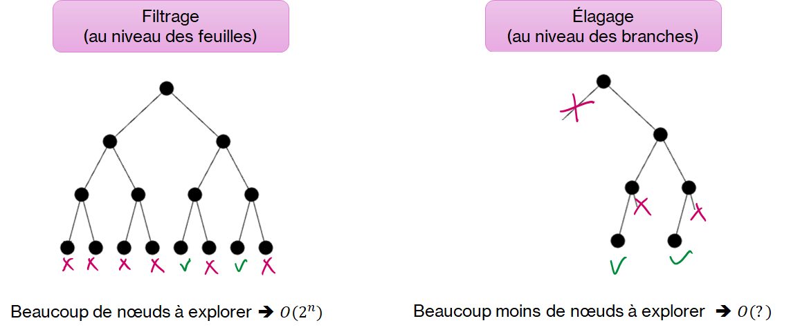
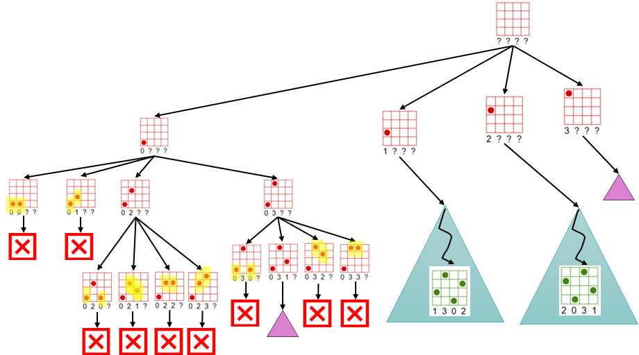

.. _dfs-pruning.rst:

Recherche en profondeur et élagage
##################################

..  contents:: Contenu du cours
    :depth: 3

Dans la section précédente, nous avons utilisé une fonction ``dfs`` récursive
pour générer toutes les configurations possibles de dames, puis nous avons
filtré celles qui n'étaient pas valides et gardé celles qui étaient valides.
Cela représente ``n^n`` configurations possibles à explorer (feuilles de l'arbre
de recherche). 

Voici une comparaison des deux méthodes permettant de voir de manière évidente
qu'il vaut mieux élaguer l'arbre de recherche dès que possible lors de la
recherche. 

    Comparaison entre le **filtrage** (au niveau des feuilles) et l'**élagage**
    (*pruning* en anglais), au niveau des branches de l'arbre de recherche.

Concrètement, on obtient donc l'arbre suivant

    Illustration de l'arbre de recherche en profondeur avec élagage lorsque la
    reine posée entre en conflit avec les reines précédemment posées

Activité : recherche en profondeur récursive avec élagage
=========================================================

On veut modifier légèrement la fonction ``dfs`` et la vérification des
contraintes ``check_constraints`` pour effectuer la vérification des contraintes
dès que possible au lieu d'attendre d'arriver aux feuilles de l'arbre (les
configurations où toutes les dames ont été posées).

Reprenez l'algorithme DFS + filtrage et adaptez-le pour implémenter
l'algorithme de DFS + élagage. Les idées principales sont les suivantes:

-   Dès qu'on pose une dame, on regarde si elle est en conflict avec l'une des
    dames préalablement posées. Si c'est le cas, on ne continue pas la recherche
    et on fait un retour-arrière (backtrack). 

    ..  note::

        Dans le cas de la récursion, cela consiste simplement à ne pas faire d'autre
        appel récursif et laisser se terminer l'appel courant (``return``
        implicite). Le processus récursif réalisera le retour-arrière implémentera
        le retour-arrière de manière transparente.

-   Il faut adapter la fonction ``dfs`` mais également la fonction
    ``check_constraints``.

..  admonition:: Conseils

    - Commencez par implémenter et tester la nouvelle version de la fonction
      ``check_constraints``

    - Adaptez ensuite la fonction récursive ``dfs`` en effectuant la
      vérification des contraintes dès qu'une dame est posée.

..  activecode:: dfs_prune_base_functional
    :language: webtp
    :interpreterargs: debug_mode=true&load_python=true

    from collections.abc import Callable

    type PartialSolution =  list[int | None]
    type Solution = list[int]

    def check_constraints(q: PartialSolution) -> bool:
        '''
        Vérifie que toutes les contraintes du problème soient satisfaites dans la
        solution ``q`` représentant la ligne sur laquelle est placée chaque dames
        q[i]
        '''
        n = len(q)

        for i in range(n):
            for j in range(i + 1, n):
                if q[i] == q[j]: return False
                if q[i] - q[j] == i - j: return False
                if q[j] - q[i] == i - j: return False

        return True

    def nqueens_solver(n: int) -> None:
        '''
        Retourne toutes les solutions pour le problème des n dames

        >>> nqueens_solver(n=1)
        [[0]]
        >>> nqueens_solver(n=2)
        []
        >>> nqueens_solver(n=3)
        []
        >>> nqueens_solver(n=4)
        [[1, 3, 0, 2], [2, 0, 3, 1]]
        >>> nqueens_solver(n=5)
        [[0, 2, 4, 1, 3], [0, 3, 1, 4, 2], [1, 3, 0, 2, 4], [1, 4, 2, 0, 3], [2, 0, 3, 1, 4], [2, 4, 1, 3, 0], [3, 0, 2, 4, 1], [3, 1, 4, 2, 0], [4, 1, 3, 0, 2], [4, 2, 0, 3, 1]]
        '''
        def on_solution(queens: Solution) -> None:
            solutions.append(queens)

        def dfs(queens: PartialSolution, index: int = 0) -> None:
            n = len(queens)
            if index == n:
                if check_constraints(queens):
                    # Attention à faire une copie de la liste `queens`
                    on_solution(queens[:])
            else:
                for i in range(n):
                    queens[index] = i
                    dfs(queens, index=index + 1)

        # Préparation du tableau utilisé pour représenter la solution
        queens: PartialSolution = [None] * n
        solutions: list[Solution] = []

        # Générer tous les placements de dames imaginables
        # => feuilles de l'arbre de recherche

        dfs(queens)

        return solutions

    def test():
        import doctest
        doctest.testmod()

    if __name__ == '__main__':
        sols = nqueens_solver(n=6)
        print(sols)
        

..  reveal:: 81e7fe73-40ea-4835-a635-c4d9f843a2ce
    :showtitle: Solution
    :instructoronly:

    ..  code-block:: python

        from collections.abc import Iterable

        def check_constraints(q: Iterable[int | None], last_queen: int) -> bool:
            '''
            Vérifie que toutes les contraintes du problème soient satisfaites dans la
            solution partielle ``q`` représentant la ligne sur laquelle est placée chaque dames
            q[i]. L'indice ``last_queen`` représente la dernière reine posée.

            >>> check_constraints([0], 0)
            True
            >>> check_constraints([1, 3, None, None], 1)
            True
            >>> check_constraints([1, None, None, None], 0)
            True
            >>> check_constraints([3, None, None, None], 0)
            True
            >>> check_constraints([1, 3, 5, 0, 2, 4], 5)
            True
            >>> check_constraints([1, 3, None, None], 1)
            True

            >>> check_constraints([0, 1, 2, 3], 3)
            False
            >>> check_constraints([3, 2, None, None], 1)
            False
            >>> check_constraints([2, 3, None, None], 1)
            False
            >>> check_constraints([1, 1, None, None, None], 1)
            False

            '''
            j = last_queen
            for i in range(j):
                if q[i] == q[j]: return False
                if q[i] - q[j] == i - j: return False
                if q[j] - q[i] == i - j: return False

            return True

        def dfs(queens: Iterable[int], index: int = 0, on_solution = None) -> None:
            n = len(queens)
            on_solution = on_solution or (lambda q: print(q))
            if index == n:
                # Si on parvient à une feuille, on tient une solution
                # Attention à faire une copie de la liste `queens`
                on_solution(queens[:])
            else:
                for i in range(n):
                    queens[index] = i
                    # print("board", queens)
                    
                    if check_constraints(queens, index):
                        dfs(queens, index=index + 1, on_solution=on_solution)
                        

        def nqueens_solver(n: int) -> None:
            '''
            Retourne toutes les solutions pour le problème des n dames

            >>> nqueens_solver(n=1)
            [[0]]
            >>> nqueens_solver(n=2)
            []
            >>> nqueens_solver(n=3)
            []
            >>> nqueens_solver(n=4)
            [[1, 3, 0, 2], [2, 0, 3, 1]]
            >>> nqueens_solver(n=5)
            [[0, 2, 4, 1, 3], [0, 3, 1, 4, 2], [1, 3, 0, 2, 4], [1, 4, 2, 0, 3], [2, 0, 3, 1, 4], [2, 4, 1, 3, 0], [3, 0, 2, 4, 1], [3, 1, 4, 2, 0], [4, 1, 3, 0, 2], [4, 2, 0, 3, 1]]
            '''
            def handle_solution(queens: list[int]) -> None:
                solutions.append(queens)

            queens = [None] * n
            solutions = []

            dfs(queens, on_solution=handle_solution)

            return solutions

        if __name__ == '__main__':
            import doctest
            doctest.testmod()

Visualisation interactive de la récursion
-----------------------------------------

Complétez le code ci-dessous pour permettre de visualiser de manière interactive
les différentes configurations de reines explorées en utilisant l'élagage.

..  activecode:: bb81b7ad-83aa-4c49-b6d9-944b34189bd0
    :language: webtp

    # écrivez votre code ici

..  reveal:: 17a6ad1b-c111-4b08-8874-ca3429f2b579
    :showtitle: Solution
    :instructoronly:
        
    ..  activecode:: ba95db5d-7930-43e4-98ff-9c19a5cf1590
        :language: webtp

        from collections.abc import Iterable

        from gturtle import *

        def draw_chess_board(solution: Iterable[int], x: int = 0, y: int = 0, size: int = 50, color="black") -> tuple[int, int]:
            def square(cx, cy) -> None:
                setPos(cx - size / 2, cy - size / 2)
                for _ in range(4):
                    fd(size)
                    rt(90)

            def queen(cx, cy):
                setPos(cx, cy)
                dot(size * 0.7)

            hideTurtle()
            setPenColor(color)
            setFontSize(size)

            n = len(solution)

            for i in range(n):
                for j in range(n):
                    cx = x + i * size - size / 2
                    cy = y + j * size - size / 2
                    square(cx, cy)
                    if solution[i] == j:
                        queen(cx, cy)

            setPos(x - size, y - 2 * size)
            setHeading(0)
            label("  ".join(str(q) if q is not None else '?' for q in solution))

            return n, size

        def check_constraints(q: Iterable[int | None], last_queen: int) -> bool:
            j = last_queen
            for i in range(j):
                if q[i] == q[j]: return False
                if q[i] - q[j] == i - j: return False
                if q[j] - q[i] == i - j: return False

            return True

        def dfs(queens: Iterable[int], index: int = 0, on_solution = None) -> None:
            n = len(queens)
            on_solution = on_solution or (lambda q: print(q))
            if index == n:
                # Si on parvient à une feuille, on tient une solution
                # Attention à faire une copie de la liste `queens`
                on_solution(queens[:])
            else:
                for i in range(n):
                    queens[index] = i
                    # print("board", queens)

                    if check_constraints(queens, index):
                        dfs(queens, index=index + 1, on_solution=on_solution)

        def nqueens_solver(n: int, ms=150, wait: bool = False, size: int = 50) -> None:
            def next(ms=50, feasible=False):
                nonlocal stop_infeasible

                if feasible or not feasible and stop_infeasible:
                    while True:
                        key = getKeyWait()
                        if key == 'i':
                            stop_infeasible = True
                            break
                        elif key == 'f':
                            stop_infeasible = False
                            break
                        else:
                            continue
                else:
                    delay(ms)

            def on_solution(queens: Iterable[int]) -> None:
                clear()
                draw_chess_board(queens, x=0, y=0, size=size, color="green")
                next(ms=2000, feasible=True)

            def on_conflict(queens: Iterable[int]) -> None:
                clear()
                draw_chess_board(queens, x=0, y=0, size=size, color="red")
                next(ms=ms, feasible=False)
                

            def dfs(queens: Iterable[int], index: int = 0) -> None:
                n = len(queens)

                if index == n:
                    # Si on parvient à une feuille, on tient une solution
                    # Attention à faire une copie de la liste `queens`
                    on_solution(queens[:])
                else:
                    for i in range(n):
                        queens[index] = i
                        on_conflict(queens[:])
                        if check_constraints(queens, index):
                            dfs(queens, index=index + 1)
                        queens[index] = None
                        
            stop_infeasible = True

            # Préparation du tableau utilisé pour représenter la solution
            queens = [None] * n

            # Générer tous les placements de dames imaginables
            # => feuilles de l'arbre de recherche

            dfs(queens)

        if __name__ == '__main__':
            # solutions = nqueens_solver(n=4)
            solutions = nqueens_solver(n=8, ms=1, wait=True, size=20)

            # Dessiner une solution particulière
            # draw_chess_board([0, 3, 3, None], x=0, y=0, size=20, color="red")

            import doctest
            doctest.testmod()

..
    Discussion de cet algorithme de résolution
    ==========================================

    Développez un code permettant de chronométrer la résolution du problème avec
    chacune des méthodes Comparons les deux approches DFS/filtrage et DFS+élagage.

