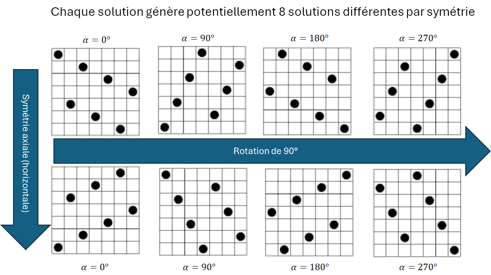
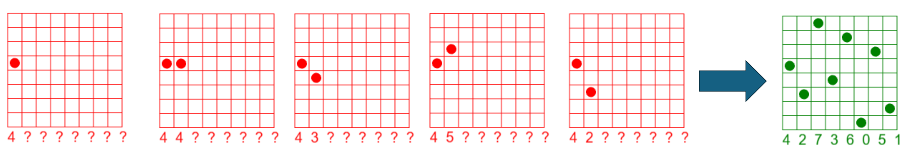

.. _exos.rst:

Exercices
#########

..  contents:: Exercices
    :depth: 3

..  note:: 

    Les solutions aux exercices ne sont pas disponibles pour le moment. Les
    exercices difficiles sont marqués d'une étoile. Plus il y a d'étoiles, plus
    vous allez transpirer ...

Exercice 1
==========

Améliorez la fonction ``check_constraints`` utilisée pour résoudre le problèmes
des :math:`n` dames pour qu'il n'y ait plus que deux conditions à tester, sans
utiliser d'opérateur logique (``or``). Tester ensuite votre code à l'aide de
``doctest``.

..  reveal:: 1fce8cad-da1c-43bb-95fa-716fde2c68c6
    :showtitle: Indice 1

    Il faut utiliser une fonction mathématique très simple et familière pour
    gérer les deux contraintes de diagonales avec une seule condition.

..  activecode:: session1-exos-simplify-check-constraints
    :language: webtp

    def check_constraints(q: list[int | None], n: int) -> bool:
        '''
        Vérifie que toutes les contraintes du problème soient satisfaites dans la
        solution partielle ``q`` représentant la ligne sur laquelle est placée chaque dames
        q[i]. On ne considère que les j premiers éléments de la liste q.

        >>> check_constraints([0], 1)
        True
        >>> check_constraints([1, 3, None, None], 2)
        True
        >>> check_constraints([1, None, None, None], 1)
        True
        >>> check_constraints([3, None, None, None], 1)
        True
        >>> check_constraints([1, 3, 5, 0, 2, 4], 6)
        True
        >>> check_constraints([1, 3, None, None], 2)
        True

        >>> check_constraints([0, 1, 2, 3], 4)
        False
        >>> check_constraints([3, 2, None, None], 2)
        False
        >>> check_constraints([2, 3, None, None], 2)
        False
        >>> check_constraints([1, 1, None, None, None], 2)
        False

        '''

        for i in range(n):
            for j in range(i + 1, n):
                if q[i] == q[j]: return False
                if q[i] - q[j] == i - j: return False
                if q[j] - q[i] == i - j: return False

        return True 

    if __name__ == '__main__':
        import doctest
        doctest.testmod

..  reveal:: 1fce8cad-da1c-43bb-95fa-716fde2c68c6-solution
    :showtitle: Solution
    

    ..  admonition:: Solution

        Il faut utiliser la valeur absolue ``abs(x)`` pour résumer en une seule
        condition les deux conditions de diagonales:

        ..  code-block:: python

            type PartialChessboard = list[int | None]

            def check_constraints(q: PartialChessboard, n: int) -> bool:
                '''
                Vérifie que toutes les contraintes du problème soient satisfaites dans la
                solution partielle ``q`` représentant la ligne sur laquelle est placée chaque dames
                q[i]. On ne considère que les j premiers éléments de la liste q.

                >>> check_constraints([0], 1)
                True
                >>> check_constraints([1, 3, None, None], 2)
                True
                >>> check_constraints([1, None, None, None], 1)
                True
                >>> check_constraints([3, None, None, None], 1)
                True
                >>> check_constraints([1, 3, 5, 0, 2, 4], 6)
                True
                >>> check_constraints([1, 3, None, None], 2)
                True

                >>> check_constraints([0, 1, 2, 3], 4)
                False
                >>> check_constraints([3, 2, None, None], 2)
                False
                >>> check_constraints([2, 3, None, None], 2)
                False
                >>> check_constraints([1, 1, None, None, None], 2)
                False

                '''

                for i in range(n):
                    for j in range(i + 1, n):
                        if q[i] == q[j]: return False
                        if abs(q[i] - q[j]) == i - j: return False

                return True 

            if __name__ == '__main__':
                import doctest
                doctest.testmod

Exercice 2
==========

Exercice 2a
-----------

Développez une fonction ``hsymmetry(q: list[int | None]) -> list[int | None]``
qui effectue une symétrie axiale d'axe horizontal. Si :math:`n` est impair, la
ligne centrale ne change pas. 

..  note:: 

    -   Développez vous-mêmes vos propres tests à l'aide du module ``doctest`` pour
        valider votre fonction.

    -   Il est possible de résoudre le problème en une seule ligne à l'aide
        d'une liste en compréhension et d'une expression conditionnelle.

..  activecode:: session1-exos-horiz-symmetry
    :language: webtp

    type PartialChessboard =ist[int | None]

    def vsymmetry(q: PartialChessboard) -> PartialChessboard:
        ...

    if __name__ == '__main__':
        import doctest
        doctest.testmod()
    
..  reveal:: ff9f6603-3aa4-4002-88c0-a38b9ae134e5
    :showtitle: Solution
    

    On peut développer cette fonction en une seule ligne en utilisant
    judicieusement une liste en compréhension combinée avec une expression
    conditionnelle
    
    ::
        
        <expression_si_vrai> if <condition> else  <expression_si_faux>

    ..  note::

        Dans les tests, il est important de tester également des cas de figure
        où certains éléments de l'échiquier sont ``None``.

    ..  note:: 

        Attention à bien mettre la condition ``row_no is not None`` et pas
        seulement ``if row_no``, condition qui est fausse pour la valeur entière
        ``0``.
    
    ..  code-block:: python

        type PartialChessboard = list[int | None]
        def hsymmetry(q: PartialChessboard) -> PartialChessboard:
            '''
            >>> hsymmetry([0, 1, 2, 3])
            [3, 2, 1, 0]
            >>> hsymmetry([0, None, 2, 3])
            [3, None, 1, 0]
            >>> hsymmetry([0, 1, 1, 0])
            [3, 2, 2, 3]
            >>> hsymmetry([0, 1, 2, 3, 4])
            [4, 3, 2, 1, 0]
            >>> hsymmetry([0, 1, 2, 1, 0])
            [4, 3, 2, 3, 4]
            >>> hsymmetry([0])
            [0]
            '''
            n = len(q)
            return [((n - row_no - 1) if row_no is not None else None) for row_no in q]

        if __name__ == '__main__':
            import doctest
            doctest.testmod()

Exercice 2b
-----------

Développez une fonction ``vsymmetry(q: PartialChessboard) -> PartialChessboard``
qui effectue une symétrie axiale d'axe vertical. Si :math:`n` est impair, la
colonne centrale ne change pas. 

..  note:: 

    Développez vous-mêmes vos propres tests à l'aide du module ``doctest`` pour
    valider votre fonction.

    Le problème peut se résoudre en une seule ligne.

..  activecode:: session1-exos-vert-symmetry
    :language: webtp

    type PartialChessboard = list[int | None]

    def vsymmetry(q: PartialChessboard) -> PartialChessboard:
        ...

    if __name__ == '__main__':
        import doctest
        doctest.testmod()

..  reveal:: d856a8ed-c858-46f9-8ac9-95b49c92261b
    :showtitle: Solution
    

    ..  code-block:: python

        type PartialChessboard = list[int | None]

        def vsymmetry(q: PartialChessboard) -> PartialChessboard:
            '''
            >>> vsymmetry([0, 1, 2, 3])
            [3, 2, 1, 0]
            >>> vsymmetry([0, 1, 2, None])
            [None, 2, 1, 0]
            '''
            return list(reversed(q))

        if __name__ == '__main__':
            import doctest
            doctest.testmod()

Exercice 2c
-----------

Développez une fonction ``dsymmetry(q: PartialChessboard) -> PartialChessboard``
qui effectue une symétrie axiale d'axe correspondant à la grande diagonale
ascendante de l'échiquier. 

..  note:: 

    Développez vous-mêmes vos propres tests à l'aide du module ``doctest`` pour
    valider votre fonction.

..  activecode:: session1-exos-diag-symmetry
    :language: webtp

    type PartialChessboard = list[int | None]

    def dsymmetry(q: PartialChessboard) -> PartialChessboard:
        ...

    if __name__ == '__main__':
        import doctest
        doctest.testmod()

..  reveal:: 407762ba-33a0-4c49-8e64-0419a980ada7
    :showtitle: Solution
    

    ..  code-block:: python

        type PartialChessboard = list[int | None]

        def dsymmetry(q: PartialChessboard) -> PartialChessboard:
            '''
            >>> dsymmetry([1, None, None, None])
            [None, 0, None, None]
            >>> dsymmetry([1, None, 3, None])
            [None, 0, None, 2]
            >>> dsymmetry([1, 3, 0, None])
            [2, 0, None, 1]
            >>> dsymmetry([1, 3, 0, 2])
            [2, 0, 3, 1]
            >>> dsymmetry(dsymmetry([1, 3, 0, 2]))
            [1, 3, 0, 2]
            >>> dsymmetry([0])
            [0]
            >>> 
            '''
            n = len(q)
            new_board: PartialChessboard = [None] * n
            for i in range(n):
                if q[i] is not None:
                    new_board[q[i]] = i

            return new_board

        if __name__ == '__main__':
            import doctest
            doctest.testmod()

Exercice 3
==========

Développez une fonction ``rotate(q: PartialChessboard) -> PartialChessboard``
qui prend une configuration ``q`` (solution complète ou partielle) des n dames
et effectue une rotation de 90° vers la droite de l'échiquier.

..  reveal:: 33c8c6ff-82b9-403d-aae9-9a08c2fbefa3
    :showtitle: Indice

    Une rotation de 90° vers la droite de l'échiquier peut se faire par
    composition de deux symétries déjà implémentées dans l'exercice 2.

..  note:: 

    Développez vous-mêmes vos propres tests à l'aide du module ``doctest`` pour
    valider votre fonction.

..  activecode:: session1-exos-rotate
    :language: webtp

..  reveal:: 0903fe22-0e5f-4ad2-b76c-41f20d6197c6
    :showtitle: Solution
    :hidetitle: Cacher la solution
    

    ..  code-block:: python

        type PartialChessboard = list[int | None]

        def hsymmetry(q: PartialChessboard) -> PartialChessboard:
            n = len(q)
            return [(n-row -1) if row is not None else None for row in q]

        def dsymmetry(q: PartialChessboard) -> PartialChessboard:
            n = len(q)
            new_board: PartialChessboard = [None] * n
            for i in range(n):
                if q[i] is not None:
                    new_board[q[i]] = i

            return new_board

        def rotate(q: PartialChessboard) -> PartialChessboard:
            '''
            >>> rotate([2, 0, 3, 1])
            [2, 0, 3, 1]
            >>> rotate([2, None, 3, 1])
            [None, 0, 3, 1]
            >>> rotate([1, 3, 5, 0, 2, 4])
            [2, 5, 1, 4, 0, 3]
            >>> rotate([1, None, None, 0, 2, 4])
            [2, 5, 1, None, 0, None]
            >>> 
            '''
            return hsymmetry(dsymmetry(q))

        if __name__ == '__main__':
            import doctest
            doctest.testmod()

    On peut également programmer les deux symmétries en une seule fois en
    observant que, lors d'une rotation à droite de 90°,

    - Le numéro de colonne :math:`i` devient le numéro de ligne (depuis le
      haut), à savoir que la dame de la colonne :math:`i` va vers la ligne
      :math:`n-1-i`

    - Le numéro de ligne d'une reine devient son numéro de colonne dans
      l'échiquier tourné.

    De ce fait, pour tout :math:`i`, on a 

    ::

        rotated_board[q[i]] = n - 1 - i

    Cela permet d'obtenir le code suivant

    ..  code-block:: python
        :linenos:

        type PartialChessboard = list[int | None]

        def rotate(q: PartialChessboard) -> PartialChessboard:
            '''
            >>> rotate([2, 0, 3, 1])
            [2, 0, 3, 1]
            >>> rotate([2, None, 3, 1])
            [None, 0, 3, 1]
            >>> rotate([1, 3, 5, 0, 2, 4])
            [2, 5, 1, 4, 0, 3]
            >>> rotate([1, None, None, 0, 2, 4])
            [2, 5, 1, None, 0, None]
            >>> 
            '''
            n = len(q)
            rotated: PartialChessboard = [None] * n
            for i in range(n):
                if q[i] is not None:
                    rotated[q[i]] = n - 1 - i
            return rotated

        if __name__ == '__main__':
            import doctest
            doctest.testmod()

Exercice 4
==========

Modifiez le programme DFS + élagage pour casser la symétrie axiale d'axe
horizontal, afin d'éliminer la moitié de l'arbre de recherche (lorsque :math:`n`
est pair) et un peu moins de la moitié de l'arbre de recherche (lorsque
:math:`n` est impair).

    Casser la symétrie axiale d'axe horizontal permet d'éliminer presque la
    moitié de l'arbre de recherche (ici pour :math:`n=7` impair).

..  reveal:: 931aeedd-7248-463d-bb0c-2057d1cd2f41
    :showtitle: Indice 1

    ..  admonition:: Indice 1

        Il faut rajouter une contrainte supplémentaire dans la fonction
        ``check_constraints``.

Cette astuce a l'avantage d'éliminer la moitié de l'arbre de recherche, mais
comporte le désavantage de supprimer la moitié des solutions retournées par la
fonction ``nqueens_solver``. Reconstruisez ces solutions manquantes à partir des
solutions obtenues et de la fonction ``hsymetry`` de l'exercice.

..  
    note:: 

    Développez vous-mêmes vos propres tests à l'aide du module ``doctest`` pour
    valider votre fonction.

..  activecode:: session1-exo-break-axial-symmetry
    :language: webtp
    :interpreterargs: branch=branch

..  reveal:: session1-exo-break-axial-symmetry-solution
    :showtitle: Solution

    L'idée est d'imposer que la dame de la première colonne soit placée dans la
    moitié inférieure de l'échiquier. On peut rajouter cette contrainte dans la
    fonction ``check_constraints`` en vérifiant que la ligne de la dame de la
    première colonne soit inférieure à :math:`n//2`:

    ::

            if q[0] is not None and q[0] >= len(q) // 2:
                return False

    Mais il est encore plus efficace de rajouter cette contrainte dans la
    fonction de génération des solutions, en ne générant que les solutions
    respectant cette contrainte. En effet, cela permet d'élaguer encore
    davantage l'arbre de recherche, et de ne pas générer du tout les solutions
    qui ne respectent pas cette contrainte, au lieu de les générer puis de les
    filtrer ensuite.

    ..  code-block:: python
        :emphasize-lines: 9-12

        def dfs(queens: Iterable[int], index: int = 0, on_solution = None) -> None:
            n = len(queens)
            on_solution = on_solution or (lambda q: print(q))
            if index == n:
                # Si on parvient à une feuille, on tient une solution
                # Attention à faire une copie de la liste `queens`
                on_solution(queens[:])
            else:
                if index == 0:
                    # on ne génère que les solutions où la dame de la première 
                    # colonne est dans la moitié inférieure de l'échiquier
                    possible_rows = range(0, (n + 1) // 2)
                else:
                    possible_rows = range(n)
                    
                for i in possible_rows:
                    queens[index] = i
                    # print("board", queens)

                    if check_constraints(queens, index):
                        dfs(queens, index=index + 1, on_solution=on_solution)

    Voici le code complet :                    

    ..  activecode:: session1-exo-break-axial-symmetry-solution-code
        :language: webtp
        :interpreterargs: branch=branch

        import micropip
        await micropip.install("https://raw.githubusercontent.com/donnerc/turing-modules/refs/heads/main/dist/turing-0.1.0-py3-none-any.whl")

        from collections.abc import Iterable
        from gturtle import *

        from turing.nqueens import draw_chess_board

        type PartialChessboard = list[int | None]

        def check_constraints(q: PartialChessboard, last_queen: int) -> bool:
            '''
            Vérifie que toutes les contraintes du problème soient satisfaites dans la
            solution partielle ``q`` représentant la ligne sur laquelle est placée chaque dames
            q[i]. L'indice ``last_queen`` représente la dernière reine posée.

            >>> check_constraints([0], 0)
            True
            >>> check_constraints([1, 3, None, None], 1)
            True
            >>> check_constraints([1, None, None, None], 0)
            True
            >>> check_constraints([3, None, None, None], 0)
            True
            >>> check_constraints([1, 3, 5, 0, 2, 4], 5)
            True
            >>> check_constraints([1, 3, None, None], 1)
            True

            >>> check_constraints([0, 1, 2, 3], 3)
            False
            >>> check_constraints([3, 2, None, None], 1)
            False
            >>> check_constraints([2, 3, None, None], 1)
            False
            >>> check_constraints([1, 1, None, None, None], 1)
            False

            '''
            j = last_queen
            for i in range(j):
                if q[i] == q[j]: return False
                if q[i] - q[j] == i - j: return False
                if q[j] - q[i] == i - j: return False

            return True

        def hsymmetry(q: PartialChessboard) -> PartialChessboard:
            n = len(q)
            return [(n-row -1) if row is not None else None for row in q]

        def dfs(queens: PartialChessboard, index: int = 0, on_solution = None) -> None:
            n = len(queens)
            on_solution = on_solution or (lambda q: print(q))
            if index == n:
                # Si on parvient à une feuille, on tient une solution
                # Attention à faire une copie de la liste `queens`
                on_solution(queens[:])
            else:
                if index == 0:
                    domain = range(0, (n + 1) // 2)
                else:
                    domain = range(n)
                    
                for i in domain:
                    queens[index] = i
                    # print("board", queens)

                    if check_constraints(queens, index):
                        dfs(queens, index=index + 1, on_solution=on_solution)

        def nqueens_solver(n: int) -> None:
            '''
            Retourne toutes les solutions pour le problème des n dames

            >>> nqueens_solver(n=1)
            [[0]]
            >>> nqueens_solver(n=2)
            []
            >>> nqueens_solver(n=3)
            []
            >>> nqueens_solver(n=4)
            [[1, 3, 0, 2], [2, 0, 3, 1]]
            >>> nqueens_solver(n=5)
            [[0, 2, 4, 1, 3], [0, 3, 1, 4, 2], [1, 3, 0, 2, 4], [1, 4, 2, 0, 3], [2, 0, 3, 1, 4], [2, 4, 1, 3, 0], [3, 0, 2, 4, 1], [3, 1, 4, 2, 0], [4, 1, 3, 0, 2], [4, 2, 0, 3, 1]]
            '''
            def handle_solution(queens: list[int]) -> None:
                solutions.append(queens)

            queens = [None] * n
            solutions = []

            dfs(queens, on_solution=handle_solution)

            return solutions

        if __name__ == '__main__':
            solutions = nqueens_solver(n=7)
            print(len(solutions))
            print(solutions)

            symmetric_solutions = [hsymmetry(sol) for sol in solutions]
            print(len(symmetric_solutions))

            unique_solutions = set(tuple(sol) for sol in solutions + symmetric_solutions)
            print(len(unique_solutions))
            solutions = list(unique_solutions)

            x0, y0 = -300, -150
            x, y, = x0, y0
            for no, sol in enumerate(solutions):
                n, size = draw_chess_board(sol, x, y, size=30)
                setPos(x, y)
                if x < 400:
                    x += n * size + 30
                else:
                    x = x0
                    y += n * size + 60

Exercice 5
==========

Essayez de casser encore d'autres symétries pour éliminer encore davantage de
branches de l'arbre de recherche. Par exemple, on peut casser la symétrie axiale
d'axe vertical en imposant que la dame de la première ligne soit placée dans la
moitié gauche de l'échiquier.

On peut aussi casser les rotations de 90° en imposant que la dame de la première
colonne soit placée dans la moitié inférieure de l'échiquier ET que la dame de
la première ligne soit placée placée dans un colonne qui est inférieure au
numéro de ligne de la dame de la première colonne. Par exemple, si la dame de la
première colonne est placée sur la ligne 3, alors la dame de la première ligne
doit être placée dans une colonne inférieure à 3.

..  activecode:: session1-exo-break-more-symmetry
    :language: webtp
    :interpreterargs: branch=branch

..  reveal:: session1-exo-break-more-symmetry-solution
    :showtitle: Solution

    Pour ce faire, il faut rajouter les contraintes suivantes dans le ``dfs``:

    ::

        if check_constraints(queens, index):
            # --- ÉLAGAGE DYNAMIQUE (ROTATIONS) ---
            
            # A. Contrainte sur la LIGNE 0 (Rotation 90°)
            # Si on pose une reine sur la ligne 0 à la colonne 'index', 
            # cette colonne doit être >= à la ligne de la Col 0.
            if i == 0 and index < queens[0]:
                continue
            
            # B. Contrainte sur la DERNIÈRE LIGNE (Rotation 270°)
            # Si on pose une reine sur la ligne N-1, sa distance au bord droit 
            # (N-1 - index) doit être >= à la ligne de la Col 0.
            if i == n - 1 and (n - 1 - index) < queens[0]:
                continue

            # C. Contrainte sur la DERNIÈRE COLONNE (Rotation 180°)
            # Si on est à la dernière colonne, sa distance au bord bas 
            # (N-1 - ligne) doit être >= à la ligne de la Col 0.
            if index == n - 1 and (n - 1 - i) < queens[0]:
                continue

            dfs(queens, index + 1, on_solution)

    ..  activecode:: session1-exo-break-more-symmetry-solution-code
        :language: webtp
        :interpreterargs: branch=branch

        import micropip
        await micropip.install("https://raw.githubusercontent.com/donnerc/turing-modules/refs/heads/main/dist/turing-0.1.0-py3-none-any.whl")

        from time import time

        from collections.abc import Iterable
        from gturtle import *

        from turing.nqueens import draw_chess_board

        type PartialChessboard = list[int | None]

        def check_constraints(q: PartialChessboard, last_queen: int) -> bool:
            '''
            Vérifie que toutes les contraintes du problème soient satisfaites dans la
            solution partielle ``q`` représentant la ligne sur laquelle est placée chaque dames
            q[i]. L'indice ``last_queen`` représente la dernière reine posée.

            >>> check_constraints([0], 0)
            True
            >>> check_constraints([1, 3, None, None], 1)
            True
            >>> check_constraints([1, None, None, None], 0)
            True
            >>> check_constraints([3, None, None, None], 0)
            True
            >>> check_constraints([1, 3, 5, 0, 2, 4], 5)
            True
            >>> check_constraints([1, 3, None, None], 1)
            True

            >>> check_constraints([0, 1, 2, 3], 3)
            False
            >>> check_constraints([3, 2, None, None], 1)
            False
            >>> check_constraints([2, 3, None, None], 1)
            False
            >>> check_constraints([1, 1, None, None, None], 1)
            False

            '''
            j = last_queen
            for i in range(j):
                if q[i] == q[j]: return False
                if q[i] - q[j] == i - j: return False
                if q[j] - q[i] == i - j: return False

            return True

        def hsymmetry(q: PartialChessboard) -> PartialChessboard:
            n = len(q)
            return [(n-row -1) if row is not None else None for row in q]

        def rotate(q: PartialChessboard) -> PartialChessboard:
            '''
            >>> rotate([2, 0, 3, 1])
            [2, 0, 3, 1]
            >>> rotate([2, None, 3, 1])
            [None, 0, 3, 1]
            >>> rotate([1, 3, 5, 0, 2, 4])
            [2, 5, 1, 4, 0, 3]
            >>> rotate([1, None, None, 0, 2, 4])
            [2, 5, 1, None, 0, None]
            >>>
            '''
            n = len(q)
            rotated: PartialChessboard = [None] * n
            for i in range(n):
                if q[i] is not None:
                    rotated[q[i]] = n - 1 - i
            return rotated

        def dfs(queens: PartialChessboard, index: int = 0, on_solution = None) -> None:
            n = len(queens)
            on_solution = on_solution or (lambda q: print(q))
            if index == n:
                # Si on parvient à une feuille, on tient une solution
                # Attention à faire une copie de la liste `queens`
                on_solution(queens[:])
            else:
                if index == 0:
                    domain = range(0, (n + 1) // 2)
                else:
                    domain = range(n)

                for i in domain:
                    queens[index] = i
                    # print("board", queens)

                    if check_constraints(queens, index):

                        # --- ÉLAGAGE DYNAMIQUE (ROTATIONS) ---

                        # A. Contrainte sur la LIGNE 0 (Rotation 90°)
                        # Si on pose une reine sur la ligne 0 à la colonne 'index',
                        # cette colonne doit être >= à la ligne de la Col 0.
                        if i == 0 and index < queens[0]:
                            continue

                        # B. Contrainte sur la DERNIÈRE LIGNE (Rotation 270°)
                        # Si on pose une reine sur la ligne N-1, sa distance au bord droit
                        # (N-1 - index) doit être >= à la ligne de la Col 0.
                        if i == n - 1 and (n - 1 - index) < queens[0]:
                            continue

                        # C. Contrainte sur la DERNIÈRE COLONNE (Rotation 180°)
                        # Si on est à la dernière colonne, sa distance au bord bas
                        # (N-1 - ligne) doit être >= à la ligne de la Col 0.
                        if index == n - 1 and (n - 1 - i) < queens[0]:
                            continue

                        dfs(queens, index=index + 1, on_solution=on_solution)

        def nqueens_solver(n: int) -> None:
            '''
            Retourne toutes les solutions pour le problème des n dames

            >>> nqueens_solver(n=1)
            [[0]]
            >>> nqueens_solver(n=2)
            []
            >>> nqueens_solver(n=3)
            []
            >>> nqueens_solver(n=4)
            [[1, 3, 0, 2], [2, 0, 3, 1]]
            >>> nqueens_solver(n=5)
            [[0, 2, 4, 1, 3], [0, 3, 1, 4, 2], [1, 3, 0, 2, 4], [1, 4, 2, 0, 3], [2, 0, 3, 1, 4], [2, 4, 1, 3, 0], [3, 0, 2, 4, 1], [3, 1, 4, 2, 0], [4, 1, 3, 0, 2], [4, 2, 0, 3, 1]]
            '''
            def handle_solution(queens: list[int]) -> None:
                solutions.append(queens)

            queens = [None] * n
            solutions = []

            dfs(queens, on_solution=handle_solution)

            return solutions

        draw_solutions = False

        if __name__ == '__main__':
            t0 = time()
            solutions = nqueens_solver(n=12)
            t1 = time()
            print(len(solutions))
            print(solutions)
            time = round(t1 - t0, 3)
            print(f"Temps: {time = } secondes" )

            # rotations
            rotated_90 = [rotate(sol) for sol in solutions]
            rotated_180 = [rotate(sol) for sol in rotated_90]
            rotated_270 = [rotate(sol) for sol in rotated_180]

            all_solutions = solutions + rotated_90 + rotated_180 + rotated_270

            # générer les solutions symétriques
            symmetric_solutions = [hsymmetry(sol) for sol in all_solutions]
            print(len(symmetric_solutions))
            

            unique_solutions = set(tuple(sol) for sol in all_solutions + symmetric_solutions)
            print("Solutions uniques", len(unique_solutions))
            solutions = list(unique_solutions)

            if draw_solutions:
                x0, y0 = -300, -150
                x, y, = x0, y0
                for no, sol in enumerate(solutions):
                    n, size = draw_chess_board(sol, x, y, size=30)
                    setPos(x, y)
                    if x < 400:
                        x += n * size + 30
                    else:
                        x = x0
                        y += n * size + 60

Exercice 6
==========

..  admonition:: Idée de l'exercice
    :class: note

    Dans la résolution d'un problème de satisfaction de contraintes, on peut
    souvent essayer d'élaguer encore davantage l'arbre de recherche en utilisant
    des heuristiques de placement des dames. Au fond cela est logique : une
    heuristique parfaite consisterait à parcourir l'arbre de recherche en
    choisissant toujours la meilleure ligne pour chaque reine. Cela permettrait
    de résoudre le problème des :math:`n` dames en :math:`n` étapes. Évidemment,
    si l'on connaissait l'heuristique parfaite, il n'y aurait plus d'intérêt
    d'utiliser l'ordinateur pour résoudre le problème...

    Mais on peut essayer de s'en approcher. Par exemple, on pourrait placer les
    reines dans un autre ordre que forcément depuis le bas jusqu'en haut de
    l'échiquer. On pourrait aussi essayer de placer les reines des colonnes du
    milieu d'abord au lieu de commencer par les reines à gauche de l'échiquier.
    La logique est qu'une reine du milieu rajoute plus de contraintes sur les
    reines futures, ce qui élague automatiquement plus de branches de l'arbre
    lors du placement des futures reines. Cette heuristique correspond au fond
    au bon sens consistant à placer les reines les plus difficiles à placer en
    premier.

    En plaçant les reines sur les lignes du milieu d'abord, on peut réduire le
    nombre de retours-arrière (backtracking) effectués par le programme pour
    trouver les premières solutions.

Implémentez cette heuristique de placement en modifiant la fonction récursive
``dfs`` de la section :ref:`dfs-pruning.rst` pour qu'elle place les reines sur
les lignes du milieu vers les lignes extérieures.

Comptez ensuite le nombre de retours-arrière (backtracking) effectués par votre
programme pour trouver les trois premières solutions et comparez ce nombre de
retours-arrière avec le nombre de retours-arrière effectués par le programme
sans heuristique de placement.

..  reveal:: session1-exo-maxconflict-heuristic-indice
    :showtitle: Indice

    Développez d'abord une fonction ``mid_first_order(n: int) -> list[int]`` qui
    retourne une liste d'entiers de 0 à n-1 dans l'ordre des lignes du milieu
    vers les lignes extérieures. Par exemple, pour :math:`n=8`, cette fonction
    doit retourner la liste ``[4, 3, 5, 2, 6, 1, 7, 0]``.

    ::

        def mid_first_order(n: int) -> list[int]:
            '''
            Return the values in a "mid-first" order.
            >>> list(mid_first_order(4)) in ([2, 1, 3, 0], [1, 2, 0, 3])
            True
            >>> list(mid_first_order(5)) in ([2, 3, 1, 4, 0], [2, 1, 3, 0, 4])
            True
            >>> list(mid_first_order(6)) in ([3, 2, 4, 1, 5, 0], [2, 3, 1, 4, 0, 5])
            True
            '''
            ...

        import doctest
        doctest.testmod()

    Intégrer ensuite cette fonction dans la fonction ``dfs`` pour qu'elle génère
    les placements des reines dans cet ordre de placement.

..  reveal:: 4548807d-3042-43c2-b8c7-87e4dfd5da85
    :showtitle: Indice 2

    Essayez de révéler des motifs dans l'ordre généré, tel que

    ..  figure:: figures/mid-first-order.png
        :align: center
        :width: 95%

        Motifs dans l'ordre de placement des reines généré par la fonction
        ``mid_first_order``.

..  reveal:: 64b66d6c-d35c-44e8-8487-20247d1856f6
    :showtitle: Indice 3

    Pour compter le nombre de retours-arrière effectués par le programme, on peut
    ajouter un compteur de retours-arrière dans la fonction ``dfs``. Un retour
    arrière se produit lorsque la fonction ``check_constraints`` retourne ``False``
    pour une configuration donnée.

..  activecode:: session1-exo-maxconflict-heuristic
    :language: webtp
    :interpreterargs: branch=branch

..  reveal:: session1-exo-maxconflict-heuristic-solution
    :showtitle: Solution
    :hidetitle: Cacher la solution

    ..  admonition:: Solution

        L'idée est de placer les reines sur les lignes du milieu d'abord, puis de
        s'éloigner progressivement vers les lignes extérieures. Par exemple, pour
        :math:`n=8`, on peut placer les reines dans l'ordre des lignes suivantes:
        4, 3, 5, 2, 6, 1, 7, 0.
    
        Voici le code complet de la fonction ``dfs`` modifiée pour implémenter
        cette heuristique de placement:

        ..  code-block:: python

            def mid_first_order(n: int) -> list[int]:
                '''
                Return the values in a "mid-first" order.
                >>> mid_first_order(4)
                [2, 1, 3, 0]
                >>> mid_first_order(5)
                [2, 3, 1, 4, 0]
                >>> mid_first_order(6)
                [3, 2, 4, 1, 5, 0]
                '''
                mid = n // 2
                result = []
                for i in range(n):
                    if n % 2 == 1:
                        if i % 2 == 0:
                            result.append(mid - i // 2)
                        else:
                            result.append(mid + (i + 1) // 2)
                    else:
                        if i % 2 == 0:
                            result.append(mid + i // 2)
                        else:
                            result.append(mid - (i + 2) // 2)
                return result

        On peut simplifier cette fonction en traitant les cas pairs et impairs de la même manière:

        ..  code-block:: python

            def mid_first_order(n: int) -> list[int]:
                '''
                Return the values in a "mid-first" order.
                >>> mid_first_order(4)
                [2, 1, 3, 0]
                >>> mid_first_order(5)
                [2, 3, 1, 4, 0]
                >>> mid_first_order(6)
                [3, 2, 4, 1, 5, 0]
                '''
                mid = n // 2
                result = []
                for i in range(n):
                    if i % 2 == 0:
                        result.append(mid + (-1)**n * (i // 2))
                    else:
                        result.append(mid - (-1)**n * ((i + 2) // 2))
                return result

        On peut encore faire mieux (Merci Marc !!!), avec un ordre légèrement différent.

        ..  code-block:: python

            from collections.abc import Iterable

            def mid_first_order(n: int) -> Iterable[int]:
                '''
                Return the values in a "mid-first" order.
                >>> list(mid_first_order(4)) in ([2, 1, 3, 0], [1, 2, 0, 3])
                True
                >>> list(mid_first_order(5)) in ([2, 3, 1, 4, 0], [2, 1, 3, 0, 4])
                True
                >>> list(mid_first_order(6)) in ([3, 2, 4, 1, 5, 0], [2, 3, 1, 4, 0, 5])
                True
                '''
                mid = n >> 1

                for i in range(n):
                    if i & 1:
                        yield mid - ((i + 1) >> 1)
                    else:
                        yield mid + ((i + 1) >> 1)

        Il suffit ensuite d'intégrer cette fonction dans la fonction ``dfs``
        pour qu'elle génère les placements des reines dans cet ordre de
        placement:

        ..  code-block:: python

            def dfs(queens: list[int], index: int = 0, on_solution = None) -> None:
                n = len(queens)
                on_solution = on_solution or (lambda q: print(q))
                if index == n:
                    # Si on parvient à une feuille, on tient une solution
                    # Attention à faire une copie de la liste `queens`
                    on_solution(queens[:])
                else:
                    for i in mid_first_order(n):
                        queens[index] = i
                        # print("board", queens)

                        if check_constraints(queens, index):
                            dfs(queens, index=index + 1, on_solution=on_solution)

..  reveal:: session1-exo-maxconflict-heuristic-solution-backtracking
    :showtitle: Solution (compter les retours-arrière)

    Pour compter le nombre de retours-arrière effectués par le programme, on peut
    ajouter un compteur de retours-arrière dans la fonction ``dfs``. Un retour
    arrière se produit lorsque la fonction ``check_constraints`` retourne ``False``
    pour une configuration donnée. Voici comment on peut modifier la fonction
    ``dfs`` pour compter les retours-arrière:

    ..  code-block:: python

        def dfs(queens: list[int], index: int = 0, on_solution = None) -> int:
            n = len(queens)
            on_solution = on_solution or (lambda q: print(q))
            if index == n:
                # Si on parvient à une feuille, on tient une solution
                # Attention à faire une copie de la liste `queens`
                on_solution(queens[:])
                return 0  # Pas de retour arrière dans ce cas
            else:
                backtracks = 0
                for i in mid_first_order(n):
                    queens[index] = i
                    # print("board", queens)

                    if check_constraints(queens, index):
                        backtracks += dfs(queens, index=index + 1, on_solution=on_solution)
                    else:
                        backtracks += 1  # Un retour arrière se produit

                return backtracks

..  reveal:: session1-exo-maxconflict-heuristic-code-complet
    :showtitle: Solution (code complet)

    Ce code permet de constater que l'heuristique de placement des reines sur
    les lignes du milieu d'abord permet de réduire considérablement le nombre de
    retours-arrière effectués par le programme pour trouver les solutions, en
    particulier pour les grandes valeurs de :math:`n`.

    ..  list-table:: Nombre de retours-arrière pour trouver les trois premières solutions pour :math:`n=8`
        :header-rows: 1

        * - Numéro de la solution trouvée
          - Nombre de retours-arrière sans heuristique
          - Nombre de retours-arrière avec heuristique

        * - 0
          - 868
          - 76
        
        * - 1
          - 1132
          - 260

        * - 2
          - 1332
          - 340

    ..  activecode:: session1-exo-maxconflict-heuristic-solution-code-complet
        :language: webtp
        :interpreterargs: branch=branch

        from collections.abc import Iterable

        from gturtle import *

        def mid_first_order(n: int) -> list[int]:
            '''
            Return the values in a "mid-first" order.
            >>> mid_first_order(4)
            [2, 1, 3, 0]
            >>> mid_first_order(5)
            [2, 3, 1, 4, 0]
            >>> mid_first_order(6)
            [3, 2, 4, 1, 5, 0]
            '''
            mid = n // 2
            result = []
            for i in range(n):
                if i % 2 == 0:
                    result.append(mid + (-1)**n * (i // 2))
                else:
                    result.append(mid - (-1)**n * ((i + 2) // 2))
            return result

        def draw_chess_board(solution: Iterable[int], x: int = 0, y: int = 0, size: int = 50, color="black") -> tuple[int, int]:
            def square(cx, cy) -> None:
                setPos(cx - size / 2, cy - size / 2)
                for _ in range(4):
                    fd(size)
                    rt(90)

            def queen(cx, cy):
                setPos(cx, cy)
                dot(size * 0.7)

            hideTurtle()
            setPenColor(color)
            setFontSize(size)

            n = len(solution)

            for i in range(n):
                for j in range(n):
                    cx = x + i * size - size / 2
                    cy = y + j * size - size / 2
                    square(cx, cy)
                    if solution[i] == j:
                        queen(cx, cy)

            setPos(x - size, y - 2 * size)
            setHeading(0)
            label("  ".join(str(q) if q is not None else '?' for q in solution))

            return n, size

        def check_constraints(q: Iterable[int | None], last_queen: int) -> bool:
            j = last_queen
            for i in range(j):
                if q[i] == q[j]: return False
                if q[i] - q[j] == i - j: return False
                if q[j] - q[i] == i - j: return False

            return True

        def dfs(queens: Iterable[int], index: int = 0, on_solution = None) -> None:
            n = len(queens)
            on_solution = on_solution or (lambda q: print(q))
            if index == n:
                # Si on parvient à une feuille, on tient une solution
                # Attention à faire une copie de la liste `queens`
                on_solution(queens[:])
            else:
                for i in mid_first_order(n):
                    queens[index] = i
                    # print("board", queens)

                    if check_constraints(queens, index):
                        dfs(queens, index=index + 1, on_solution=on_solution)

        def nqueens_solver(n: int, ms=150, wait: bool = False, size: int = 50) -> None:
            def next(ms=50, feasible=False):
                nonlocal stop_infeasible

                if feasible or not feasible and stop_infeasible:
                    while True:
                        key = getKeyWait()
                        if key == 'i':
                            stop_infeasible = True
                            break
                        elif key == 'f':
                            stop_infeasible = False
                            break
                        else:
                            continue
                else:
                    delay(ms)

            def on_solution(queens: Iterable[int]) -> None:
                print(nb_backtracks)
                clear()
                draw_chess_board(queens, x=0, y=0, size=size, color="green")
                next(ms=2000, feasible=True)

            def on_conflict(queens: Iterable[int]) -> None:
                clear()
                draw_chess_board(queens, x=0, y=0, size=size, color="red")
                next(ms=ms, feasible=False)

            def dfs(queens: Iterable[int], index: int = 0) -> None:
                nonlocal nb_backtracks
                n = len(queens)

                if index == n:
                    # Si on parvient à une feuille, on tient une solution
                    # Attention à faire une copie de la liste `queens`
                    on_solution(queens[:])
                else:
                    values = range(n)
                    values = mid_first_order(n)
                    for i in values:
                        queens[index] = i
                        on_conflict(queens[:])
                        if check_constraints(queens, index):
                            dfs(queens, index=index + 1)
                        nb_backtracks += 1
                        queens[index] = None

            nb_backtracks = 0
            stop_infeasible = True

            # Préparation du tableau utilisé pour représenter la solution
            queens = [None] * n

            # Générer tous les placements de dames imaginables
            # => feuilles de l'arbre de recherche

            dfs(queens)

        if __name__ == '__main__':
            # solutions = nqueens_solver(n=4)
            solutions = nqueens_solver(n=8, ms=1, wait=True, size=20)

            # Dessiner une solution particulière
            # draw_chess_board([0, 3, 3, None], x=0, y=0, size=20, color="red")

            import doctest
            doctest.testmod()

..
    Exercice 6 (**)
    ===============

    Implémentez un algorithme *min-conflicts* pour trouver une solution au problème
    des :math:`n` dames pour des grands :math:`n`. Cette approche est très
    différente de celle abordée au cours. Au lieu de rechercher toutes les solutions
    possibles en effectuant une recherche exhaustive, on part d'une solution
    initiale possédant des conflits et on essaye de "réparer" progressivement la
    solution en éliminant les conflits (échanges de reines par exemple) jusqu'à ce
    qu'il n'y en ait plus du tout. On peut même combiner cette approche avec
    l'approche exhaustive en faisant une bonne partie du travail avec l'heuristique
    min-conflicts, puis en résolvant les derniers conflits (parfois difficile avec
    min-conclicts) avec une recherche exhaustive utilisant du raisonnement.

    Référence : https://en.wikipedia.org/wiki/Min-conflicts_algorithm

    ..  note::

        Les meilleurs solveurs de contraintes combinent plusieurs approches
        complémentaires pour résoudre un problème, parmi lesquelles on a par
        exemple:

        - Raisonnements logiques avec solveurs SAT
        - Programmation en nombres entiers (MIP solveurs)
        - Recherche locale et métaheuristiques
        - Recherche systématique (programmation par contraintes)

    ..  activecode:: session1-exo-minconflict-heuristic
        :language: webtp

Exercice 7
==========

Si vous avez un peu de temps, vous pouvez jeter un oeil au récent article
https://arxiv.org/html/2511.12009v1#S2 qui présente une approche de résolution
du problème des :math:`n` dames à l'aide d'un cluster de 8 GPUs NVIDIA RTX 5090.

L'article montre qu'il faut environ 1 mois avec de nombreuses optimisations pour
déterminer toutes les solutions du problème des :math:`n` dames pour
:math:`n=27`. 