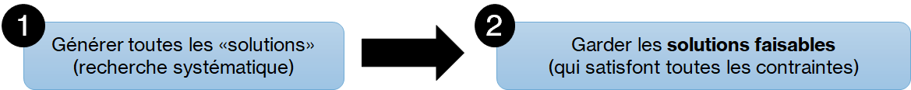
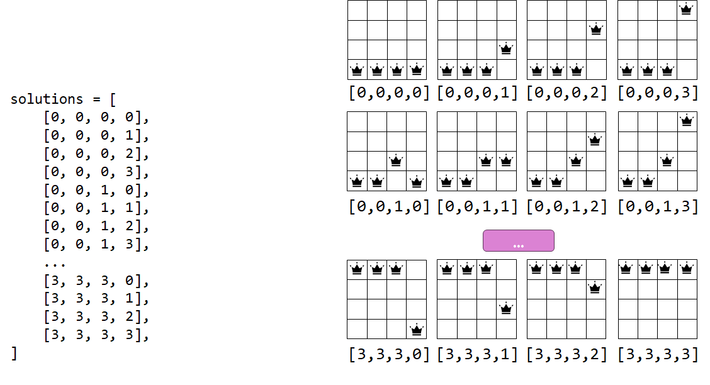
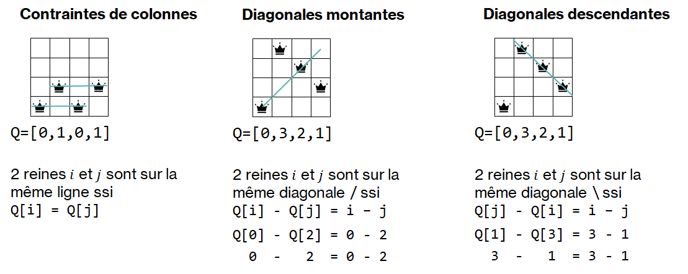

.. _generate-and-test.rst:

Générer et tester
#################

..  contents:: Contenu de la page
    :depth: 3

L'approche la plus évidente pour résoudre le problème des :math:`n` dames est de
générer toutes les :math:`n^n` manières possibles de poser les dames sur
l'échiquier et de tester, pour chacune, si elle est valable ou non.

    Les deux étapes de l'approche par force brute

..  note:: 

    Cette approche pourrait être qualifiée d'approche par **force brute**, car
    elle utilise uniquement la capacité de l'ordinateur de faire beaucoup de
    calcul, sans aucune intelligence ni raisonnement pour améliorer la
    recherche.

Étape 1 : générer les solutions
===============================

Première approche
-----------------

Pour générer toutes les configurations possibles. Pour :math:`n = 4`, on
voudrait générer toutes les solutions suivantes

Pour ce faire, il faudrait pouvoir effectuer un nombre quelconque de boucles
imbriquées:

..  activecode:: generate-nqueens-for-imbriquees
    
    n = 4
    solutions = [
        [a,b,c,d] for a in range(n)
            for b in range(n)
            for c in range(n)
            for d in range(n)
    ]
    
    for no, s in enumerate(solutions):
        if 0 <= no < 8 or no > 251:
            print(f"solution {no + 1} => {s}")
        elif no == 9:
            print("...")
    

..  note::

    Le problème avec cette approche est qu'elle n'est pas **flexible**, car il
    faudrait modifier le code pour une taille d'échiquier différent.

Meilleure approche : ``itertools.product()``
--------------------------------------------

On peut utiliser le module intégré ``itertools`` pour gérer ce problème en
effectuant le produit cartésien d'une séquence avec elle-même.

..  admonition:: Rappel

    En théorie des ensembles, le produit cartésien de deux ensembles ``E1`` et
    ``E2`` est donné par

    ..  math::

        E = E_1 \times E_2 := \{(e_1, e_2) \mid e_1 \in E_1, e_2 \in E_2\}

En Python, on peut effectuer le produit cartésien de deux collections
quelconques, par exemple des ``set`` ou des ``list``:

..  activecode:: 296a143b-03d0-4ac2-873e-4ce16748e4ec

    from itertools import product

    A = [2, 4, 6]
    B = [1, 3, 5]

    E = list(product(A, B))

    print(f"Produit cartésien E = A x B = {E}")
    print(f"|E| = {len(E)}")

On peut donc également effectuer le produit cartésien d'un ensemble avec
lui-même et ce même plusieurs fois d'affilée grâce au paramètre nommé
``repeat``.

..  activecode:: 46ef1517-da97-4f3e-aa75-279716497751

    from itertools import product

    n = 4
    domain = list(range(n))

    solutions = list(product(domain, repeat=n))
    
    # affichage des 8 premières et 8 dernières solutions
    for no, s in enumerate(solutions[:8]):
        print(f"solution {no + 1} => {s}")

    print("...")

    for no, s in enumerate(solutions[-8:]):
        print(f"solution {n ** n - 8 + no + 1} => {s}")

Développement de ``generate_solutions``
---------------------------------------

Développez une fonction ``generate_solutions(n: int) -> list[tuple[int, ...]]`` qui
retourne une liste contenant toutes les solutions possibles (y compris les
solutions incorrectes) pour l'échiquier de taille ``n``.

..  activecode:: nqueens-generate-all-solutions
    :language: webtp

    def generate_solutions(n: int) -> list[tuple[int, ...]]:
        '''
        >>> generate_solutions(n=0)
        [()]
        >>> generate_solutions(n=1)
        [(0,)]
        >>> generate_solutions(n=2)
        [(0, 0), (0, 1), (1, 0), (1, 1)]
        >>> n = 3
        >>> x = generate_solutions(n)
        >>> x[:6]
        [(0, 0, 0), (0, 0, 1), (0, 0, 2), (0, 1, 0), (0, 1, 1), (0, 1, 2)]
        >>> x[-6:]
        [(2, 1, 0), (2, 1, 1), (2, 1, 2), (2, 2, 0), (2, 2, 1), (2, 2, 2)]
        >>> len(x) == n ** n
        True
        '''

        ...

    if __name__ == '__main__':
        import doctest
        doctest.testmod()

..  reveal:: 0c079952-ce87-4d01-a507-ad111cd90067
    :showtitle: Solution

    ..  code-block:: python

        from itertools import product

        def generate_solutions(n: int) -> list[tuple[int, ...]]:
            '''
            >>> generate_solutions(n=0)
            [()]
            >>> generate_solutions(n=1)
            [(0, )]
            >>> generate_solutions(n=2)
            [(0, 0), (0, 1), (1, 0), (1, 1)]
            >>> n = 3
            >>> x = generate_solutions(n)
            >>> x[:6]
            [(0, 0, 0), (0, 0, 1), (0, 0, 2), (0, 1, 0), (0, 1, 1), (0, 1, 2)]
            >>> x[-6:]
            [(2, 1, 0), (2, 1, 1), (2, 1, 2), (2, 2, 0), (2, 2, 1), (2, 2, 2)]
            >>> len(x) == n ** n
            True
            '''
            domain = list(range(n))
            return list(product(domain, repeat=n))

        if __name__ == '__main__':
            import doctest
            doctest.testmod()

Étape 2 : tester les solutions
==============================

Chaque solution potentielle générée lors de l'étape précédente n'est pas
nécessairement correcte. En réalité, la majorité des solutions sont mêmes
incorrectes (*infeasible*), car elles violent au moins une des contraintes du
problème.

    Les trois types de contraintes à vérifier pour chaque solution

On vérifie une solution générée grâce à la fonction ``check_constraints``
développée dans la partie :ref:`nqueens-check-constraints`.

Étape 3 : mettre le tout ensemble
=================================

Rassemblez les étapes 1 et 2 pour générer toutes les solutions du problème de
taille :math:`n` et définissez une fonction ``nqueens_solver(n: int) ->
list[list[int]]`` qui retourne la liste de toutes les solutions du problème des
:math:`n` dames pour une taille donnée.

..  activecode:: nqueens-generate-and-test
    :language: webtp
    :interpreterargs: branch=branch

    def nqueens_solver(n):
        '''
        >>> nqueens_solver(n=1)
        [(0,)]
        >>> nqueens_solver(n=2)
        []
        >>> nqueens_solver(n=3)
        []
        >>> nqueens_solver(n=4)
        [(1, 3, 0, 2), (2, 0, 3, 1)]
        >>> nqueens_solver(n=5)
        [(0, 2, 4, 1, 3), (0, 3, 1, 4, 2), (1, 3, 0, 2, 4), (1, 4, 2, 0, 3), (2, 0, 3, 1, 4), (2, 4, 1, 3, 0), (3, 0, 2, 4, 1), (3, 1, 4, 2, 0), (4, 1, 3, 0, 2), (4, 2, 0, 3, 1)]
        '''
        ...

    if __name__ == '__main__':
        import doctest
        doctest.testmod()

..  reveal:: fefd02d8-94b7-46d1-a3fe-818da30754e8
    :showtitle: Solution
    :hidetitle: Cacher la solution
    :instructoronly:

    ..  code-block:: python

        from itertools import product

        def generate_solutions(n: int) -> list[tuple[int, ...]]:
            '''
            >>> generate_solutions(n=0)
            [()]
            >>> generate_solutions(n=1)
            [(0,)]
            >>> generate_solutions(n=2)
            [(0, 0), (0, 1), (1, 0), (1, 1)]
            >>> n = 3
            >>> x = generate_solutions(n)
            >>> x[:6]
            [(0, 0, 0), (0, 0, 1), (0, 0, 2), (0, 1, 0), (0, 1, 1), (0, 1, 2)]
            >>> x[-6:]
            [(2, 1, 0), (2, 1, 1), (2, 1, 2), (2, 2, 0), (2, 2, 1), (2, 2, 2)]
            >>> len(x) == n ** n
            True
            '''
            domain = list(range(n))
            return list(product(domain, repeat=n))

        def check_constraints(q: list[int]) -> bool:
            '''

            Vérifie que toutes les contraintes du problème soient satisfaites dans
            la solution ``q`` représentant la ligne sur laquelle est placée chaque
            dames ``q[i]``.

            >>> check_constraints([0])
            True
            >>> check_constraints([1, 3, 0, 2])
            True
            >>> check_constraints([1, 3, 5, 0, 2, 4])
            True

            >>> check_constraints([0, 1, 2, 3])
            False
            >>> check_constraints([3, 2, 1, 0])
            False
            >>> check_constraints([1, 3, 0, 0])
            False
            >>> check_constraints([1, 4, 5, 2, 0, 4])
            False

            '''
            n = len(q)

            for i in range(n):
                for j in range(i + 1, n):
                    if q[i] == q[j]: return False
                    if q[i] - q[j] == i - j: return False
                    if q[j] - q[i] == i - j: return False

            return True

        def nqueens_solver(n: int) -> list[tuple[int, ...]]:
            '''
            >>> nqueens_solver(n=1)
            [(0,)]
            >>> nqueens_solver(n=2)
            []
            >>> nqueens_solver(n=3)
            []
            >>> nqueens_solver(n=4)
            [(1, 3, 0, 2), (2, 0, 3, 1)]
            >>> nqueens_solver(n=5)
            [(0, 2, 4, 1, 3), (0, 3, 1, 4, 2), (1, 3, 0, 2, 4), (1, 4, 2, 0, 3), (2, 0, 3, 1, 4), (2, 4, 1, 3, 0), (3, 0, 2, 4, 1), (3, 1, 4, 2, 0), (4, 1, 3, 0, 2), (4, 2, 0, 3, 1)]
            '''
            solutions = generate_solutions(n)
            return [s for s in solutions if check_constraints(s)]

        if __name__ == '__main__':
            import doctest
            doctest.testmod()

..  reveal:: c12ec8c9-80fd-4d62-9be1-1ef8d6a237b6
    :showtitle: Solution avec visualisation de l'échiquier
    :hidetitle: Cacher la solution
    :instructoronly:

    ..  activecode:: 153720d9-863b-40de-af1f-86e38c18b7ae
        :language: webtp
        :interpreterargs: branch=branch

        import micropip
        await micropip.install("https://raw.githubusercontent.com/donnerc/turing-modules/refs/heads/main/dist/turing-0.1.0-py3-none-any.whl")

        from turing.nqueens import draw_chess_board
        from itertools import product
        
        # Visualisation avec la tortue graphique de WebTP
        from gturtle import *

        def check_constraints(q: list[int]) -> bool:
            '''

            Vérifie que toutes les contraintes du problème soient satisfaites dans
            la solution ``q`` représentant la ligne sur laquelle est placée chaque
            dames ``q[i]``.

            >>> check_constraints([0])
            True
            >>> check_constraints([1, 3, 0, 2])
            True
            >>> check_constraints([1, 3, 5, 0, 2, 4])
            True

            >>> check_constraints([0, 1, 2, 3])
            False
            >>> check_constraints([3, 2, 1, 0])
            False
            >>> check_constraints([1, 3, 0, 0])
            False
            >>> check_constraints([1, 4, 5, 2, 0, 4])
            False

            '''
            n = len(q)

            for i in range(n):
                for j in range(i + 1, n):
                    if q[i] == q[j]: return False
                    if q[i] - q[j] == i - j: return False
                    if q[j] - q[i] == i - j: return False

            return True

        def generate_solutions(n: int) -> list[tuple[int, ...]]:
            '''
            >>> generate_solutions(n=0)
            [()]
            >>> generate_solutions(n=1)
            [(0,)]
            >>> generate_solutions(n=2)
            [(0, 0), (0, 1), (1, 0), (1, 1)]
            >>> n = 3
            >>> x = generate_solutions(n)
            >>> x[:6]
            [(0, 0, 0), (0, 0, 1), (0, 0, 2), (0, 1, 0), (0, 1, 1), (0, 1, 2)]
            >>> x[-6:]
            [(2, 1, 0), (2, 1, 1), (2, 1, 2), (2, 2, 0), (2, 2, 1), (2, 2, 2)]
            >>> len(x) == n ** n
            True
            '''
            domain = list(range(n))
            return list(product(domain, repeat=n))

        def nqueens_solver(n: int) -> list[tuple[int, ...]]:
            '''
            >>> nqueens_solver(n=1)
            [(0,)]
            >>> nqueens_solver(n=2)
            []
            >>> nqueens_solver(n=3)
            []
            >>> nqueens_solver(n=4)
            [(1, 3, 0, 2), (2, 0, 3, 1)]
            >>> nqueens_solver(n=5)
            [(0, 2, 4, 1, 3), (0, 3, 1, 4, 2), (1, 3, 0, 2, 4), (1, 4, 2, 0, 3), (2, 0, 3, 1, 4), (2, 4, 1, 3, 0), (3, 0, 2, 4, 1), (3, 1, 4, 2, 0), (4, 1, 3, 0, 2), (4, 2, 0, 3, 1)]
            '''
            feasible_solutions = []
            for sol in generate_solutions(n):
                clear()
                if check_constraints(sol):
                    draw_chess_board(sol, color="green")
                    delay(3000)
                    feasible_solutions.append(sol)
                else:
                    draw_chess_board(sol, color="red")
                    delay(10)
            return feasible_solutions

        if __name__ == '__main__':
            import doctest
            doctest.testmod()