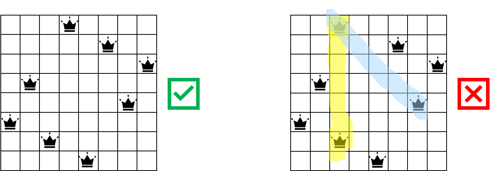
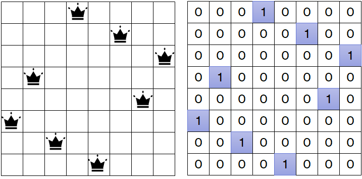
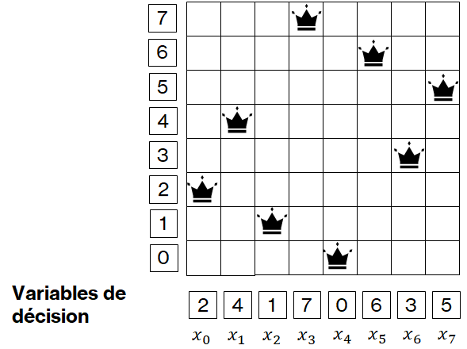

.. _session1/n-queens-csp:

Problèmes de satisfaction de contraintes
########################################

..  contents:: Contenu de la page
    :depth: 3

La programmation par contraintes (PPC) permet essentiellement de faciliter la
résolution de problèmes de satisfaction de contraintes (PSC) complexes.

Exemples
========

Les problèmes suivants sont des problèmes de satisfaction de contraintes

- Résoudre un Sudoku
- Problème des n dames (présenté ci-dessous)
- Problèmes cryptarithmétiques
- Coloriage de graphe avec :math:`k` couleurs
- ...

Problème des :math:`n` dames
============================

Un des PSC les plus célèbres est le problème des :math:`n` dames. Il s'agit de
placer :math:`n` reines sur un échiquier :math:`n \times n`. Pour :math:`n = 8`,
voici une solution correcte (faisable) et une solution incorrecte (infaisable).

    Illustration d'une solution valide au problème des 8 dames (à gauche) et
    d'une solution invalide (à droite).

..  admonition:: Contraintes du problème des :math:`n` dames

    - Contrainte de colonne : chaque dame doit être seule sur sa colonne
    - Contrainte de ligne : chaque dame doit être seule sur sa ligne
    - Contrainte de diagonale montante : chaque dame doit être seule sur sa
      diagonale montante
    - Contrainte de diagonale descendante : chaque dame doit être seule sur sa
      diagonale descendante

..  note::

    En anglais, on parle de *feasible solution* lorsque toutes les contraintes
    sont satisfaites et de *infeasible solution* lorsqu'au moins une contrainte
    est violée.

Représentations possibles
=========================

:math:`n^2` variables booléennes (0/1)
--------------------------------------

    Représentation du problème des :math:`n` dames avec :math:`n^2` variables
    booléennes.

..  admonition:: Désavantages

    - :math:`𝑛^2` variables
    - Il faut vérifier les contraintes de colonnes, lignes et diagonales, car
      cette représentation permet d'encoder des solutions telles que 

      ..  figure:: figures/wrong-nqueens-bool-vars.png
          :align: center
          :width: 90%

:math:`n` variables entières :math:`[0 .. n-1]`
-----------------------------------------------

..  admonition:: Idée

    Tenir compte du fait qu’il n’y a de toute manière qu’une seule reine par
    colonne et se limiter à déterminer la ligne dans laquelle placer chaque
    reine.

    Cela revient à représenter une solution par :math:`n` variables entières
    :math:`x_i \in D = \{0, 1, 2, \ldots, n\}`.

    Représentation du problème des :math:`n` dames avec :math:`n` variables
    entières déterminant le numéro de la ligne de chaque dame.

Visualisation des solutions
===========================

Développez une fonction ``show_nqueens(solution: list[int]) -> str`` qui
retourne une chaîne de caractères permettant de visualiser la position des
reines sur l'échiquier. La solution ``solution`` est une liste d'entiers ``q:
list[int]`` où ``q[i]`` représente la ligne sur laquelle se trouve la reine
occupant la colonne ``i``.

..  activecode:: show_nqueens_py
    :language: webtp

    def show_nqueens(q: list[int]) -> str:
        '''
        >>> board = show_nqueens([0])
        >>> type(board)
        <class 'str'>
        >>> print(board)
        Q

        >>> board = show_nqueens([0, 1, 2, 3])
        >>> print(board)
        . . . Q
        . . Q .
        . Q . .
        Q . . .

        >>> board = show_nqueens([1, 3, 0, 2])
        >>> print(board)
        . Q . .
        . . . Q
        Q . . .
        . . Q .

        >>> board = show_nqueens([1, 3, 5, 0, 2, 4])
        >>> print(board)
        . . Q . . .
        . . . . . Q
        . Q . . . .
        . . . . Q .
        Q . . . . .
        . . . Q . .

        '''
        return ''

    import doctest
    doctest.testmod()

..  reveal:: 900da980-436e-46dd-9c64-988a22efb684
    :showtitle: Solution

    ..  code-block:: python

        def show_nqueens(q: list[int]) -> str:
            '''
            >>> board = show_nqueens([0])
            >>> board
            'Q'
            >>> print(board)
            Q

            >>> board = show_nqueens([0, 1, 2, 3])
            >>> print(board)
            . . . Q
            . . Q .
            . Q . .
            Q . . .

            >>> board = show_nqueens([1, 3, 0, 2])
            >>> print(board)
            . Q . .
            . . . Q
            Q . . .
            . . Q .

            >>> board = show_nqueens([1, 3, 5, 0, 2, 4])
            >>> print(board)
            . . Q . . .
            . . . . . Q
            . Q . . . .
            . . . . Q .
            Q . . . . .
            . . . Q . .

            '''
            n = len(q)

            def row(i: int) -> list[str]:
                return ' '.join(['Q' if q[j] == i else '.' for j in range(n)])

            return '\n'.join([row(i) for i in range(n - 1, -1, -1)])

        import doctest
        doctest.testmod()

Visualisation d'une solution avec ``gturtle``
=============================================

..  activecode:: nqueens-gturtle-visu
    :language: webtp

    from collections.abc import Iterable
    from gturtle import *

    def draw_chess_board(solution: Iterable[int], x: int = 0, y: int = 0, size: int = 50, color="black") -> tuple[int, int]:
        '''
        Représente la solution `solution` aux coordonnées (x, y) avec des carrés
        de taille `size` pixels avec la couleur `color`.
        '''

        def square(cx: float, cy: float) -> None:
            setPos(cx - size / 2, cy - size / 2)
            for _ in range(4):
                fd(size)
                rt(90)

        def queen(cx: float, cy: float) -> None:
            setPos(cx, cy)
            dot(size * 0.7)
            
        hideTurtle()
        setPenColor(color)
        setFontSize(size * 0.95)

        n = len(solution)

        for i in range(n):
            for j in range(n):
                cx = x + i * size - size / 2
                cy = y + j * size - size / 2
                square(cx, cy)
                if solution[i] == j:
                    queen(cx, cy)

        setPos(x - size, y - 2 * size)
        setHeading(0)
        label("  ".join(str(q) if q is not None else '?' for q in solution))

        return n, size

    draw_chess_board([1, 3, 5, 0, 2, 4])

Visualisation d'une solution avec pygame
========================================

Si vous connaissez pygame, voici une visualisation qui utilise ce framework de
création de jeux:

..
    Version sans POO
    ----------------

    Le code suivant vous permet de visualiser une solution avec la bibliothèque de
    création de jeux pygame (https://pyga.me/).

    ..  activecode:: nqueens-visu-pygame
        :language: webtp

        import pygame as pg
        from pygame.locals import *
        import time

        # Constants
        SIZE = 50                   # SIZE of a square in px
        BG_WHITE = (230,230,230)    
        BG_BLACK = (47,79,79)       
        QUEENS_COLOR = (255, 0, 0)

        def draw_board(screen, n: int) -> None:
            for x in range(n):
                for y in range(n):
                    if((x+y)&1^1):
                        pg.draw.rect(screen, BG_WHITE, (x*SIZE, y*SIZE, SIZE, SIZE))

        def draw_queens(screen, solution: list[int]) -> None:
            for col, row in enumerate(solution):
                x = SIZE // 2 + col * SIZE
                y = SIZE // 2 + row * SIZE
                pg.draw.circle(screen, QUEENS_COLOR, (x, y), int(SIZE // 2 * 0.6))

        def show_solution(solution: list[int]) -> None:
            n = len(solution)
            screen = pg.display.set_mode((800,200))
            pg.display.set_caption('N Queens solution visualization N:')
            done = False
            screen.fill(BG_BLACK)
            screen = pg.display.set_mode((SIZE*n, SIZE*n))
            pg.display.set_caption('Solution of N Queens')

            draw_board(screen, n)
            draw_queens(screen, solution)

            pg.display.update()

            while not done:
                for event in pg.event.get():
                    if event.type == pg.QUIT:
                        done = True

        pg.init()
        solution = [0, 1, 2, 3]
        transformed_solution = [len(solution) - x - 1 for x in solution]
        show_solution(transformed_solution)
        pg.quit()

    Version orientée objets
    -----------------------

Le code suivant vous permet de visualiser une solution avec la bibliothèque de
création de jeux pygame (https://pyga.me/).

Voici une version orientée objets du même programme de visualisation, avec
quelques améliorations supplémentaires.

..  note:: 

    Étudiez ce programme pour réviser les notions de programmation orientée
    objets. Ces notions seront essentielles pour la suite de ce module.

..  activecode:: nqueens-visu-pygame-oop
    :language: webtp

    import pygame
    from pygame.locals import *
    # import time

    # types
    NQueensSolution = list[int]

    # Constants
    SIZE = 50  # SIZE of a square in px
    BG_WHITE = (230, 230, 230)
    BG_BLACK = (47, 79, 79)
    QUEENS_COLOR = (230, 80, 80)

    class NQueensVisu:
        
        def __init__(self, n: int, **kwargs):
            self.n = n
            self.screen = pygame.display.set_mode((SIZE * n, SIZE * n))

            self.inverted = kwargs.get('inverted', False)

            pygame.init()
            pygame.display.set_caption("N Queens solution visualization N:")

        def draw_board(self) -> None:
            n = self.n
            for x in range(n):
                for y in range(n):
                    if (x + y) & 1 ^ 1:
                        pygame.draw.rect(
                            self.screen,
                            BG_WHITE,
                            (x * SIZE, y * SIZE, SIZE, SIZE)
                        )
        
        @staticmethod
        def transform_solution(solution: NQueensSolution) -> NQueensSolution:
            return [len(solution) - x - 1 for x in solution]
        
        
        def show(self, solution: NQueensSolution, inverted: bool = False) -> None:
            self.reset()
            
            if inverted or self.inverted:
                solution = NQueensVisu.transform_solution(solution)
        
            for col, row in enumerate(solution):
                x = SIZE // 2 + col * SIZE
                y = SIZE // 2 + row * SIZE
                pygame.draw.circle(
                    self.screen,
                    QUEENS_COLOR,
                    (x, y),
                    int(SIZE // 2 * 0.6)
                )
        
            pygame.display.update()
        
        def reset(self):
            self.screen.fill(BG_BLACK)
            self.draw_board()
            pygame.display.update()
        
        
        def event_loop():
            done = False
            while not done:
                for event in pygame.event.get():
                    if event.type == pygame.QUIT:
                        done = True

            pygame.quit()

    if __name__ == '__main__':
        solution = [0, 1, 2, 3, 4]
        v = NQueensVisu(n=len(solution), inverted=True)
        v.show(solution)

.. _nqueens-check-constraints:

Vérification d'une solution
===========================

Développez une fonction ``check_constraints(q: list[int]) -> bool`` qui
détermine si la solution ``q`` reçue en paramètre est admissible ou non.

..  admonition:: Cas de test

    Pour tester votre fonction, le module ``doctest`` est utilisé pour exécuter
    automatiquement les **cas de test** présents dans la **docstring** de la
    définition de la fonction.

    ..  figure:: figures/nqueens-check-constraints-testcases.png
        :align: center
        :width: 100%

        Cas de test pour valider la fonction. Ceci ne constitue pas une preuve
        absolue que la fonction est correcte, mais ces tests sont suffisants
        pour nos besoins.

..  activecode:: check_nqueens_constraints
    :language: webtp

    def check_constraints(q: list[int]) -> bool:
        '''

        Vérifie que toutes les contraintes du problème soient satisfaites dans
        la solution ``q`` représentant la ligne sur laquelle est placée chaque
        dames ``q[i]``.

        >>> check_constraints([0])
        True
        >>> check_constraints([1, 3, 0, 2])
        True
        >>> check_constraints([1, 3, 5, 0, 2, 4])
        True

        >>> check_constraints([0, 1, 2, 3])
        False
        >>> check_constraints([3, 2, 1, 0])
        False
        >>> check_constraints([1, 3, 0, 0])
        False
        >>> check_constraints([1, 4, 5, 2, 0, 4])
        False

        '''
        return True

    if __name__ == '__main__':
        import doctest
        doctest.testmod()

..  reveal:: 6ea2c234-6514-4166-ac2f-77ff22b3c504
    :showtitle: Solution

    ..  code-block:: python
        :linenos:

        def check_constraints(q: list[int]) -> bool:
            '''

            Vérifie que toutes les contraintes du problème soient satisfaites dans
            la solution ``q`` représentant la ligne sur laquelle est placée chaque
            dames ``q[i]``.

            >>> check_constraints([0])
            True
            >>> check_constraints([1, 3, 0, 2])
            True
            >>> check_constraints([1, 3, 5, 0, 2, 4])
            True

            >>> check_constraints([0, 1, 2, 3])
            False
            >>> check_constraints([3, 2, 1, 0])
            False
            >>> check_constraints([1, 3, 0, 0])
            False
            >>> check_constraints([1, 4, 5, 2, 0, 4])
            False

            '''
            n = len(q)

            for i in range(n):
                for j in range(i + 1, n):
                    if q[i] == q[j]: return False
                    if q[i] - q[j] == i - j: return False
                    if q[j] - q[i] == i - j: return False
            
            return True

        if __name__ == '__main__':
            import doctest
            doctest.testmod()

Résolution à la main
====================

Sans lire les pages suivantes du cours, trouvez au moins 3 solutions faisables
très différentes du problème des n dames. Deux solutions sont essentiellement
différentes si l'on ne peut pas obtenir l'une de l'autre par symétrie centrale,
axiale ou rotation de l'échiquier.

..  admonition:: Conseil

    Pour trouver les solutions, affectez des valeurs aux listes ``q1``, ``q2``
    et ``q3`` ci-dessous.

..  activecode:: nqueens-handsolutions
    :language: webtp
    :interpreterargs: branch=branch

    import micropip
    await micropip.install("https://raw.githubusercontent.com/donnerc/turing-modules/refs/heads/main/dist/turing-0.1.0-py3-none-any.whl")

    from turing.nqueens import *
    from gturtle import *

    n = 8

    q1 = [0, 0, 0, 0, 0, 0, 0, 0]
    q2 = [0, 0, 0, 0, 0, 0, 0, 0]
    q3 = [0, 0, 0, 0, 0, 0, 0, 0]

    solutions: list[list[int]] = [q1, q2, q3]

    x, y, = -300, -150
    for no, sol in enumerate(solutions):
        color = "green" if check_constraints(sol) else "red"
        n, size = draw_chess_board(sol, x, y, size=30, color=color)

        setPos(x, y)
        x += n * size + 30
            
