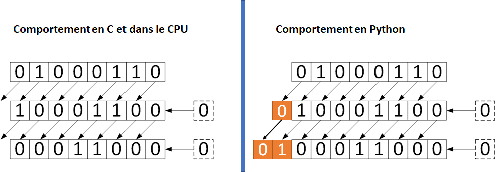
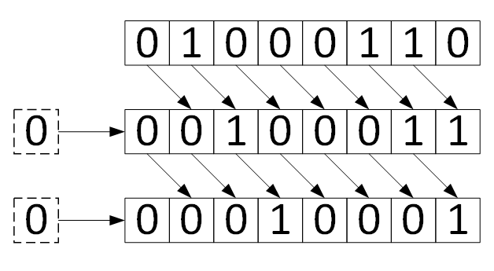
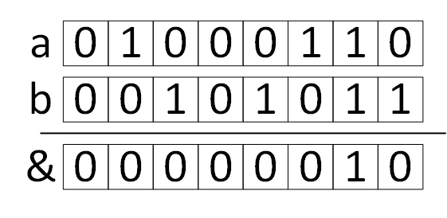
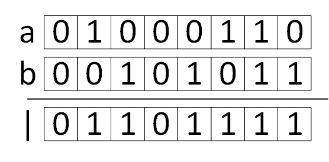
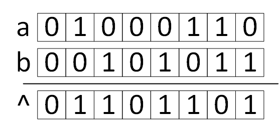
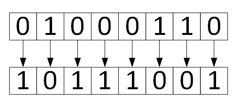

.. _bitwise-operators:

Opérateurs sur les bits
#######################

..  contents:: Contenu de la page
    :depth: 3

..  reveal:: 7a5e6e9b-98b2-4bdd-b8a0-8f5053ca5126
    :instructoronly: 

    Mettre en évidence, à l'aide d'exemples ou de petits exemples l'utilité
    concrète des différents opérateurs.

Vous connaissez déjà les types suivants d'opérateurs

* Opérateurs arithmétiques ``+``, ``*``, ``-``, ``/``, ``//``, ``%``
* Opérateurs d'affectation ``=``, ``+=``, etc.
* Opérateurs d'indexation (subscript) ``[]``

Dans cette section, nous allons étudier un type d'opérateurs particuliers qui
permettent de manipuler des informations directement au niveau des bits.

Opérateurs de décalage
======================

Décalage à gauche ``<<`` (left shift)
-------------------------------------

On peut décaler tous les bits d'un nombre d'un certain nombre de positions vers
la gauche.

..  admonition:: Syntaxe

    ::

        number << nb_positions

    Décalage à gauche des bits du nombre entier :math:`70_{10} =
    01000110_{2}`.

Le code Python correspondant est 

..  activecode:: 2ce07615-0d78-4445-ae44-21b220b92bf9

    data = 70
    shifted = data << 1
    double_shifted = data << 2

    print(f"Données originales : {bin(data)} ({data})")
    print(f"Après décalage de 1 position : {bin(shifted)} ({shifted})")
    print(f"Après décalage de 2 position : {bin(double_shifted)} ({double_shifted})")

..  admonition:: Remarque (multiplication par 2)

    Lorsqu'on décale tous les bits d'un nombre entier à gauche de 1 position, on
    le double. Comme cette opération est très simple et efficace à exécuter au
    niveau du CPU, on utilise souvent cette opération pour multiplier un nombre
    par une puissance de 2 de manière très efficace.

Décalage à droite ``>>`` (right shift)
--------------------------------------

On peut aussi décaler tous les bits d'un nombre d'un certain nombre de positions
vers la droite.

..  admonition:: Syntaxe

    ::

        number >> nb_positions

    Décalage à droite des bits du nombre entier :math:`70_{10} = 01000110_{2}`.

Le code Python correspondant est 

..  activecode:: 53f07da3-643c-419d-a07d-11b54f9aa600

    data = 70
    shifted = data >> 1
    double_shifted = data >> 2

    print(f"Données originales :           {bin(data)} ({data})")
    print(f"Après décalage de 1 position : {bin(shifted)} ({shifted})")
    print(f"Après décalage de 2 position : {bin(double_shifted)} ({double_shifted})")

..  admonition:: Remarque (division entière par 2)

    Lorsqu'on décale tous les bits d'un nombre entier à droite de 1 position, on
    le divise par 2 si le nombre est pair. Si le nombre est impair, le bit de
    poids faible est perdu et on effectue donc une division euclidienne par 2,
    en laissant tomber le reste de la division. Comme cette opération est très
    simple et efficace à exécuter au niveau du CPU, on utilise souvent cette
    opération pour diviser un nombre par une puissance de 2 de manière très
    efficace.

Opérateurs logiques bit à bit
=============================

Combinaison AND (opérateur ``&``)
---------------------------------

Il est également possible d'effectuer des opérations logiques bit à bit pour
combiner logiquement les bits de deux nombres entiers. 

..  admonition:: Remarque

    Les deux nombres sont considérés comme alignés à droite et on "complète"
    avec des bits à 0 à gauche pour que les deux nombres comportent le même
    nombre de bits.

..  admonition:: Syntaxe

    ::

        a & b

    Et logique bit à bit entre les bits des nombres entiers :math:`a = 70_{10} =
    01000110_{2}` et :math:`b = 43_{10} =
    00101011_{2}`.

..  activecode:: 790e7cd8-d629-4556-81fe-04dba0d3afe1

    a = 70
    b = 43
    bitwise_and = a & b

    print(f"a :   {bin(a)} ({a})")
    print(f"b :   {bin(b)} ({b})")
    print(f"& :   {bin(bitwise_and)} ({bitwise_and})")

..  admonition:: Utilité

    L'opérateur ``a & b`` est souvent utilisée pour ne garder que certains bits
    du nombre ``a``. On dit dans ce cas que ``b`` est un "masque binaire".

Combinaison OR (Opérateur ``|``)
--------------------------------

..  admonition:: Syntaxe

    ::

        a | b

    OU logique bit à bit entre les bits des nombres entiers :math:`a = 70_{10} =
    01000110_{2}` et :math:`b = 43_{10} = 00101011_{2}`.

..  activecode:: 21b1e325-4f41-4a2f-8be4-356a8fbe8c63

    a = 70
    b = 43
    bitwise_or = a | b

    print(f"a :   {bin(a)} ({a})")
    print(f"b :   {bin(b)} ({b})")
    print(f"| :   {bin(bitwise_or)} ({bitwise_or})")

..  admonition:: Utilité

    L'opérateur ``a | b`` est souvent utilisée pour combiner les bits des
    nombres ``a`` et ``b``.

Combinaison XOR (opérateur ``^``)
---------------------------------

Python dispose au niveau des bits d'une fonction logique qui n'existe pas en
tant qu'opérateur booléen : le XOR (eXclusive OR). Le OU exclusif est donné par
la table de vérité suivante.

Un bit dans le résultat est à 1 si et seulement si un des deux bits est à 1.
Autrement dit, les deux bits en entrée ne peuvent pas être à 1.

..  admonition:: Syntaxe

    ::

        a ^ b

    OU logique exclusif (XOR) bit à bit entre les bits des nombres entiers
    :math:`a = 70_{10} = 01000110_{2}` et :math:`b = 43_{10} = 00101011_{2}`.

..  activecode:: 3869a3c5-a43d-479a-870f-831b33297ed9

    a = 70
    b = 43
    bitwise_xor = a ^ b

    print(f"a :   {bin(a)} ({a})")
    print(f"b :   {bin(b)} ({b})")
    print(f"^ :   {bin(bitwise_xor)} ({bitwise_xor})")

..  admonition:: Remarques et applications

    Le XOR dispose de propriétés très intéressantes.

    * Il correspond à l'addition modulo 2
    * :math:`((a \oplus b) \oplus b) = a`. Autrement dit, on a ``a ^ b ^ b ==
      a``

    On peut donc utiliser le XOR pour chiffrer un texte bit à bit avec un
    **masque binaire** qui constitue la clé de chiffrement et de déchiffrement
    (One-Time-Pad).

Inversion des bits (opérateur ``~``)
------------------------------------

On peut inverser tous les bits d'un nombre avec l'opérateur ``~``. Il s'agit
d'un opérateur unaire qui n'accepte qu'un seul opérande.

..  admonition:: Syntaxe

    ::

        ~ number

    Inversion des bits du nombre entier :math:`70_{10} = 01000110_{2}`.

..  activecode:: 7628e2bb-9afe-4e37-a7f7-91672bb76f91

    data = 70
    flipped = ~data

    print(f"Données originales :   {bin(data)} ({data})")
    print(f"Après inversion :      {bin(flipped)} ({flipped})")

..  admonition:: Complément à 1

    Mathématiquement, inverser les bits d'un nombre entier revient à calculer
    son **complément à 1**.

    Du point de vue logique, cela correspond à faire une opération NOT sur
    chacun des bits du nombre.

Questions de compréhension
==========================

Question 1
----------

Indiquez ce qu'affiche le programme suivant

..  shortanswer:: 4561f07a-2f9a-48a0-97b2-fd0056fd4f1a

    ::
        
        print(47 & 23)

..  reveal:: 2d2caa48-2742-47ca-ae21-a918965abaf5
    :showtitle: Réponse

    ..  figure:: bitwise-operators/comprehension-01-solution.png
        :align: center
        :width: 90%

Question 2
----------

Indiquez ce qu'affiche le programme suivant

..  shortanswer:: 6e14c328-828c-4048-bacd-e375ac243abe

    ::
        
        print(47 | 23)

..  reveal:: fb57b2d6-fd46-4b01-b198-2865c0221157
    :showtitle: Réponse

    ..  figure:: bitwise-operators/comprehension-02-solution.png
        :align: center
        :width: 90%

Question 3
----------

Indiquez ce qu'affiche le programme suivant

..  shortanswer:: 440523b8-c5f7-4472-b6e9-93a97449aa4c

    ::
        
        print(47 ^ 23)

..  reveal:: 4aa0c6ac-cb53-4dee-8f36-10c856a7b18d
    :showtitle: Réponse

    ..  figure:: bitwise-operators/comprehension-03-solution.png
        :align: center
        :width: 90%

Question 4
----------

Indiquez ce qu'affiche le programme suivant

..  shortanswer:: cab93476-0c43-442f-b4ea-6ed0e9e93493

    ::
        
        print(47 ^ 11 ^ 11)

..  reveal:: 3ec37a21-2a06-407a-9e57-602b7148d87d
    :showtitle: Réponse

    ..  figure:: bitwise-operators/comprehension-04-solution.png
        :align: center
        :width: 90%

Question 5A
-----------

Indiquez ce qu'affiche le programme suivant

..  shortanswer:: 17ac3feb-3c57-4247-b625-95cee6c1df34

    ::
        
        print(0b1101 & 1)

..  reveal:: b660d265-41f2-41e0-9c45-255ff952aac6
    :showtitle: Réponse

    ..  admonition:: Réponse

        ::

              1101
            & 0001
            ------
              0001

        La réponse est donc ``1``

Question 5B
-----------

Indiquez ce qu'affiche le programme suivant

..  shortanswer:: 9b7ef94e-9d83-43a1-a46d-2e4e16f63205

    ::
        
        print(16 & 1)

..  reveal:: 44de4983-339e-4cdc-8da1-4640ea9da119
    :showtitle: Réponse

    ..  admonition:: Réponse

        ::

              10000
            & 00001
            ------
              00000

        La réponse est donc ``0``

Question 5C
-----------

Indiquez ce qu'affiche le programme suivant

..  shortanswer:: 2a431b50-2c8d-42a1-906b-934073eab566

    ::
        
        print(20 & 4)

..  reveal:: 08685b6b-7d2c-41e4-845e-05721f8454c0
    :showtitle: Réponse

    ..  admonition:: Réponse

        ::

              10100
            & 00100
            ------
              00100

        La réponse est donc ``4``

Question 7
----------

Indiquez ce qu'affiche le programme suivant

..  shortanswer:: 45063049-b6f0-446e-9565-3f78519a884c

    ::
        
        result = ''
        x = 65

        while x > 0:
            result += str(x & 1)
            x = x >> 1
            
        print(result)

..  reveal:: fa5d654b-75f5-4d31-8ad8-c6283c5de7b9
    :showtitle: Réponse

    ..  admonition:: Réponse

        La programme affiche la représentation binaire du nombre entier 65. La
        ligne 5 ajoute à chaque itération la valeur du bit de poids faible (LSB
        = Least Significant Bit) à la chaîne result.

        La ligne 6 décale à chaque fois tous les bits vers la droite d'une
        position. Lors de la prochaine itération, on lira donc le bit suivant.

        Le programme affiche donc

        ::
            
            1000001

Question 8
----------

Indiquez ce qu'affiche le programme suivant

..  shortanswer:: 8fcec2a0-bd23-446d-9d88-cc64acab200a

    ::
        
        result = ''
        x = ~65

        while x > 0 or x < -1:
            result += str(x & 1)
            x = x >> 1
            
        print(result)

    ..  reveal:: 52b4769a-626f-40e7-9931-7d52162616bb
        :showtitle: Réponse

        ..  admonition:: Réponse

            Fonctionne comme le programme de l'exercice précédent, mais en
            affichant la représentation binaire du **complément à 1** (tous les
            bits inversés).

            Il a fallu pour cela adapter la condition du ``while`` pour tenir
            compte du cas où les nombres sont négatifs (ce qui est le cas
            lorsqu'on prend le complément à 1 d'un nombre positif).

            Le programme affiche donc

            ::
                
                0111110

Question 9
----------

Indiquez ce qu'affiche le programme suivant

..  shortanswer:: 71130108-81b0-4088-a0af-ebd746b54f2f

    ::
        
        def newsize(size):
            return (size + (size >> 3) + 6) & ~3

        size = 0
        for i in range(8):
            size = newsize(size)
            print(size)

..  reveal:: b5f59bb4-e42f-48bc-b205-77d75534e2cd
    :showtitle: Réponse

    ..  admonition:: Réponse

        La ligne 2 est une transcription en Python du code C utilisé dans
        l'interpréteur pour gérer le motif de croissance du tableau dynamique
        sous-jacent aux listes Python. Au début, une liste Python croît donc de
        4 en 4, puis de 8 en 8 etc. Cette croissance est quasi-géométrique, pour
        garantir une complexité amortie :math:`O(1)` de l'opération de
        ``append`` dans une liste.

        ..  admonition:: Référence

            https://github.com/python/cpython/blob/3.11/Objects/listobject.c#L70

        :: 

            4
            8
            12
            16
            24
            32
            40
            48
            60
            72
            84
            100
            116
            136
            156
            180
            208
            240
            276
            316

Exercices
=========

Exercice 1 (rotation à droite)
------------------------------

..  activecode:: bitwise_rotate_right_8.py

    Développez une fonction Python ``rotate_right_8(n: int, k: int) -> int`` qui
    prend en paramètre un nombre de 8 bits et le décale de :math:`k` bits vers
    la droite. Les bits “perdus à droite” doivent être “récupérés” et replacés à
    gauche.

    ..  admonition:: Exemples

        ::

            >>> bin(rotate_right_8(0b1100_1011, 2))
            '0b11110010'
            >>> bin(rotate_right_8(0b1100_1011, 3))
            '0b1111001'
            >>> bin(rotate_right_8(0b1100_1011, 4))
            '0b10111100'
            >>> bin(rotate_right_8(0b1100_1011, 1))
            '0b11100101'
            >>> bin(rotate_right_8(0b1100_1011, 0))
            '0b11001011'

    ~~~~

    def rotate_right_8(n: int, k: int) -> int:
        pass

    
    if __name__ == '__main__':
        import doctest
        doctest.testmod()
    
..  reveal:: 86fe4424-3671-4ec3-bdb6-adbd6badf361
    :showtitle: Solution

    ::
        
        def rotate_right_8(n: int, k: int) -> int:
            '''
            >>> bin(rotate_right_8(0b1100_1011, 2))
            '0b11110010'
            >>> bin(rotate_right_8(0b1100_1011, 3))
            '0b1111001'
            >>> bin(rotate_right_8(0b1100_1011, 4))
            '0b10111100'
            >>> bin(rotate_right_8(0b1100_1011, 1))
            '0b11100101'
            >>> bin(rotate_right_8(0b1100_1011, 0))
            '0b11001011'
            '''
            # shift 4 bits to the right
            right_part = n >> k
            # mask to get the (8-k) rightmost bits
            left_mask = (0b11111111 >> (8 - k))
            # take the (8-k) rightmost bits and shift them (8-k) positions to the left
            left_part = (n & left_mask) << (8 - k)
            
            return (
                # combine the left and right parts
                left_part | right_part
            )

        if __name__ == '__main__':
            import doctest
            doctest.testmod()

Exercice 2 (Création de masque binaire)
---------------------------------------

..  activecode:: bitwise_bitmask.py

    Développez une fonction ``bitmask(n: int, positions: list[int]) -> int`` qui
    crée un masque binaire de taille ``n`` avec les bits aux positions indiquées
    par ``positions`` à 1 et tous les autres bits à 0.

    Les bits sont numérotés à partir de 1 et depuis la gauche selon le schéma
    :math:`b_1, b_2, b_3, b_4, \ldots, b_n`.

    Votre fonction ne doit pas utiliser la fonction ``bin`` ni travailler sur
    une représentation sous forme de chaîne binaire. Les opérations doivent être
    faites avec les opérateurs sur les bits directement et retourner un nombre
    correspondant au masque binaire désiré.

    ..  
        admonition:: Exemples

        ::

            >>> bitmask(6, [2, 4]) # => 01 0100
            0x14
            >>> bitmask(6, [1, 3]) # => 10 1000
            0x28
            >>> bitmask(6, [5, 6]) # => 00 0011
            0x03
            >>> bitmask(8, [2, 4]) # => 0101 0000
            0x50
            >>> bitmask(8, [1, 3]) # => 1010 0000
            0xa0
            >>> bitmask(8, [5, 6]) # => 0000 1100
            0x0c

    ~~~~

    def bitmask(n: int, positions: list[int]) -> int:
        '''

        Returns the bitmask b1,b2,b3,...,bn, where bi == 1 if and only if i is
        in positions.

        >>> hex(bitmask(6, [2, 4])) # => 01 0100
        '0x14'
        >>> hex(bitmask(6, [1, 3])) # => 10 1000
        '0x28'
        >>> hex(bitmask(6, [5, 6])) # => 00 0011
        '0x3'
        >>> hex(bitmask(8, [2, 4])) # => 0101 0000
        '0x50'
        >>> hex(bitmask(8, [1, 3])) # => 1010 0000
        '0xa0'
        >>> hex(bitmask(8, [5, 6])) # => 0000 1100
        '0xc'
        '''
        ...

    if __name__ == '__main__':
        import doctest
        doctest.testmod()

..  reveal:: a72f4e0d-55dd-4020-9c27-eeef22bdfc5e
    :showtitle: Solution

    ..  admonition:: Solution

        ::

            def bitmask(n: int, positions: list[int]) -> int:
                '''

                Returns the bitmask b1,b2,b3,...,bn, where bi == 1 if and only if i is
                in positions.

                >>> hex(bitmask(6, [2, 4])) # => 01 0100
                '0x14'
                >>> hex(bitmask(6, [1, 3])) # => 10 1000
                '0x28'
                >>> hex(bitmask(6, [5, 6])) # => 00 0011
                '0x3'
                >>> hex(bitmask(8, [2, 4])) # => 0101 0000
                '0x50'
                >>> hex(bitmask(8, [1, 3])) # => 1010 0000
                '0xa0'
                >>> hex(bitmask(8, [5, 6])) # => 0000 1100
                '0xc'
                '''
                ...

                mask = 0
                for p in positions:
                    mask |= (1 << (n - p))
                return mask

Exercice 3
----------

..  activecode:: bitwise_to_binary.py

    Développez une fonction ``to_binary(data: int, size: int) -> str`` qui
    retourne une chaîne de ``size`` bits correspondant au nombre ``data``.

    Si le nombre de bits est insuffisant pour représenter le nombre ``data``, la
    fonction doit lever une exception de type ``ValueError`` avec le message
    "Unable to represent the number {data} on {size} bits"

    ..  admonition:: Lever une exception

        Pour lever une exception, utiliser la syntaxe ``raise ValueError(message)``

    ..  admonition:: Exemples

        >>> to_binary(20, 6)
        '010100'
        >>> to_binary(20, 5)
        '10100'
        >>> to_binary(20, 5)
        Traceback (most recent call last):
        ...
        ValueError: Unable to represent the number 20 on 4 bits
        

    ~~~~

    def to_binary(data: int, size: int) -> str:
        '''
        >>> to_binary(20, 6)
        '010100'
        >>> to_binary(20, 5)
        '10100'
        >>> to_binary(20, 4)
        Traceback (most recent call last):
        ...
        ValueError: Unable to represent the number 20 on 4 bits
        '''
        ...

    if __name__ == '__main__':
        import doctest
        doctest.testmod()

..  reveal:: 2554d040-97d4-4e48-b583-fcf9376fd508
    :showtitle: Solution 1 (uniquement nombres positifs)

    ..  raw:: html

        <a href="https://webtigerpython.ethz.ch/?code=NobwRAdghgtgpmAXGGUCWEB0AHAnmAGjABMoAXKJMAHQmLgDMACMgewH0AjDKAJ1wAUpCoiYYyBJgGc0ALzijxkmQHMIcYqM6tWAGyYBeJgDlW6gJRMAtAD5pZXolpMXTAOQfnrmz5Ydu0PwCAEwADJIAbOZeLm6hAIwJoaFuMUw-dmxcPEFhkgCs0RCu7omJKWkZftmBggDM8QVFJW7xbW2pxd6-WQF89cFNaQAqvFAAxnCcEwDWTAIwrFJkTLxwkxAr41C6-rpQy-ZOXS6YZ2kAajsArnAAory8rI5MAKrQnLpwfqtw2GtSOCbFgAC2-EGuME4cF4TDqwSYZiY-SY3DIUjSHk6JTQzGEUHS8wE8SYAB5SdI5HBLFYmPEjmkSmM0ICmFddLcHk9eAIGNQwO8oJ9vmxfv84IDgWQwUwIVCYUwQPiAL6I4ogGTyVVojFgIppHWGJjAUIAXSYACpKfI0mgjfFaGkAO4gtBfMRkoyahSM1w64BWNDmoz4pgAMjpvpcoZ8RgdJxKHoA1HGo0w0msyNdeMUPJgAFasDACZY8ziWBjPVFiYo6_UQXFMdjsaDwZuGIxuZuoDDNtzHHEwbDPFbEVjjMgSshpMcTqeYSfLRbEARFMDK01AA">
            Code exécutable dans WebTigerPython
        </a>    

..  reveal:: 1cfa5055-8f2f-4054-a99b-7a6f95ff6058
    :showtitle: Solution 2 (extension pour traiter les nombres négatifs en complément à 2)

    ..  raw:: html

        <a href="https://webtigerpython.ethz.ch/?code=NobwRAdghgtgpmAXGGUCWEB0AHAnmAGjABMoAXKJMAHQmLgDMACMgewH0AjDKAJ1wAUpCoiYYyBJgGc0ALzijxkmQHMIcYqM6tWAGyYBeJgDlW6gJRMAtAD5pZXolpMXTAOQfnrmz5Ydu0PwCAEwADJIAbOZeLm6hAIwJoaFuMUw-dmxcPEFhkcpoahoGAGJQulJw0RCu7kmJKWkZftmBgnlMEQVFxAYAKrwArlVpcYkNqTXevlkBfO3hTACs1bVu48mTtc2zOYIAzPGSK6PxZ2db05n-ewJWAOySACyrruvJ8ZcuOzdtd49MJ6SAbDV6xBqfJozX7zf7PSRlCojKYuAZQADGcE4GIA1kwBDBWFIyExeHBMRASejyvpdFBieYnCimJhWWkAGrlYYAUV4vFYjiYAGEoBAIKwSWTsGTKpSmFAmOoVOQ0AA3OCKwYwThwXhMTi4JiDCCqdTEMSUqHXVqwqxHQFg9znSHMn42oJWAAcz0d702Vpacw9AE4fWk0Zjsei8QSiZLyXA5dTdLT6WRGWlWZgOVy4Lz-YKAKrQTi6DVsUlwaVwWUksgACw1EC1Or1VmDTDMgP1aDIUnl_dNGgtZDgKl1Ad2f32wWOjojWNx-MJxMrFKpNKYdIZTNqWZzuh5fIFomLUFL5dYlertZYjc12t1TBnnZqSx7fdGnmZaGYwgVAA8TChLutSuL-0iFGahhGIilSgWBYG8OglRMJyh55sevACAw1BgCKYoSteMqJiSCpKiq6oPq2-qGsaQ7muIeGOrUcBIghiGuAxhhMCCcC0GkEHiiS3Giua_7pPiAjxEwAFATI8iWFYTDxBmzK1MhaCoehR4FjheFnhefjETWpF3k2LZPiA_4AL6vkwIAKXAdncJ-YDVIJzAMRxtTaMa5pGDJcn4k51gqZYADETDBEwABUsUhXIGphapaS1EJRF3H5dCyUYEkAUY2Xmspqk-Zxmnabm-YCvpYCGWWxlSiRcoNhZj56tZ5BQHZXaOUlLm9v29KQT0I5jhO7kCcyrn9kYwChAAunFkHyIJPHxGkaQAO71mgDVoLlK0KGlrgzcAVhoEteVdUwABkKknS4Ek-IFj1iEwADUr3qa4aRkmQgy8DUHiYAAVqwGACMS2GcJYDACvqFoflIHkQBB7DsNA8AYzB7gY6gGAY24HFoDA2ACiSxCsOio7EmkVM0zWZCYLTZCEsQAjVGANkLUAA">
            Code exécutable dans WebTigerPython
        </a>

    ::

        def to_binary(data: int, size: int, signed: bool = None) -> str:
            '''
            >>> to_binary(20, 6)
            '010100'
            >>> to_binary(20, 6, signed=False)
            '010100'
            >>> to_binary(20, 6, signed=True)
            '010100'
            >>> to_binary(20, 5)
            '10100'
            >>> to_binary(31, 5)
            '11111'
            >>> to_binary(-7, 4)
            '1001'
            >>> to_binary(-7, 4, True)
            '1001'
            >>> to_binary(-7, 4, False)
            Traceback (most recent call last):
            ...
            ValueError: Cannot represent a negative number by unsigned int
            >>> to_binary(-1, 4)
            '1111'
            >>> to_binary(-8, 4)
            '1000'
            >>> to_binary(-9, 4)
            Traceback (most recent call last):
            ...
            ValueError: Unable to represent the number -9 on 4 bits as signed integer
            >>> to_binary(32, 5)
            Traceback (most recent call last):
            ...
            ValueError: Unable to represent the number 32 on 5 bits
            '''
            if data < 0:
                if signed == False:
                    raise ValueError(f"Cannot represent a negative number by unsigned int")
                else:
                    signed = True

            if not signed and data > ((1 << size) - 1):
                raise ValueError(f"Unable to represent the number {data} on {size} bits")

            if signed:
                bound = 1 << (size - 1) # 2 ** (size  - 1)
                if not (-bound <= data <= bound - 1):
                    raise ValueError(f"Unable to represent the number {data} on {size} bits as signed integer")
            
            bits = [0] * size
            i = 1
            
            while i <= size:
                bits[-i] = data & 1
                data >>= 1
                i += 1
                
            return ''.join(str(b) for b in bits)

        if __name__ == '__main__':
            import doctest
            doctest.testmod()

Exercice 4
----------

..  admonition:: Prérequis

    Connaître la représentation en complément à 2 des nombres entiers négatifs
    (entiers relatifs).

..  activecode:: bitwise_from_binary.py

    Développez une fonction ``from_binary(data: str, signed: bool = False) ->
    int`` qui fait l'inverse de la fonction  ``to_binary`` développée à
    l'exercice précédent. La fonction doit retourner un nombre entier
    correspondant aux bits indiqués dans la chaîne ``data``. Le paramètre
    ``signed`` détermine si le nombre doit être considéré comme signé (en
    complément à 2) ou non signé.

    Votre fonction ne doit pas utiliser la fonction Python ``bin`` ni la
    fonction ``int``, mais utiliser les opérateurs sur les bits directement.

    ..  admonition:: Exemples

        ::

            >>> from_binary('11100010010')
            1810
            >>> from_binary('1111')
            15
            >>> from_binary('1111', True)
            -1

    ~~~~

    def from_binary(data: str, signed: bool = False) -> int:
        ...

..  reveal:: a84bbab7-5050-4d7f-b0d4-58deb7cde447
    :showtitle: Solution

    ..  code-block:: python

        def from_binary(data: str, signed: bool = False) -> int:
            '''
            >>> from_binary('11100010010')
            1810
            >>> from_binary('1111')
            15
            >>> from_binary('10000')
            16
            >>> from_binary('10000', signed=True)
            -16
            >>> from_binary('1111', signed=True)
            -1
            '''

            n = 0
            for bit in data:
                n = (n << 1) | (1 if bit == '1' else 0)
            return n - (1 << len(data)) if signed else n

        try:
            import doctest
            doctest.testmod()
        except:
            print("Impossible d'exécuter les doctests")

    ..  raw:: html

        <a href="https://webtigerpython.ethz.ch/?code=NobwRAdghgtgpmAXGGUCWEB0AHAnmAGjABMoAXKJMAHQmLgDMACBgJwHsYB9AIwyla4AFKQqImAZzKsCktAHMIcYuJ7t2AGyYBeJgDEoGiXACUTALQA-JhjKJaTR0wDkrh08ueWHbn2iChZwBGEIAGcKCI0OcTd0cggA5IuKZPazZOXn4A4JCgmJSggFYUtO9MvwFhYPDwgognJiCANlKvDN9s6sja51kJBSVibQAVVgBXUxTzFrb0nyz_bry-uUVlUYmphqcZlNdnWhSG3VCUhnZWJj4yGwbRKHsdxscTpiEGgB5PprMAH3eQRszBuOl0wWcTDgRjgTFCsWeTFYcDI41YDQa5kBTG-TA0cAgInIUBMZjQzAG62IUJhTAgRwg0lwT0aaBg2Eut2I7AAxmQ4FIUty-QKyJh-VIYOxiEIEXAAB48uDYOwpbCsWxCahgACS7PYEgGPHxTGIzgVAEueeN-Vd8RJTbyJWQJNqEWAAL4AXSAA">
            Code exécutable dans WebTigerPython
        </a>

Exercice 5
----------

Complétez la fonction ``P10(n)`` qui prend un nombre entier de 10 bits (non
signé) et qui permute les bits selon la permutation :math:`P_{10}` donnée
ci-dessous:

..  admonition:: Notation

    La permutation :math:`P_{10}` peut être notée comme suit sous forme
    matricielle :

    ..  math::

        P_{10} = 
        \begin{pmatrix}
        1 & 2 & 3 & 4 & 5 & 6 & 7 & 8 & 9 & 10 \\
        3 & 5 & 2 & 7 & 4 & 10 & 1 & 9 & 8 & 6 
        \end{pmatrix}

    Cela correspond à la permutation suivante des bits

    ..  figure:: bitwise-operators/P10_permutation.png
        :align: center
        :width: 90%

        Ordre des bits après l'application de la permutation :math:`P_{10}`

..  admonition:: Notation abrégée

    Dans la notation matricielle, la première ligne de la matrice contient les
    nombres 1 à 10 dans l'ordre. On peut donc aussi noter la permutation en ne
    gardant que la deuxième ligne:

    ..  math::

        P_{10} = \left(
        3, 5, 2, 7, 4, 10, 1, 9, 8, 6     
        \right)

..  activecode:: bitwise-permutation-P10

    def permutation(data):
        ''' Applique la permutation P10 sur les bits du nombre ``data`` '''
        
        return (
            (data & (0b1 << 9) >> 6) |
            (data & (0b101 << 6) >> 1) |
            (data & (0b1 << 7) << 3) |
            ...
        )

..  reveal:: 5b9ae19d-f5c6-45cf-ab15-b635f1093755
    :showtitle: Solution

    Solution en cours de rédaction

Exercice 6
----------

..  activecode:: bitwise_min_bits.py

    Définissez une fonction ``min_bits(n: int) -> int`` qui retourne le nombre
    minimal de bits nécessaires pour représenter un nombre. N'utilisez ni
    multiplication ni division pour réaliser cet exercice.

    ..  admonition:: Exemples d'utilisation

        ::

            >>> min_bits(12)
            4
            >>> min_bits(0)
            0
            >>> min_bits(1)
            1
            >>> min_bits(2)
            2
            >>> min_bits(63)
            6
            >>> min_bits(64)
            7
            >>> n = 12324
            >>> min_bits(2 ** n - 1)
            n
            >>> min_bits(2 ** n)
            n + 1

    ~~~~

    def min_bits(n: int) -> int:
        '''
        >>> min_bits(12)
        4
        >>> min_bits(0)
        0
        >>> min_bits(1)
        1
        >>> min_bits(2)
        2
        >>> min_bits(63)
        6
        >>> min_bits(64)
        7
        >>> n = 12324
        >>> min_bits(2 ** n - 1)
        n
        >>> min_bits(2 ** n)
        n + 1
        '''
        ...

    try:
        import doctest
        doctest.testmod()
    except:
        print("Utilisez un vrai Python pour exécuter les doctests (Thonny, basthon, ...)")

    ====

    from unittest.gui import TestCaseGui

    test_n = 134

    tests = [
        (12, 4),
        (0, 0),
        (1, 1),
        (2, 2),
        (63, 6),
        (64, 7),
        (2 ** test_n - 1, test_n),
        (2 ** test_n, test_n + 1),
    ]

    class myTests(TestCaseGui):

        def test_1(self):

            for n, expected in tests:
                result = min_bits(n)
                feedback = f"Le résultat est OK pour n={n}"
                self.assertEqual(result, expected, feedback=feedback)

    myTests().main()

..  reveal:: a9654e32-6369-4b0e-b4ba-ee9b96df8eb4
    :showtitle: Solution

    La solution consiste à décaler le nombre binaire vers la droite autant de
    fois qu'il le faut pour que tous les bits à 1 soient "passés à la trappe" (à
    ce moment, le nombre ``n`` vaut 0, puisqu'il n'y a plus de bits à 1).

    ..  code-block:: python
        :linenos:
        :emphasize-lines: 4

        def min_bits(n: int) -> int:
            counter = 0
            while n > 0:
                n = n >> 1
                counter += 1
            return counter

    ..  note::

        On peut aussi écrire la ligne 4 en utilisant l'opérateur ``>>=`` :

        ::

            n >>= 1

        
Exercice 7
----------