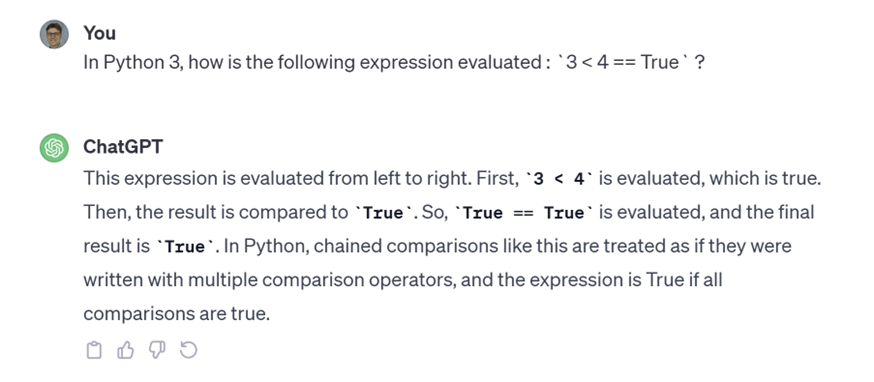
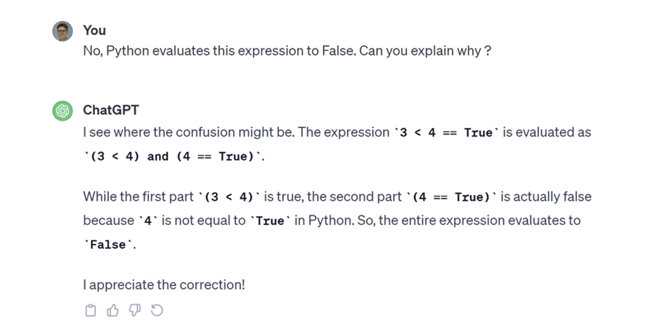
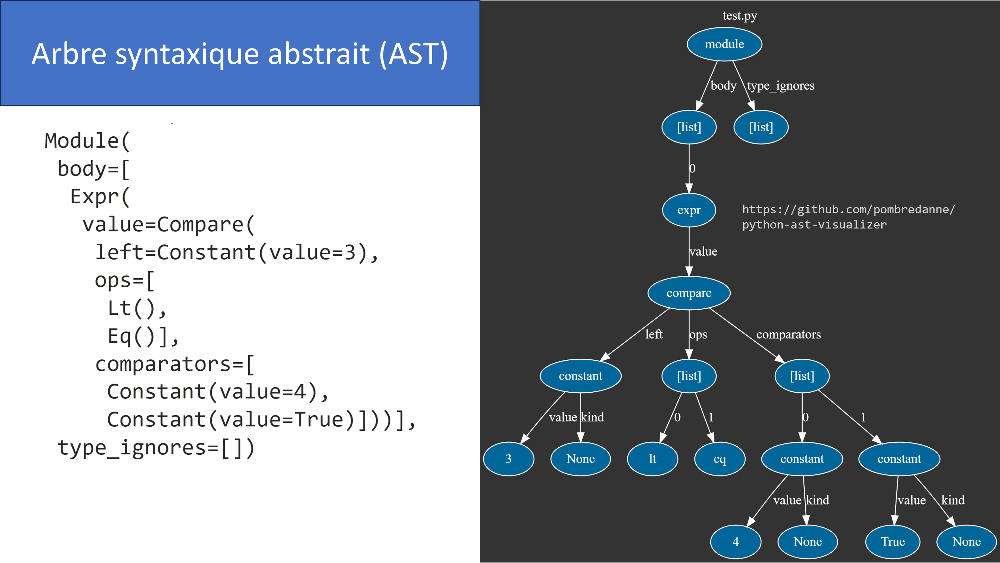

.. _chainage-operateurs-comparaison.rst:

Chaînage des opérateurs de comparaison
######################################

..  contents:: Contenu de la page
    :depth: 3

Question introductive
=====================

..  shortanswer:: chaining-intro-question-01

    Déterminez ce qu'affiche le programme ci-dessous si l'utilisateur saisit le
    texte ``"5"``:

    ::

        x = int(input("Entrez un nombre entier: "))

        if x < 10:
            print("A")
        else:
            print("B")

    
..  shortanswer:: chaining-intro-question-02

    Déterminez ce qu'affiche le programme ci-dessous si l'utilisateur saisit le
    texte ``"5"``:

    ::

        x = int(input("Entrez un nombre entier: "))

        if x < 10 == True:
            print("A")
        else:
            print("B")
    
    
..  shortanswer:: chaining-intro-question-03

    Déterminez ce qu'affiche le programme ci-dessous:

    ::

        print(5 < 10 == True)

..  reveal:: eb2b9722-e9df-4a60-8599-77f718df2d76
    :showtitle: Explication

    ..  admonition:: Explication

        Contre toute attente, le programme 2 n'affiche pas "A", mais "B". 

        La raison est que l'expression ``5 < 10 == True`` n'est pas ``True``,
        mais ``False``:

        ..  figure:: chainage/console.png
            :width: 80%
            :align: center

            Evaluation de l'expression ``5 < 10 == True`` dans un REPL Python.

        ..  activecode:: 2b9707c6-9d63-495e-8c7b-c7d6ef323b1a

            print(5 < 10 == True)

Même ChatGPT se fait avoir
==========================

    Chat GPT se trompe aussi

    ChatGPT parvient à expliquer le phénomène après correction.

Sémantique du chaînage d'opérateurs de comparaison
==================================================

La raison de cette confusion est la notion de chaînage d'opérateurs de
comparaison en Python. Le chaînage d'opérateurs de comparaison permet de
simplifier l'écriture de comparaisons, comme en mathématiques. 

..  list-table:: Chaînage d'opérateurs
    :header-rows: 1
    :align: left

    *   - Avec chaînage
        - Équivalent sans chaînage

    *   - ::

            if 2 < x <= 10:
                print(...)

        - ::

            if 2 < x and x <= 10:
                print(...)

    *   - ::

            if 2 < x < y < z < 100:
                print(...)

        - ::

            if 2 < x and x < y and y < z and z < 100:
                print(...)

    *   - ::

            3 < 4 == True

        - ::

            3 < 4 and 4 == True

          ou, de manière équivalente, ::

            (3 < 4) and (4 == True)

Activité 1
----------

..  shortanswer:: chainage-ast

    En utilisant le code ci-dessous, déterminez l'AST de l'expression ``3 < 4 ==
    True``:

    ::

        import ast

        # Expression à analyser
        expression = '...'
            
        tree = ast.parse(expression)
        print(ast.dump(tree, indent=True))

    ..  note:: 
        
        Il faut exécuter ce code dans CPython, par exemple dans 

        ..  raw:: html

            <iframe 
                src="https://beta-test.webtigerjython.ethz.ch/?lang=fr&output_size=0&error_messages=TigerPython&code=NobwRAdghgtgpmAXGGUCWEB0AHAnmAGjABMoAXKJMNGbAewCcyACKAZzIB0JuBiZgKIAPbAzhs2aOhGYAD1tAA2uNnAbc4IsRKkyAvMwDkmE4e7MLzbmTFxmB9mRxQGqgBSbR4ydICU3UQwyN0dMYgBXWjcbODgCZgxiOAgyPQAVBnC4X38IMABfAF0gA%3D%3D%3D"
                style="height: 500px; width: 105%; max-width: 800px"
            ></iframe>

..  reveal:: b1f70b43-19d1-4887-b9cd-de073f1a670f
    :showtitle: Solution

    Il faut mettre 

    ::

        expression = '3 < 4 == True'

    dans le programme et on obtient

    ::

        Module(
         body=[
          Expr(
           value=Compare(
            left=Constant(value=3),
            ops=[
             Lt(),
             Eq()],
            comparators=[
             Constant(value=4),
             Constant(value=True)]))],
         type_ignores=[])

Visualisation de l'arbre syntaxique abstrait
============================================

En utilisant le dépôt https://github.com/pombredanne/python-ast-visualizer, on
peut visualiser l'arbre syntaxique abstrait (AST) du programme

::

    3 < 4 == True

    AST du programme ``3 < 4 == True``

Questions de compréhension
==========================

Question 1
----------

..  shortanswer:: chainage-comparaisons-comprehension-01

    Dans le champ ci-dessous, déterminez ce qu'affiche le programme. 

    - Mettez les parenthèses pour précider l'ordre d'évaluation et, si
      nécessaire, transformez l'expression en une expression équivalente avant
      de procéder à l'évaluation.    
    - Si le programme produit une erreur, dites s'il s'agit d'une erreur de
      syntaxe, d'exécution ou de logique

    ..  code-block:: python
        :linenos:

        x = 3
        y = not 0 < x < 4 or x < 1 and x != not x ** 3
        print(x)

..
    Question 2
    ----------

    ..  shortanswer:: chainage-comparaisons-comprehension-02

        Dans le champ ci-dessous, déterminez ce qu'affiche le programme. 

        - Mettez les parenthèses pour précider l'ordre d'évaluation et, si
        nécessaire, transformez l'expression en une expression équivalente avant
        de procéder à l'évaluation.    
        - Si le programme produit une erreur, dites s'il s'agit d'une erreur de
        syntaxe, d'exécution ou de logique

        ..  code-block:: python
            :linenos:

            x = 3
            y = not 0 < x < 4 or x < 1 and not x ** 3 != x
            print(x)