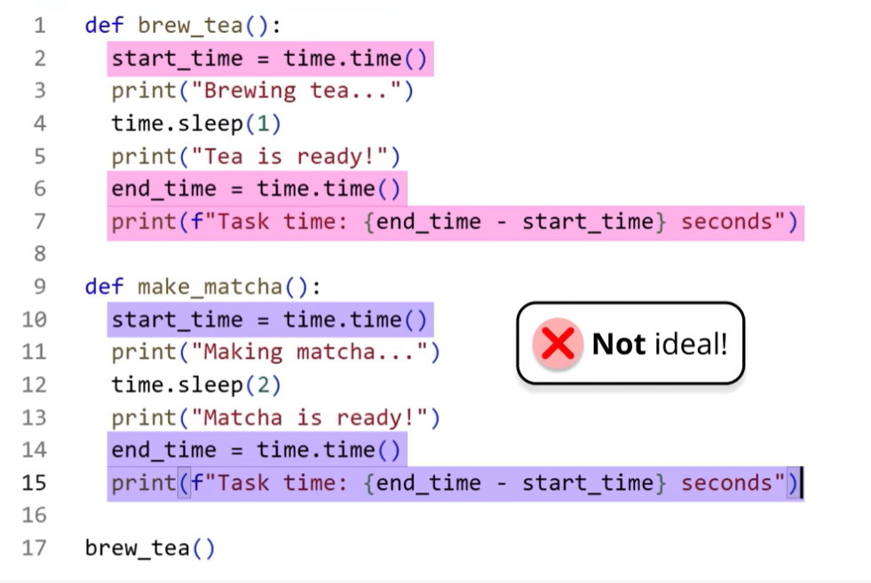
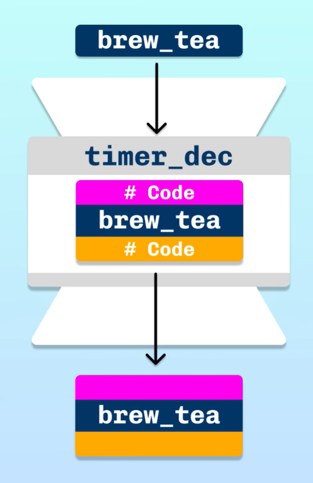
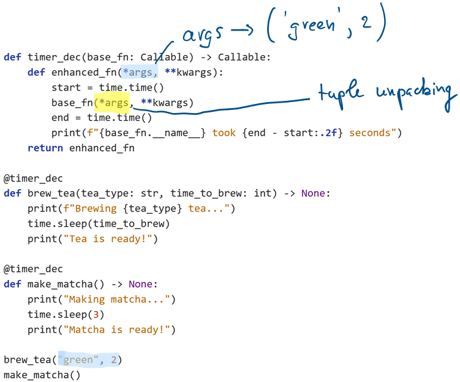

. _decorators.rst:

Decorateurs
###########

..  contents:: Contenu de la page
    :depth: 3

La meilleure introduction au sujet
==================================

..  note::

    N'hésitez pas à régler la langue audio sur "Français (FR)" si vous avez du
    mal avec l'anglais.

..  youtube:: 3tyaO-OE0K0
    :width: 800
    :height: 450
    :divid: visually-explained-decorators

L'objectif
----------

Les décorateurs sont des fonctions qui prennent en entrée une fonction et qui
retournent une nouvelle fonction. Ils permettent de modifier le comportement
d'une fonction sans en modifier le code source. 

La fonction de base
-------------------

On veut améliorer la fonction ``breaw_tea`` pour afficher le temps que la
préparation du thé a pris. Nous allons utiliser un décorateur pour cela.

..  activecode:: decorators-brew-tea-1
    :language: webtp
    :interpreterargs: layout=["Editor", "Console"]

    import time

    def brew_tea():
        print("Brewing tea...")
        time.sleep(1)
        print("Tea is ready!")

    def make_matcha():
        print("Making matcha...")
        time.sleep(2)
        print("Matcha is ready!")

Le comportement souhaité
------------------------

..  activecode:: decorators-brew-tea-2
    :language: webtp
    :interpreterargs: layout=["Editor", "Console"]

    import time

    def brew_tea() -> None:
        start = time.time()
        print("Brewing tea...")
        time.sleep(1)
        print("Tea is ready!")
        end = time.time()
        print(f"Brewing tea took {end - start:.2f} seconds")

    def make_matcha() -> None:
        start = time.time()
        print("Making matcha...")
        time.sleep(2)
        print("Matcha is ready!")
        end = time.time()
        print(f"Making matcha took {end - start:.2f} seconds")

    brew_tea()
    make_matcha()

Le problème
-----------

Le problème de cette manière de faire est que pour chronométrer le temps
d'exécution d'une fonction, il est nécessaire de modifier le code de la fonction
en question. Si on veut chronométrer une autre fonction, il faudra à nouveau
modifier le code de cette fonction.

La solution : les décorateurs
-----------------------------

Les décorateurs permettent de résoudre ce problème en permettant de modifier le
comportement d'une fonction sans en modifier le code source. **Un décorateur est
une fonction** qui prend en paramètre une fonction et qui retourne une nouvelle
fonction. La nouvelle fonction peut faire des choses avant et après l'appel de
la fonction de base, et peut même modifier les arguments ou le résultat de la
fonction de base.

Syntaxe 1
+++++++++

..  activecode:: decorators-brew-tea-3
    :language: webtp
    :interpreterargs: layout=["Editor", "Console"]

    from collections.abc import Callable

    import time

    def timer_dec(base_fn: Callable) -> Callable:
        def enhanced_fn():
            start = time.time()
            base_fn()
            end = time.time()
            print(f"{base_fn.__name__} took {end - start:.2f} seconds")
        return enhanced_fn

    def brew_tea():
        print("Brewing tea...")
        time.sleep(2)
        print("Tea is ready!")
        
        
    def make_matcha():
        print("Making matcha...")
        time.sleep(3)
        print("Matcha is ready!")

    # Définition d'une version chronométrée de brew_tea et make_matcha
    timed_brew_tea = timer_dec(brew_tea)
    timed_make_matcha = timer_dec(make_matcha)

    timed_brew_tea()
    timed_make_matcha()

    # La fonction originale est encore disponible
    brew_tea()

Syntaxe 2
+++++++++

On peut aussi utiliser la syntaxe des décorateurs pour appliquer le décorateur à
une fonction une fois pour toutes lors de sa définition. 

..  activecode:: decorators-brew-tea-4
    :language: webtp
    :interpreterargs: layout=["Editor", "Console"]

    from collections.abc import Callable

    import time

    def timer_dec(base_fn: Callable) -> Callable:
        def enhanced_fn():
            start = time.time()
            base_fn()
            end = time.time()
            print(f"{base_fn.__name__} took {end - start:.2f} seconds")
        return enhanced_fn

    @timer_dec
    def brew_tea():
        print("Brewing tea...")
        time.sleep(2)
        print("Tea is ready!")

    @timer_dec
    def make_matcha():
        print("Making matcha...")
        time.sleep(3)
        print("Matcha is ready!")

    brew_tea()
    make_matcha()

Décorer des fonctions avec des paramètres
=========================================

Le problème
-----------

Les fonctions ``brew_tea`` et ``make_matcha`` ne prennent pas de paramètre. Si
on veut décorer une fonction qui prend des paramètres, il faut que la fonction
interne du décorateur puisse accepter n'importe quels paramètres. Pour cela, on
peut utiliser les arguments ``*args`` et ``**kwargs`` qui permettent de passer
un nombre variable d'arguments positionnels et de mots-clés à une fonction.

Si l'on essaye de rajouter des paramètres à la fonction ``brew_tea`` et de la
décorer avec le décorateur ``timer_dec`` tel quel, on obtiendra une erreur car
la fonction interne du décorateur ne pourra pas accepter les nouveaux
paramètres.

..  admonition:: Erreur

    Exécutez le code ci-dessous pour voir l'erreur.

    ::

        TypeError: timer_dec.<locals>.enhanced_fn() takes 0 positional arguments but 2 were given

..  activecode:: decorators-brew-tea-5
    :language: webtp
    :interpreterargs: layout=["Editor", "Console"]

    from collections.abc import Callable

    import time

    def timer_dec(base_fn: Callable) -> Callable:
        def enhanced_fn():
            start = time.time()
            base_fn()
            end = time.time()
            print(f"{base_fn.__name__} took {end - start:.2f} seconds")
        return enhanced_fn

    @timer_dec
    def brew_tea(tea_type: str, time_to_brew: int) -> None:
        print(f"Brewing {tea_type} tea...")
        time.sleep(time_to_brew)
        print("Tea is ready!")

    @timer_dec
    def make_matcha() -> None:
        print("Making matcha...")
        time.sleep(3)
        print("Matcha is ready!")

    brew_tea("green", 2)
    make_matcha()

La solution
-----------

Pour résoudre ce problème, il suffit de faire en sorte que la fonction interne
du décorateur puisse accepter n'importe quels paramètres en utilisant les
arguments ``*args`` et ``**kwargs``.

    Décorateur avec ``args`` et ``kwargs`` pour décorer des fonctions avec des
    paramètres

..  activecode:: decorators-brew-tea-6
    :language: webtp
    :interpreterargs: layout=["Editor", "Console"]

    from collections.abc import Callable

    import time

    def timer_dec(base_fn: Callable) -> Callable:
        def enhanced_fn(*args, **kwargs):
            start = time.time()
            base_fn(*args, **kwargs)
            end = time.time()
            print(f"{base_fn.__name__} took {end - start:.2f} seconds")
        return enhanced_fn

    @timer_dec
    def brew_tea(tea_type: str, time_to_brew: int) -> None:
        print(f"Brewing {tea_type} tea...")
        time.sleep(time_to_brew)
        print("Tea is ready!")

    @timer_dec
    def make_matcha() -> None:
        print("Making matcha...")
        time.sleep(3)
        print("Matcha is ready!")

    brew_tea("green", 2)
    make_matcha()

Décorateurs avec paramètres
===========================

On peut également créer des décorateurs qui acceptent eux-mêmes des paramètres.
Pour cela, il faut créer une fonction qui prend les paramètres du décorateur et
qui retourne le décorateur lui-même. Cela rajoute encore une couche
d'imbrication supplémentaire, mais le principe est le même que pour les
décorateurs sans paramètres.

..  activecode:: decorators-brew-tea-7
    :language: webtp
    :interpreterargs: layout=["Editor", "Console"]

    from collections.abc import Callable

    import time

    def timer_dec_with_params(nb_times: int) -> Callable:
        def timer_dec(base_fn: Callable) -> Callable:
            def enhanced_fn(*args, **kwargs):
                for i in range(nb_times):
                    print(f"Run {i + 1}/{nb_times} of {base_fn.__name__}")
                    start = time.time()
                    base_fn(*args, **kwargs)
                    end = time.time()
                    print(f"{base_fn.__name__} took {end - start:.2f} seconds")
            return enhanced_fn
        return timer_dec

    @timer_dec_with_params(nb_times=3)
    def brew_tea(tea_type: str, time_to_brew: int) -> None:
        print(f"Brewing {tea_type} tea...")
        time.sleep(time_to_brew)
        print("Tea is ready!")

    brew_tea("green", 2)

Méthode générique pour décorer des fonctions
============================================

..  activecode:: decorators-generic-syntax
    :language: webtp
    :interpreterargs: layout=["Editor", "Console"]

    from functools import wraps

    def repetiter(nb_fois): # Niveau 1 : Reçoit les paramètres du décorateur
        def decorateur(fonction): # Niveau 2 : Le décorateur classique (reçoit la fonction)
            @wraps(fonction)
            def wrapper(*args, **kwargs): # Niveau 3 : L'exécution (reçoit les arguments de la fonction)
                resultat = None
                for _ in range(nb_fois):
                    print(f"Exécution de {fonction.__name__}...")
                    resultat = fonction(*args, **kwargs)
                return resultat
            return wrapper
        return decorateur

    @repetiter(nb_fois=3)
    def saluer(nom):
        print(f"Bonjour {nom} !")

    saluer("Alice")

Vidéo plus technique sur les décorateurs
========================================

..  youtube:: QH5fw9kxDQA
    :width: 800
    :height: 450
    :divid: arjan-codes-decorators