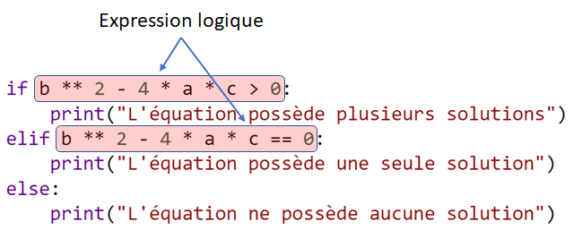
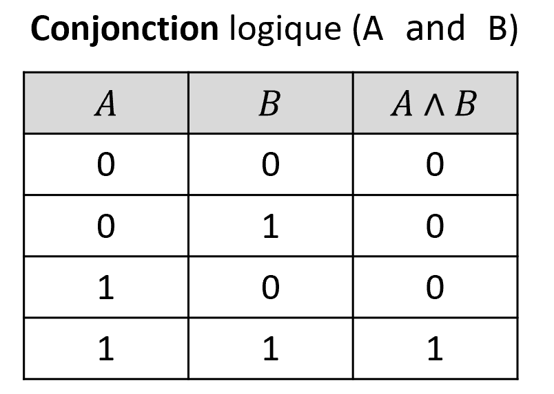
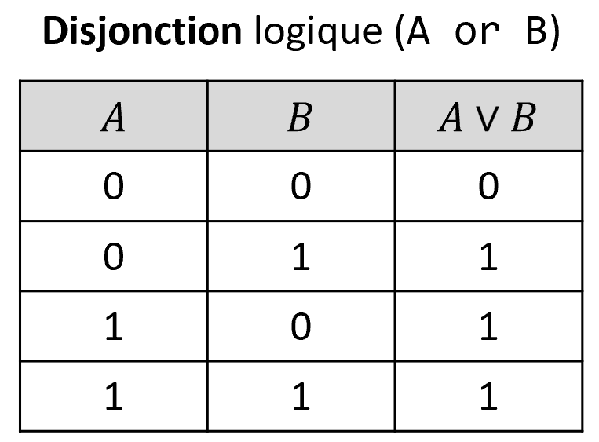
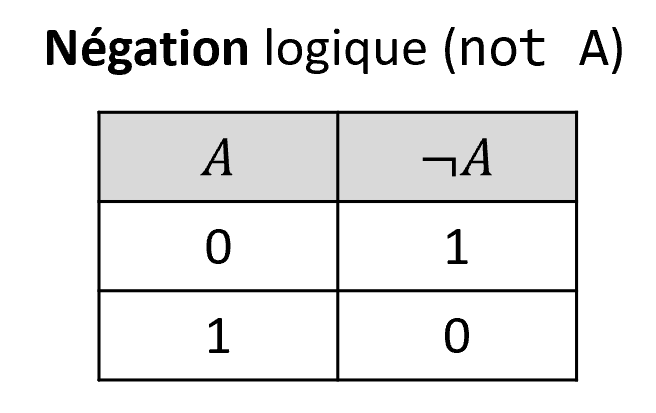
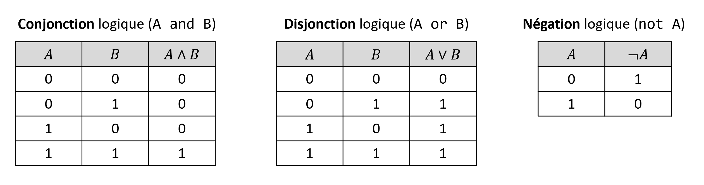

..  _expression-logiques.rst:

Expression logiques (booléennes)
################################

..  contents:: Contenu de la page
    :depth: 3

Comme vous avez pu le constater, les **instructions conditionnelles** telles que
``if ... else ...`` prennent leur décision en fonction de la valeur d'une
**expression logique**, également appelée **expression booléenne**.

.. 
    Qu'est-ce qu'une expression Python?
    ===================================

    Les **expressions** jouent un rôle fondamental en programmation. Vous connaissez
    déjà les expressions arithmétiques telles que

    - ``3 * x ** 2 - 4 * x``
    - ``3 * sqrt(x) - 10 * x``

    De manière informelle, une expression **produit une valeur**. Tout ce qu'on peut
    taper dans un REPL (chat) Python **et qui fournit une réponse (valeur)** est une
    expression.

    ..  admonition:: REPL Python

        Si vous tapez une expression dans le chat Python sur Basthon
        (https://console.basthon.fr/), Python va l'évaluer et vous **répondre avec
        sa valeur**. Voici quelques exemples d'expressions Python que vous pouvez
        tester.

        - ``15``
        - ``15 + 20``
        - ``3 * 10 > 20``
        - ``True``
        - ``False``

        En revanche, tout ce qu'on peut taper dans le REPL **qui ne produit pas de
        réponse** n'est **pas** une expression. Voici quelques exemples **qui ne
        sont pas** des expressions, mais des **instructions**:

        - Instruction d'affectation : ``age = 18``
        - Instruction d'importation de module : ``from math import *``

        ..
          ..  raw:: html

              <iframe class="pyodide-repl" src="https://pyodide.org/en/stable/console.html" width="720" height="300" style="transform: scale(0.89);transform-origin: 0 0;"></iframe>

Expressions et valeurs booléennes
=================================

Une ``expression booléenne`` est une expression dont le résultat est une
**valeur booléenne**. Il n'existe que deux valeurs booléennes : ``True`` (VRAI)
et ``False`` (FAUX).

..  admonition:: Valeurs booléennes

    Les valeurs booléennes sont notées ``True`` et ``False`` en Python. Il est
    **important de mettre la majuscule**. C'est bien ``True`` et non ``true``,
    que Python ne reconnaît pas.

..  admonition:: Parenthèse culturelle

    On parle d'expression **booléenne** en l'honneur du mathématicien et logicien
    Georges Boole qui a énormément contribué aux fondements de la logique
    mathématique. 

    ..  figure:: https://upload.wikimedia.org/wikipedia/commons/c/ce/George_Boole_color.jpg
        :align: center
        :width: 40%

        George Boole. Source : https://fr.wikipedia.org/wiki/George_Boole

    Toute l'informatique repose sur les concepts développés par Boole, notamment
    sur *l'algèbre de Boole*
    (https://fr.wikipedia.org/wiki/Alg%C3%A8bre_de_Boole_(logique)), dont nous
    aborderons les fondements dans ce chapitre.

Opérateurs booléens
===================

Les expressions booléennes sont des sortes de calculs qui, au lieu d'être
construites à l'aide d'opérateurs arithmétiques, sont construites à partir
d'**opérateurs booléens** ou **opérateurs logiques**. Tout opérateur est
caractérisé par son **arité**, à savoir le nombre d'**opérandes** qu'il combine.
La plupart des opérateurs sont d'arité 2 (opèrent sur deux opérandes).

..  admonition:: Opérateurs de comparaison

    Parmi les opérateurs qui permettent de constituer des expressions
    booléennes, les plus couramment utilisés sont les **opérateurs de
    comparaison**:

    ..  list-table:: Opérateurs de comparaison
        :widths: 30 10 10 10 90
        :header-rows: 1
        :align: left

        * - Nom de l'opérateur
          - Arité
          - Notation Python
          - Notation mathématique
          - Exemple

        * - Est égal
          - 2
          - ``==``
          - :math:`=`
          - 
            ::
                
                >>> prenom = "Amélie"
                >>> prenom == "Amélie"
                True
                >>> prenom == "Géraldine"
                False

    
        * - Est différent de
          - 2
          - ``!=``
          - :math:`\neq`
          - 
            ::
                
                >>> prenom = "Amélie"
                >>> prenom != "Amélie"
                False
                >>> prenom != "Géraldine"
                True

        * - Est inférieur à
          - 2
          - ``<``
          - :math:`<`
          - 
            ::
                
                >>> age = 20
                >>> age == 20
                True
                >>> age == 30
                False

        * - Est inférieur ou égale à
          - 2
          - ``<=``
          - :math:`\leq`
          - 
            ::
                
                >>> age = 20
                >>> age <= 25
                True
                >>> age <= 20
                True
                >>> age <= 18
                False

        * - Est supérieur à
          - 2
          - ``>``
          - :math:`>`
          - 
            ::
                
                >>> age = 20
                >>> age > 25
                False
                >>> age > 20
                False
                >>> age > 18
                True

        * - Est supérieur ou égale à
          - 2
          - ``>=``
          - :math:`\geq`
          - 
            ::
                
                >>> age = 20
                >>> age >= 25
                False
                >>> age >= 20
                True
                >>> age >= 18
                True

Il existe également d'autres opérateurs booléens que les opérateurs de
comparaison. L'opérateur ``in`` est particulièrement pratique, car il permet de
vérifier si une valeur est contenue dans une collection de valeurs:

..  admonition:: Opérateur d'appartenance ``in``

    ..  list-table:: Opérateurs de comparaison
        :widths: 30 10 10 10 90
        :header-rows: 1
        :align: left

        * - Nom de l'opérateur
          - Arité
          - Notation Python
          - Notation mathématique
          - Exemple
        
        * - Appartient à 
          - 2
          - ``in``
          - :math:`\in`
          - 
            ::
                
                >>> msg = "salut les copains"
                >>> 'salut' in msg
                True
                >>> 'banane' in msg
                False

Opérateurs logiques
===================

De même que les opérateurs arithmétiques permettent de construire des
expressions arithmétiques à partir d'expressions arithmétiques plus simples, les
**opérateurs logiques** permettent de combiner des expressions logiques pour
former des expressions logiques plus complexes. En Python, il y a trois
opérateurs logiques 

* La **conjonction logique** (opérateur ``and``)
* La **disjonction logique** (opérateur ``or``)
* La **négation logique** (opérateur ``not``)

Conjonction logique (opérateur ``and``)
---------------------------------------

L'opérateur binaire (d'arité 2) ``and`` permet de combiner deux expressions ou
valeurs logiques (booléennes). L'expression ainsi formée est vraie **si et
seulement si les deux expressions combinées sont vraies**. On peut exprimer cela
à l'aide d'une **table de vérité** ou 0=FAUX et 1=VRAI.

    Table de vérité du ET logique (conjonction logique)

Programme pour afficher la table de vérité
++++++++++++++++++++++++++++++++++++++++++

On peut afficher la table de vérité d'un opérateur logique à l'aide du programme
ci-dessous:

..  activecode:: 54271c9f-47b6-4740-862a-8e9dae47efff

    Voici quelques manipulations à faire sur ce programme pour explorer la table de vérité

    - Exécutez le programme
    - Remplacez ``False`` par ``0`` dans la variable ``FAUX`` et ``True`` par
      ``1`` dans la variable ``VRAI``, puis exécutez le programme. Que
      constatez-vous?

    ~~~~

    VRAI = True
    FAUX = False

    print('A\tB\tA ET B')

    # ligne 1
    A = FAUX
    B = FAUX
    print(f'{A}\t{B}\t{A and B}')

    # ligne 2
    A = FAUX
    B = VRAI
    print(f'{A}\t{B}\t{A and B}')
    
    # ligne 3
    A = VRAI
    B = FAUX
    print(f'{A}\t{B}\t{A and B}')
    
    # ligne 4
    A = VRAI
    B = VRAI
    print(f'{A}\t{B}\t{A and B}')

..
    Exemples
    ++++++++

    ..  activecode:: 8a55f6c2-3ed3-47ef-a3d3-cea7ad270316

        print(5 == 6, 3 < 2, 5 == 6 and 3 < 2)
        print(5 == 5, 3 < 2, 5 == 5 and 3 < 2)
        print(5 == 6, 3 > 2, 5 == 6 and 3 > 2)
        print(5 == 5, 3 > 2, 5 == 5 and 3 > 2)

Disjonction logique (opérateur ``or``)
--------------------------------------

L'opérateur binaire (d'arité 2) ``or`` permet de combiner deux expressions ou
valeurs logiques (booléennes). L'expression ainsi formée est fausse **si et
seulement si les deux expressions combinées sont fausse**. On peut exprimer cela
à l'aide d'une **table de vérité** ou 0=FAUX et 1=VRAI.

    Table de vérité du OU logique (disjonction)

Négation logique (opérateur ``not``)
------------------------------------

L'opérateur unaire (d'arité 1) ``not`` agit sur une seule expression ou valeur
logique (booléenne). Cet opérateur **inverse la valeur de vérité**. On appelle
donc également cet opérateur **inverseur logique**. On peut exprimer cela à
l'aide d'une **table de vérité** ou 0=FAUX et 1=VRAI.

    Table de vérité du NON logique (négation / inversion)

Résumé des opérateurs logiques
------------------------------

    Tables de vérité des opérateurs logiques ``and``, ``or`` et ``not``
    disponibles en Python.

..  admonition:: Opérateurs logiques

    ..  list-table:: Opérateurs logiques
        :widths: 30 10 10 10 90
        :header-rows: 1
        :align: left

        * - Nom de l'opérateur
          - Arité
          - Notation Python
          - Notation mathématique
          - Exemple
        
        * - Conjonction logique (ET logique)
          - 2
          - ``and``
          - :math:`A \land B` ou :math:`A \cdot B` 
          - 
            ::
                
                >>> x = 10
                >>> x >= 5
                True
                >>> x < 12
                True
                >>> x < 12 and x >= 5
                True
                >>> False and False
                False
                >>> True and False
                False
                >>> False and True
                False
                >>> True and True
                True

        * - Disjonction logique (OU logique)
          - 2
          - ``or``
          - :math:`A \lor B` ou :math:`A + B` 
          - 
            ::
                
                >>> x = 10
                >>> x >= 5
                True
                >>> x > 12
                False
                >>> x < 12 or x > 12
                True
                >>> False or False
                False
                >>> True or False
                True
                >>> False or True
                True
                >>> True or True
                True

        * - Négation logique (NON logique)
          - 2
          - ``not``
          - :math:`\lnot A` 
          - 
            ::
                
                >>> x = 10
                >>> x >= 5
                True
                >>> not x >= 5
                False
                >>> not False
                True
                >>> not True
                False

..  reveal:: f84d881d-fe85-4f59-90ed-ca849f8a8ef9
    :showtitle: Outil de génération de formulaire
    :instructoronly:

    .. activecode:: 79265b1b-1fd8-465e-b492-26a5f805698b

        import document
        from document import *
        from random import randint

        def prepare_attrs(theid=None, name=None, label=None):
            theid = theid or f'{currentDiv()}-{randint(1, 10000000)}'
            id_attr = f'id="{theid}"' if theid else ""
            name = name or theid
            
            return theid, id_attr, name

        def form_input(thetype="text", theid=None, name=None, label=None):
            theid, id_attr, name = prepare_attrs(theid, name, label)
            
            return f'''
            <label for="{name}">{label}</label>
            <input {id_attr} type="{thetype}" name="{name}" id="{theid}" />
            '''

        def format_options(options):
            return '\n'.join([f'<option value="{i}">{opt}</option>' for i, opt in enumerate(options)])

        def form_select(options, theid=None, name=None, label=None):
            theid, id_attr, name = prepare_attrs(theid, name, label)
            
            return f'''
            <label for="{name}">{label}</label>
            <select {id_attr} name="{name}" id="{theid}">
            {format_options(options)}
            </select>
            '''
            
            

        for item in dir(document): print(item)
            
        print(currentDiv())
        div = getElementById(currentDiv())
        form = createElement('form')
        form.setAttribute('id', f'input-form-{currentDiv()}')

        ########## Génération formulaire ###########
        form_html = ''

        form_html += form_input(thetype="text", label="Prénom")
        form_html += form_input(thetype="text", label="Nom de famille")
        form_html += form_select(['Thé froit', "Café au lait"], label="Article")

        form.innerHTML = form_html

        print(form_html)
        ############################################

        div.appendChild(form)
        print(dir(form))
        print(dir(div))

..
    ..  raw:: html

        <form id="menu_form">
        
        <label for="firstname">Prénom</label>
        <input id="firstname" type="text" name="firstname" id="firstname" />
        
        <label for="lastname">Nom de famille</label>
        <input id="lastname" type="text" name="lastname" id="lastname" />
        
        <label for="article">Article</label>
        <select id="article" name="article" id="article">
            <option value="0">Thé froid</option>
            <option value="1">Eau plate</option>
            <option value="2">Eau gazeuse</option>
            <option value="3">Bière</option>
            <option value="4">Limonade</option>
        </select>
        
        </form>

Expression logique : définition
===============================

Nous pouvons à présent définir précisément ce qu'est une expression logique, à
savoir ce qu'on peut indiquer comme "question" dans une condition ``if`` ou
``elif``.

..  admonition:: Remarque

    La définition donnée ci-dessous est une définition **récursive**. Cela
    signifie que le terme défini est utilisé dans la définition. Cela peut
    paraître bizarre. En réalité, il s'agit d'une **définition constructive**
    dans le sens où cette définition indique toutes les manières de **construire
    une expression logique** à partir de briques de base.

    En somme, toute expression qui peut être construite à partir des règles
    ci-dessous est, **par construction**, une expression logique.

- Les **littéraux booléens** ``True`` et ``False``
- Une variable booléenne
- ``not`` appliqué à une expression logique
- Deux expressions logiques combinées avec l'opérateur ``or`` ou ``and``
- Une expression booléenne entre parenthèses

Questions de compréhension
==========================

..  mchoice:: d3f3a741-489e-46c6-ad8b-41985af3a6c0

    Déterminez les expressions ci-dessous qui sont booléennes
    
    - ``True and False``
    
      + Vrai
    
    - ``"True and False"``
    
      - Faux. À cause des guillemets, il s'agit d'une chaine de caractères et
        non d'un booléen.
    
    - ``((not False))``
    
      + Vrai
    
    - ``True not False``
    
      - Faux. L'opérateur ``not`` est unaire et ne peut donc pas combiner deux
        expressions
    
    - ``123``
    
      - Faux
    
    - ``True and True``
    
      + Vrai
    
    - ``not not (not False)``

      + Vrai

..  mchoice:: f38a3e07-c5d3-4284-9b1b-89a97d2df163

    Parmi les expressions logiques ci-dessous, cochez celles qui sont vraies:

    - ``True``
    
      + Vrai
    
    - ``not True``
    
      - Faux
    
    - ``not not True``
    
      + Vrai
    
    - ``True and False``
    
      - Faux
    
    - ``(True) and (False)``
    
      - Faux
    
    - ``False``
    
      - Faux
    
    - ``not False``
    
      + Vrai
    
    - ``True or False``
    
      + Vrai
    
    - ``False or True``
    
      + Vrai

..  mchoice:: a98be592-6627-44c4-8ab8-8f568c4142c6

    Parmi les expressions logiques ci-dessous, cochez celles qui sont
    équivalentes à l'expression ``age < 21``.

    - ``age <= 21``
    
      - Faux
    
    - ``21 <= age``
    
      - Faux
    
    - ``21 >= age``
    
      - Faux
    
    - ``age <= 21 and age != 21``
    
      + Vrai
    
    - ``age < 21 or age == 21``
    
      - Faux
    
    - ``age >= 21``
    
      - Faux

..  reveal:: 81963ce8-c865-4158-b07e-0dc203ba6075
    :showtitle: Réponse

    Deux expressions sont équivalentes si elles ont toujours la même valeur,
    quelles que soient les valeurs des variables qu'elles impliquent.

    ..  figure:: expressions/2022-04-13-14-14-29.png
        :align: center
        :width: 100%

        Table de vérité des différentes expressions

..  mchoice:: fcd6e57b-4d76-49f1-aa57-3d0d2ec81429

    Parmi les expressions logiques ci-dessous, cochez celles qui sont
    équivalentes à l'expression ``age <= 21``.
    
    - ``21 <= age``
    
      - Faux
    
    - ``21 >= age``
    
      + Vrai
    
    - ``age <= 21 and age != 21``
    
      - Faux
    
    - ``age < 21 or age == 21``
    
      + Vrai
    
    - ``age >= 21``
    
      - Faux

..  reveal:: cd7f71d0-6d4a-4ce8-a79f-fa5479baeeb2
    :showtitle: Réponse

    Deux expressions sont équivalentes si elles ont toujours la même valeur,
    quelles que soient les valeurs des variables qu'elles impliquent.

    ..  figure:: expressions/2022-04-13-14-17-30.png
        :align: center
        :width: 100%

        Table de vérité des différentes expressions

..  mchoice:: 6d3c9773-f9cc-401a-993d-5080172a7c7a

    On définit une variable ``est_majeur`` dans un programme de la manière
    suivante:

    ::

        age = int("Indiquez votre âge: ")
        if age >= 18:
            est_majeur = True
        else:
            est_majeur = False

    Parmi les expressions logiques ci-dessous, cochez celles qui sont
    équivalentes à l'expression ``est_majeur == True``.
    
    - ``est_majeur``
    
      + Vrai
    
    - ``est_majeur == False``
    
      - Faux
    
    - ``not est_majeur``
    
      - Faux
    
    - ``est_majeur != True``
    
      - Faux
    
    - ``est_majeur != False``
    
      + Vrai
    
    - ``not est_majeur != False``
    
      - Faux
    
    - ``est_majeur == est_majeur``
    
      - Faux
    
    - ``est_majeur != est_majeur``
    
      - Faux
    
    - ``True``
    
      - Faux
    
    - ``False``
    
      - Faux

..  mchoice:: 9ab53663-8016-489f-951e-2f877e7e4a95

    On définit une variable ``est_majeur`` dans un programme de la manière
    suivante:

    ::

        age = int("Indiquez votre âge: ")
        if age >= 18:
            est_majeur = True
        else:
            est_majeur = False

    Parmi les expressions logiques ci-dessous, cochez celles qui sont
    équivalentes à l'expression ``est_majeur == False``.
    
    - ``est_majeur``
    
      - Faux
        
    - ``not est_majeur``
    
      + Vrai
    
    - ``est_majeur != True``
    
      + Vrai
    
    - ``est_majeur != False``
    
      - Faux
    
    - ``not est_majeur != False``
    
      + Vrai
    
    - ``est_majeur == est_majeur``
    
      - Faux
    
    - ``est_majeur != est_majeur``
    
      - Faux
    
    - ``True``
    
      - Faux
    
    - ``False``
    
      - Faux

Exercices
=========

Exercice 1
----------

Soient ``A`` et ``B`` deux variables booléennes.

#. Établissez la table de vérité de l'expression logique ``not (A and B)``

#. Établissez la table de vérité de l'expression logique ``not A and not B``

#. Établissez la table de vérité de l'expression logique ``(A or B) and not (A and B)``

#. Établissez la table de vérité de l'expression logique ``(A and not B) or not (not A and B)``

Exercice 2
----------

..  mchoice:: expressions-logiques-exercice-02

    On donne le programme suivant:

    ..  code-block:: python
        
        x = int(input())

        if not (x <= 10):
            print("A")
        else:
            print("B")

    Cochez les valeurs de la variable ``x`` qui font en sorte que le programme
    affiche ``A``:

    - 3

      - Faux. L'expression ``not (x <= 10)`` est vraie si et seulement si ``x >
        10``

    - 9

      - Faux. L'expression ``not (x <= 10)`` est vraie si et seulement si ``x > 10``

    - 10

      - Faux. L'expression ``not (x <= 10)`` est vraie si et seulement si ``x > 10``

    - 11

      + Vrai. L'expression ``not (x <= 10)`` est vraie si et seulement si ``x > 10``

    - 15

      + Vrai. L'expression ``not (x <= 10)`` est vraie si et seulement si ``x > 10``

    - Aucune des valeurs proposées

      - Faux. L'expression ``not (x <= 10)`` est vraie si et seulement si ``x > 10``

Exercice 3
----------

..  mchoice:: expressions-logiques-exercice-03

    On donne le programme suivant:

    ..  code-block:: python
        
        x = int(input())

        if (not (x <= 10)) or (2 * x < 10):
            print("A")
        else:
            print("B")

    Cochez les valeurs de la variable ``x`` qui font en sorte que le programme
    affiche ``A``:

    - 3

      + Vrai. L'expression ``2 * x < 10`` est vraie si et seulement si ``x < 5``

    - 9

      - Faux. 

    - 10

      - Faux.

    - 11

      + Vrai. L'expression ``not (x <= 10)`` est vraie si et seulement si ``x > 10``

    - 15

      + Vrai. L'expression ``not (x <= 10)`` est vraie si et seulement si ``x > 10``

    - Aucune des valeurs proposées

      - Faux. L'expression ``not (x <= 10)`` est vraie si et seulement si ``x > 10``

