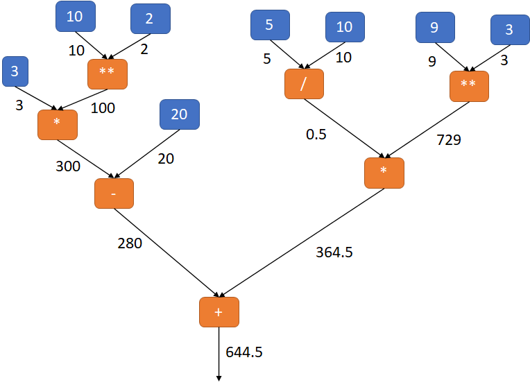
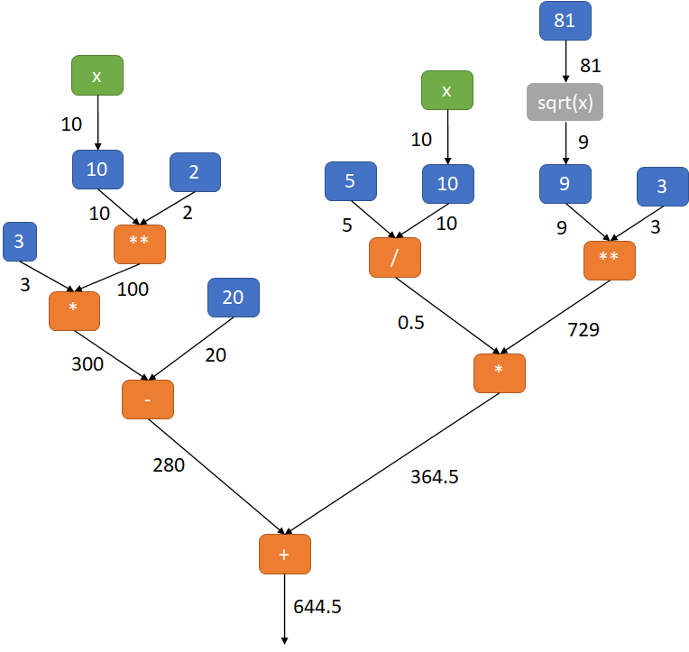
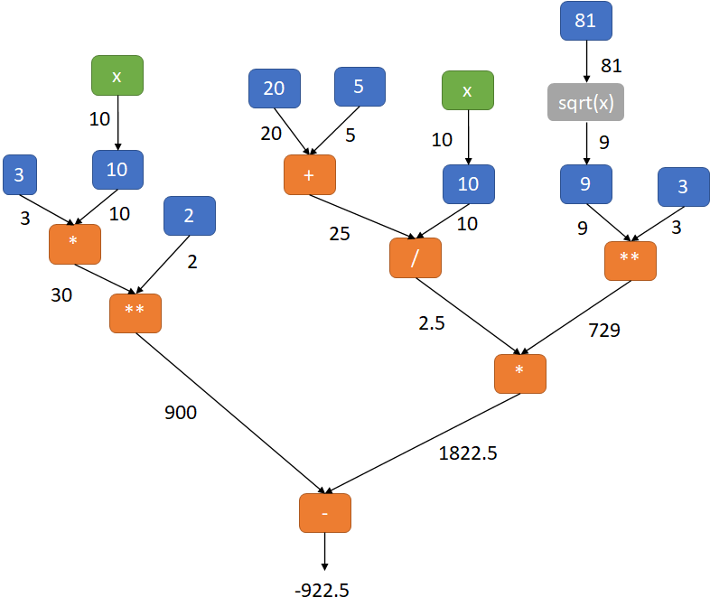
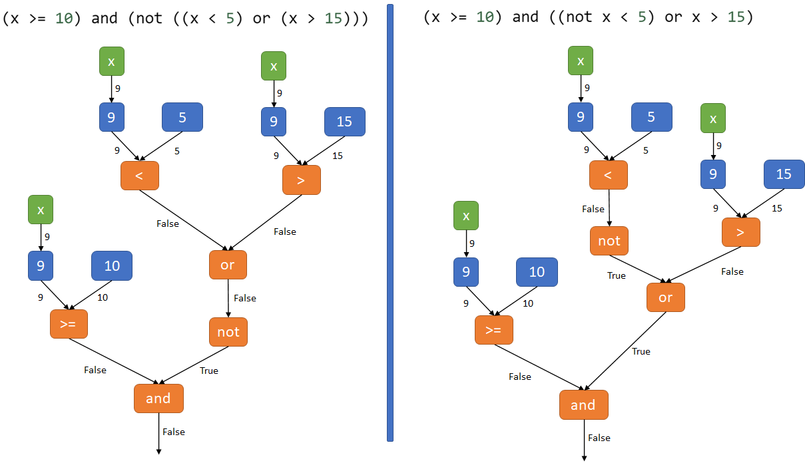
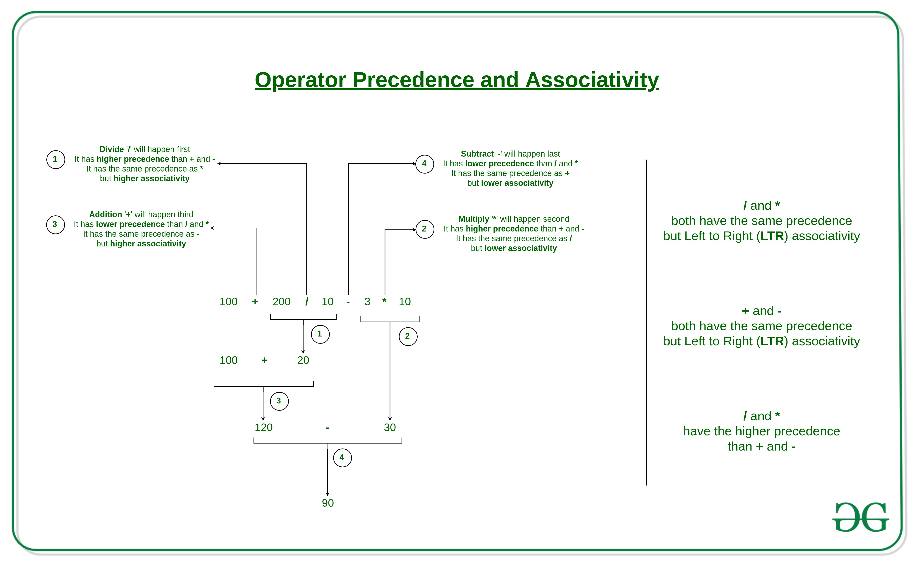

.. _fondements-priorite-operations.rst:

Priorité des opérations
#######################

..  contents:: Contenu de la page
    :depth: 3

..  reveal:: 0199a1c7-1b40-4cfb-ac74-36849918e56e
    :showtitle: Code pour générer l'arbre d'une expression
    :instructoronly:

    -   Voici un code permettant de générer l'AST d'un code Python, en
        particulier une expression.

        ::
            
            import ast

            expression = '(x >= 10) and (not ((x < 5) or (x > 15)))'
            expression = '(20 > x >= 10)'
                
            tree = ast.parse(expression)
            print(ast.dump(tree, indent=True))

    -   Rien à voir ... mais repo pour comparer la proximité de deux code
        sources : https://github.com/pombredanne/python-ast-visualizer

Expressions arithmétiques
=========================

Vous savez qu'en mathématiques, il y a une priorité des opérations à respecter.
Avec vos connaissances actuelles en mathématiques, évaluez l'expression
suivante, sachant que la variable ``x`` possède la valeur 10.

..  fillintheblank:: ed0633b9-0749-4d75-bb24-f5460604a06d

    Évaluez à la main l'expression arithmétique ci-dessous avec la priorité
    usuelle des opérations:

    L'évaluation de l'expression ``3 * 10 ** 2 + 20 - 5 / 10 * 9 ** 3`` donne la valeur
    |blank|

    - :-44.5: Juste
      :.*: Faux. Notez la virgule avec un point

..  reveal:: 7f62200a-9fa3-4407-bb37-888e0bf008cb
    :showtitle: Solution

    ..  admonition:: Solution

        La réponse est :math:`-44.5`.

..  admonition:: Priorité des opérations en mathématiques
        
    En mathématiques, on évalue les expressions **de gauche à droite**, en respectant la priorité suivante des opérations:

    * Parenthèses
    * Puissances
    * Multiplications / divisions
    * Additions / soustractions

L'évaluation se fait donc de la manière suivante:

..  showeval:: _47cf17bc_de0d_4835_a852_466f3d19b479
    :trace_mode: true

    ~~~~

    3 * {{10**2}}{{100}} - 20 + 5 / 10 * 9 ** 3
    {{3 * 100}}{{300}} - 20 + 5 / 10 * 9 ** 3
    {{300 - 20}}{{280}} + 5 / 10 * 9 ** 3
    280 + {{5 / 10}}{{0.5}} * 9 ** 3
    280 + 0.5 * {{9 ** 3}}{{729}}
    280 + {{0.5 * 729}}{{364.5}}
    {{280 + 364.5}}{{644.5}}

On peut encore visualiser l'évaluation de cette expression comme un arbre,
avec les valeurs qui "coulent" depuis le haut vers le bas:

    Évaluation de l'expression ``3 * 10 ** 2 - 20 + 5 / 10 * 9 ** 3``

..  admonition:: AST (=Abstract Syntax Tree)

    L'arbre en question, constituant la bonne interprétation, est apparenté à
    l'arbre syntaxique abstrait (Abstract Syntax Tree) construit par le
    *parseur* Python (analyseur syntaxique). 

    La section **Arbre syntaxique abstrait (AST)** va plus dans les détails et
    montre comment déterminer automatiquement, avec Python, l'arbre syntaxique
    d'une expression Python en utilisant l'IDE Thonny ou le module ``ast`` de
    Python.

Expressions avec variables et appels de fonction
================================================

Voici encore un autre exemple qui fait intervenir des variables et des
fonctions. Il faut donc encore faire intervenir dans la priorité des
opérations le fait de remplacer les variables par leur valeur
(**substitution**) et l'**évaluation des fonctions**. 

..  showeval:: _751bde0a_04b9_4a56_8467_7203e27d1586
    :trace_mode: true

    from math import sqrt
    x = 10
    ~~~~

    3 * {{x}}{{10}}**2 - 20 + 5 / x * sqrt(81) ** 3
    3 * {{10**2}}{{100}} - 20 + 5 / x * sqrt(81) ** 3
    {{3 * 100}}{{300}} - 20 + 5 / x * sqrt(81) ** 3
    {{300 - 20}}{{280}} + 5 / x * sqrt(81) ** 3
    280 + 5 / {{x}}{{10}} * sqrt(81) ** 3
    280 + {{5 / 10}}{{0.5}} * sqrt(81) ** 3
    280 + 0.5 * {{sqrt(81)}}{{9}} ** 3
    280 + 0.5 * {{9 ** 3}}{{729}}
    280 + {{0.5 * 729}}{{364.5}}
    {{280 + 364.5}}{{644.5}}

On peut visualiser l'évaluation de cette expression de la manière suivante:

    Évaluation de l'expression ``3 * x ** 2 - 20 + 5 / x * sqrt(81) ** 3``
    impliquant des substitutions de variable et l'évaluation de la fonction
    ``sqrt(x)``.

..  admonition:: Priorité des opérations

    * Parenthèses
    * Substitution des variables
    * Évaluation de fonctions
    * Puissances
    * Multiplication / division
    * Addition / soustraction

Rôle des parenthèses
====================

Comme vous le savez des mathématiques, on peut utiliser les parenthèses pour
modifier l'ordre de l'évaluation des opérations. 

..  admonition:: Remarque (anectodique)

    Les parenthèses peuvent être considérées comme un opérateur unaire
    prioritaire sur tous les autre opérant sur l'expression qu'elles renferment.

..  fillintheblank:: 91a4bc2a-2e30-4bfc-a367-412834664a90

    Évaluez à la main l'expression arithmétique ci-dessous avec la priorité
    usuelle des opérations:

    ``(3 * x) ** 2 - (20 + 5) / x * 9 ** 3`` donne la valeur |blank|

    - :-922.5: Juste
      :.*: Faux. Notez la virgule avec un point. Indiquez le signe ``-`` sans espace.

..  showeval:: _384ebf21_9d8e_4e13_bcfb_5dc511fb5174
    :trace_mode: true

    from math import sqrt
    x = 10
    ~~~~

    (3 * {{x}}{{10}}) **2 - (20 + 5) / x * sqrt(81) ** 3
    {{(3 * 10)}}{{30}} ** 2 - (20 + 5) / x * sqrt(81) ** 3
    {{30 ** 2}}{{900}} - (20 + 5) / x * sqrt(81) ** 3
    900 - {{(20 + 5)}}{{25}} / x * sqrt(81) ** 3
    900 - 25 / {{x}}{{10}} * sqrt(81) ** 3
    900 - {{25 / 10}}{{2.5}} * sqrt(81) ** 3
    900 - 2.5 * {{sqrt(81)}}{{9}} ** 3
    900 - 2.5 * {{9 ** 3}}{{729}}
    900 - {{2.5 * 729}}{{1822.5}}
    {{900 - 1822.5}}{{-922.5}}

Les parenthèses ont donc pour effet de **modifier l'arbre d'évaluation de
l'expression** comme suit:

    Évaluation de l'expression arithmétique ``(3 * x) ** 2 - (20 + 5) / x *
    sqrt(81) ** 3``.

Priorité dans les expressions booléennes
========================================

De même qu'il y a des règles de priorité dans les opérations arithmétiques, il y
a une priorité des opérations dans la formation des expressions logiques. Il est
essentiel de connaître et respecter ces règles lorsqu'on évalue des expressions
logiques.

Exemple
-------

..  admonition:: Question

    Pour ``x = 9``, quelle est la valeur de l'expression logique ``x >= 10 and
    not x < 5 or x > 15``? 
    
Cette expression pourrait être interprétée de différentes manières, en fonction
de la priorité des opérations. Voici deux interprétations possibles:

* Interprétation A : ``(x >= 10) and (not ((x < 5) or (x > 15)))``
* Interprétation B : ``(x >= 10) and ((not x < 5) or x > 15)``

Chacune des ces deux interprétations donne lieu à l'un des arbres ci-dessous:

    L'arbre de gauche correspond à l'interprétation A et l'arbre de droite à
    l'interprétation B. En l'occurrence, le résultat est le même, mais il aurait
    pu être différent.

Associativité des opérateurs
============================

Lorsque les opérateurs ont des priorités différentes, l'évaluation de
l'expression est triviale, comme dans l'exemple

::

    x = 3 + 6 * 7

Dans ce cas, on sait que l'expression ``3 + 6 * 7`` est en fait équivalente à
``3 + (6 * 7)``. C'est moins clair lorsque toutes les opérations ont la même
priorité, par exemple dans l'expression

::

    x = 3 - 6 + 8 - 4

Par exemple, à laquelle des expressions ci-dessous l'expression ``3 - 6 + 8 -
4`` est-elle équivalente?

-  ``(((3 - 6) + 8) - 4)``
-  ``((3 - (6 + 8)) - 4)``
-  ``(3 - (6 + (8 - 4)))``
-  ``3 - 6 + 8 - 4``

En Python, la plupart des opérateurs **associent de gauche à droite** (on
commence par évaluer la partie de gauche avant d'évaluer la partie de droite).
Autrement dit, c'est la première variante qui est correcte. Autrement dit,
l'arbre d'évaluation correct est celui de l'expression ``(((3 - 6) + 8) - 4)``.

..  note::

    En Python, tous les opérateurs arithmétiques suivent l'associativié de
    gauche à droite, sauf l'exponentiation, qui associe de droite à gauche.

    L'associativité des opérateurs est mentionnée dans le tableau
    :ref:`table-operator-precedence`

Exemple détaillé
----------------

L'exemple ci-dessous explique le déroulement de l'évaluation de l'expression
arithmétique ``100 + 200 / 10 - 3 * 10``.

    Source : https://www.geeksforgeeks.org/precedence-and-associativity-of-operators-in-python/

Priorité et associativité des opérateurs en Python
==================================================

L'interprétation correcte de l'expression ``x >= 10 and not x < 5 or x >
15`` est l'interprétation A, à savoir l'arbre de gauche. En effet, voici les
opérateurs que vous connaissez en Python, classés par ordre décroissant de
priorité. On voit donc que l'opérateur le plus prioritaire sont les
parenthèses et que l'opérateur le moins prioritaire est le ``or``
(disjonction logique).

..  admonition:: Références pour le tableau ci-dessous
    :class: note

    - Documentation Python officielle : https://docs.python.org/3/reference/expressions.html#operator-precedence
    - Précédence et associativité des opérateurs Python : https://www.geeksforgeeks.org/precedence-and-associativity-of-operators-in-python/

..  _table-operator-precedence:

..  list-table:: Priorité des opérations Python à connaître
    :widths: 60 30 20 30
    :header-rows: 1
    :align: left

    * - Nom de l'opérateur
      - Symboles
      - Priorité
      - Associativité

    * - Parenthèses
      - ``(...)``
      - La plus haute
      - Gauche à droite

    * - Indexation, slicing, appels, référence aux attributs
      - ``x[index]``, ``x[index:index]``, ``x(arguments...)``, ``x.attribute``
      - 
      - Gauche à droite
    
    * - Exponentiation
      - ``**``
      - 
      - Droite à gauche

    * - Positif, opposé, négation bit à bit
      - ``+``, ``-``, ``~``
      - 
      - Droite à gauche

    * - Multiplication, division, division entière, modulo, multiplication
        matricielle
      - ``*``, ``/``, ``//``, ``%``, ``@``
      - 
      - Gauche à droite

    * - Addition et soustraction
      - ``+``, ``-``
      - 
      - Gauche à droite

    * - Décalages de bits
      - ``<<``, ``>>``
      - 
      - Gauche à droite

    * - ET bit à bit
      - ``&``
      - 
      - Gauche à droite

    * - XOR bit à bit
      - ``^``
      - 
      - Gauche à droite

    * - OR bit à bit
      - ``|``
      - 
      - Gauche à droite

    * - Opérateurs d'appartenance
      - ``in``, ``not in``, ``is``, ``is not``, ``<,`` ``<=,`` ``>,``
        ``>=,`` ``!=,`` ``==``
      - 
      - Règles spéciales (cf. :ref:`chainage-operateurs-comparaison.rst`)

    * - Négation logique
      - ``not``
      - 
      - Droite à gauche

    * - Conjonction logique
      - ``and``
      - 
      - Gauche à droite

    * - Disjonction logique
      - ``or``
      - 
      - Gauche à droite

    * - Expression conditionnelle
      - ``if-else``
      - 
      - Droite à gauche

    * - Expression lambda
      - ``lambda``
      - 
      - N/A

    * - Expression d'affectation (opérateur walrus)
      - ``:=``
      - La plus basse
      - Droite à gauche

Exercices
=========

Exercice 1
----------

Pour chaque expression ci-dessous, 

#.  Ajoutez les parenthèses pour indiquer l'ordre dans lequel les opérations
    sont effectuées d'après la priorité des opérateurs. 

#.  Dessinez l'arbre représentant l'expression

#.  Déterminez la valeur de l'expression

Les variables ``x`` et ``y`` sont définies comme suit:

::

    x = 10
    y = 20

..  mchoice:: 64c71918-f50d-4f96-8272-af22998ebb17

    Cochez l'ordre dans lequel les opérations sont effectuées dans l'expression
    ci-dessous, puis dessinez l'arbre d'évaluation correspondant.

    ..  code-block:: python

        True and False or True

    - ``(True and False) or True``

      + Vrai. Les opérations sont effectuées de gauche à droite. De plus,
        l'opérateur ``and`` est prioritaire sur l'opérateur ``or``
    
    - ``True and (False or True)``
        
      - Faux. Les opérations sont effectuées de gauche à droite. De plus,
        l'opérateur ``and`` est prioritaire sur l'opérateur ``or``

..  mchoice:: f359b2da-3bbb-4e4b-b989-ebd45aa4069b

    Cochez l'ordre dans lequel les opérations sont effectuées dans l'expression
    ci-dessous, puis dessinez l'arbre d'évaluation correspondant.

    ..  code-block:: python

        not not True or not False

    - ``(not (not True)) or (not False)``

      + Vrai. L'opérateur ``not`` est prioritaire sur les autres opérateurs
        logiques. De plus, les opérations sont effectuées de gauche à droite.
    
    - ``not ((not True) or (not False))``

      - Faux. L'opérateur ``not`` tout à gauche est prioritaire par rapport au
        ``or``

          
..  mchoice:: 731bc42e-9e20-42dc-9e0c-9253f17d4282

    Cochez l'ordre dans lequel les opérations sont effectuées dans l'expression
    ci-dessous, puis dessinez l'arbre d'évaluation correspondant.

    ..  code-block:: python

        not 3 * x <= y + 2 or 4 * x + 2 < y

    - ``((not 3) * (x <= y + 2)) or (((4 * x) + 2) < y)``

      - Faux. 

    - ``((not (3 * x)) <= y) + ((((2 or 4) * x) + 2) < y)``

      - Faux. 

    - ``(not ((3 * x) <= (y + 2))) or (((4 * x) + 2) < y)``

      + Juste. Les opérateurs de comparaison sont prioritaires sur les
        opérateurs logiques. De plus, ``not`` est prioritaire sur ``or``.
        Finalement, on va de gauche à droite.

Exercice 2
----------

..  shortanswer:: a8d5b9dc-5101-4a77-989a-1fbfecafdeee

    Qu'affiche le programme suivant:

    :: 

        print(4 * 7 % 3)

..  shortanswer:: 29d27528-e9b1-497d-a465-ef7e96caac55

    Qu'affiche le programme suivant:

    :: 

        print(4 ** 3 ** 2)

Exercice 3
----------

..  shortanswer:: 45cb7100-bb22-4858-90d5-cda8bd64690f

    Mettez les parenthèses au bon endroit pour clarifier l'évaluation de
    l'expression ci-dessous, dessinez son arbre syntaxique, puis effectuez
    l'évaluation:

    ::

        >>> --3 ** --2

    ..  note::

        Consultez la note correspondante de la page
        https://docs.python.org/3/reference/expressions.html#id21

Exercice 4
----------

..  shortanswer:: ea81177c-8a87-441a-a1bb-4cfcc070de95

    Mettez les parenthèses au bon endroit pour clarifier l'évaluation de
    l'expression ci-dessous pour ``x = 3`` et ``x = 11``, puis effectuez
    l'évaluation pour ``x = 3`` et ``x = 11``:

    ::

        >>> 4 if x < 5 else 7 if x > 8 else x - 2

    ..  note::

        Consultez la note correspondante de la page
        https://docs.python.org/3/reference/expressions.html#id21

..  reveal:: 7a5a3173-4e41-4159-836a-f1a82aaed7eb
    :showtitle: Indice 01

    La question est de savoir s'il faut mettre les parenthèses comme en A ou
    comme en B:

    ::

        # Variante A
        4 if x < 5 else (7 if x > 8 else x - 2)
        
        # Variante B
        (4 if x < 5 else 7) if x > 8 else x - 2

..  reveal:: efa543d0-5777-46c9-aa10-74d983e56c75
    :showtitle: Indice 02

    ..  figure:: priorite-operations/solution-exo-4-ast.png