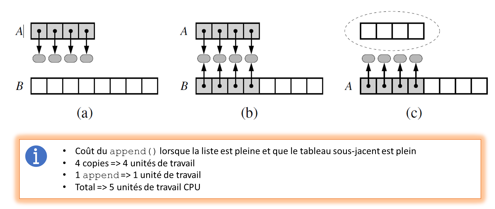
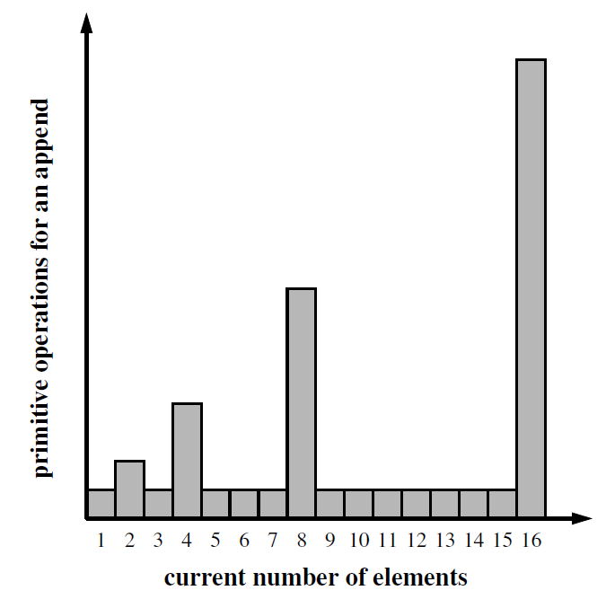
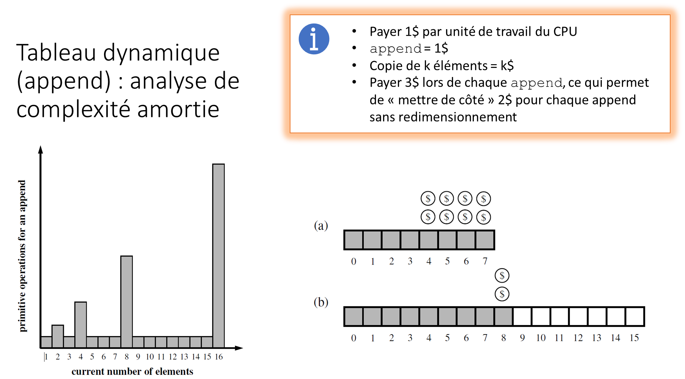

.. _prog-lists-performances-append:

Performance de ``list.append()``
################################

..  contents:: Contenu de la page
    :depth: 3

Les listes Python sont des **tableaux dynamiques**. Un tableau dynamique est un
tableau qui grandit petit-à-petit au fur et à mesure qu'on y rajoute des
éléments. Par rapport aux tableaux statiques, les tableaux offrent les avantages
suivants:

- Il n'est pas nécessaire de connaître à l'avance le nombre maximal d'éléments
  que l'on va y stocker.

- Ils sont redimensionnés au besoin, ce qui évite de gaspiller de la mémoire.

Fonctionnement de ``list.append()``
===================================

Expérience
----------

Le code ci-dessous (à exécuter dans un Python standard) montre comment la taille
occupée en mémoire par la liste augmente à chaque ajout d'un élément en fin de
liste avec ``.append()``.

..  activecode:: 34009219-9a30-4858-8fc2-9d99ab3d3d1a
    :language: webtp

    import sys 
    data = []
    n = 100
    for k in range(n):
        nb_elements = len(data)
        size_occupied = sys.getsizeof(data)
        print("Length: {0:3d}; Size in bytes: {1:4d}".format(
            nb_elements,
            size_occupied
        ))
        data.append(None)

Voici les premières lignes de la sortie produite. Elle montre bien que la taille
du tableau sous-jacent augmente par pallier. De ce fait, le tableau n'a pas
besoin d'être redimensionné à chaque ajout d'un élément.

::

    Length:   0; Size in bytes:   28
    Length:   1; Size in bytes:   44
    Length:   2; Size in bytes:   44
    Length:   3; Size in bytes:   44
    Length:   4; Size in bytes:   44
    Length:   5; Size in bytes:   60
    Length:   6; Size in bytes:   60
    Length:   7; Size in bytes:   60
    Length:   8; Size in bytes:   60
    Length:   9; Size in bytes:   92
    Length:  10; Size in bytes:   92
    Length:  11; Size in bytes:   92
    Length:  12; Size in bytes:   92
    Length:  13; Size in bytes:   92
    Length:  14; Size in bytes:   92
    Length:  15; Size in bytes:   92
    Length:  16; Size in bytes:   92
    Length:  17; Size in bytes:  124
    Length:  18; Size in bytes:  124
    Length:  19; Size in bytes:  124
    Length:  20; Size in bytes:  124
    Length:  21; Size in bytes:  124
    Length:  22; Size in bytes:  124
    Length:  23; Size in bytes:  124
    Length:  24; Size in bytes:  124
    Length:  25; Size in bytes:  156
    Length:  26; Size in bytes:  156
    Length:  27; Size in bytes:  156
    Length:  28; Size in bytes:  156
    Length:  29; Size in bytes:  156
    Length:  30; Size in bytes:  156
    Length:  31; Size in bytes:  156
    Length:  32; Size in bytes:  156
    Length:  33; Size in bytes:  188
    Length:  34; Size in bytes:  188
    Length:  35; Size in bytes:  188
    Length:  36; Size in bytes:  188
    Length:  37; Size in bytes:  188
    Length:  38; Size in bytes:  188
    Length:  39; Size in bytes:  188
    Length:  40; Size in bytes:  188
    Length:  41; Size in bytes:  236
    Length:  42; Size in bytes:  236
    Length:  43; Size in bytes:  236
    Length:  44; Size in bytes:  236
    Length:  45; Size in bytes:  236
    Length:  46; Size in bytes:  236
    Length:  47; Size in bytes:  236
    Length:  48; Size in bytes:  236
    Length:  49; Size in bytes:  236
    Length:  50; Size in bytes:  236
    Length:  51; Size in bytes:  236
    Length:  52; Size in bytes:  236
    Length:  53; Size in bytes:  284
    Length:  54; Size in bytes:  284
    ...

Redimensionnement du tableau lors d'un ``append``
-------------------------------------------------

En Python, les listes sont implémentées comme des **tableaux dynamiques**. Les
**tableaux** (*Array* en anglais) est une structure de données du langage C dont
la taille est fixe. Pour implémenter un tableau dynamique, on augmente la taille
du tableau lorsqu'il n'y a plus de place, en copiant tous les éléments du
tableau d'origine vers le tableau redimensionné. La figure ci-dessous montre que
cette opération se déroule en trois phases

a)  Le tableau original est plein et on crée un nouveau tableau dont la taille
    est :math:`c` fois plus grand que le tableau original (ici :math:`c = 2`).

b)  On copie tous les éléments du tableau original vers le nouveau tableau
    redimensionné.

c)  On supprime le tableau original

    Redimensionnement en trois phases du tableau sous-jacent lorsqu'on rajoute
    un élément à un tableau plein. Source: Datastructures and algorithms in
    Python, M. T. Goodrich, R. Tamassia, M. H. Goldwasser, page 195, Wiley 2013.

Analyse amortie
===============

Principe
--------

Dans le pire cas, rajouter un élément à une liste de taille :math:`N` est
:math:`O(N)`, puisque cela implique de copier :math:`N` de l'ancien tableau vers
le nouveau. Heureusement, cela n'intervient pas très souvent grâce à la
stratégie de pré-allocation de mémoire utilisée par ``.append()``.

Ainsi, en "moyenne", si l'on rajoute un très grand nombre :math:`N` d'élément à
une liste initialement vide, on doit utiliser :math:`O(N)` opérations. On dit de
ce fait que chaque ``append`` a un coût amorti en :math:`O(1)`.

    Temps d'exécution (ou nombre d'opérations élémentaires) pour une série de
    ``.append()`` successifs sur une liste de taille initiale 1 dont la taille
    est doublée lors de chaque redimensionnement. Source: Datastructures and
    algorithms in Python, M. T. Goodrich, R. Tamassia, M. H. Goldwasser, page
    197, Wiley 2013.

Analyse plus fine
-----------------

De manière plus précise, on peut constater que, si la taille de la liste est
doublée à chaque fois qu'il manque de place et que le tableau utilisé pour
stocker la liste est de taille :math:`n=1` au début, il faudra doubler la taille
de la liste dès que la taille atteint une puissance de 2, à savoir pour
:math:`n = 1, 2, 4, 8, 16, 32, \ldots`. En d'autres termes, les
redimensionnements interviennent de moins en moins souvent, mais il sont de plus
en plus fastidieux. Comment se convaincre que, "en moyenne", chaque append a un
coût en :math:`O(1)` ?

..  admonition:: Remarque

    Ceci est un exemple hypothétique et ne correspond pas à ce que fait Python.
    Python ne double pas la liste lors de chaque redimensionnement, mais suit
    également une croissance géométrique.

..  admonition:: Hypothèse

    Faisons les hypothèses suivantes:

    - Chaque append "normal" (sans redimensionnement du tableau sous-jacent)
      demande 1 unité de travail au CPU.

    - Chaque copie dans la mémoire lors du redimensionnement demande 3 unités de
      travail au CPU (Ceci ne correspond pas exactement à la réalité).

    Une analyse amortie du travail nécessaire pour faire un append peut être
    réalisé de la manière suivante, en considérant que, lorsque l'on peut faire
    un ``append()`` sans avoir besoin de redimensionner le tableau, au peut
    "épargner" du temps de travail et l'accumuler pour faire une "réserve" que
    l'on peut utiliser lorsqu'on doit redimensionner et copier tous les
    éléments.

    Principe de l'amortissement lors de chaque ``append`` : on épargne un
    montant constant lors de chaque ``append`` pour avoir suffisamment à
    disposition pour payer un redimensionnement du tabeleau sous-jacent. Source:
    Datastructures and algorithms in Python, M. T. Goodrich, R. Tamassia, M. H.
    Goldwasser, page 195, Wiley 2013.

..  csv-table:: Simulation du montant épargné (colonne ``$ épargné``) toujours suffisant pour payer une copie
    :header-rows: 1
    :delim: ,
    :align: left

    len(liste),len(array), $ append, $ copie, $ payé, $ épargné, $ dispo
    1,1,1,1,3,1,1
    2,2,1,2,3,0,1
    3,4,1,0,3,2,3
    4,4,1,4,3,-2,1
    5,8,1,0,3,2,3
    6,8,1,0,3,2,5
    7,8,1,0,3,2,7
    8,8,1,8,3,-6,1
    9,16,1,0,3,2,3
    10,16,1,0,3,2,5
    11,16,1,0,3,2,7
    12,16,1,0,3,2,9
    13,16,1,0,3,2,11
    14,16,1,0,3,2,13
    15,16,1,0,3,2,15
    16,16,1,16,3,-14,1
    17,32,1,0,3,2,3
    18,32,1,0,3,2,5

Conclusion
----------

On peut conclure de cette analyse amortie que si l'on éparne un certain montant
:math:`k` "dollars" à chaque ``append``, on a toujours suffisamment pour couvrir
tous les ``append`` qui se font sans redimensionnement ainsi que les
redimensionnement très coûteux. De ce fait, globalement, sur :math:`n`
``append`` successifs, chaque ``append`` coûte :math:`k` dollars (:math:`k = 3`)
dans l'exemple simplifié ci-dessus. De ce fait, on peut dire que, de manière
amortie, la complexité du ``append`` est :math:`\Theta(1)` puisqu'il s'agit d'un
coût constant, indépendant de la taille de la liste.